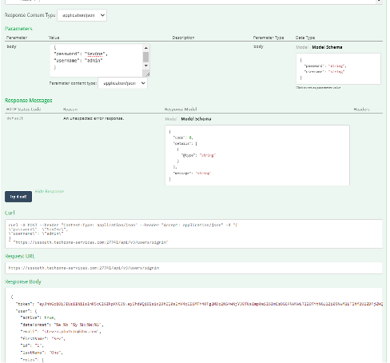
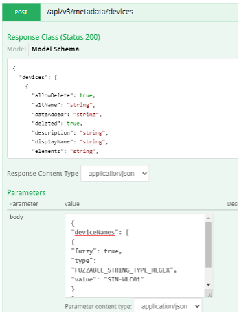
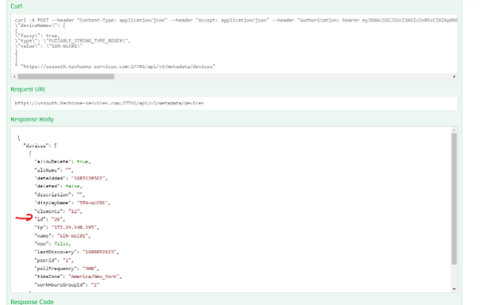
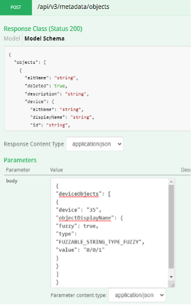
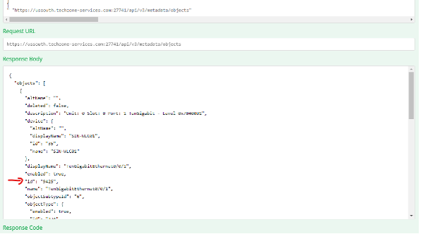
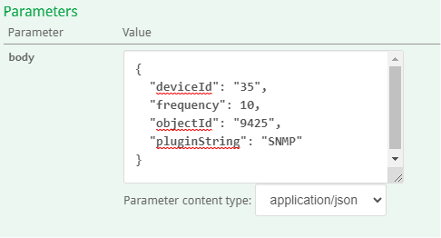
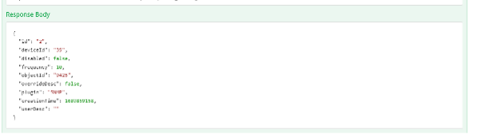
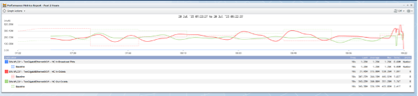

# API

In this lab we will learn how we can use the SevOne API to automate any action in SevOne.

# High Frequency Poller

1. Login into your NMS
2. Go to Administration -> API Docs -> Version 3
3. Go to Users -> /api/v3/users/signin
4. Paste the following in the body field

    {
    "password": "SevOne",

    "username": "admin"
    }
5. Try it out!

6. Copy token and paste it in the ‘Bearer Token’ field

7. Go to Metadata -> POST /api/v3/metadata/devices
8. Paste the following in the body field

    {
    "deviceNames": [
    {
    "fuzzy": true,

    "type": "FUZZABLE_STRING_TYPE_REGEX",
    
    "value": "SIN-WLC01"
    }
    ]
    }

9. Try it Out!
10. Save the ID field for a later stage

11. Go to Metadata -> POST /api/v3/metadata/objects
12. Paste the following in the body field
    
    {
    "deviceObjects": [
    {
    "device": "35",
    "objectDisplayName": {
    "fuzzy": true,
    "type": "FUZZABLE_STRING_TYPE_FUZZY",
    "value": "0/0/1"
    }
    }
    ]
    }

13. Try it out!
14. Save the ID field for a later stage

15. Go to Polling -> POST /api/v3/polling/HFPobjects
16. Paste the following in the body field

    {
    "deviceId": "35",
    "frequency": 10,
    "objectId": "9425",
    "pluginString": "SNMP"
    }
    

17. Try it out!

Review
To make sure this worked, let’s go back to the NMS, find the device SIN-WLC01 in device manager, go to Object Manager and find the object TenGigabitEthernet0/0/1, click on it to see all the metrics available in that object, and then click on the HC Statistics widget to open a new window with those metrics. As we want to see the difference between 5 minute polling and 10 seconds polling, let’s change the timespan to Last 2 hours 

This graph shows how HFP has worked using the API, meaning that we don’t need to configure HFP manually, we can really on third party tools to communicate with SevOne to configure this feature. Also, if we go back to Device manager, search for SIN-WLC01 device, click on the ‘spanner icon’ and then go to the High Frequency Poller section, we can also verify that this configuration was configured correctly

