# Application Centric Report

## Overview

In this lab we will learn how we can use the SevOne Data Insight reporting to troubleshoot network issues from an application centric perspective.

SevOne's capability to link NetFlow data with performance data (i.e. SNMP, IPSLA, API data...) allows us to focus on the applications running on our network, showing us all those network elements that are part of the application flow and helping us troubleshooting the network from an applications point of view.

## Application Centric Report

1. Login into your DAta Insight

2. Click on Create Report

3. Change report name from 'Untitled Report' to 'Application Centric Report'

4. Change section name from 'Untitled Section' to 'Flow'

5. Click Save

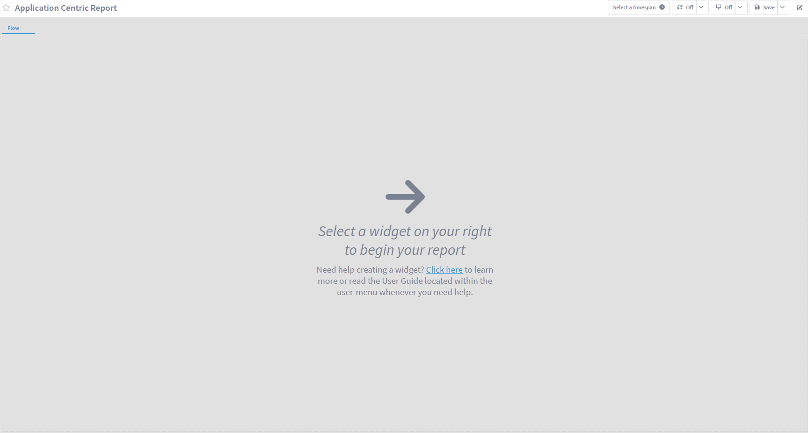

6. Click on the pencil icon on the top right corner to start editing the report again

7. On the widget list, click on Flow

    a. Change the name of the widget to Apps

    b. On Resource Type, choose:

        i. Flow source

            1. All devices

        ii. Flow Interface

            1. All interfaces

        iii. Direction

            1. All Directions

    c. Disable 'Display Aggregated Views'

    d. Select Flow View: Top Services (Bandwidth, Packets, Flows)

    e. Sort Field: Bandwitdh (Sum)

    f. Sort Order: Descending

    g. Result limit: 20

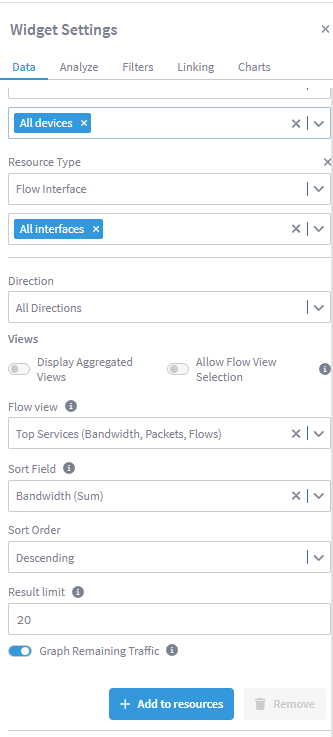

8. Click Add to resources

9. Click Run

10. Within Widget Settings, go to Charts

    a. Select 'Bar' visualization 

    b. Disable 'Show title' and 'Show subtitle'

    c. Change the size of the widget as shown in the image below

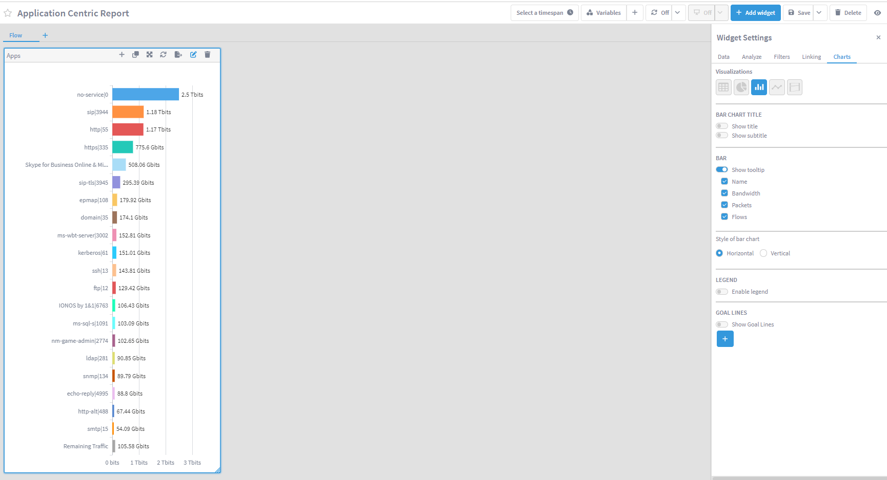

11. Click on the + icon in the top of the 'Apps' widget and select Flow

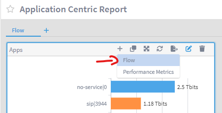

12. Move the new widget to the top right corner, making it wider and shorter (see image below)

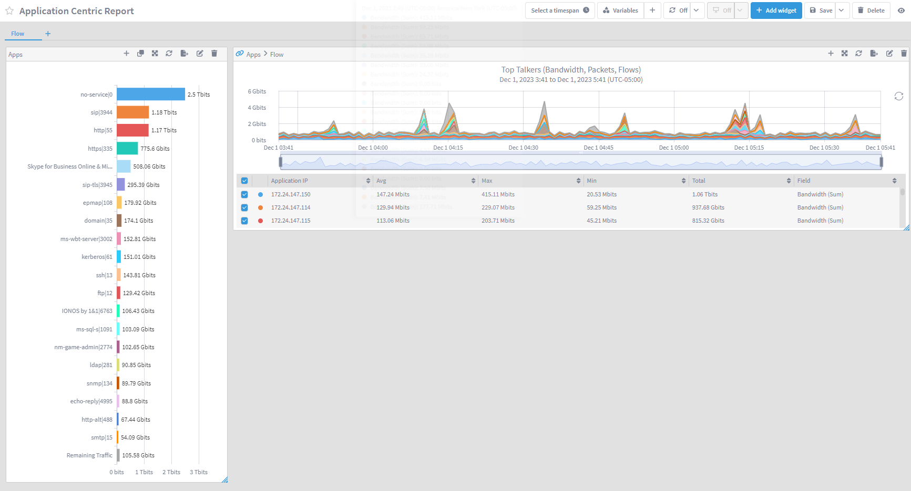

13. Edit the new widget

    a. Disable 'Display Aggregated Views'

    b. Select Flow view: Top Services (Bandwidth, Packets, Flows)

        i. Click Run

    c. Go to Charts section

        i. Disable 'Show title' and 'Show subtitle'

14. On this widget, click on the + icon and select 'Performance Metrics'

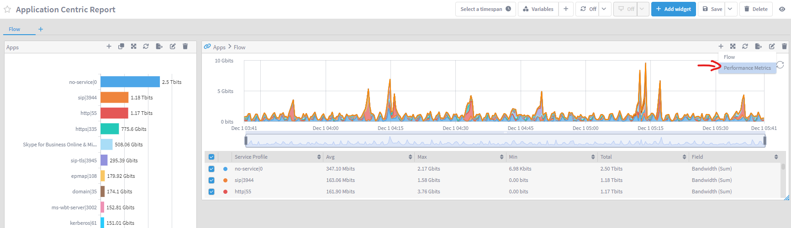

15. Expand the new widget to fit all your window

16. On the top of the report, click on the + icon next to Variables

    a. Select Flow Interfaces

        i. Name: Flow Interfaces

        ii. Enable Multiple selection, clear selection and Select all

    b. Click Add

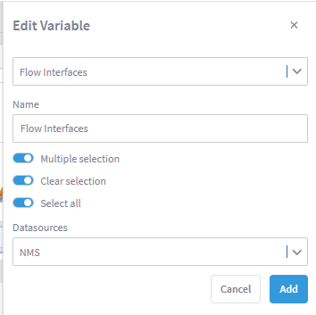

17. Click over Variables to hide/unhide the variable section

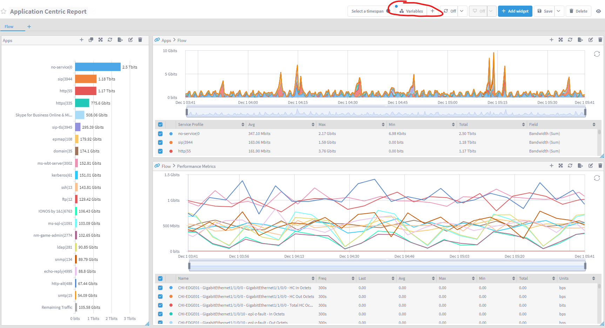

18. On the last widget created (Flow > Performance Metrics), edit the widget

    a. Go to Linking

    b. On Report Link 2, on Links to report, choose Data Analytics Workspace

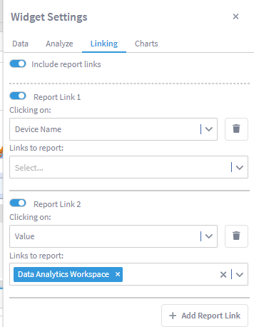

19. Click Save to save the report again

## Review

The way we would use this report is by starting with the application that is having problems, we would choose it from the Apps widget, and the other widgets would tell us the amount of traffic that app is generating and where this app is seen, including the traffic utilization on those interfaces where the app is seen.

20. On the Apps widget, click on IONOS by 1&1

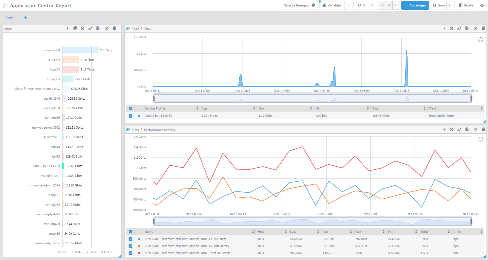

Now we can see the traffic that this app has created over time, and the amount of traffic going through the interfaces running this application.

21. Click on any data point of any line in the Flow > Performance Metrics widget within the graph and click on Data Analytics Workspace

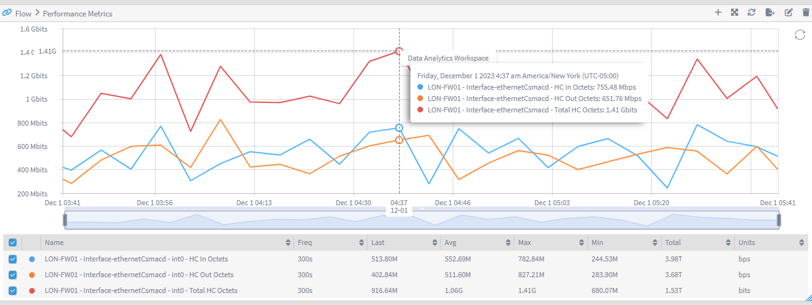

Now we can see the normal behaviour of this metric, allowing us to detect any anomaly on this particular interface.

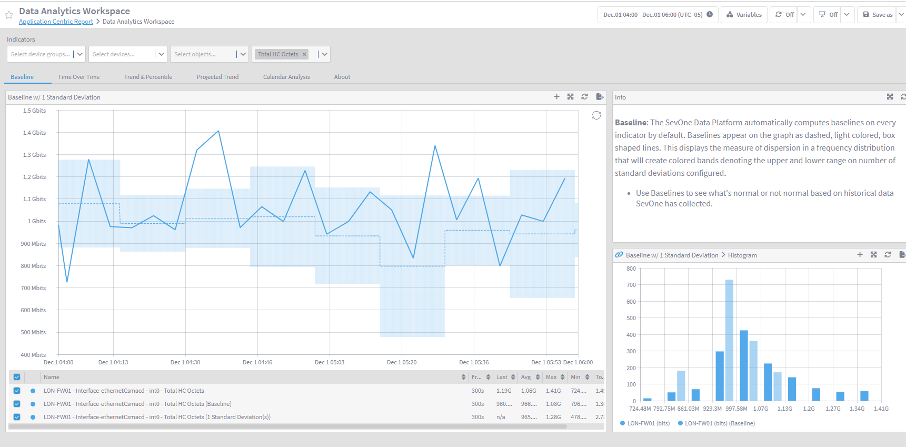
