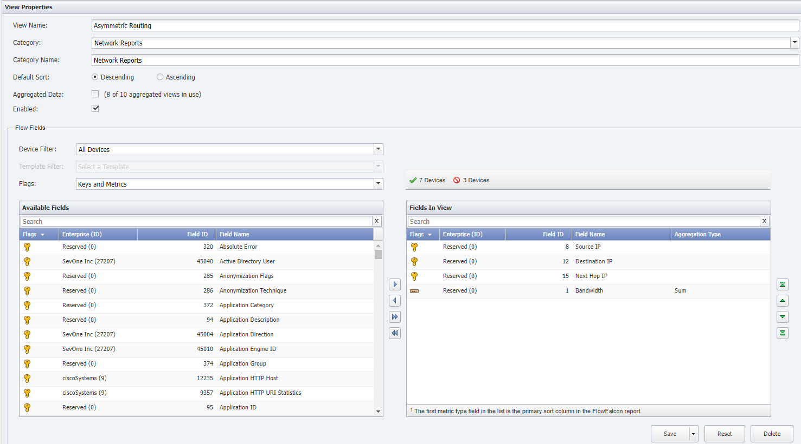
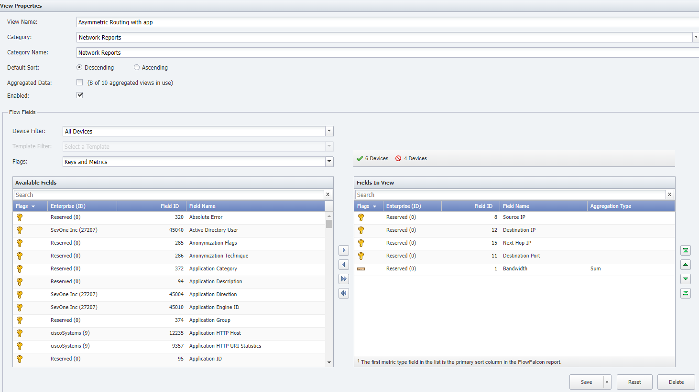
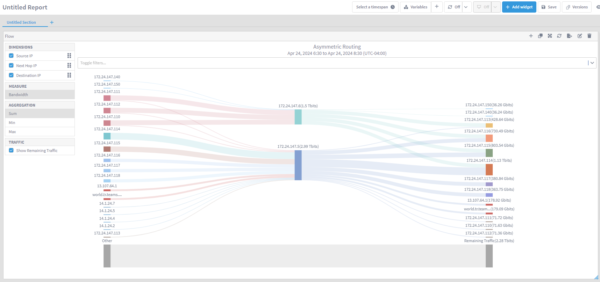
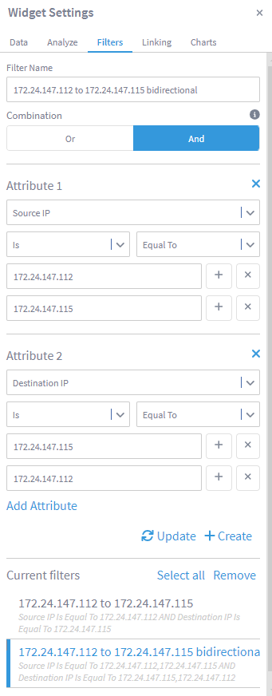
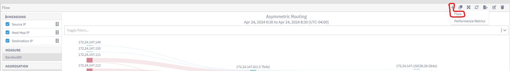
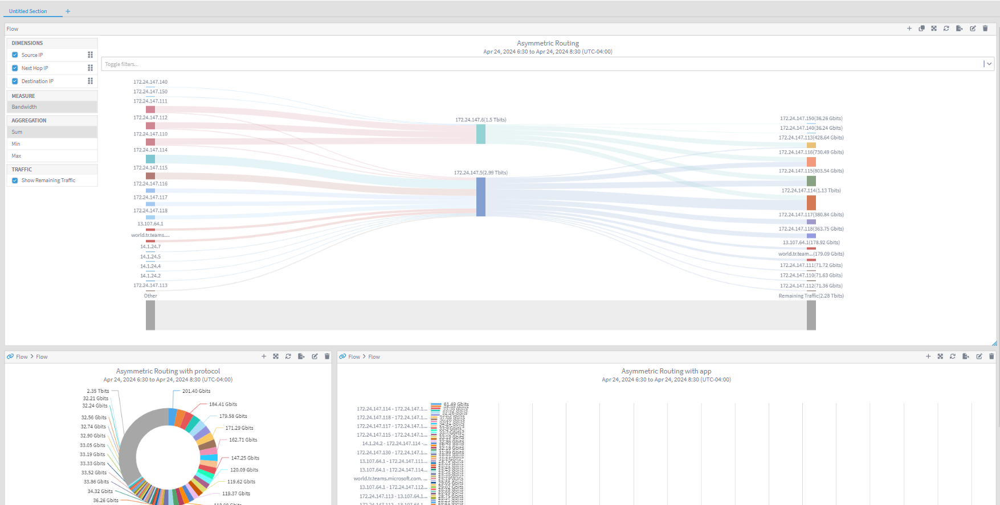
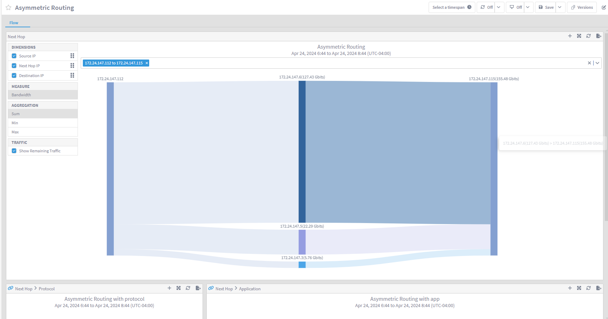
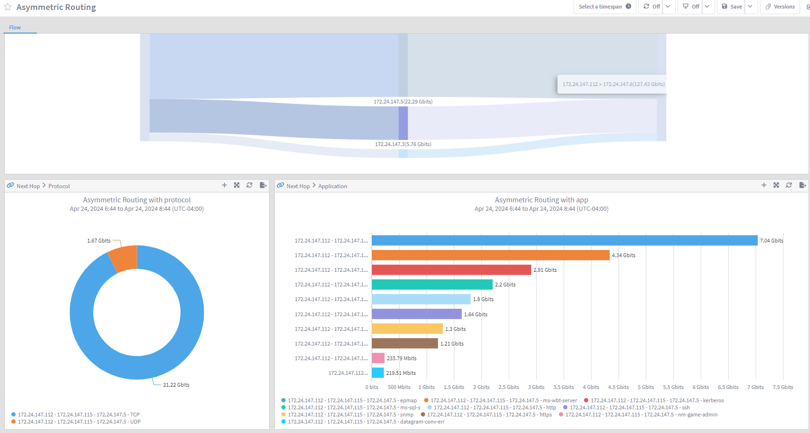
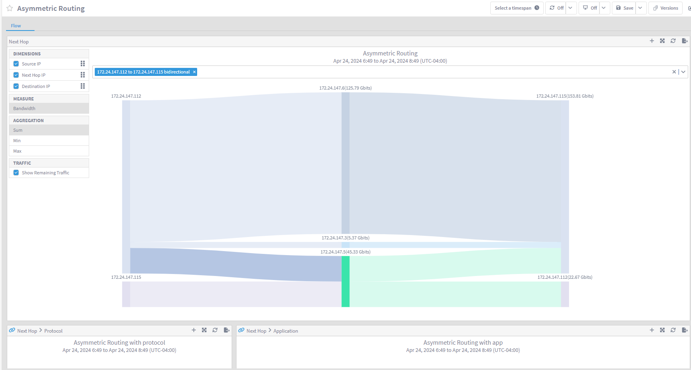
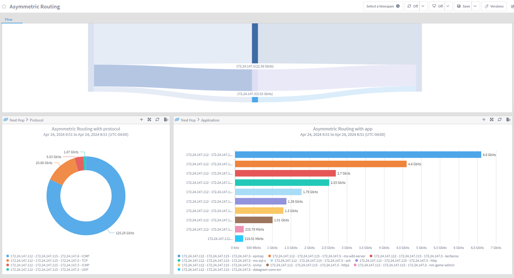

# Asymmetric Routing

In this lab we will learn how we can configure SevOne to troubleshoot asymmetric routing issues.

One of the common issues when running newer and more complex technologies such as SDN, VxLAN, MPBGP, SDWAN, Cloud and others is the lose of control in features such as routing. Asymmetric routing occurs when the path from A to B is different than the path followed from B to A, and this can generate issues for several reasons:

* Cost associated with different paths

* Firewalls need to be aware of the bidirectional communication

* Link congestion

We can configure SevOne to monitor how the traffic flows through the network and identify potential asymmetric routing situations. Mainly NetFlow will be used to collect 'next-hop' data and identify the path following by the traffic.

# Flow Views

1. Login into your NMS

2. Go to Administration -> Flow Configuration -> FlowFalcon View Editor

3. Click on Add 

    a. View Name: Asymmetric Routing

    b. Category: Network Reports
    
    c. Aggregated Data: Disabled

    d. Enabled: Enabled

    d. Flow Fields:

        i. Source IP (8)

        ii. Destination IP (12)

        iii. Next Hop PI (15)

        iv. Bandwidth (1)

    e. Click Save

4. Click on Add 

    a. View Name: Asymmetric Routing with protocol

    b. Category: Network Reports
    
    c. Aggregated Data: Disabled

    d. Enabled: Enabled

    d. Flow Fields:

        i. Source IP (8)

        ii. Destination IP (12)

        iii. Next Hop PI (15)

        iv. Protocol (4)

        iv. Bandwidth (1)

    e. Click Save

5. Click on Add 

    a. View Name: Asymmetric Routing with app

    b. Category: Network Reports
    
    c. Aggregated Data: Disabled

    d. Enabled: Enabled

    d. Flow Fields:

        i. Source IP (8)

        ii. Destination IP (12)

        iii. Next Hop PI (15)

        iv. Destination Port (11)

        iv. Bandwidth (1)

    e. Click Save

6. Go to DI and create a new report

    a. Add widget -> Flow

        i. Resource Type: Flow Source -> All devices

        ii. Resource Type: Flow Interface -> All interfaces

        iii. Direction: All directions

    b. Views: 

        i. Display Aggregated Views: disabled

        ii. Flow view: Asymmetric Routing

    c. Result limit: 50

    d. Click 'Add to resources'

    e. Click 'Run'

    f. Go to Charts section within the widget

        i. Visualizations: Sankey

7. Edit the widget again and go to Filters

    a. Filter name: 172.24.147.112 to 172.24.147.115

    b. Combination: AND

    c. Attribute 1:

        i. Source IP is Equal to 172.24.147.112

    d. Click 'Add Atribute'

    e. Attribute 2:

        i. Destination IP is Equal to 172.24.147.115

    f. Click 'Create'

8. Add another filter

    a. Filter name: 172.24.147.112 to 172.24.147.115 bidirectional

    b. Combination: AND

    c. Attribute 1:

        i. Source IP is Equal to 172.24.147.112

        ii. Click on the + icon next to 172.24.147.112 and add 172.24.147.115

    d. Click 'Add Atribute'

    e. Attribute 2:

        i. Destination IP is Equal to 172.24.147.115

        ii. Click on the + icon next to 172.24.147.115 and add 172.24.147.112

    f. Click 'Create'

9. On the Flow widget, click on the + symbol to use report chaining and click Flow

10. On the new Flow widget added, click edit:

    a. Display Aggregated Views: Disabled

    b. Flow View: Asymmetric Routing with protocol

    c. Click 'Run'

    d. Go to Charts

        i. Visualization: Pie

        ii. Enable legend

11. Edit the size of the widget to around a third of the available width

12. On the first Flow widget, click on the + symbol to use report chaining and click Flow

13. On the new Flow widget added, click edit:

    a. Display Aggregated Views: Disabled

    b. Flow View: Asymmetric Routing with app

    c. Click 'Run'

    d. Go to Charts

        i. Visualization: Bar

        ii. Enable legend

14. Edit the size of the widget to fit next to the second widget created

15. Change Report name to Asymmetric Routing

16. Change Section name to Flow

17. Change first widget name to Next Hop

18. On the left hand side of the Next Hop widget, under Dimensions, move Next Hop IP in the middle. The order should be:

    a. Source IP

    b. Next Hop IP

    c. Destination IP

19. Change second widget name to Protocol

20. Change third widget name to Application

21. Click 'Save' and 'Save' again

## Troubleshoot Asymmetric Routing

22. On the Next Hop widget, enable the 172.24.147.112 to 172.24.147.115 filter

23. This widget is showing us that the traffic from 172.24.147.112 to 172.24.147.115 is using three different next hops (172.24.147.3, 172.24.147.5, 172.24.147.6). On widgets Protocol and Applications we can see the protocols and applications used on the traffic between those two endpoints.

24. Click on Next Hop 172.24.147.5 and wait until Protocol and Application widget are updated. This action will show which protocol and applications are running through the 172.24.147.5 next hop.

25. Go back to the Next Hop widget, remove the filter and select filter 172.24.147.112 to 172.24.147.115 bidirectional.

26. This widget now shows that communication between 172.24.147.112 to 172.24.147.115 uses three next hops, but the communication between 172.24.147.115 to 172.24.147.112 only uses one, highlighting the fact that there is asymmetric routing. 

27. Remove the filter and select again filter 172.24.147.112 to 172.24.147.115, click on next hops 172.24.147.6 and 172.24.147.3 (these are the next hops not used by communication between 172.24.147.115 to 172.24.147.112) to identify which applications are not routed properly.

