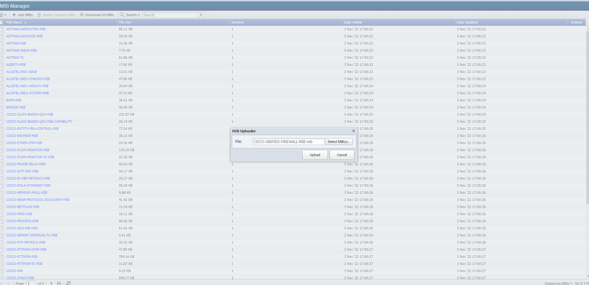
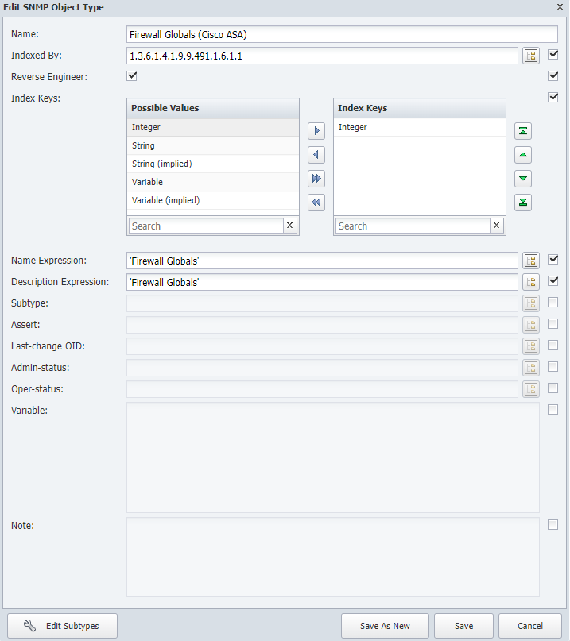
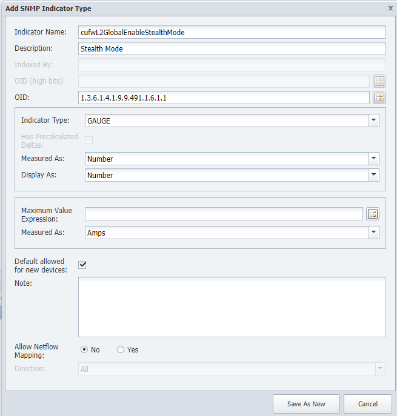
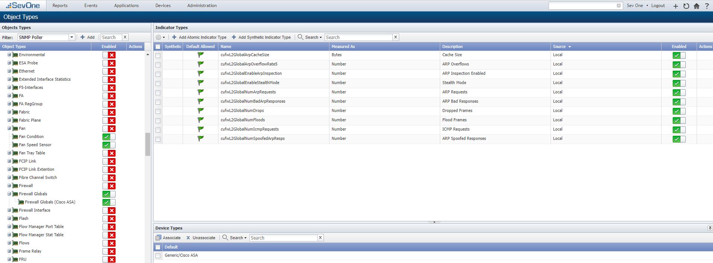
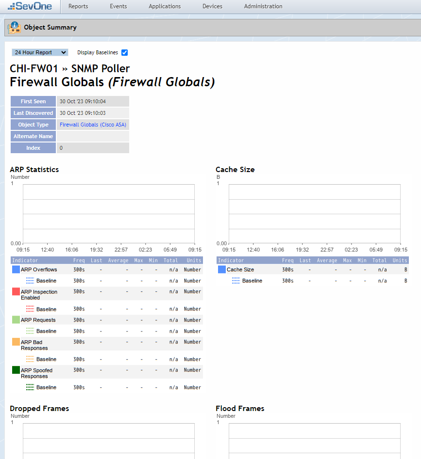

# Object Type Creation

In this lab we will learn how we can create new custom device certifications to collect new metrics from the network.

NOTE: it's important to remember that SevOne offers a free device certification process done by a specialist team, therefore it is not required to run the process shown on this lab manually. However some people prefer to certify devices manually, hence this is an example on how to do it.

During this lab we will show how we can import MIB files from vendors, and how we can create new SMNP object types that will allow us to collect new metrics based on the OIDs that we configure. In this lab we will focus on some custom firewall data available in Cisco ASAs, such number of ARP inspections, requests, ICMP requests, frame floods and similar. 

## Import MIB File

1. Download this MIB file from [HERE](files/CISCO-UNIFIED-FIREWALL-MIB.mib)

2. Log into the NMS

3. Go to administration -> Monitoring Configuration -> MIB Manager

4. Click on Add MIBs
    
    a. Select MIB shared on step 1

    b. Click Upload

NOTE: This step is not required to create a new SNMP object type, however it helps when troubleshooting. 

## Create Object Rule

5. Go to administration -> Monitoring Configuration -> Object Types

6. Click on Add

    a. Name: Firewall Globals

    b. Click Save As New

7. Click on Firewall Globals

    a. Click on Add

        i. Name: Firewall Globals (Cisco ASA)

        ii. Indexed By: 1.3.6.1.4.1.9.9.491.1.6.1.1 

        iii. Reverse Engineer: ENABLED

        iv. Index Keys: add one Integer to the Index Keys section

        v. Name Expression: 'Firewall Globals'

        vi. Description Expression: 'Firewall Globals'

        vii. Click Save As New

8. Click on Firewall Globals (Cisco ASA)

    a. Click Add Atomic Indicator Type

        i. Indicator Name: cufwL2GlobalEnableStealthMode

        ii. Description: Stealth Mode

        iii. OID: 1.3.6.1.4.1.9.9.491.1.6.1.1

        iv. Indicator Type: GAUGE

        v. Measured As: Number

        vi. Display As: Number

        vii. Click Save As New

        
    
    b. Click Add Atomic Indicator Type

        i. Indicator Name: cufwL2GlobalArpCacheSize

        ii. Description: Cache Size

        iii. OID: 1.3.6.1.4.1.9.9.491.1.6.1.2

        iv. Indicator Type: GAUGE

        v. Measured As: Bytes

        vi. Display As: Bytes

        vii. Click Save As New

    c. Click Add Atomic Indicator Type

        i. Indicator Name: cufwL2GlobalEnableArpInspection

        ii. Description: ARP Inspection Enabled

        iii. OID: 1.3.6.1.4.1.9.9.491.1.6.1.3

        iv. Indicator Type: GAUGE

        v. Measured As: Number

        vi. Display As: Number

        vii. Click Save As New

    d. Click Add Atomic Indicator Type

        i. Indicator Name: cufwL2GlobalNumArpRequests

        ii. Description: ARP Requests

        iii. OID: 1.3.6.1.4.1.9.9.491.1.6.1.5

        iv. Indicator Type: COUNTER64

        v. Measured As: Number

        vi. Display As: Number

        vii. Click Save As New

     e. Click Add Atomic Indicator Type

        i. Indicator Name: cufwL2GlobalNumIcmpRequests

        ii. Description: ICMP Requests

        iii. OID: 1.3.6.1.4.1.9.9.491.1.6.1.6

        iv. Indicator Type: COUNTER64

        v. Measured As: Number

        vi. Display As: Number

        vii. Click Save As New

    f. Click Add Atomic Indicator Type

        i. Indicator Name: cufwL2GlobalNumFloods

        ii. Description: Flood frames

        iii. OID: 1.3.6.1.4.1.9.9.491.1.6.1.7

        iv. Indicator Type: COUNTER64

        v. Measured As: Number

        vi. Display As: Number

        vii. Click Save As New

    g. Click Add Atomic Indicator Type

        i. Indicator Name: cufwL2GlobalNumDrops

        ii. Description: Dropped Frames

        iii. OID: 1.3.6.1.4.1.9.9.491.1.6.1.8

        iv. Indicator Type: COUNTER64

        v. Measured As: Number

        vi. Display As: Number

        vii. Click Save As New

    h. Click Add Atomic Indicator Type

        i. Indicator Name: cufwL2GlobalArpOverflowRate5

        ii. Description: ARP Overflows

        iii. OID: 1.3.6.1.4.1.9.9.491.1.6.1.9

        iv. Indicator Type: GAUGE

        v. Measured As: Number

        vi. Display As: Number

        vii. Click Save As New

     i. Click Add Atomic Indicator Type

        i. Indicator Name: cufwL2GlobalNumBadArpResponses

        ii. Description: ARP Bad Responses

        iii. OID: 1.3.6.1.4.1.9.9.491.1.6.1.10

        iv. Indicator Type: COUNTER64

        v. Measured As: Number

        vi. Display As: Number

        vii. Click Save As New

    j. Click Add Atomic Indicator Type

        i. Indicator Name: cufwL2GlobalNumSpoofedArpResps

        ii. Description: ARP Spoofed Responses

        iii. OID: 1.3.6.1.4.1.9.9.491.1.6.1.11

        iv. Indicator Type: COUNTER64

        v. Measured As: Number

        vi. Display As: Number

        vii. Click Save As New

9. On the bottom half of the screen, click Associate

    a. Select Cisco ASA

    b. Click Associate

10. Go to Devices -> Device Manager

    a. Search for FW

    b. Select all the devices found, click on the gear icon -> Discovery -> Discover

NOTE: this step will take 5-10 minutes to complete

## Review

11. Go to Devices -> Object Manager

    a. Device: CHI-FW01

    b. Click Apply

    c. Search for Firewall Global

    d. Click on Firewall Globals

NOTE: it will take some time to start showing up data because of the polling frequency (5 minutes). We can change the polling frequency of the device to 1 minute, or using High Frequency Polling on this specific object to something like 10 seconds to start see data showing up faster. 