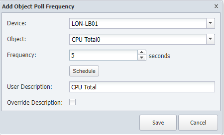
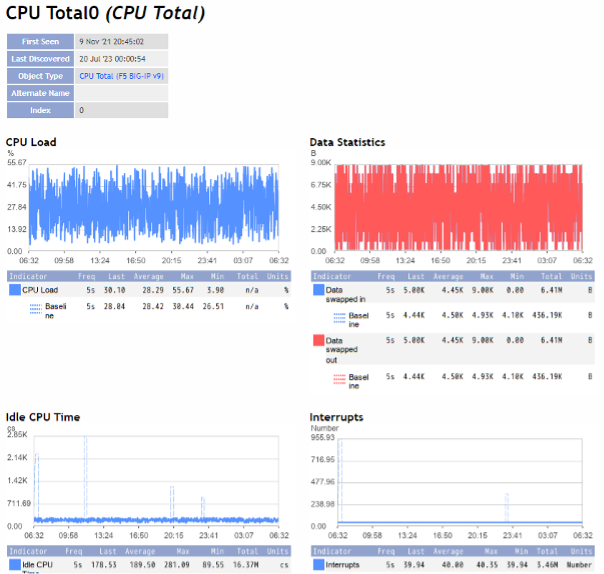
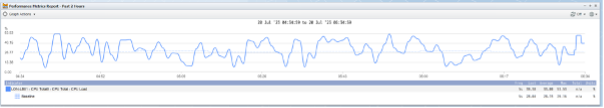

# High Frequency Polling

**Overview**
In this lab we will learn how we can get more granular data from the network by monitoring specific objects at a higher frequency

High Frequency Poller
1.	Log into the NMS
2.	Go to Devices -> Device Manager
3.	Click on the ‘spanner’ icon of YOURDEVICE
4.	Click on ‘High Frequency Poller’
5.	Click ‘Add Object Poll Frequency’
    - a.	Object: CPU Total0
    - b.	Frequency: 5 seconds
6.	Save
 
 

**Review**

This action should take immediate effect, so the easiest way to confirm this is by clicking on the name of the object.

 

 
This will bring us to a new page with the indicators monitored on that object, to see the difference between 1 minute polling and 5 seconds polling, click on the first widget (CPU Load) and that action will open a new window.

 

 
On that new window, on the only widget available click on the +  symbol to extend the widget and then click on the gear -> Change Timespan -> Past 2 hours. This way we will have a better view of the data collected.

 
