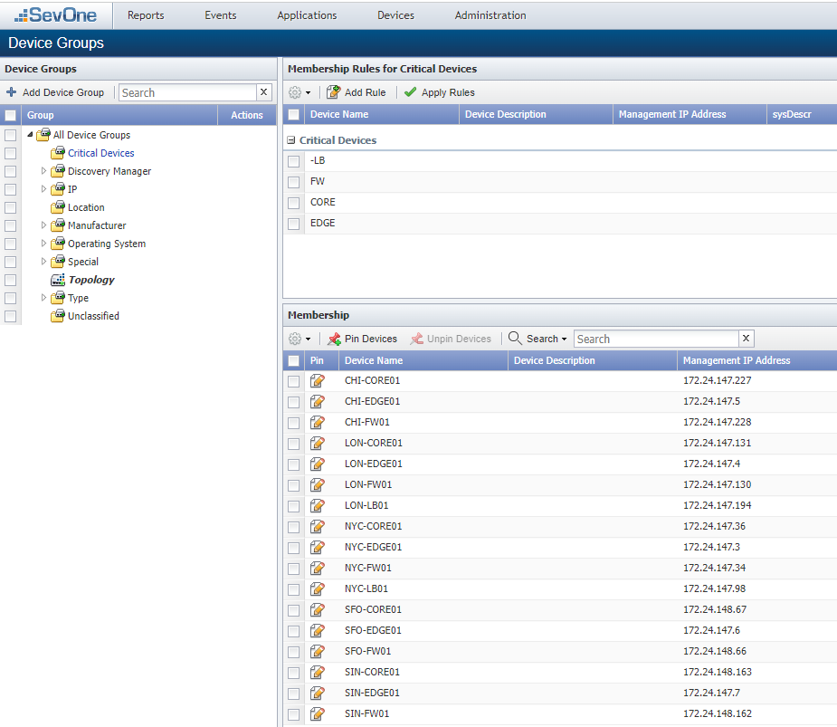
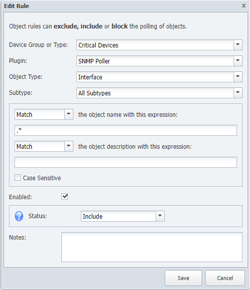
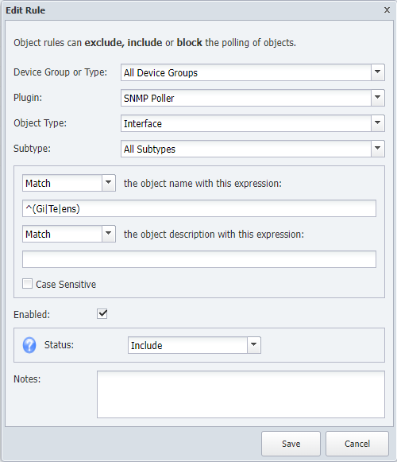
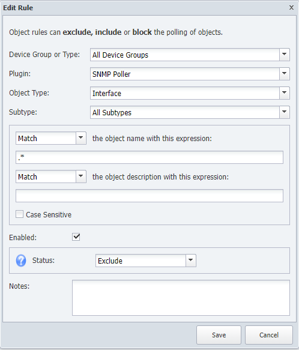
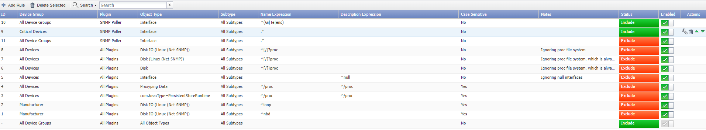
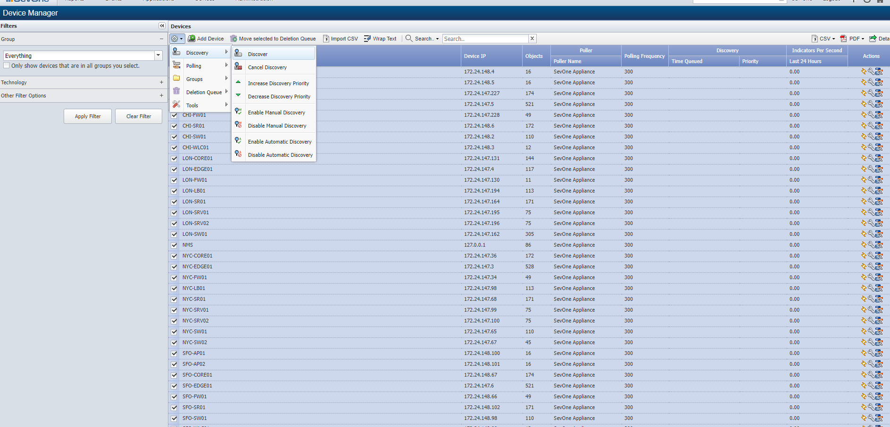
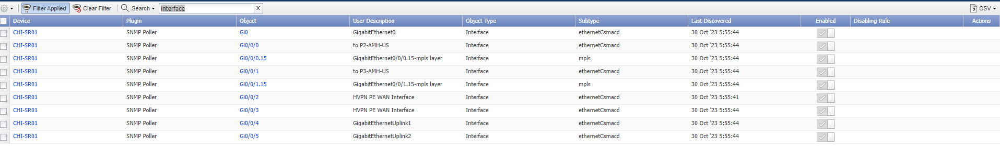
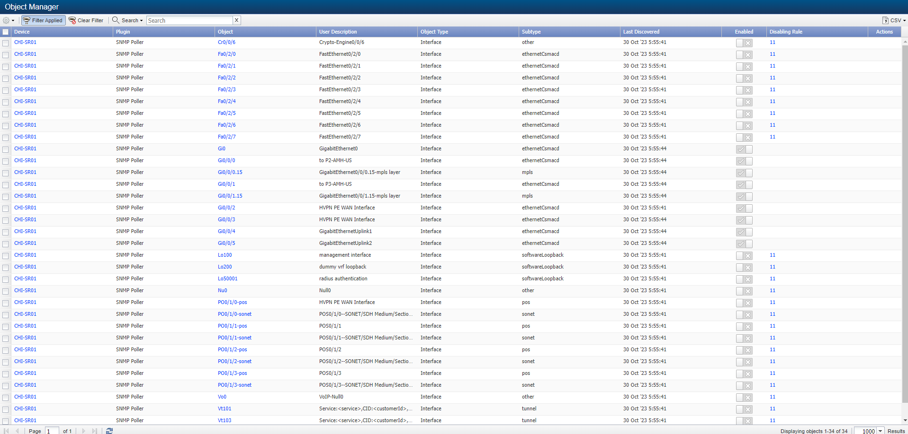

# Object Rules

In this lab we will learn how we can control which objects are being monitored and which objects are being excluded using object rules.

In our installation we want to monitor all the enabled interfaces from the critical devices, but only the main interfaces (Gigabit, TenGigabit...) from the rest of the devices.

Therefore, in this lab we will:

* Create a group of devices with the critical devices in it

* Create an object rule to monitor all interfaces from the critical devices group

* Create an object rule to monitor only the important interfaces from the rest of the devices

Finally, we will review manually on a non-critical device which interfaces have been disabled (i.e. not monitored) to confirm the result is what we expected.

## Create Group

1. Log into the NMS

2. Go to Devices -> Grouping -> Device Groups

3. Click Add Device Group

    a. Name: Critical Devices

4. Save

5. Click Add Rule

    a. Device Name: EDGE

    b. Save

6. Click Add Rule

    a. Device Name: CORE

    b. Save

7. Click Add Rule

    a. Device Name: FW

    b. Save

8. Click Add Rule

    a. Device Name: -LB

    b. Save

9. Click Apply Rules

## Create Object Rule

10. Go to Administration -> Monitoring Configuration -> Object Rules

11. Click on Add Rule

    a. Device Group or Type: Critical Devices
    
    b. Plugin: SNMP Poller

    c. Object Type: Interface

    d. Subtype: All Subtypes

    e. **Match** the object name with this expression: .*

    f. Enabled: ticked

    g. Status: Include

    h. Click Save

12. Click on Add Rule

    a. Device Group or Type: All Device Groups
    
    b. Plugin: SNMP Poller

    c. Object Type: Interface

    d. Subtype: All Subtypes

    e. **Match** the object name with this expression: ^(Gi|Te|ens)

    f. Enabled: ticked

    g. Status: Include

    h. Click Save

13. Click on Add Rule

    a. Device Group or Type: All Device Groups
    
    b. Plugin: SNMP Poller

    c. Object Type: Interface

    d. Subtype: All Subtypes

    e. **Match** the object name with this expression: .*

    f. Enabled: ticked

    g. Status: Exclude

    h. Click Save

14. Using the little arrows that appear on the right hand side of each rule, move the last rule created (ID 11) under the first rule we created (ID 9)

15. Go to Devices -> Device Manager, select all devices, click on the gear icon -> Discovery - Discover

NOTE: This process will take 5-10 minutes to complete

16. Go to Devices -> Object manager

17. Click on Clear Filter

18. Click on Set Filter

    a. Device: CHI-SR01

    b. Object Type: SNMP -> Interface (remember to disable All Object Types)

NOTE: only 'important interfaces' are being monitored on 'non-critical devices', but what if we want to manually enable monitoring in some interfaces?

19. Click on Filter Applied

    a. Object Visibility: Show Both

    b. Object Status: Show Both

    c. Object State: Show Both

20. Select interface Cr0/0/6, click on the gear icon:

    a. Set Status -> Enabled

    b. Set Visibility -> Visible

NOTE: From now on, interface Cr0/0/6 will be monitored, even if we rediscover the device and object rules are applied

