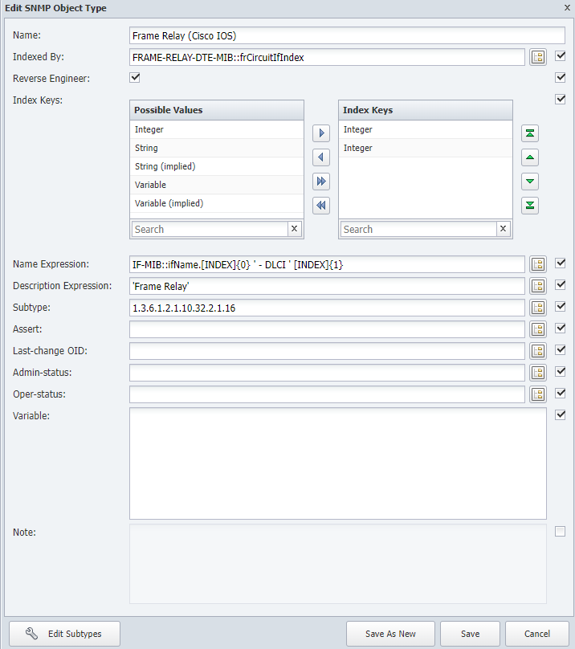

# Object Subtype

In this lab we will learn how we can leverage object subtypes for better grouping and alerting.

This lab has two sections: the first one where we use object subtypes to categorize better the objects monitored, and a second one where we can use this feature to get more information from the objects to reduce the number of object monitored.

## Frame Relay Circuit Type

1. Log into the NMS

2. Go to administration -> Monitoring Configuration -> Object Types

3. Search for Frame Relay (Cisco IOS)
    
4. On the Frame Relay (Cisco IOS) click the wrench icon to edit

    a. On Subtype, add 1.3.6.1.2.1.10.32.2.1.16

    b. Click Save

5. Go to administration -> Monitoring Configuration -> Object Subtype manager

6. In Object Type, find Frame Relay (Cisco IOS)

7. Click Add Subtype

    a. Name: Static

    b. Description: Static

    c. Under Rules, click Add

        i. Identifier: 1

        ii. Click Update

    d. Click Save

8. Click Add Subtype

    a. Name: Dynamic

    b. Description: Dynamic

    c. Under Rules, click Add

        i. Identifier: 2

        ii. Click Update

    d. Click Save

9. Go to Device -> Device Manager

10. Select CHI-EDGE01, click the gear icon -> Discovery -> Discover

11. Click on the wrench icon on that device to edit the device and click on Object Manager

    a. Search for Frame Relay

This is how it looks before the discovery is finished

This is how it looks after the discovery is finished

## F5 Load Balancer Status

12. Go to administration -> Monitoring Configuration -> Object Types

13. Search for Virtual Server (F5 BIG-IP v9)

14. On the Virtual Server (F5 BIG-IP v9) click the wrench icon to edit

    a. On Subtype, add .1.3.6.1.4.1.3375.2.2.10.1.2.1.9

    b. Click Save

15. Go to administration -> Monitoring Configuration -> Object Subtype manager

16. In Object Type, find Virtual Server (F5 BIG-IP v9)

17. Click Add Subtype

    a. Name: Enabled

    b. Description: Enabled

    c. Under Rules, click Add

        i. Identifier: 1

        ii. Click Update

    d. Click Save

18. Click Add Subtype

    a. Name: Disabled

    b. Description: Disabled

    c. Under Rules, click Add

        i. Identifier: 0

        ii. Click Update

    d. Click Save

19. Go to Device -> Device Manager

20. Select LON-LB01, click the gear icon -> Discovery -> Discover

21. Go to Device -> Object Manager

    a. Click Clear Filter

    b. Click Set Filter

        i. Object Type: Virtual Server (F5 BIG-IP v9) (remember to unselect All Object Types)

        ii. Click Apply

22. Wait until the discovery is finished (max 5 minutes), once it is finished you should see something like this

## Close the loop

23. Now that we have this info, let's create an object rule to stop monitoring those virtual servers that are disabled.

24. Go to Administration -> Monitoring Configuration -> Object Rules

25. Click on Add Rule

    a. Device Group or Type: All Device Groups
    
    b. Plugin: SNMP Poller

    c. Object Type: Virtual Server (F5 BIG-IP v9)

    d. Subtype: Disabled

    e. **Match** the object name with this expression: .*

    f. Enabled: ticked

    g. Status: Exclude

    h. Click Save

26. Go to Device -> Device Manager

27. Select LON-LB01, click the gear icon -> Discovery -> Discover

28. Go to Device -> Object Manager

    a. Click Clear Filter

    b. Click Set Filter

        i. Object Type: Virtual Server (F5 BIG-IP v9) (remember to unselect All Object Types)

        ii. Click Apply

29. Wait until the discovery is finished (max 5 minutes), once it is finished, all virtual servers that are detected as Subtype: Disabled will not be monitored any more.

30. Discover device NYC-LB01, and now also the virtual servers that are disabled from that load balancer will be removed from monitoring.

