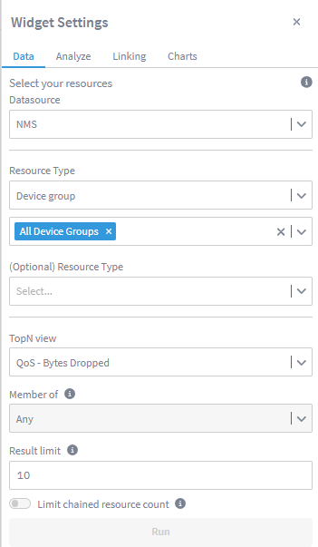
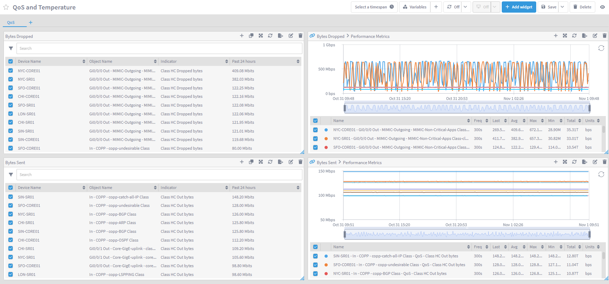

# TopN Reports

In this lab we will learn how we can create new TopN views to be used on Data Insight reports.

TopN views allows us to optimze reports by calculating in the background the top devices/objects based on a specific indicator. Out of the box there are several TopN views available, however it is recommended creating custom TopN views based on the KPIs collected on your network.

In this lab we will create custom TopN views to show top QoS classes by bytes dropped as well as another TopN view to show top devices by temperature.

# TopN View

1. Login into your NMS

2. Go to Reports -> TopN Reports

3. Click on Add View

    a. Report View Name: QoS - Bytes Dropped

    b. Indicator Selection

        i. Plugin: SNMP

        ii. Object Type: QoS (Cisco IOS XR)

        iii. Disable 'Only Display Common Subtypes'

        iv. Object Subtype: any

        v. Indicator Type: Class Dropped bytes

        vi. Click Add Indicator
    
    c. Indicator Selection

        i. Plugin: SNMP

        ii. Object Type: QoS (Cisco IOS XR)

        iii. Disable 'Only Display Common Subtypes'

        iv. Object Subtype: any

        v. Indicator Type: Class HC Dropped bytes

        vi. Click Add Indicator

    d. Indicator Selection

        i. Plugin: SNMP

        ii. Object Type: QoS (Cisco IOS)

        iii. Disable 'Only Display Common Subtypes'

        iv. Object Subtype: any
        
        v. Indicator Type: Class Dropped bytes

        vi. Click Add Indicator

    e. Indicator Selection

        i. Plugin: SNMP

        ii. Object Type: QoS (Cisco IOS)

        iii. Disable 'Only Display Common Subtypes'

        iv. Object Subtype: any
        
        v. Indicator Type: Class HC Dropped bytes

        vi. Click Add Indicator
    
    f. Click Save

3. Click on Add View

    a. Report View Name: QoS - Bytes Dropped

    b. Indicator Selection

        i. Plugin: SNMP

        ii. Object Type: QoS (Cisco IOS XR)

        iii. Disable 'Only Display Common Subtypes'

        iv. Object Subtype: any

        v. Indicator Type: Class Out Bytes

        vi. Click Add Indicator
    
    c. Indicator Selection

        i. Plugin: SNMP

        ii. Object Type: QoS (Cisco IOS XR)

        iii. Disable 'Only Display Common Subtypes'

        iv. Object Subtype: any

        v. Indicator Type: Class HC Out bytes

        vi. Click Add Indicator

    d. Indicator Selection

        i. Plugin: SNMP

        ii. Object Type: QoS (Cisco IOS)

        iii. Disable 'Only Display Common Subtypes'

        iv. Object Subtype: any
        
        v. Indicator Type: Class Out bytes

        vi. Click Add Indicator

    e. Indicator Selection

        i. Plugin: SNMP

        ii. Object Type: QoS (Cisco IOS)

        iii. Disable 'Only Display Common Subtypes'

        iv. Object Subtype: any
        
        v. Indicator Type: Class HC Out bytes

        vi. Click Add Indicator
    
    f. Click Save

5. Click on Add View

    a. Report View Name: Temperature

    b. Indicator Selection

        i. Plugin: SNMP

        ii. Object Type: Tmperature Sensor

        iii. Disable 'Only Display Common Subtypes'

        iv. Object Subtype: any

        v. Indicator Type: Temperature

        vi. Click Add Indicator
    
    c. Indicator Selection

        i. Plugin: SNMP

        ii. Object Type: Temperature Monitor (F5 BIG-IP v9)

        iii. Disable 'Only Display Common Subtypes'

        iv. Object Subtype: any

        v. Indicator Type: Temperature

        vi. Click Add Indicator

    d. Indicator Selection

        i. Plugin: SNMP

        ii. Object Type: Temperature Monitor (Cisco IOS)

        iii. Disable 'Only Display Common Subtypes'

        iv. Object Subtype: any

        v. Indicator Type: Temperature

        vi. Click Add Indicator

    e. Click Save

6. Log into Data Insight

7. Click on Create Report

    a. Change Report name to "QoS and Temperature"

    b. Change Section name to "QoS"

    c. Click Add Widget

        i. Click on TopN

            1. Resource Type: Device group -> All device Groups

            2. TopN view: Qos - Bytes Dropped

        ii. Click Run

    d. Click Add Widget

        i. Click on TopN

            1. Resource Type: Device group -> All device Groups

            2. TopN view: Qos - Bytes Dropped

        ii. Click Run

    e. On the first widget created

        i. Click on the name (TopN) and change it to 'Bytes Dropped'

        ii. Click on the pencil icon, go to Charts and disable 'Show title'

        iii. Click on the + symbol on the top right corner of the widget and select Performance Metrics

        iv. move the new widget alongside the first widget

    e. On the second TopN widget created

        i. Click on the name (TopN) and change it to 'Bytes Sent'

        ii. Click on the pencil icon, go to Charts and disable 'Show title'

        iii. Click on the + symbol on the top right corner of the widget and select Performance Metrics

        iv. move the new widget alongside the first widget
     

    f. Create a new section by clicking on the + icon next to section "QoS"

        i. Change the name of the section to Temperature

    g. Click Add widget

        i. Click on TopN

            1. Resource Type: Device group -> All device Groups

            2. TopN view: Temperature

            3. Result limit: 20

        ii. Click Run

    h. Expand the widget to show all the 20 results

    i. Click on the + symbol on the top right corner of the widget and select Performance Metrics

    j. Move the new widget alongside the first widget

    k. Expand the new widget to match the length of the first widget

8. Click Save (top right corner of the report)

