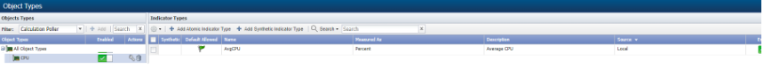
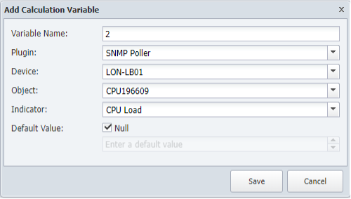
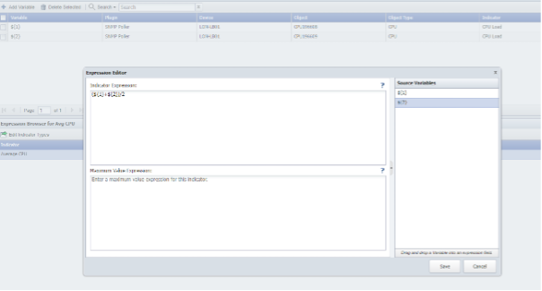
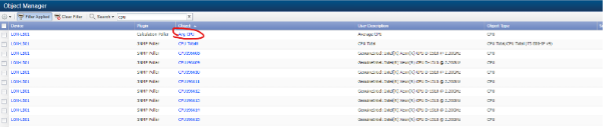
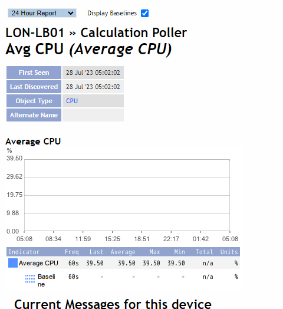

# Custom Monitoring
In this lab we will learn how we can create custom metrics based off existing KPIs in order to create aggregations or just new metrics that will help us understand better the performance of the overall network.

## Create Aggregation

1. Log into the NMS
2. Go to Administration -> Monitoring Configuration -> Object Types
3. Change Filter to Calculation Poller
4. Click Add
a. Name: CPU
5. Choose CPU
    - a. Click Add Atomic Indicator Type
        - i. Indicator Name: Avg CPU
        - ii. Description: Average CPU
        - iii. Indicator Type: GAUGE
        - iv. Measure as: Percent
        - v. Display as: Percent

6.	Go to Administration -> Monitoring Configuration -> Calculation Editor
7.	Click ‘Add Object’
    - a.	Parent Device: YOURDEVICE
    - b.	Object Type: CPU
    - c.	Object Name: Avg CPU
    - d.	Object Description: Average CPU
8.	Save
9.	Select the CPU objects in YOURDEVICE
10.	Add Variable: 
    - a.	Name: 1
    - b.	Plugin: SNMP Poller
    - c.	Device: YOURDEVICE
    - d.	Object: CPU196608
    - e.	Indicator: CPU Load
11.	Save
12.	Add Variable: 
    - a.	Name: 2
    - b.	Plugin: SNMP Poller
    - c.	Device: YOURDEVICE
    - d.	Object: CPU196609
    - e.	Indicator: CPU Load
13.	Save

Repeat for as many CPUs you find

14. Expression Browser
    - a. Edit CPULoad Indicator:
        - i. Expression: (${1}+${2})/2
15. Save

16. Go to Devices - > Device Manager
17. Select YOURDEVICE and click discover

Review
Once the rediscovery is finished, your device should have one more object, the new one we have created. Edit the device, go to Object Manager, find the new object on click on the name to open a new window that will show the data it’s being calculated.

Congratulations! You have Completed this lab.