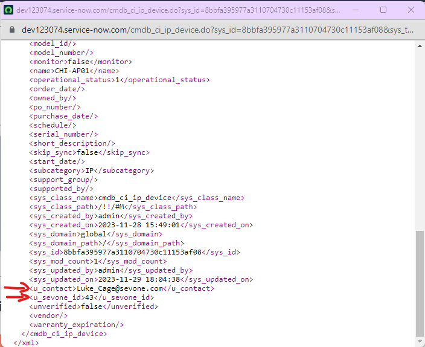

# Integrate SevOne Metadata into ServiceNow attributes

## Overview

In this lab we will review how we can copy SevOne Metadata into ServiceNow.

The flow of this lab is the following:

* Firstly we will create the new attributes in ServiceNow

* We will get the list of devices in SevOne

* For each of the devices, we will check if the device exists in ServiceNow

* If the device exists, we will get the values of the metadata attributes that we want to send to ServiceNow

* We will update the ServiceNow CI with the values

## Prerequirements

In order to complete this lab, it is required to have access to a ServiceNow instance. If you don't have one already, please create one using following the steps defined on this [link](https://developer.servicenow.com/dev.do#!/learn/learning-plans/utah/new_to_servicenow/app_store_learnv2_buildmyfirstapp_utah_personal_developer_instances).

It's important to change your role to admin to be able to use the instance properly (see link [here](https://www.servicenow.com/community/user/ssoregistrationpage?dest_url=https:%2F%2Fwww.servicenow.com%2Fcommunity%2Finstance-help-forum%2Fhow-to-get-out-of-app-engine-studio-and-go-back-to-the-main%2Fm-p%2F286367%2Fthread-id%2F23136) )

**We strongly recommend doing the 'Sync Sevone Devices with ServiceNow' lab first to have the same devices in both platforms**

## Prepare the System

As we will copy some custom metadata into ServiceNow, firstly we need to prepare ServiceNow to support the new attributes.

1. Go to your ServiceNow instance

	a. Click on All

	b. Search for dictionary, and click on Dictionary

	c. Click on New (top right corner)

		i. Table: IP Device

		ii. Type: String

		iii. Column label: Contact

		iv. Column name: u_contact

		v. Max length: 256

		vi. Click Submit

	d. Click on New (top right corner)

		i. Table: IP Device

		ii. Type: Integer

		iii. Column label: SevOne_ID

		iv. Column name: u_sevone_id

		v. Max length: 16

		vi. Click Submit

## SevOne - ServiceNow attribute sync

If SevOne authentication has already been created, please skip this block of actions and continue to step 5.

2. Log into SANO automation platform

3. Go to Authentications

4. Click  Create Authentication

	a. Name: SevOne

	b. Service: SevOne

	c. **Protocol: http://** (<-- important)

	d. Host: 10.0.0.10

	e. Username: admin

	f. Password: SevOne

If ServiceNow authentication has already been created, please skip this block of actions and continue to step 6.

5. Click Create Authentication

	a. Name: ServiceNow

	b. Service: ServiceNow

	c. Protocol: https://

	d. Host: (Your SNOW instance URL, example: dev109667.service-now.com)

	e. Username: (Your SNOW instance username, example: admin)

	f. Password: (Your SNOW instance password)

6. Go to **Workflows**

7. Click Create Workflow

	a. Name: Sync SevOne metadata with ServiceNOW attributes

	b. Layout type: Sequence

8. Add variables to Start

	a. NMSCredentials

		i. Name: NMSCredentials

		ii. Type: Authentication -> SevOne

		iii. Default Value: "admin/SevOne"

		iv. In

		v. Required

	b. ServiceNowCredentials

		i. Name: ServiceNowCredentials

		ii. Type: Authentication -> ServiceNow

		iii. Default Value: "admin/ServiceNow"

		iv. In

		v. Required

	c. namespace

		i. Name: namespace

		ii. Type: string

		iii. Default Value: "ServiceNow"

		iv. In

		v. Required

	d. attribute

		i. Name: attribute

		ii. Type: string

		iii. Default Value: "sysContact"

		iv. In

		v. Required

9. Change to Flow View

10. On the left hand side panel, Click on SevOne -> REST v3 -> Metadata

11. Select "Metadata Devices (POST)" and drop it after the building block START

	a. Change name to SevOne_Get_Devices

	b. Click on the building block to open the right side panel and complete the following fields

		i. authKey: $NMSCredentials

12. Add a new building block, Common -> ForEach

	a. Change name to ForEach_Device

	b. Click on the building block to open the right side panel and complete the following fields

		i. list: $SevOne_Get_Devices.result.devices

13. Inside the LOOP, add a new building block, ServiceNow -> getTable

	a. Change name to ServiceNow_Find_CI

	b. Click on the building block to open the right side panel and complete the following fields

		i. authKey: $ServiceNowCredentials

		ii. tableName: "cmdb_ci_ip_device"

		iii. query: "name=" + $ForEach_Device.item.name

14. Add a new building block, Common -> If

	a. Change name to If_CI_Found

	b. Click on the building block to open the right side panel and complete the following fields

		i. condition: $ServiceNow_Find_CI.result.result.length > 0

15. In the 'TRUE' branch of the If, add a new building block, SevOne -> REST v3 -> Metadata -> Metadata Metadata Values (POST)

	a. Change name to SevOne_Find_Metadata_Value

	b. Click on the building block to open the right side panel and complete the following fields

		i. authKey: $NMSCredentials

		ii. body:

			1. attributeName:

				a. attribute: $attribute

				b. namespace: $namespace

			2. entityId: $ForEach_Device.item.id

			3. entityType: DEVICE

16. Add a new building block, ServiceNow -> patchTable

	a. Change name to ServiceNow_Update_Attribute

	b. Click on the building block to open the right side panel and complete the following fields

		i. authKey: $ServiceNowCredentials

		ii. tableName: "cmdb_ci_ip_device"

		iii. sys_id: $ServiceNow_Find_CI.result.result[0].sys_id

		iv. Table: click on the pencil item and paste the following content

			{
				"u_contact": $SevOne_Find_Metadata_Value.result.values[0],
				"u_sevone_id": $ForEach_Device.item.id
			}

		v. content_type: "application/json"

## Review

17. To test the workflow, click on Run (it will take around 1 minute to complete)

18. Go to your ServiceNow instance

	i. Click on All

	ii. Search for CMDB

	iii. Click on CMDB workspace (inside the CMDB workspace group)

19. Scroll down where CI overview is, and click on the 'Devices' column

20. Click on IP Device

21. Click on any device, for example CHI-AP01

	a. Navigate to the Details section (bottom half)

	b. Click on the three dots next to Key Attributes

	c. Click Show XML

22. At the bottom of the XML file you should see the new fields populated, u_contact and u_sevone_id

NOTE: the reason why these new fields don't appear directly on the web interface is because we haven't edited the out-of-the-box form in ServiceNow to display those new attributes.

