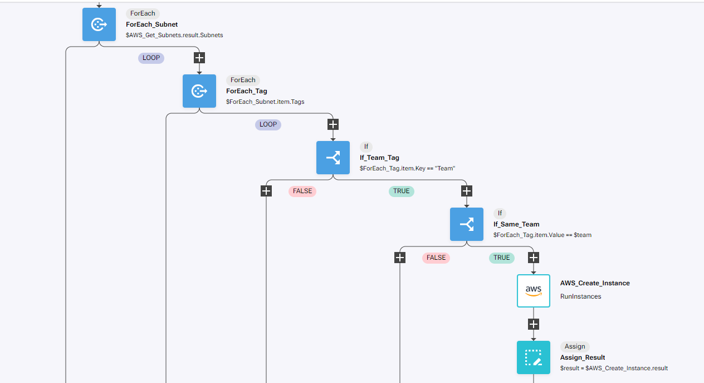

# Self service AWS Instance

## Overview

In this lab we will review how we can create a workflow that creates EC2 instances in AWS, without the need of giving users access to our AWS platform

The process of this RNA lab is the following:

* Check which subnet the team asking to create the vm is assigned to

* Create instance based on settings provided

## Prerequirements

In order to complete this lab, it is required to have access to AWS, including free AWS accounts https://aws.amazon.com/free/

To access the AWS API, we will require to create an access key and secret key https://docs.aws.amazon.com/keyspaces/latest/devguide/access.credentials.html

This lab needs as a prerequirement the completion of the Automate Subnet Creation PoT lab finished and executed correctly.

## Create Automation

If AWS authentication has already been created, please skip this block of actions and continue to step 4.

1. Log into RNA

2. Go to Authentications

3. Click  Create Authentication

	a. Name: AWS

	b. Service: AWS

	c. Access Key Id: [Copy Access Key from AWS]

	d. Secret Access Key: [Copy Secret Access Key from AWS]

4. Go to **Workflows**

5. Click Create Workflow

	a. Name: AWS Self Service Instance

	b. Layout type: Sequence

6. Add variables to Start

	a. size

		i. Name: size

		ii. Type: Enum

		iii. Click in the 'Expand' icon:

			{"type":"string","enum":["t2.micro","t3.micro"]}

		iv. Default Value: "t2.micro"

		v. In

		vi. Required

	b. image

		i. Name: region

		ii. Type: Enum

		iii. Click in the 'Expand' icon:

			{"type":"string","enum":["ami-00006bfaf3dd954f3","ami-00009114fa9ca2a86"]}

		iv. Default Value: "ami-00009114fa9ca2a86"

		v. In

		vi. Required
	
	
	c. AWSCredentials

		i. Name: AWSCredentials

		ii. Type: Authentication -> AWS

		iii. Default Value: "admin/AWS"

		iv. In

		v. Required

	d. region

		i. Name: region

		ii. Type: String

		iii. Default Value: "us-east-1"

		iv. In

		v. Required

	e. team

		i. Name: team

		ii. Type: Enum

		iii. Click in the 'Expand' icon:

			{"type":"string","enum":["Sales","Engineering"]}

		iv. Default Value: "Engineering"

		v. In

		vi. Required

7. Change to Flow View

8. On the left hand side panel, Click on AWS -> EC2

9. Select "DescribeVpcs" and drop it after the building block START

	a. Change name to SevOne_Check_VPCs

	b. Click on the building block to open the right side panel and complete the following fields

		i. authKey: $AWSCredentials

		ii. region: $region

10. Add a new building block, Common -> ForEach

	a. Change name to ForEach_Subnet

	b. Click on the building block to open the right side panel and complete the following fields

		i. list: $subnets

11. Inside the LOOP, add a new building block, Common -> ForEach

	a. Change name to ForEach_Tag

	b. Click on the building block to open the right side panel and complete the following fields

		i. list: $ForEach_Subnet.item.Tags

12. Inside the LOOP, add a new building block, Common -> If

	a. Change name to If_Team_Tag

	b. Click on the building block to open the right side panel and complete the following fields

		i. condition: $ForEach_Tag.item.Key == "Team"

13. Inside the TRUE branch, add a new building block, Common -> If

	a. Change name to If_Same_Team

	b. Click on the building block to open the right side panel and complete the following fields

		i. condition: $ForEach_Tag.item.Value == $team

14. Inside the TRUE branch, add a new building block, AWS -> EC2 -> RunInstances

	a. Change name to AWS_Create_Instance

	b. Click on the building block to open the right side panel and complete the following fields

		i. authKey: $AWSCredentials

		ii. region: $region

		iii. body: 

			1. ImageId: $image

			2. InstanceType: $size

			3. MaxCount: 1

			4. MinCount: 1

			5. SubnetId: $ForEach_Subnet.item.SubnetId

15. Add a new building block, Common -> Assign

	a. Change name to Assign_Result

	b. Click on the building block to open the right side panel and complete the following fields

		i. variable: $result

		ii. region: $AWS_Create_Instance.result

16. If there is any other Assign building block, disable/delete it

		

## Review

17. Run the workflow

18. Go to the AWS portal, search for EC2 and go to the EC2 Dashboard

19. In Instances (running) there should be 1

	

20. Click in Instances (running)

21. Click on the Instance Id of the only instance running

22. Check the Instance type is t2.micro and AMI ID is ami-00009114fa9ca2a86

	

23. Click on the Subnet ID

24. Click again on the Subnet ID and click on Tags

25. Verify that this instance is running on the Engineering subnet

	

**Terminate the instance as soon as you have finished reviewing the lab so you don't get charged**