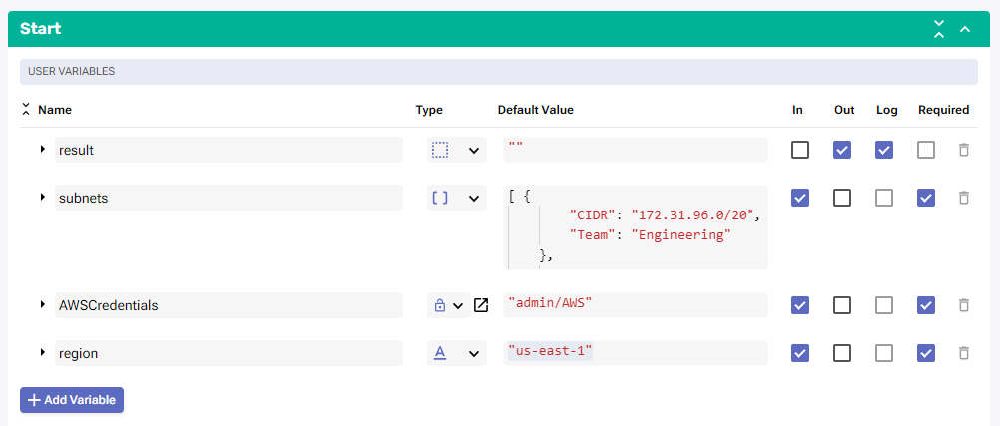
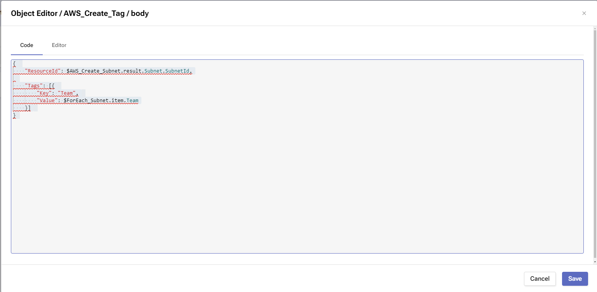
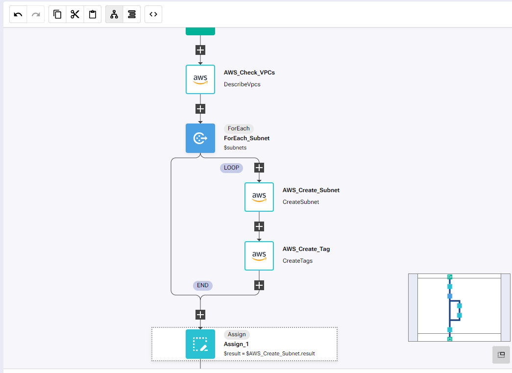
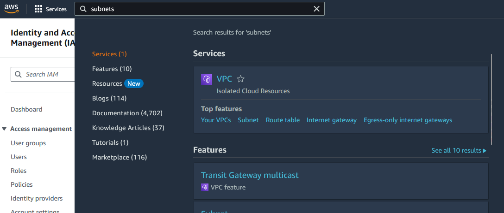
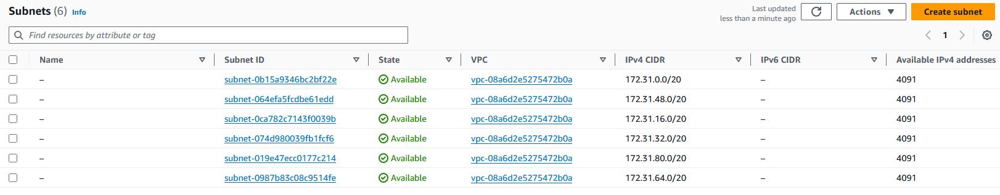
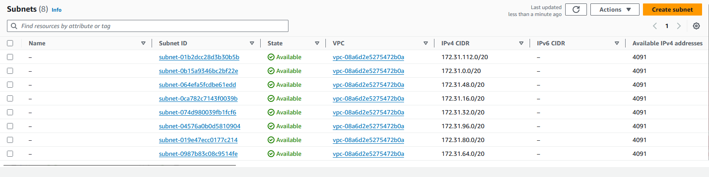
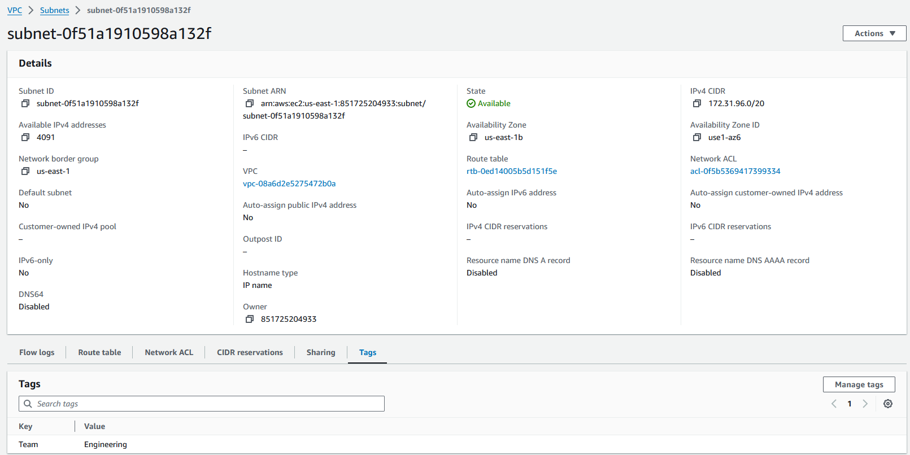
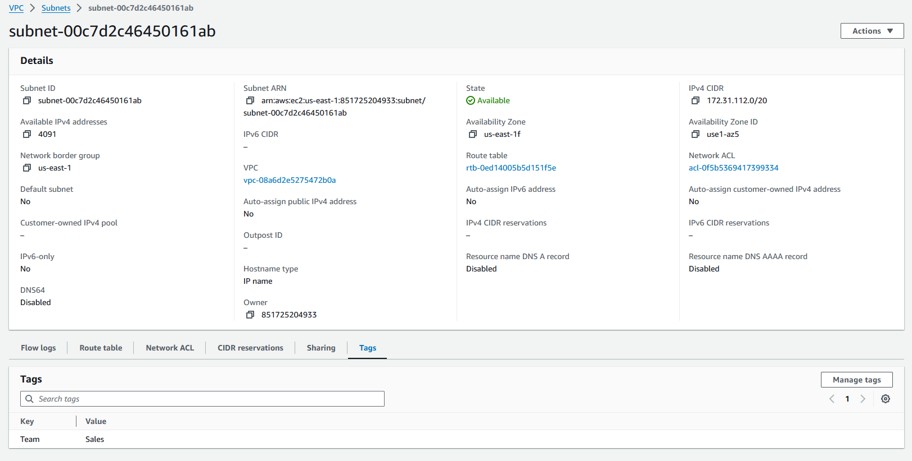

# Automate Subnet Creation

## Overview

In this lab we will review how we can create multiple subnets in AWS in a specified VPC and tag the subnets for later use.

The process of this RNA lab is the following:

* Check the VPCs available in our account

* On the first VPC available create each of the subnets defined

* Tag each of the subnets to the team assigned to that subnet

## Prerequirements

In order to complete this lab, it is required to have access to AWS, including free AWS accounts https://aws.amazon.com/free/

To access the AWS API, we will require to create an access key and secret key https://docs.aws.amazon.com/keyspaces/latest/devguide/access.credentials.html

## Create Subnets

If AWS authentication has already been created, please skip this block of actions and continue to step 4.

1. Log into RNA

2. Go to Authentications

3. Click  Create Authentication

	a. Name: AWS

	b. Service: AWS

	c. Access Key Id: [Copy Access Key from AWS]

	d. Secret Access Key: [Copy Secret Access Key from AWS]

4. Go to **Workflows**

5. Click Create Workflow

	a. Name: AWS Create Subnets

	b. Layout type: Sequence

6. Add variables to Start

	a. subnets

		i. Name: subnets

		ii. Type: Array

		iii. Default Value:
			[ {
					"CIDR": "172.31.96.0/20",
					"Team": "Engineering"
				},
				 {
					"CIDR": "172.31.112.0/20",
					"Team": "Sales"
				}
			]

		iv. In

		v. Required

	b. AWSCredentials

		i. Name: AWSCredentials

		ii. Type: Authentication -> AWS

		iii. Default Value: "admin/AWS"

		iv. In

		v. Required

	c. region

		i. Name: region

		ii. Type: String

		iii. Default Value: "us-east-1"

		iv. In

		v. Required

7. Change to Flow View

8. On the left hand side panel, Click on AWS -> EC2

9. Select "DescribeVpcs" and drop it after the building block START

	a. Change name to SevOne_Check_VPCs

	b. Click on the building block to open the right side panel and complete the following fields

		i. authKey: $AWSCredentials

		ii. region: $region

10. Add a new building block, Common -> ForEach

	a. Change name to ForEach_Subnet

	b. Click on the building block to open the right side panel and complete the following fields

		i. list: $subnets

11. Inside the LOOP, add a new building block, AWS -> EC2 -> CreateSubnet

	a. Change name to AWS_Create_Subnet

	b. Click on the building block to open the right side panel and complete the following fields

		i. authKey: $AWSCredentials

		ii. region: $region

		iii. body:

			1. CidrBlock: $ForEach_Subnet.item.CIDR

			2. VpcId: $AWS_Check_VPCs.result.Vpcs[0].VpcId

12. Add a new building block, AWS -> EC2 -> CreateTags

	a. Change name to AWS_Create_Tag

	b. Click on the building block to open the right side panel and complete the following fields

		i. authKey: $AWSCredentials

		ii. region: $region

		iii. body:

			{
			    "ResourceId": $AWS_Create_Subnet.result.Subnet.SubnetId,
			
			    "Tags": [{
			        "Key": "Team",
			        "Value": $ForEach_Subnet.item.Team
			    }]
			}

13. If there is an 'Assign_1' block at the end of the workflow, use it for the following step, otherwise add a new building block Common -> Assign

	a. variable: $result

	b. value: $AWS_Create_Subnet.result

## Review

14. Go to your AWS console

15. Search for subnets on the top bar, it will show VPC and it you hover the mouse over VPC you will see subnets

16. Click on Subnet

17. There should be 6 subnets created by default

18. Run the workflow in RNA, it should create two new subnets

19. Click on the Subnet ID of the subnet with CIDR 172.31.96.0/20

20. Click on Tags to show which team that subnet is assigned to

21. Click on subnets to go back to the main list of subnets and click on the Subnet Id of the subnet with CIDR 172.31.112.0/20

22. Click on Tags to show which team that subnet is assigned to

