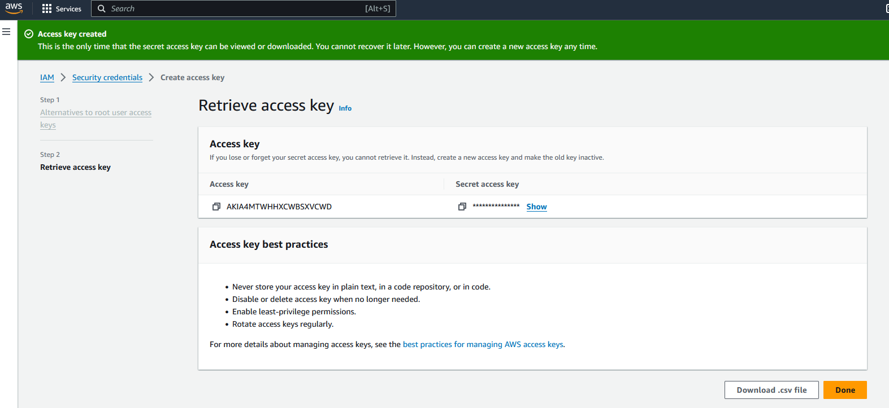

# Democratize Hybrid Cloud Automation

## Overview

In this lab we will review how to create a self service portal for users to create their own virtual machines in different clouds.

The process of this RNA lab is the following:

* Build a workflow that uses existing workflows to create instances in the cloud (see prerequirements section)

* Create a tile in Automation Center to allow self service automation to users

## Prerequirements

In order to complete this lab, it is required to have access to AWS, including free AWS accounts https://aws.amazon.com/free/

To access the AWS API, we will require to create an access key and secret key https://docs.aws.amazon.com/keyspaces/latest/devguide/access.credentials.html

This lab needs as a prerequirement the completion of the Self service AWS Instance and Automate Subnet Creation PoT lab finished and executed correctly.

## Create Workflow

If AWS authentication has already been created, please skip this block of actions and continue to step 4.

1. Log into RNA

2. Go to Authentications

3. Click  Create Authentication

	a. Name: AWS

	b. Service: AWS

	c. Access Key Id: [Copy Access Key from AWS]

	d. Secret Access Key: [Copy Secret Access Key from AWS]

4. Go to **Workflows**

5. Click Create Workflow

	a. Name: Cloud Instance Self Service

	b. Layout type: Sequence

6. Add variables to Start

	a. cloud

		i. Name: cloud

		ii. Type: Enum

		iii. Click in the 'Expand' icon:

			{"type":"string","enum":["AWS","Azure","IBM","GCP"]}

		iv. Default Value: "AWS"

		v. In

		vi. Required

	b. size

		i. Name: size

		ii. Type: Enum

		iii. Click in the 'Expand' icon:

			{"type":"string","enum":["Small","Medium","Large"]}

		iv. Default Value: "Small"

		v. In

		vi. Required

	c. region

		i. Name: region

		ii. Type: String

		iii. Click in the 'Expand' icon:

			{"type":"string","enum":["US East","US West","Europe","Africa","Asia","Australia"]}

		iv. Default Value: "US EAST"

		v. In

		vi. Required
	
	d. image

		i. Name: region

		ii. Type: Enum

		iii. Click in the 'Expand' icon:

			{"type":"string","enum":["Linux","Windows"]}

		iv. Default Value: "Linux"

		v. In

		vi. Required
	
	e. team

		i. Name: team

		ii. Type: Enum

		iii. Click in the 'Expand' icon:

			{"type":"string","enum":["Sales","Engineering"]}

		iv. Default Value: "Engineering"

		v. In

		vi. Required

7. Change to Flow View

8. On the left hand side panel, Click on Common

9. Select "SwitchCase" and drop it after the building block START

	a. Change name to SwitchCase_Cloud

	b. Click on the building block to open the right side panel and complete the following fields

		i. expression: $cloud

10. On Case-1, click on the box below

	a. value: "AWS"

11. Click on + CASE, on Case-2 click on the box below

	a. value: "Azure"

12. Click on + CASE, on Case-3 click on the box below

	a. value: "IBM"

13. Click on + CASE, on Case-4 click on the box below

	a. value: "GCP"

	

14. On Case-2, add a new building block, Common -> Assign

	a. Change name to Assign_Azure

	b. Click on the building block to open the right side panel and complete the following fields

		i. variable: $result

		ii. value: "Cloud not supported"

15. On Case-3, add a new building block, Common -> Assign

	a. Change name to Assign_IBM

	b. Click on the building block to open the right side panel and complete the following fields

		i. variable: $result

		ii. value: "Cloud not supported"
		
16. On Case-4, add a new building block, Common -> Assign

	a. Change name to Assign_GCP

	b. Click on the building block to open the right side panel and complete the following fields

		i. variable: $result

		ii. value: "Cloud not supported"

17. On Case-1, add a new building block, Common -> SwitchCase

	a. Change name to SwitchCase_Size

	b. Click on the building block to open the right side panel and complete the following fields

		i. expression: $size

18. On Case-1, click on the box below:

	a. value: "Small"

19. On Case-1 of the SwitchCase_Size, add a new building block, Common -> Assign

	a. Change name to Assign_size

	b. Click on the building block to open the right side panel and complete the following fields

		i. variable: $newsize

		ii. value: "t2.micro"

20. On Default of the SwitchCase_Size, add a new building block, Common -> Assign

	a. Change name to Assign_size_1

	b. Click on the building block to open the right side panel and complete the following fields

		i. variable: $newsize

		ii. value: "t3.micro"

	

21. After the END of SwitchCase_Size, add a new building block, Common -> SwitchCase

	a. Change name to SwitchCase_Image

	b. Click on the building block to open the right side panel and complete the following fields

		i. expression: $image

22. On Case-1, click on the box below

	a. value: "Linux"

23. On Case-1 of the SwitchCase_Image, add a new building block, Common -> Assign

	a. Change name to Assign_Image

	b. Click on the building block to open the right side panel and complete the following fields

		i. variable: $newimage

		ii. value: "ami-00006bfaf3dd954f3"

24. On Default of the SwitchCase_Image, add a new building block, Common -> Assign

	a. Change name to Assign_image_1

	b. Click on the building block to open the right side panel and complete the following fields

		i. variable: $newimage

		ii. value: "ami-00009114fa9ca2a86"

	

25. After the END of SwitchCase_Image, add a new building block, Common -> SwitchCase

	a. Change name to SwitchCase_Region

	b. Click on the building block to open the right side panel and complete the following fields

		i. expression: $region

26. On Case-1, click on the box below

	a. value: "US East"

27. On Case-1 of the SwitchCase_Region, add a new building block, Common -> Assign

	a. Change name to Assign_Region

	b. Click on the building block to open the right side panel and complete the following fields

		i. variable: $newregion

		ii. value: "us-east-1"

28. On Default of the SwitchCase_Region, add a new building block, Common -> Assign

	a. Change name to Assign_region_1

	b. Click on the building block to open the right side panel and complete the following fields

		i. variable: $newregion

		ii. value: "us-west-1"

	

29. After the END of SwitchCase_Image, add a new building block, User -> AWS Self Service Instance

	a. Change name to AWS_self_service_instance

	b. Click on the building block to open the right side panel and complete the following fields

		i. size: $newsize

		ii. image: $newimage

		iii. AWSCredentials: "admin/AWS"

		iv. region: $newregion

		v. team: $team

30. Add a new building block, Common -> Assign

	a. Change name to Assign_result

	b. Click on the building block to open the right side panel and complete the following fields

		i. variable: $result

		ii. value: $AWS_self_service_instance.result

31. If there are other Assign blocks, please disable/delete them.

32. Save workflow

	

## Create Self Service Portal

33. Go to Automation Center

34. Click on Create Panel

	a. Title: Cloud Self Service

	b. Click Create

35. Click on the new panel created, and click on Create Tile

	a. Select workflow: admin/User/Cloud Instance Self Service

	b. Click Next

	c. Title: Request Cloud Instance

	d. Description: This tile allows you to request a new cloud instance

	e. Click Next

	f. Click Create

36. Click on the Request Cloud Instance tile to test the process

	a. Leave the options as default

	b. Click Execute

37. Go to AWS to check if the instance has been created correctly

NOTE: InstanceId from the last two screenshots should match

**Terminate the instance as soon as you have finished reviewing the lab so you don't get charged**