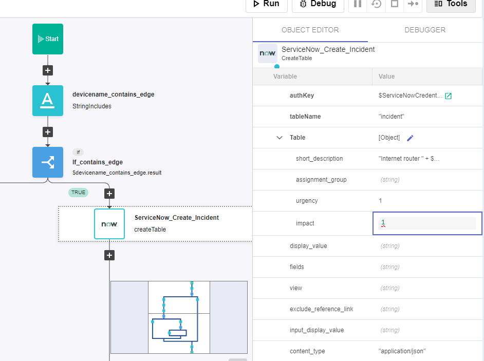
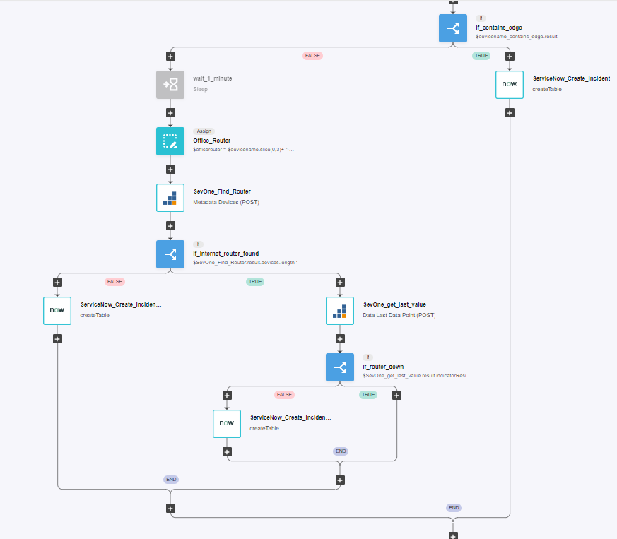

# Alert Suppression

## Overview

In this lab we will review how RNA can suppress alerts based on specific situations.

SevOne has the capability of sending alerts based on policies, however SevOne does not have alert correlation or alert suppression capabilities. However with RNA we can expand SevOne capabilities to only forward specific alerts to 3rd party ticketing systems (such as ServiceNow) based on the conditions we define.

In this lab we will review how we can suppress alerts of devices that became unavailable in offices where the internet connection has been lost. This is a well-know situation that generates multiple alerts (from 100s to 1000s) however the actual issue is just one device going down (internet router).

## Prerequirements

In order to complete this lab, it is required to have access to a ServiceNow instance. If you don't have one already, please create one using following the steps defined on this [link](https://developer.servicenow.com/dev.do#!/learn/learning-plans/utah/new_to_servicenow/app_store_learnv2_buildmyfirstapp_utah_personal_developer_instances).

It's important to change your role to admin to be able to use the instance properly (see link [here](https://www.servicenow.com/community/user/ssoregistrationpage?dest_url=https:%2F%2Fwww.servicenow.com%2Fcommunity%2Finstance-help-forum%2Fhow-to-get-out-of-app-engine-studio-and-go-back-to-the-main%2Fm-p%2F286367%2Fthread-id%2F23136) )

## Alert Suppression - ServiceNow Integration

If SevOne authentication has already been created, please skip this block of actions and continue to step 5.

1. Log into SANO automation platform

2. Go to Authentications

3. Click  Create Authentication

	a. Name: SevOne

	b. Service: SevOne

	c. **Protocol: http://** (<-- important)

	d. Host: 10.0.0.10

	e. Username: admin

	f. Password: SevOne

If ServiceNow authentication has already been created, please skip this block of actions and continue to step 5.

4. Click Create Authentication

	a. Name: ServiceNow

	b. Service: ServiceNow

	c. Protocol: https://

	d. Host: (Your SNOW instance URL, example: dev109667.service-now.com)

	e. Username: (Your SNOW instance username, example: admin)

	f. Password: (Your SNOW instance password)

5. Go to **Workflows**

5. Click Create Workflow

	a. Name: Alert Suppression

	b. Layout type: Sequence

6. Add variables to Start

	a. NMSCredentials

		i. Name: NMSCredentials

		ii. Type: Authentication -> SevOne

		iii. Default Value: "admin/SevOne"

		iv. In

		v. Required

	b. ServiceNowCredentials

		i. Name: ServiceNowCredentials

		ii. Type: Authentication -> ServiceNow

		iii. Default Value: "admin/ServiceNow"

		iv. In

		v. Required

	c. devicename

		i. Name: devicename

		ii. Type: String

		iii. Default Value: ""

		iv. In

		v. Required

7. Change to Flow View

8. On the left hand side panel, Click on Common -> String 

9. Select "StringIncludes" and drop it after the building block START

	a. Change name to devicename_contains_edge

	b. Click on the building block to open the right side panel and complete the following fields

		i. str: $devicename

		ii. searchString: "EDGE"

10. Add a new building block, Common -> If

	a. Change name to If_contains_edge

	b. Click on the building block to open the right side panel and complete the following fields

		i. condition: $devicename_contains_edge.result

11. On the 'TRUE' branch of the If, add a new building block, ServiceNow -> createTable

	a. Change name to ServiceNow_Create_Incident

	b. Click on the building block to open the right side panel and complete the following fields

		i. authKey: $ServiceNowCredentials

		ii. tableName: "incident"

		iii. Table: 

			1. short_description: "Internet router " + $devicename + " is down"

			2. urgency: 1

			3. impact: 1

		iv. content_type: "application/json"

12. On the 'FALSE' branch of the If, add a new building block, Common -> Sleep

	a. Change name to wait_1_minute

	b. Click on the building block to open the right side panel and complete the following fields

		i. seconds: 60

	c. Disable this building block by clicking on On/Off icon

NOTE: we are disabling this building block because when we test this workflow we don't want to wait 60 seconds, however in a production environment we will want to wait some time, to make sure SevOne is able to capture the status of the EDGE return before pushing the alert to ServiceNow

13. Add a new building block, Common -> Assign

	a. Change name to Office_Router

	b. Click on the building block to open the right side panel and complete the following fields

		i. variable: $officerouter

		ii. value: $devicename.slice(0,3)+ "-EDGE01"

14. Add a new building block, SevOne -> REST v3 -> Metadata -> Metadata Devies (POST)

	a. Change name to SevOne_Find_router

	b. Click on the building block to open the right side panel and complete the following fields

		i. authKey: $NMSCredentials

		ii. body:

			1. name:

				a. value: $officerouter

15. Add a new building block, Common -> If

	a. Change name to If_internet_router_found

	b. Click on the building block to open the right side panel and complete the following fields

		i. condition: $SevOne_Find_Router.result.devices.length > 0

16. On the 'TRUE' branch of the If, add a new building block, SevOne -> Rest v3 -> Data -> Data Last Data Point (POST)

	a. Change name to SevOne_get_last_value

	b. Click on the building block to open the right side panel and complete the following fields

		i. authKey: $NMSCredentials

		ii. body:

			1. indicatorFilters: click on the three little dots that appear on the right side of this property and click Append child

				a. On the new line ( 0 ):

					i. deviceIds: [ $SevOne_Find_Router.result.devices[0].id ]
				
					ii. indicatorTypeNames: click on the three little dots that appear on the right side of this property and click Append child

						1. On the new line ( 0 ): 
						
							a. value: $availability

					ii. plugins: ["ICMP"]

Note: to confirm, click on the square icon next to body and compare with the screenshot below.

15. Add a new building block, Common -> If

	a. Change name to If_router_down

	b. Click on the building block to open the right side panel and complete the following fields

		i. condition: $SevOne_get_last_value.result.indicatorResults[0].dataPoint.value == 0

16. On the 'FALSE' branch of the If, add a new building block, ServiceNow -> createTable

	a. Change name to ServiceNow_Create_Incident2

	b. Click on the building block to open the right side panel and complete the following fields

		i. authKey: $ServiceNowCredentials

		ii. tableName: "incident"

		iii. Table: 

			1. short_description:  "Device " + $devicename + " is down"

			2. urgency: 2

			3. impact: 2

		iv. content_type: "application/json"

17. Go back to the 'If_internet_router_found', on the 'FALSE' branch of this If, add a new building block, ServiceNow -> createTable

	a. Change name to ServiceNow_Create_Incident3

	b. Click on the building block to open the right side panel and complete the following fields

		i. authKey: $ServiceNowCredentials

		ii. tableName: "incident"

		iii. Table: 

			1. short_description:  "Device " + $devicename + " is down"

			2. urgency: 2

			3. impact: 2

		iv. content_type: "application/json"

18. Go to **APIS** section

19. Click create API

	a. Name: suppress

	b. Authentications: 

		i. authentication: Api Keys

		ii. Click on Add API Key

			1. Name: suppress

			2. Click on the 'tick' icon

			3. copy the content of value for future use

	c. Click Create

20. Click Create (top right corner)

	a. Workflow: click on the folder icon and choose the workflow 'Alert Suppression;

	b. Stage: 
		
		i. click on the + icon
		
		ii. click 'Create' on the new window that appeared

	c. Endpoint:

		i. click on the + icon

		ii. Path: /suppress

		iii. Method: POST

		iv. click Create

	d. Click Deploy

21. Click on Swagger UI

	a. Click on Authorize

	b. Paste the API key created before and click authorize and close

	c. Expand the endpoint /suppress and click 'Try it out'

	d. Click Execute

NOTE: the test will fail, however this doesn't matter because we are interested in the Request URL created. Copy it for future use

22. Go to the NMS -> Events -> Configuration -> Webhook Definition Manager

23. Click on Add Webhook Definition

	a. Webhook Definition Name: supress RNA

	b. Destination URL: paste the URL copied from SWAGGER but replacing the "na4.techzone-services.com:XXXXX" (including port number) for "10.0.0.12" 

	c. Allow insecure webhook connection: Enabled

	d. Request Method: POST

	e. Body:

			{

  				"NMSCredentials": "admin/SevOne",

  				"ServiceNowCredentials": "admin/ServiceNow",

  				"devicename": "$deviceName"

			}
	
	e. Click Save

22. Go to the NMS -> Events -> Configuration -> Policy Browser

23. Click on Create Policy

	a. Name: Device Down (Suppression)

	b. Device Group: All Device Groups

	c. Object Type: ICMP Poller -> Ping Data

	d. Click on Trigger Conditions:

		i. Under Conditions, click on the menu icon -> Create New

			1. Indicator: Availability

			2. Type: Static

			3. Comparison: equal to

			4. Threshold: 0

			5. Duration: 1 

			6. Aggregation: Minimum

		ii. Click Save

	e. On Webhooks, move suppress RNA to the right side

	f. Click on Clear Conditions:

		i. Under Conditions, click on the menu icon -> Create New

			1. Indicator: Availability

			2. Type: Static

			3. Comparison: equal to

			4. Threshold: 100 Percent

			5. Duration: 1 

			6. Aggregation: Average

		ii. Click Save

	g. Click Save as New

## Review

24. Go to the NMS -> Devices -> Device Manager

25. Edit the device CHI-EDGE01

	a. Click High Frequency Poller:

		1. Click on Add Object Poll Frequency

			1. Device: CHI-EDGE01

			2. Object: IP of device

			3. Frequency: 10 

	b. Click High Frequency Poller:

		1. Click on Add Object Poll Frequency

			1. Device: CHI-AP01

			2. Object: IP of device

			3. Frequency: 10 

	c. Click High Frequency Poller:

		1. Click on Add Object Poll Frequency

			1. Device: CHI-AP02

			2. Object: IP of device

			3. Frequency: 10 

26. Go back to Device Manager and edit CHI-EDGE01

	a. Change IP to 1.1.0.0 to force it to go down

	b. Click Save

NOTE: we need to wait to rediscover the device, but after a few minutes we should see an incident in ServiceNow (the image below has two alerts on CHI-EDGE01 due to some testing, in your instance there should be one alert only)

NOTE: If now we do the same with CHI-AP1, it should not generate any alert, because the workflow will suppress any alert for devices in CHI office

27. Go back to Device Manager and edit CHI-AP01

	a. Change IP to 1.1.0.0 to force it to go down

	b. Click Save

(the image below has two alerts on CHI-EDGE01 due to some testing, in your instance there should be one alert only)

 

28. Edit CHI-EDGE01 and CHI-AP01 to the correct IPs

	a. CHI-EDGE01: 172.24.147.5

	b. CHI-AP01: 172.24.148.4

29. Wait a few minutes until the discovery of the devices has finished

NOTE: on the next step we choose a different device from CHI office to get the result faster, but we could choose CHI-AP1 again but we would need to make sure that the original alert has been clear in SevOne before changin the IP again

30. Go back to Device Manager and edit CHI-AP02 

	a. Change IP to 1.1.0.0 to force it to go down

	b. Click Save

NOTE: now the workflow won't suppress the alert because the internet router of that office is active

 
