# Automated Cross Object Calculation

## Overview

In this lab we will review how we can automate the creation of Cross Object Calculation objects (Calculation Plugin) using RNA.

In order to custom metrics in SevOne there are two main options: group poller and calculation plugin. The benefit of calculation plugin is that we can create more complex and sophisticated formulas than with group poller (mainly aggregations), however the main problem with the calculation plugin is that you need to create the formulas manually.

Now with RNA we can automate the creation of these CoC formulas with no need for scripting (PHP, Python...) or understanding the SevOne API.

In this lab we will select a group of devices where we want to create some CoC objects. This CoC object will be the sum of the In Traffic from two interfaces that are connected to internet, therefore we need to tell RNA:

* where to find these devices (device group)

* which CoC object type we will use to create the new CoC objects

* which interfaces are the ones connected to internet

* which indicators have In Traffic data

## Create CoC Object

If SevOne authentication has already been created, please skip this block of actions and continue to step 4.

1. Log into SANO automation platform

2. Go to Authentications

3. Click  Create Authentication

	a. Name: SevOne

	b. Service: SevOne

	c. **Protocol: http://** (<-- important)

	d. Host: 10.0.0.10

	e. Username: admin

	f. Password: SevOne

4. Go to Workflows and click on Create Workflow

	a. Name: Automatic CoC Creation

	b. Layout type: Sequence

5.  Add variables to Start

	a. NMSCredentials

		i. Name: NMSCredentials

		ii. Type: Authentication -> SevOne

		iii. Default Value: "admin/SevOne"

		iv. In

		v. Required

	b. CoCObjectType

		i. Name: CoCObjectType

		ii. Type: String

		iii. Default Value: "Interface"

		iv. In

		v. Required

	c. CoCIndicatorType

		i. Name: CoCIndicatorType

		ii. Type: String

		iii. Default Value: "OctetsIn"

		iv. In

		v. Required

	d. CoCObjectName

		i. Name: CoCObjectName

		ii. Type: String

		iii. Default Value: "Interface Traffic"

		iv. In

		v. Required

	e. devicegroup

		i. Name: devicegroup

		ii. Type: String

		iii. Default Value: "CoC Internet Traffic"

		iv. In

		v. Required

	f. listobjects

		i. Name: listobjects

		ii. Type: Array

		iii. Default Value: ['GigabitEthernet1/1/0/0','GigabitEthernet1/1/0/10']

		iv. In

		v. Required

	g. indicatorname

		i. Name: indicatornames

		ii. Type: Array

		iii. Default Value: ["ifHCInOctets","ifInOctets"]

		iv. In

		v. Required

	h. tempindicatorlist

		i. Name: tempindicatorlist

		ii. Type: Array

		iii. Default Value: []

	i. expression

		i. Name: expression

		ii. Type: String

		iii. Default Value: ""

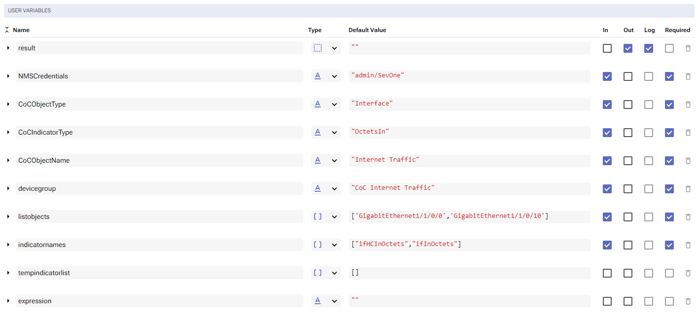

6. Change to Flow View

7. On the left hand side panel, click on  SevOne -> REST v3 -> Metadata

8. Select "Metadata Device Groups (POST)" and drop it after the building block START

	a. Change name to Find_Device_Group

	b. Click on the building block to open the right side panel and complete the following fields

		i. authKey: $NMSCredentials

		ii. body: 

			1. names: click on the three vertical dots on the right side of this property and click 'Append child'

				a. type: "FUZZABLE_STRING_TYPE_EXACT"

				b. value: $devicegroup

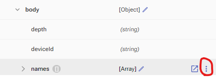

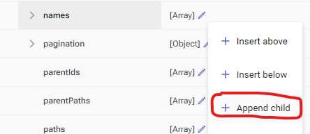

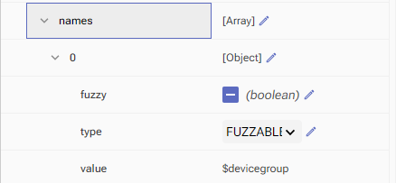

9. Add a new building block, SevOne -> REST v3 -> Metadata -> Metadata Devices (POST)

	a. Change name to Find_Devices

	b. Click on the building block to open the right side panel and complete the following fields

		i. authKey: $NMSCredentials

		ii. body: 

			1. deviceGroupsIds: [ $Find_Device_Group.result.groups[0].id ]

10. Add a new building block, SevOne -> REST v3 -> Metadata -> Metadata Object Types (POST)

	a. Change name to Find_Object_Type

	b. Click on the building block to open the right side panel and complete the following fields

		i. authKey: $NMSCredentials

		ii. body: 

			1. pluginId: 20,

			2. names: click on the three vertical dots on the right side of this property and click 'Append child'

				a. type: "FUZZABLE_STRING_TYPE_EXACT"

				b. value: $CoCObjectType

11. Add a new building block, SevOne -> REST v3 -> Metadata -> Metadata Indicator Types (POST)

	a. Change name to Find_Indicator_Type

	b. Click on the building block to open the right side panel and complete the following fields

		i. authKey: $NMSCredentials

		ii. body: 

			1. filters: click on the three vertical dots on the right side of this property and click 'Append child'

				a. plugins: [ 20 ],

				b. indicatorTypeNames: click on the three vertical dots on the right side of this property and click 'Append child'

					i. value: $CoCIndicatorType

				c. objectTypeIds: [ $Find_Object_Type.result.objectTypes[0].id ]

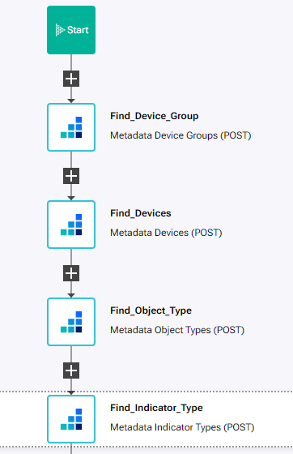				

12. Add a new building block, Common -> ForEach

	a. Change name to ForEach_Device_in_Group

	b. Click on the building block to open the right side panel and complete the following fields

		i. list: $Find_Devices.result.devices

13. Add a new building block, Common -> Assign

	a. Change name to Initizalize_list_variables

	b. Click on the building block to open the right side panel and complete the following fields

		i. variable: $tempindicatorlist

		ii. value: []

14. Add a new building block, SevOne -> REST v3 -> Object -> Objects Create COC Group

	a. Change name to Create_CoC_Object

	b. Click on the building block to open the right side panel and complete the following fields

		i. authKey: $NMSCredentials

		ii. body:

			1. description: $CoCObjectName

			2. deviceId: $ForEach_Device_in_Group.item.id

			3. name: $CoCObjectName

			4. ObjectTypeId: $Find_Object_Type.result.objectTypes[0].id

15. Add a new building block, Common -> ForEach

	a. Change name to ForEach_object

	b. Click on the building block to open the right side panel and complete the following fields

		i. list: $listobjects

16. Add a new building block, Common -> ForEach

	a. Change name to ForEach_indicatorname

	b. Click on the building block to open the right side panel and complete the following fields

		i. list: $indicatornames

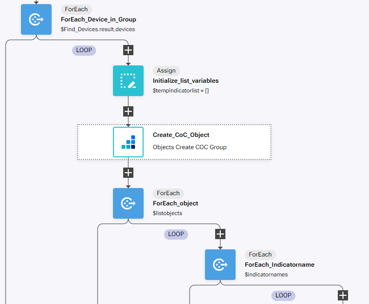				

17. Add a new building block, SevOne -> REST v3 -> Metadata -> Metadata Indicators (POST)

	a. Change name to Find_Indicators

	b. Click on the building block to open the right side panel and complete the following fields

		i. authKey: $NMSCredentials

		ii. body:

			1. Filters: click on the three vertical dots on the right side of this property and click 'Append child'

				a. deviceIds: [ $ForEach_Device_in_Group.item.id ]

				b. objectNames: click on the three vertical dots on the right side of this property and click 'Append child'

					i. value: $ForEach_object.item

				c. indicatorTypeNames: click on the three vertical dots on the right side of this property and click 'Append child'

					i. value: $ForEach_Indicatorname.item

18. Add a new building block, Common -> If

	a. Change name to If_indicator_found

	b. Click on the building block to open the right side panel and complete the following fields

		i. Condition: $Find_Indicators.result.indicators.length > 0

19. On the 'TRUE' branch of the If, add a new building block, SevOne -> Rest v3 -> Objects -> Objects Create COC Variable

	a. Change name to Create_CoC_Variable

	b. Click on the building block to open the right side panel and complete the following fields

		i. authKey: $NMSCredentials

		ii. body:

			1. deviceId: $ForEach_Device_in_Group.item.id

			2. objectName: $CoCObjectName

			3. varDeviceId: $Find_Indicators.result.indicators[0].deviceId

			4. varIndicatorId: $Find_Indicators.result.indicators[0].indicatorId

			5. varName: $Find_Indicators.result.indicators[0].id

			6. varObjectId: $Find_Indicators.result.indicators[0].objectId

			7. varPluginId: $Find_Indicators.result.indicators[0].pluginId

20. Add a new building block, Common -> Array -> ArrayPush

	a. Change name to Save_Indicator_Name

	b. Click on the building block to open the right side panel and complete the following fields

		i. array: $tempindicatorlist

		ii. item: $Find_Indicators.result.indicators[0].id

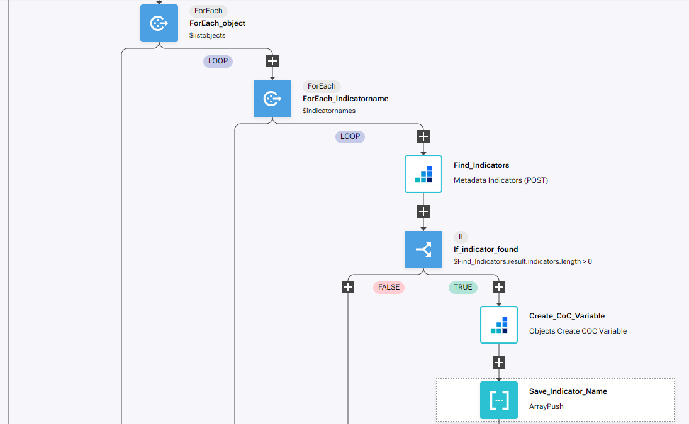				

21. After the third 'END', add a new building block, Common -> Assign

	a. Change name to Initialize_expression

	b. Click on the building block to open the right side panel and complete the following fields

		i. variable: $expression

		ii. value: ''

22. Add a new building block, Common -> ForEach

	a. Change name to ForEach_Indicator

	b. Click on the building block to open the right side panel and complete the following fields

		i. list: $tempindicatorlist

23. Add a new building block, Common -> If

	a. Change name to If_expression_empty

	b. Click on the building block to open the right side panel and complete the following fields

		i. Condition: $expression == ""	

24. On the 'TRUE' branch of the If, add a new building block, Common -> Assign

	a. Change name to Add_indicator_to_expression

	b. Click on the building block to open the right side panel and complete the following fields

		i. variable: $expression

		ii. value: "${" + $ForEach_Indicator.item + "} "

25. On the 'FALSE' branch of the If, add a new building block, Common -> Assign

	a. Change name to Add_indicator_to_expression2

	b. Click on the building block to open the right side panel and complete the following fields

		i. variable: $expression

		ii. value: $expression + " + ${" + $ForEach_Indicator.item + "} "

26. After the second 'END', add a new building block, SevOne -> REST v3 -> Objects -> Objects Update COC Expression

	a. Change name to Update_Expression

	b. Click on the building block to open the right side panel and complete the following fields

		i. authKey: $NMSCredentials

		ii. body:

			1. objectName: $CoCObjectName

			2. deviceId: $ForEach_Device_in_Group.item.id

			3. expression: $expression

			4. indicatorTypeId: $Find_Indicator_Type.result.indicatorTypes[0].id

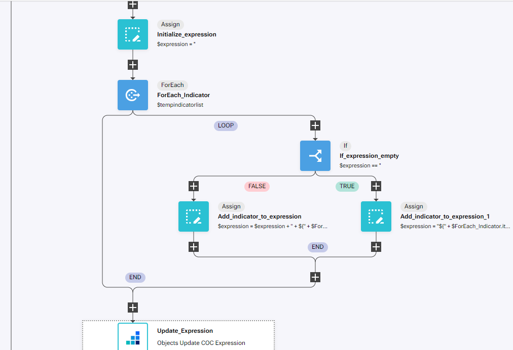	

## Review

In order to review how the workflow in RNA works, we need to create the device group and the CoC object type in the NMS first.

27. Go to the NMS -> Devices -> Grouping -> Device Groups

28. Click 'Add Device Group'

	a. Device Group Name: CoC Internet Traffic

	b. Click save

29. Find the device group created, click on the name and add devices by clicking on 'Pin Devices'

	a. Select CHI-EDGE01 and SFO-EDGE01

	b. Click 'Pin to Group'

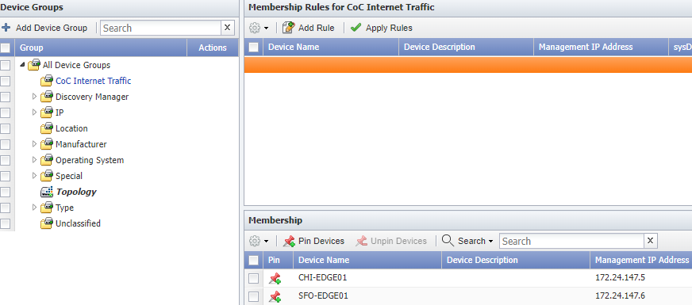	

30. Go to Administration -> Monitoring Configuration -> Object Types

31. Change Filter to Calculation Poller

	a. Click on Add

		i. Name: Interface

		ii. Click Save as New

32. Click on the object type created and click on Add Atomic Indicator Type

	a. Indicator Name: OctetsIn

	b. Description: OctetsIn

	c. Indicator Type: GAUGE

	d. Measure As: Bytes

	e. Display As: Bytes

	f. Click Save As New

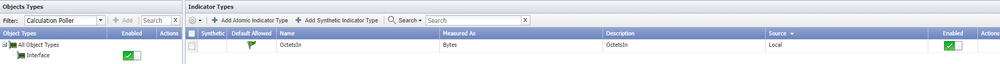	

Now we are ready to test the RNA workflow.

33. Go back to RNA, open the workflow that you created and click Run

34. Go back to the NMS and go to Administration -> Monitoring Configuration -> Calculation Editor

35. Click on any of the objects created to see the formula and the variables created

NOTE: variable names will be different on your installation

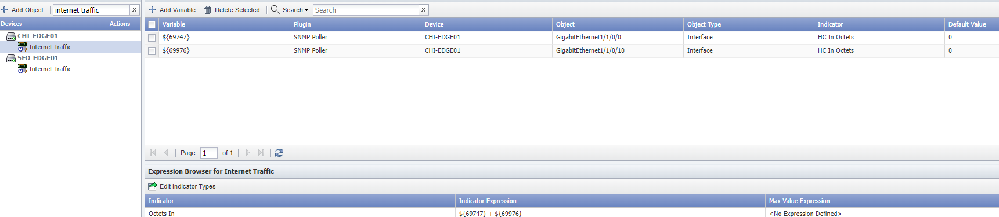

To start collecting data on this new object, we need to rediscover the device

36. Go to Devices -> Device Manager

	a. Find devices CHI-EDGE01 and SFO-EDGE01

	b. Click on the 'gear' icon -> Discovery -> Discover

After a few (5-10) minutes, data should start being populated on the new Internet Traffic object

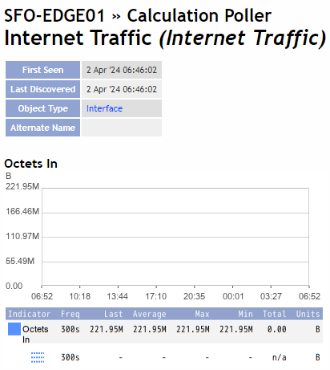
