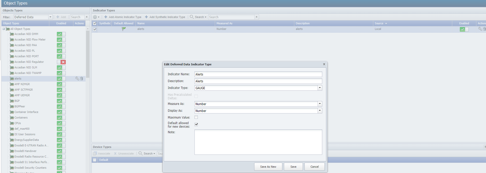
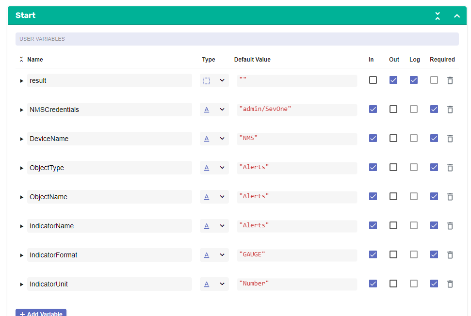
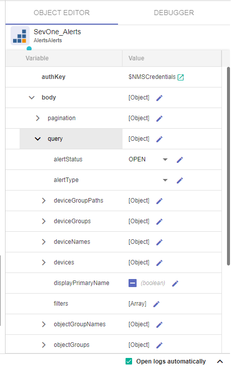
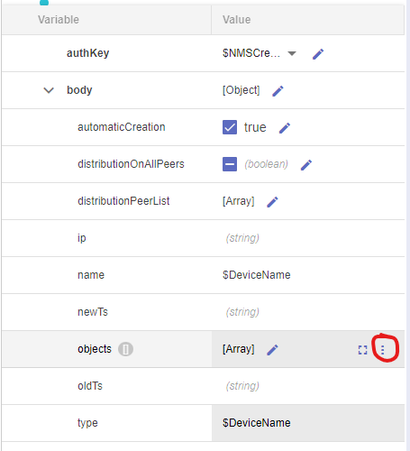
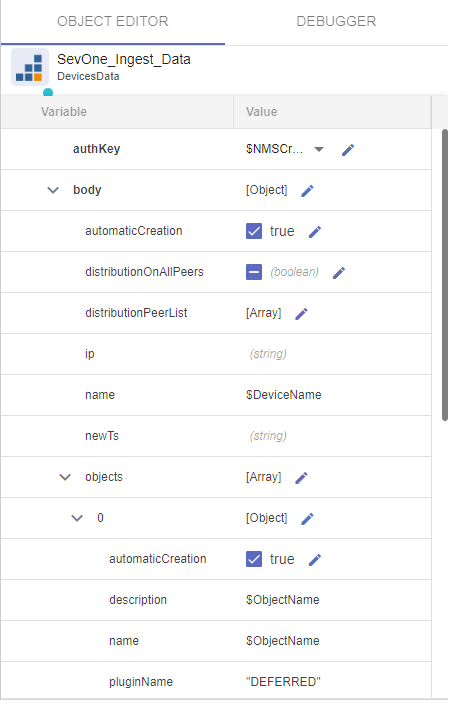
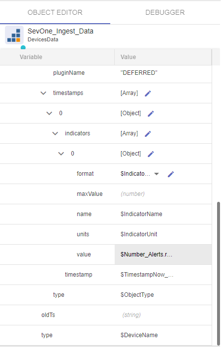
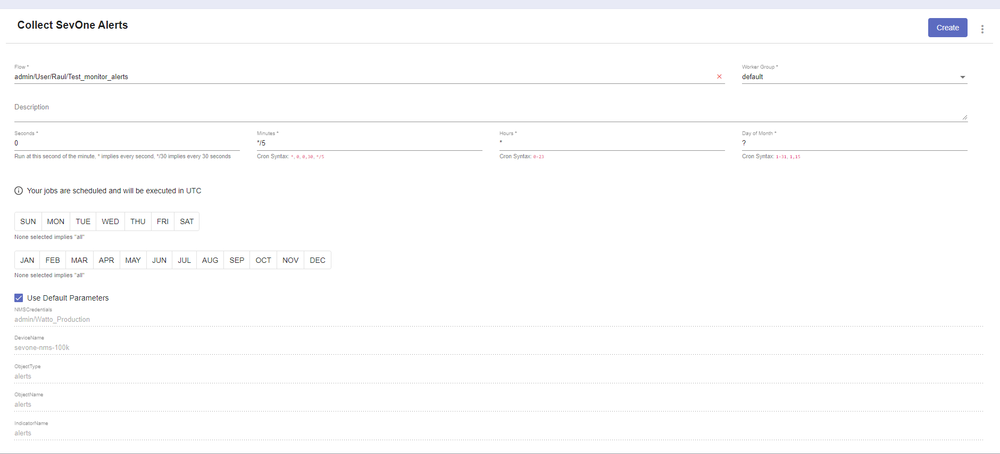

# Uncover New Data Feeds

## Overview

In this lab we will review how we can collect new sources of data.

SevOne is capable or monitoring any kind of time series data, however only a few protocols are supported out of the box (SNMP, ICMP, Netflow....). However, there is a framework called Universal Collector that allows us to monitor any time of data, regardless of the source/protocol.

In this lab we are collecting data that is available only using REST API calls. In this case, we are collecting data from the SevOne API, but it could be done with any other API available (as in this lab we only have access to SevOne, it makes sense to use the SevOne API as source of data). 

The data we are collecting is the number of active alerts triggered in SevOne, and we are ingesting this data back into SevOne to monitor this metric. This is an important metric to monitor, because if we have an abnormal high level of alerts triggered, that would mean that something big might be happening on the network.

## Prerequisites

1. Log into SevOne

2. Go to Administration -> Monitoring Configuration -> Object Types

3. Change the Filter to Deferred Data

4. Click Add

	a. Name: Alerts

5. Select the new object type created ("Alerts") and click on "Add Atomic Indicator Type"

	a. Indicator Name: Alerts

	b. Description: Alerts

	c. Indicator Type: GAUGE

	d. Measure As: Number

	e. Display As: Number

## Collect number of alerts triggered

If SevOne authentication has already been created, please skip this block of actions and continue to step 9.

6. Log into SANO automation platform

7. Go to Authentications

8. Click  Create Authentication

	a. Name: SevOne

	b. Service: SevOne

	c. **Protocol: http://** (<-- important)

	d. Host: 10.0.0.10

	e. Username: admin

	f. Password: SevOne

9. Go to **Workflows**

10. Click Create Workflow

	a. Name: Your Name - Collect SevOne Alerts

	b. Layout type: Sequence

11. Add variables to Start

	a. NMSCredentials

		i. Name: NMSCredentials

		ii. Type: Authentication -> SevOne

		iii. Default Value: "admin/SevOne"

		iv. In

		v. Required

	b. DeviceName

		i. Name: DeviceName

		ii. Type: String

		iii. Default Value: "NMS"

		iv. In

		v. Required

	c. ObjectType

		i. Name: ObjectType

		ii. Type: String

		iii. Default Value: "Alerts"

		iv. In

		v. Required

	d. ObjectName

		i. Name: ObjectName

		ii. Type: String

		iii. Default Value: "Alerts"

		iv. In

		v. Required

	e. IndicatorName

		i. Name: IndicatorName

		ii. Type: String

		iii. Default Value: "Alerts"

		iv. In

		v. Required

	f. IndicatorFormat

		i. Name: IndicatorFormat

		ii. Type: String

		iii. Default Value: "GAUGE"

		iv. In

		v. Required

	g. IndicatorUnit

		i. Name: IndicatorUnit

		ii. Type: String

		iii. Default Value: "Number"

		iv. In

		v. Required

12. Change to Flow View

13. On the left hand side panel, search for SevOne, Click on SevOne -> REST v3 -> Alerts 

14. Select "Alerts Alerts" and drop it after the building block START

	a. Change name to SevOne_Alerts

	b. Click on the building block to open the right side panel and complete the following fields

		i. authKey: $NMSCredentials

		ii. body -> query -> alertStatus: OPEN

15. Add a new building block, Common -> Array -> ArraySize

	a. Change name to Number_Alerts

	b. Click on the building block to open the right side panel and complete the following fields

		i. array: $SevOne_Alerts.result.alerts

16. Add a new building block, Common -> DateTime -> TimestampNow

	a. No need to edit anything

17. Add a new building block, SevOne -> REST v3 -> Devices -> Devices Data

	a. Change name to SevOne_Ingest_Data

	b. Click on the building block to open the right side panel and complete the following fields

		i. authKey: $NMSCredentials

		ii. body	

			1. automaticCreation: TRUE

			2. name: $DeviceName

			3. objects -> Append Child

				a. 0 

					i. automaticCreation: TRUE

					ii. description: $ObjectName

					iii. name: $ObjectName

					iv. pluginName: "DEFERRED"

					v. timestamps -> Append Child

						1. 0

							a. indicators -> Append Child

								i. 0

									1. format: $IndicatorFormat

									2. name: $IndicatorName

									3. units: $IndicatorUnit

									4. value: $Number_Alerts.result

							b. timestamp: $TimestampNow_1.result

					vi. type: $ObjectType

			4. type: $DeviceName

18. If there is an 'Assign' building block, use it for the next step, otherwise go to Common -> Assign, and add the building block to the end of the workflow

	a. Click on the building block to open the right side panel and complete the following fields

		i. variable: $result

		ii. value: $SevOne_Ingest_Data.result

## Create Scheduled Job

19. Go to JOBS

20. Click Create Job

	a. Name: Collect SevOne Alerts

		i. Flow: Your Name -  Collect SevOne Alerts

		ii. Seconds: 0

		iii. Minutes: */5

		iv. Hours: *

		v. Day of Month: ?

		vi. Use Default Parameters: ENABLED

		vii. ENABLED

## Review

21. Go to DI -> Create Report

22. Click on + Add Widget

	a. Performance Metrics

		i. Resource Type: Device Groups
			
			1. All Device Groups

		ii. Resource Type: Object Type

			1. Alerts

		iii. Resource Type: Indicator Type

			1. Alerts

	b. Click 'Add to resources' 

	c. Click 'Run'

