# Kubernetes Container Monitoring

## Overview

In this lab we will review how we can monitor container performance on Kubernetes environments by using the Prometheus interface available, and using eBPF to monitor the traffic generated by the containers. On top of it, we will map container metric data with flow data to enable metric to flow.

These are the steps that we will follow on this lab:

* Enable SNMP on the Data Insight server

* Add Data Insight device in the NMS to start monitoring

* Import Data Insight Kubernetes Monitoring RNA workflow and deploy it to monitor container performance

* Enable netobserv in Data Insight

* Import Data Insight eBPF Flow Mapping RNA workflow to map metric data to flow data

* Create TopN views and Data Insight reports to show data collected

## Enable SNMP on Data Insight and Add DI to NMS

1. Go to TechZone reservations

2. Open the reservation SevOne - NPM Lab with IBM Rapid Network Automation

3. Scroll down until you see the sdi virtual machine (currently running Red Hat Enterprise Linux 8) with IP 10.0.0.11

4. Open the Console

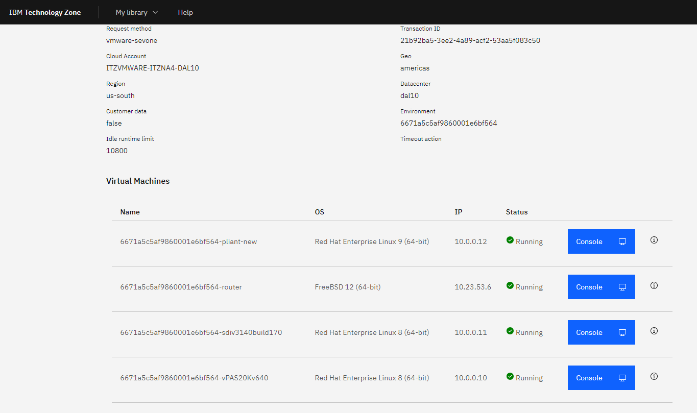

5. Click Open in a new window

	a. sevonek8s login: sevone

	b. Password: dRum&5853

	c. Execute:

		1. sudo su 
		
		2. systemctl enable snmpd

		3. systemctl start snmpd

6. Go to the GUI of the NMS

7. Go to Devices -> Device Manager

8. Click Add Device

	a. Name: Data Insight

	b. IP Address: 10.0.0.11

	c. SNMP

		i. Read Community String: sevone

	d. Click 'Save As New'

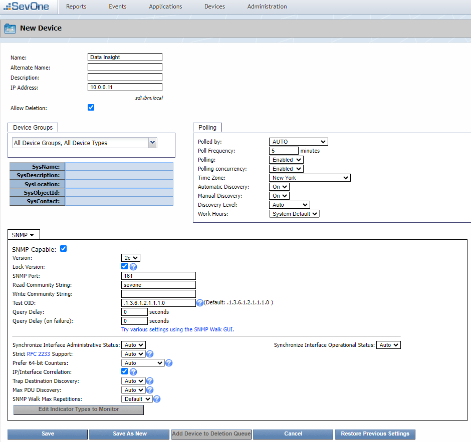

9. Wait a few minutes to start seeing data coming in

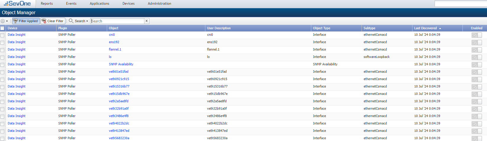

## Kubernetes Container Monitoring

If SevOne authentication has already been created, please skip this block of actions and continue to step 13.

10. Log into SANO automation platform

11. Go to Authentications

12. Click  Create Authentication

	a. Name: SevOne

	b. Service: SevOne

	c. **Protocol: http://** (<-- important)

	d. Host: 10.0.0.10

	e. Username: admin

	f. Password: SevOne

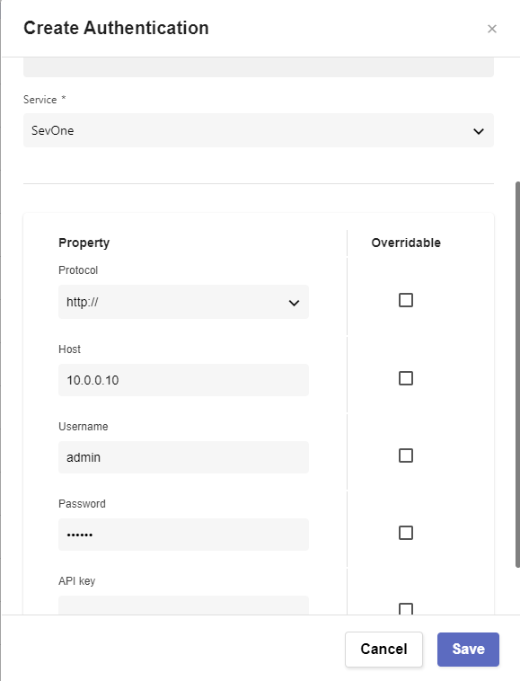

13. Go to **Workflows**

14. Click on Import

	a. Import K8s_DI_Monitoring_Flow_Mapping.zip file (https://ibm.box.com/s/sqnz0nbzzfvci0zuvqfkco8fztmnjk8k)

15. Open workflow SevOne Data Insight Monitoring

	a. Expand Start and make sure the following variables have values

		i. token: default token (using datainsight:datainsight converted to basic64) is "ZGF0YWluc2lnaHQ6ZGF0YWluc2lnaHQ=". If a different combination of user and password is used in a differen DI platform, the new token will need to be converted (https://www.base64encode.org/)

		ii. url: targets the prometheus interface of the DI server "https://10.0.0.11/prometheus". If a different DI system is used, please make sure Prometheus is enabled and the IP is correct

		iii. NMSCredentials: use the credential configured on step 12 "admin/SevOne" to connect to the SevOne platform to ingest the data (you might need to go to another page)

16. Click Run to make sure the workflow works properly

	a. Go to the NMS

	b. Go to Devices -> Device Manager

	c. Open device Data Insight and go to Object Manager, new objects should have been created

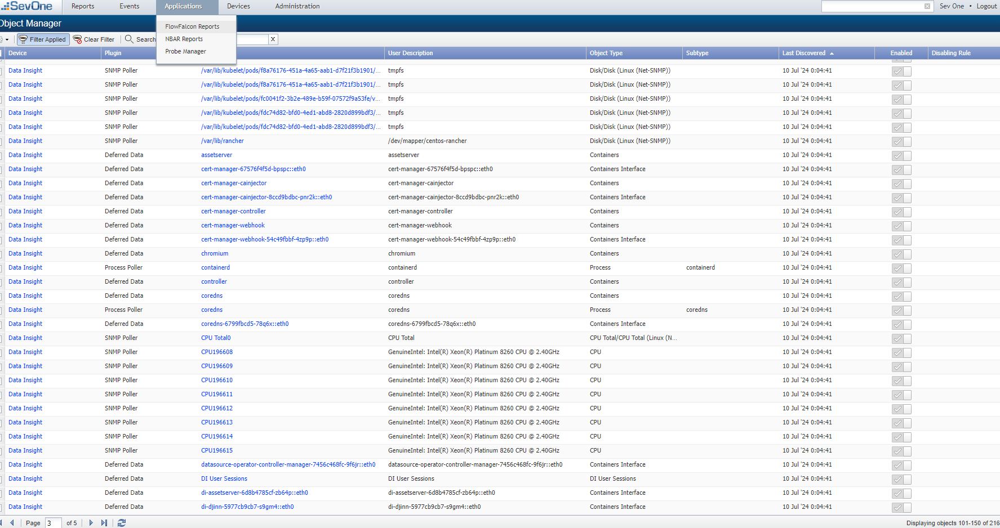

17. Go to **JOBS**

18. Click 'Create Job'

	a. Flow: SevOne Data Insight Monitoring

	b. Worker Group: default

	c. Seconds: 0

	d. Minutes: */5

	e. Hours: *

	f. Day of Month: ?

	g. Use Default Parameters: Enabled

	h. Enabled

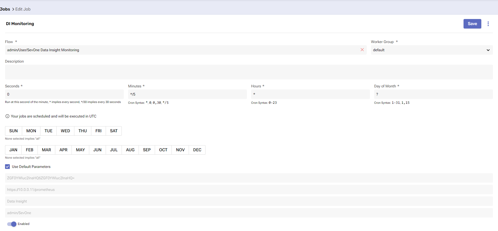

## Enable eBPF in Data Insight k8s Cluster

19. Go to TechZone reservations

20. Open the reservation SevOne - NPM Lab with IBM Rapid Network Automation

21. Scroll down until you see the sdi virtual machine (currently running Red Hat Enterprise Linux 8) with IP 10.0.0.11

22. Open the Console

23. Click Open in a new window and execute the following commands

	a. sudo su
	
	b. cd /home/sevone
	
	c. kubectl config view --raw > kubeconfig.yaml

	d. vi perms.yaml

	e. Paste the content of this file (https://ibm.box.com/s/ebni5tuvzmmbcel0dujc5jr7h833i1g7)

	[Tip: use the 'Send Text' functionality available in the window]

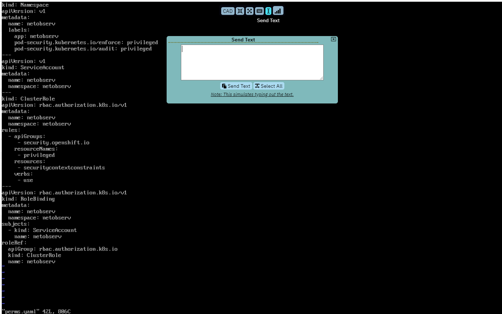

	f. Press 'Esc' key and then type :wq! to save contents of the file

	g. vi flp-daemonset.yaml

	h. Paste the content of this file (https://ibm.box.com/s/q8u0cgwkhj6h3tomxomaz012a0no1wv6) editing the following two values:

		i. line 97 -> KubeConfigPath: /home/sevone/kubeconfig.yaml

		ii. line 111 -> targetHost: "10.0.0.10"

	[Tip: copy and paste small parts of the file otherwise the identation will not be respected and the file will not be correct]

	i. Press 'Esc' key and then type :wq! to save contents of the file

	j. kubectl apply -f perms.yaml

	k. kubectl apply -f flp-daemonset.yaml

24. After a couple of minutes, go back to the NMS

25. Go to Administration -> Flow Configuration -> Flow Interface Manager

	a. Go to the Data Insight or 'Unknown' device and enable the flow data

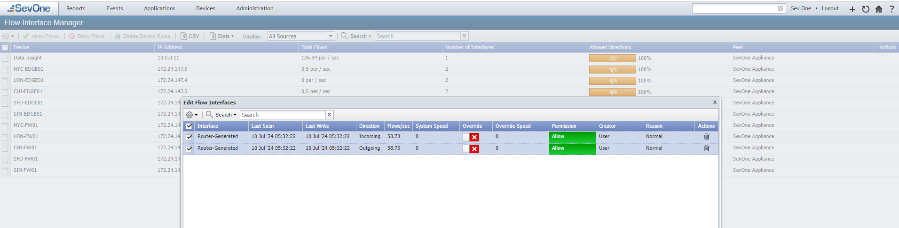

## Map Container Metric with Container Flow

26. Go back to RNA -> Workflows

27. Open workflow SevOne - Map All Container Interfaces

28. Expand Start and make sure that these variables have values:

	a. NMSCredentials: "admin/SevOne"

	b. devicename: "Data Insight"

29. Scroll down to the Map_Object_Incoming workflow and click on it to open Object Editor

30. No need to change anything here, but please review that different settings required to run this subworkflow

	a. field: netflow field that we will use to create the filter that will allow us to assign a container to the traffic generated to that container

	b. podname: name of the container that will be mapped to the flow data

	c. indicatorname: indicator that will be mapped to the flow data

	d. direction: 1 (inbound) or 2 (outbound)

	e. flowview: default flow view assigned to the mapping

	f. NMSCredentials: SevOne credentials used to connect to the SevOne platform

	f. devicename: device where the containers (objects) are part of

31. Click Run to test it works

32. To confirm, go back to the NMS -> Administration -> Flow Configuration -> Object Mapping 

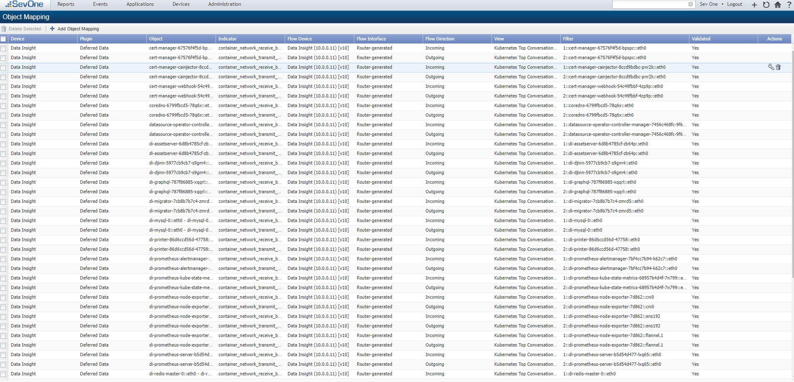

## Reporting

33. On the NMS, go to Reports -> TopN Reports

34. Click on Add View

	a. Report View Name: Container Traffic

	b. Plugin: Deferred Data

	c. Object Type: Containers Interface

	d. Only Display Common Subtypes: Disabled

	e. Object Subtype: Any

	f. Indicatory Type: container_network_receive_bytes_total

	g. Click Add Indicator

	h. Indicatory Type: container_network_transmit_bytes_total

	i. Click Add Indicator

	j. Click Save

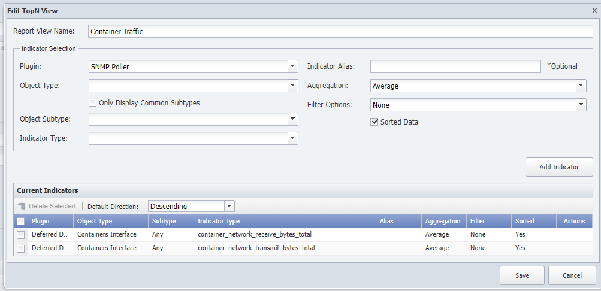

35. Go to DI

36. Click Create Report

	a. Change Untitled Report for Container Traffic Report

	b. Change Untitled Section for Traffic

	c. Add Widget

		i. TopN

			1. Select Type -> Device Group -> All Device Groups

			2. TopN View: Container Traffic

			3. Result limit: 25

			4. Click Run

			5. Edit the size of the widget to use almost all length of the report, and less than half of the width

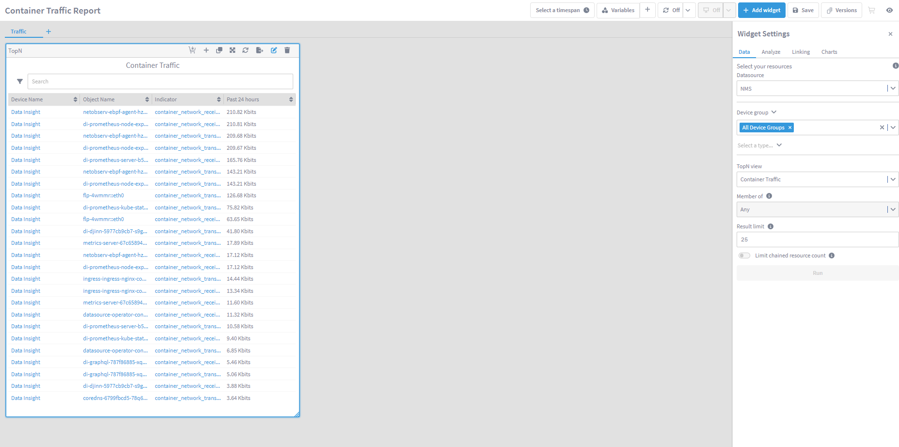

		ii. On the TopN widget, click on the + icon and select Performance Metrics

			1. Move the widget just right of the TopN widget

			2. Edit the size to half of the length of the TopN widget, and all the remaining width of the report
		
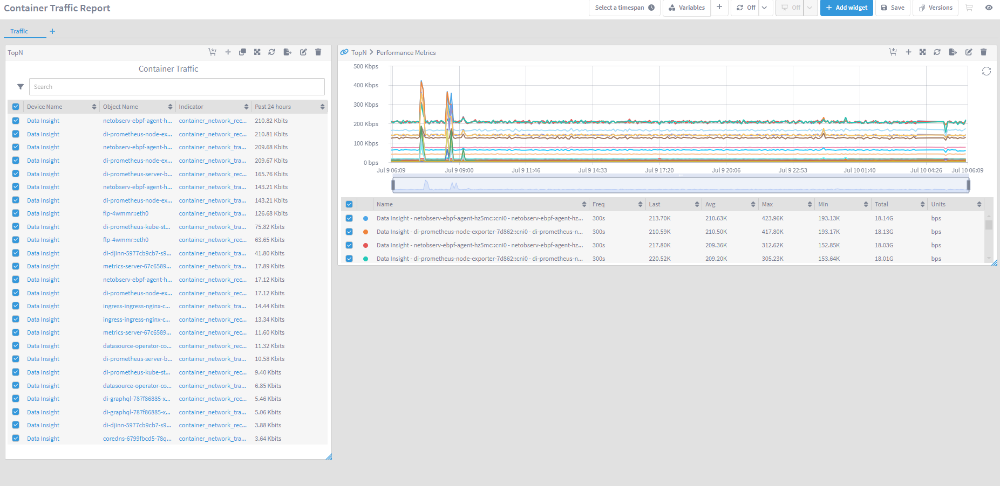

		iii. On the Performance Metrics widget, click on the + icon and select Flow

		[Note: In Di 7.0.0 there is a bug that doesn't show flow data, continue to the next step to display some data]

37. Save the report

38. On the TopN widget select one container (recommended di-graphql container) to show how the selection is propagated to the PM widget and the Flow widget, showing us only the traffic generated by that container

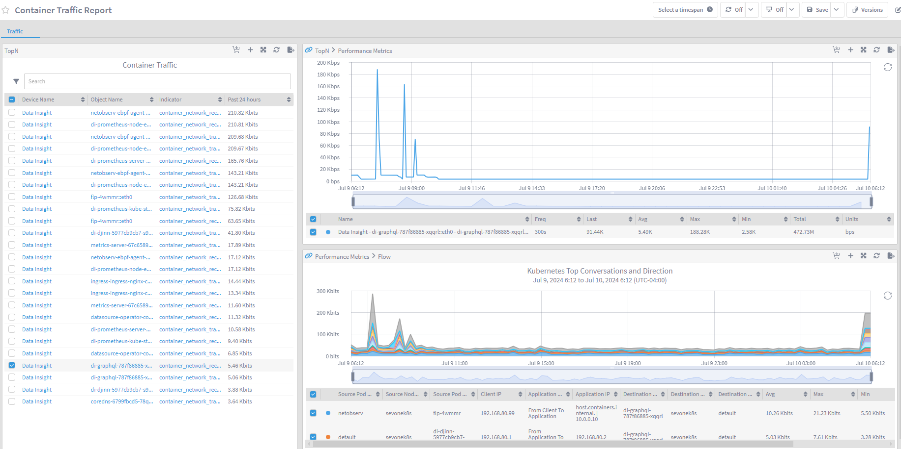