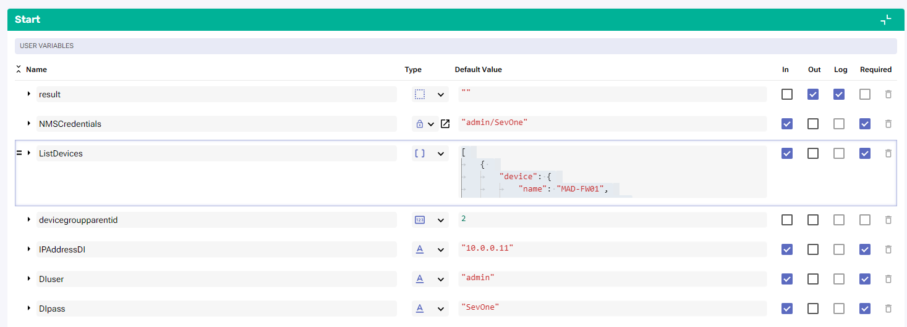

# Automated Multi Tenancy

## Overview

SevOne is a multitenant solution that allows us to create different users that will have different access to devices, different permissions, different reports and even different look and feel, allowing us to completely separate users or tenants among them.

In this lab we will review how we can fully automate the creation of multiple tenants from a list of devices.

The process to fully create a new tenant will be the following, from a list of devices that contains name of the device, IP address, SNMP community string and customer/tenant, we will go through each of them and:

* Check if there is a device group created for that tenant, if there isn't we will create a new one

* Check if the device is already monitored, if it isn't we will monitor it

* Add the device into the device group

* Check if the tenant has already a user role create, if there isn't we will create a new one and assign permissions and access to the device group created

* Check if there is any user assigned to that user role, if there isn't we will create a new user and assign it to that user role

* Check if the tenant is created in DI, if it isn't we will create a new tenant in DI and assign the default authentication datasource to the tenant

## Create Workflow

If SevOne authentication has already been created, please skip this block of actions and continue to step 4.

1. Log into SANO automation platform

2. Go to Authentications

3. Click  Create Authentication

	a. Name: SevOne

	b. Service: SevOne

	c. **Protocol: http://** (<-- important)

	d. Host: 10.0.0.10

	e. Username: admin

	f. Password: SevOne

4. Go to Workflows and click on Create Workflow

	a. Name: SevOne Device Onboarding including Tenant

	b. Layout type: Sequence

5.  Add variables to Start

	a. NMSCredentials

		i. Name: NMSCredentials

		ii. Type: Authentication -> SevOne

		iii. Default Value: "admin/SevOne"

		iv. In

		v. Required

	b. ListDevices

		i. Name: ListDevices

		ii. Type: list

		iii. Default Value:
            [
                { 
                    "device": {
                        "name": "MAD-FW01",
                        "ip": "172.24.147.228",
                        "snmp": "public",
                        "customer": "CustomerA"
                    }
                },
                { 
                    "device": {
                        "name": "MAD-FW02",
                        "ip": "172.24.147.130",
                        "snmp": "public",
                        "customer": "CustomerA"
                    }
                },
                { 
                    "device": {
                        "name": "BRG-EDGE01",
                        "ip": "172.24.147.5",
                        "snmp": "public",
                        "customer": "CustomerB"
                    }
                }

            ]

		iv. In

		v. Required

	c. devicegroupparentid

		i. Name: devicegroupparentid

		ii. Type: Number

		iii. Default Value: 2

	d. IPAddressDI

		i. Name: IPAddressDI

		ii. Type: String

		iii. Default Value: "10.0.0.11"

		iv. In

		v. Required

	e. DIuser

		i. Name: DIuser

		ii. Type: String

		iii. Default Value: "admin"

		iv. In

		v. Required

	f. DIpass

		i. Name: DIpass

		ii. Type: String

		iii. Default Value: "SevOne"

		iv. In

		v. Required

6. Change to Flow View

7. On the left hand side panel, click on Common

8. Select "ForEach" and drop it after the building block START

	a. Change name to ForEach_Device

	b. Click on the building block to open the right side panel and complete the following fields

		i. list: $ListDevices

9. Add a comment:

    a. Check Device Group

10. Add a new building block, SevOne -> REST v3 -> Device Groups -> Device Groups Filter Device Groups

	a. Change name to SevOne_Find_Device_Group

	b. Click on the building block to open the right side panel and complete the following fields

		i. authKey: $NMSCredentials

		ii. body: 

			1. name: $ForEach_Device.item.device.customer

11. Add a new building block, Common -> If

	a. Change name to If_Group_Not_found

	b. Click on the building block to open the right side panel and complete the following fields

		i. condition: $SevOne_Find_Device_Group.result.totalElements == 0

12. On the FALSE branch of the IF, add a new building block, Common -> Assign

	a. Change name to Assign_devicegroupid

	b. Click on the building block to open the right side panel and complete the following fields

		i. variable: $devicegroupid
        
        ii. value: $SevOne_Find_Device_Group.result.content[0].id

13. On the TRUE branch of the if, add a new building block, SevOne -> REST v3 -> Device Groups -> Device Groups Create Device Group

	a. Change name to SevOne_Create_Device_Group

	b. Click on the building block to open the right side panel and complete the following fields

		i. authKey: $NMSCredentials

		ii. body: 

			1. name: $ForEach_Device.item.device.customer
            
            2. parentid: $devicegroupparentid
            
14. Add a new building block, Common -> Assign

	a. Change name to Assign_devicegroupid2

	b. Click on the building block to open the right side panel and complete the following fields

		i. variable: $devicegroupid
        
        ii. value: $SevOne_Create_Device_Group.result.id
        

15. After the end of the IF, add a comment

	a. Create Device

16. Add a new building block, SevOne -> REST v3 -> Metadata -> Metadata Devices (POST)

	a. Change name to SevOne_Find_Device

	b. Click on the building block to open the right side panel and complete the following fields

		i. authKey: $NMSCredentials

		ii. body: 

			1. name: 
            
                a. value: $ForEach_Device.item.device.name
			

17. Add a new building block, Common -> If

	a. Change name to If_Device_Not_Found

	b. Click on the building block to open the right side panel and complete the following fields

		i. condition: $SevOne_Find_Device.result.devices.length == 0

18. On the FALSE branch of the IF, add a new building block, Common -> Assign

	a. Change name to Assign_deviceid

	b. Click on the building block to open the right side panel and complete the following fields

		i. variable: $deviceid
        
        ii. value: $SevOne_Find_Device.result.devices[0].id

19. On the 'TRUE' branch of the If, add a new building block, SevOne -> Rest v2 -> Devices -> Create Device

	a. Change name to SevOne_Create_Device

	b. Click on the building block to open the right side panel and complete the following fields

		i. authKey: $NMSCredentials

		ii. body:

			1. name: $ForEach_Device.item.device.name
            
            2. ipAddress: $ForEach_Device.item.device.ip
            
            3. description: $ForEach_Device.item.device.name
            
            4. pluginInfo: 
            
                {
                    "1": {
                        "extendedInfo": {
                            "snmpVersion": "2",
                            "roCommunity": $ForEach_Device.item.device.snmp,
                            "snmpPort": "161"
                        },
                        "enabled": true
                    },
                    "2": {
                        "extendedInfo": {
                            "packetInterval": "0",
                            "packetNumber": "5",
                            "packetSize": "64"
                        },
                        "enabled": true
                    }
                }

20. Add a new building block, Common -> Assign

	a. Change name to Assign_device2
    
	b. Click on the building block to open the right side panel and complete the following fields

		i. variable: $deviceid

		ii. item: $SevOne_Create_Device.result.id

		

21. After the end of the IF, add a comment

	a. Add Device to Group

22. Add a new building block, SevOne -> REST v3 -> Device Groups -> Device Groups Add Device to Device Groups

	a. Change name to SevOne_add_device_To_Group

	b. Click on the building block to open the right side panel and complete the following fields

		i. authKey: $NMSCredentials

		ii. id: $devicegroupid
        
        iii. deviceid: $deviceid

23.  Add a comment

	a. Check User Role

24. Add a new building block, Sevone -> REST v2 -> Roles -> Filter Roles

	a. Change name to SevOne_Find_Role

	b. Click on the building block to open the right side panel and complete the following fields

		i. authKey: $NMSCredentials

		ii. roleFilter:
        
            1. name: $ForEach_Device.item.device.customer

25. Add a new building block, Common -> If

	a. Change name to If_Role_Not_Found

	b. Click on the building block to open the right side panel and complete the following fields

		i. condition: $SevOne_Find_Role.result.totalElements == 0

26. On the FALSE branch of the If, add a new building block, Common -> Assign

	a. Change name to Assign_roleid

	b. Click on the building block to open the right side panel and complete the following fields

		i. variable: $roleid
        
        ii. value: $SevOne_Find_Role.result.content[0].id

27. On the TRUE branch of the If, add a new building block, SevOne -> REST v2 -> Roles -> Create Role

    a. Change name to SevOne_Create_Role

	b. Click on the building block to open the right side panel and complete the following fields

		i. authKey: $NMSCredentials

		ii. role:
        
            1. name: $ForEach_Device.item.device.customer
            
            2. parentId: 3

28.  Add a new building block, Common -> Assign

	a. Change name to Assign_roleid2

	b. Click on the building block to open the right side panel and complete the following fields

		i. variable: $roleid
        
        ii. value: $SevOne_Create_Role.result.id
        
29. Add a new building block, SevOne -> REST v2 -> Permissions -> Update Device Group Permissions2

    a. Change name to SevOne_Update_Permissions 

	b. Click on the building block to open the right side panel and complete the following fields

		i. authKey: $NMSCredentials

		ii. dto:
        
            1. canViewGroup: true
            
            2. canViewGroupMembers: true
            
        iii. id: $devicegroupid
        
        iv. roleId: $roleid
        

30.  Add a new building block, SevOne -> REST v2 -> Permissions -> Update Access Permissions

    a. Change name to SevOne_Update_Access

	b. Click on the building block to open the right side panel and complete the following fields

		i. authKey: $NMSCredentials

		ii. permissions: [
                            "VIEW_NETFLOW",
                            "VIEW_REPORTS",
                            "VIEW_ALERTS",
                            "VIEW_ALERT_HISTORY",
                            "RECEIVE_ALERTS"
                        ]
                        
        iii. roleId: $roleid
        
	

31. After the end of the IF, add a comment

	a. Check First User

32. Add a new building block, SevOne -> REST v3 -> Users -> Users Users (POST)

    a. Change name to SevOne_Find_User

	b. Click on the building block to open the right side panel and complete the following fields

		i. authKey: $NMSCredentials

		ii. body:
        
            1. roles:
            
                a. ids: [ $roleid ]
	
33. Add a new building block, Common -> If

	a. Change name to If_User_Not_Found

	b. Click on the building block to open the right side panel and complete the following fields

		i. condition: $SevOne_Find_User.result.users.length == 0
        
34. On the TRUE branch of the If, add a new building block, SevOne -> REST v2 -> Users -> Create User Using POST

    a. Change name to SevOne_Create_User

	b. Click on the building block to open the right side panel and complete the following fields

		i. authKey: $NMSCredentials

		ii. user:
        
            1. authentication: SEVONE
            
            2. email: "a@a.com"
            
            3. firstName: $ForEach_Device.item.device.customer
            
            4. isActive: true
            
            5. lastName: $ForEach_Device.item.device.customer
            
            6. password: $ForEach_Device.item.device.customer
            
            7. roleIds: [ $roleid ]
            
            8. username: $ForEach_Device.item.device.customer

	

35. After the end of the IF, add a comment

    a. Check Tenant in DI
    
36. Add a new buildig block, Common -> HttpRequest

    a. Change name to HttpRequest_Get_DI_Token
    
    b. Click on the building block to open the right side panel and complete the following fields
    
        i. method: POST
        
        ii. host: $IPAddressDI+"/retinaserver"
        
        iii. protocol: https
        
        iv. headers:
        
                {
                    "Content-Type": "application/json"
                }
                
        v. body: "{\"query\":\"mutation {\\r\\n    authenticate(tenant: \\\"SevOne\\\", name: \\\""+$DIuser+"\\\", password:\\\""+$DIpass+"\\\") {\\r\\n        token\\r\\n    }\\r\\n}\",\"variables\":{}}"
        
37. Add a new buildig block, Common -> HttpRequest

    a. Change name to HttpRequest_Find_Tenant
    
    b. Click on the building block to open the right side panel and complete the following fields
    
        i. method: POST
        
        ii. host: $IPAddressDI+"/retinaserver"
        
        iii. protocol: https
        
        iv. headers:
        
                {
                    "Content-Type": "application/json",
                    "X-Auth-Token": $HttpRequest_Get_DI_Token.result.data.authenticate.token
                }
                
        v. body: "{\"query\":\"query {\\r\\n    tenants (\\r\\n        name: \\\"" + $ForEach_Device.item.device.customer + "\\\"\\r\\n    )\\r\\n    {\\r\\n        id\\r\\n        name\\r\\n    }\\r\\n}\",\"variables\":{}}"
        
38. Add a new building block, Common -> If

    a. Change name to If_Tenant_Not_Found
    
    b. Click on the building block to open the right side panel and complete the following fields
    
        i. condition: $HttpRequest_Find_Tenant.result.errors
        
	
        
39. On the TRUE branch of the If, add a new buildig block, Common -> HttpRequest

    a. Change name to HttpRequest_Create_Tenant
    
    b. Click on the building block to open the right side panel and complete the following fields
    
        i. method: POST
        
        ii. host: $IPAddressDI+"/retinaserver"
        
        iii. protocol: https
        
        iv. headers:
        
                {
                    "Content-Type": "application/json",
                    "X-Auth-Token": $HttpRequest_Get_DI_Token.result.data.authenticate.token
                }
                
        v. body: "{\"query\":\"mutation {\\r\\n    createTenant (\\r\\n        tenant: {\\r\\n            name: \\\"" + $ForEach_Device.item.device.customer + "\\\",\\r\\n            nmsRoleId: " + $roleid + "\\r\\n        }\\r\\n    )\\r\\n    {\\r\\n        id\\r\\n        name\\r\\n    }\\r\\n}\",\"variables\":{}}"

40. Add a new buildig block, Common -> HttpRequest

    a. Change name to HttpRequest_Get_Datasource
    
    b. Click on the building block to open the right side panel and complete the following fields
    
        i. method: POST
        
        ii. host: $IPAddressDI+"/retinaserver"
        
        iii. protocol: https
        
        iv. headers:
        
                {
                    "Content-Type": "application/json",
                    "X-Auth-Token": $HttpRequest_Get_DI_Token.result.data.authenticate.token
                }
                
        v. body: "{\"query\":\"query {\\r\\n    datasources\\r\\n    {\\r\\n        id\\r\\n        name\\r\\n    }\\r\\n}\",\"variables\":{}}"
        
41. Add a new buildig block, Common -> HttpRequest

    a. Change name to HttpRequest_Assign_Datasource
    
    b. Click on the building block to open the right side panel and complete the following fields
    
        i. method: POST
        
        ii. host: $IPAddressDI+"/retinaserver"
        
        iii. protocol: https
        
        iv. headers:
        
                {
                    "Content-Type": "application/json",
                    "X-Auth-Token": $HttpRequest_Get_DI_Token.result.data.authenticate.token
                }
                
        v. body: "{\"query\":\"mutation {\\r\\n    addTenantDatasource (\\r\\n        datasourceId: " + $HttpRequest_Get_Datasource.result.data.datasources[0].id + ",\\r\\n        tenantId: " + $HttpRequest_Create_Tenant.result.data.createTenant.id + ",\\r\\n        useAsAuthsource: true,\\r\\n        useAsDatasource: true\\r\\n    )\\r\\n    {\\r\\n        id\\r\\n        name\\r\\n    }\\r\\n}\\r\\n\\r\\n\\r\\n\",\"variables\":{}}"
        
	

## Review

42. Run the workflow, it should finish without errors

43. Go to the NMS

44. Go to Devices -> Device Manager

    a. There should be three new devices that were not before:
    
        1. MAD-FW02
        
        2. MAD-FW01
        
        3. BRG-EDGE01
        
	

45. Go to Devices -> Grouping -> Device Groups

    a. There should be two new groups:
    
        i. CustomerA: including the two MAD devices
        
        ii. CustomerB: including the BRG device
        
	

46. Go to Administration -> Access Configuration-> User Role Manager

    a. Expand System Administrators -> Administrators to find the new roles created
    
        1. CustomerA: click on it to see the permissions and click on Devices and Device Groups Access to review the access
        

47. Go to Administration -> Access Configuration -> User Manager

    a. There should be two new users:
    
        i. CustomerA: assigned to role CustomerA
        
        ii. CustomerB: assigned to role CustomerB
        

48. Go to DI and login using the admin user and SevOne tenant

49. Select all the reports you have in All Reports folder

    a. click on Permissions
    
    b. User Access: Multi-tenant
    
        i. Tenants: All Tenants
        

        
50. Do the same with All Templates

51. Logout and login using:

    a. Tenant: CustomerA
    
    b. User: CustomerA
    
    c. Password: CustomerA
    
52. Go to Network Performance Report, and click on the variable Devices to see the devices available on this tenant

53. Log out and do the same with CustomerB

    a. Tenant: CustomerB
    
    b. User: CustomerB
    
    c. Password: CustomerB
    

54. To test how dynamic this workflow is, go back to RNA, open the workflow and edit the ListDevices variable:

            [
                { 
                    "device": {
                        "name": "MAD-FW01",
                        "ip": "172.24.147.228",
                        "snmp": "public",
                        "customer": "CustomerA"
                    }
                },
                { 
                    "device": {
                        "name": "MAD-FW02",
                        "ip": "172.24.147.130",
                        "snmp": "public",
                        "customer": "CustomerA"
                    }
                },
                { 
                    "device": {
                        "name": "BRG-EDGE01",
                        "ip": "172.24.147.5",
                        "snmp": "public",
                        "customer": "CustomerB"
                    }
                },
                { 
                    "device": {
                        "name": "MAN-EDGE01",
                        "ip": "172.24.147.3",
                        "snmp": "public",
                        "customer": "NewCustomerC"
                    }
                }

            ]
            

55. Run the workflow again

56. Go back to DI and login using NewCustomerC tenant:

    a. Tenant: NewCustomerC
    
    b. User: NewCustomerC
    
    c. Password: NewCustomerC

NOTE: in your instance there will be no alerts triggered for this device