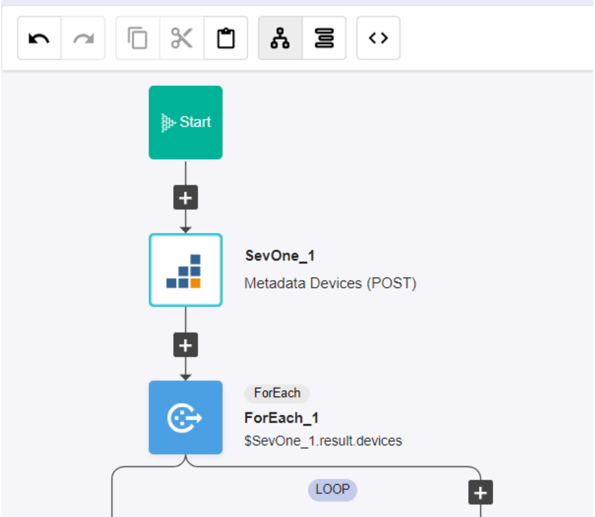
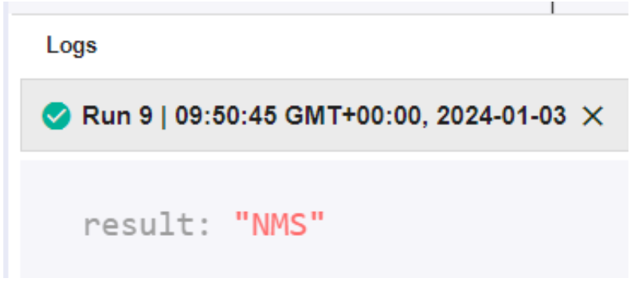
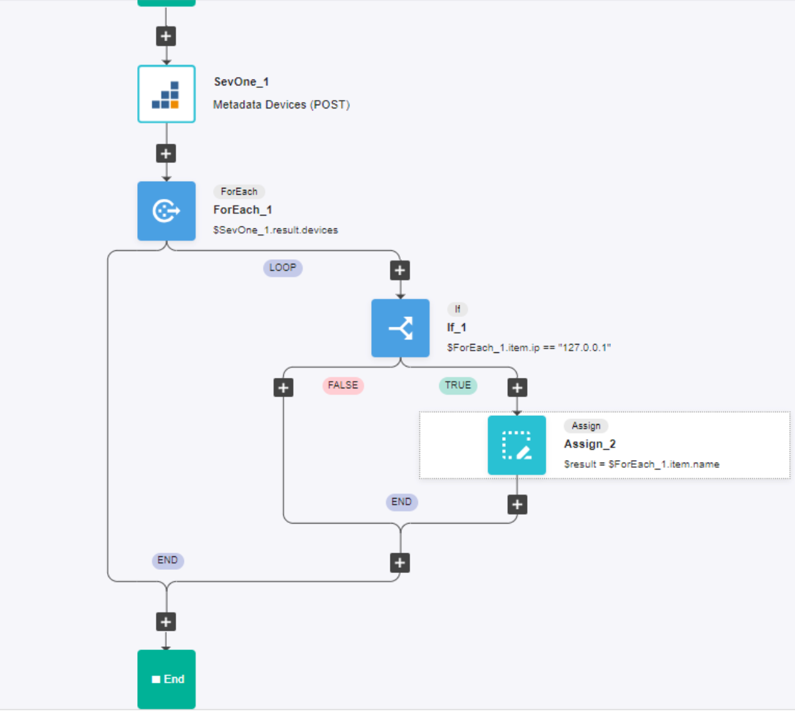

# Logic

## Overview

```
In this lab you will create a workflow using RNA logic action blocks.  

The workflow will query the SevOne API looking for a particular device.  

You will use the _ForEach_ action block to iterate through the devices, looking for a matching device.

You will use the _If_ action block to test whether the current ForEach item is a match.  

If found, the device name will be printed out in the log viewer.

```
> Let’s find which device in SevOne has IP 127.0.0.1

## Steps:
### [1] Create an authentication to connect to the SevOne NMS
```
- Protocol: http://
- IP: 10.0.0.10
- User: admin
- Password: SevOne
```

### [2] Create a new workflow
1. Add building block SevOne-> API v3-> Metadata -> Metadata Devices (POST)
2. Change authentication to the one created above
3. Add a ForEach loop
```
- List: $SevOne_1.result.devices <- if you have changed the name of the building block, please use
the current name for the variable
```

4. Inside the loop, add a IF building block
```
- Condition: $ForEach_1.item.ip == "127.0.0.1"
```
5. Inside the TRUE branch of the IF add a new building block Common -> Assign
```
- Variable: $result
- Value: $ForEach_1.item.name
```
6. At the end of the workflow there is an Assign building block with $result = 'Hello World', please delete it
7. Save and Run the workflow

### [3] View the result

```
- result : “NMS”
```

### Your Completed Workflow

