# myWeather Lab -- DRAFT

## Overview

In this lab, you will create a ***weather station collector*** workflow using data from ***api.weather.gov***.  Once you collect the weather information, you will transform the data into a JSON object that will then be ingested into IBM's SevOne observability solution.

As you create your ***weather station collector*** you will be using a design pattern where you have a main workflow that will call sub-workflows ("subflows") to accomplish certain tasks.  Think of ***subflows*** like functions that can be used to break up development into smaller discrete items.  You can reuse ***subflows*** that you have written in the past, or use those written by others so you don't have to start from scratch.   

The _main_ workflow for this lab will be called ***Weather Collector***.
It will use the following two _subflows_ to accomplish some of its tasks:
- ***get weather*** - You will construct this workflow to retrieve current weather info from ***api.weather.gov*** 
- ***SevOne Ingest Data - APIv3*** - You will retrieve this reusable workflow from https://community.ibm.com/community/user/aiops/viewdocument/sevone-data-ingestion-api-v3?CommunityKey=fe9d91df-352c-4846-9060-189fd98d00ca&tab=librarydocuments 

## Steps:
### [1] Create an authentication called ***sevone*** to connect to the SevOne NMS
```
- Protocol: https://
- IP: 10.0.0.10
- User: admin
- Password: _your password here_
```

### [2] Create the _main_ workflow called ***Weather Collector***

***[A] Define the following variables*** in the start block of the _main_ ***Weather Collector*** workflow:
```
- Name: deviceName
- Type: string
- Default Value: "myWeather"
- check the checkboxes for "Out" and "Log"
```
```
- Name: stationId
- Type: string
- Default Value: "KDFW"
- check the checkboxes for "Out" and "Log"
```
```
- Name: timestamp
- Type: Number
- Default Value: 0
- check the checkboxes for "Out" and "Log"
```
```
- Name: Fahrenheit
- Type: Number
- Default Value: 0
- check the checkboxes for "Out" and "Log"
```
```
- Name: content
- Type: Object
- Default Value: {}
- check the checkboxes for "Out" and "Log"
```
```
- Name: NMSCredentials
- Type: Password
- Default Value: "admin/sevone"
```

***[B] Add the following comments to your workflow to describe what your workflow will need to accomplish***
```
get the weather
```
```
get the current timestamp in seconds
```
```
populate content object for SevOne ingestion
```
```
write data into SevOne
```
Your workflow should look like this:

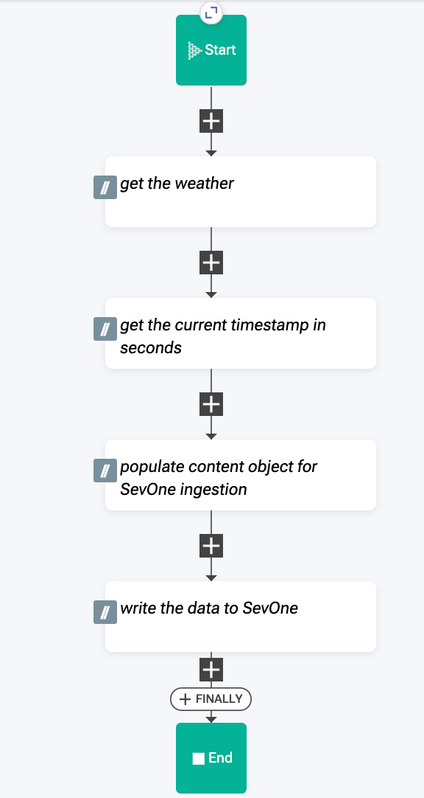

***[C] Save your workflow***


### [3] Create a new workflow called ***get weather***
This workflow will be used as a ***subflow*** from within your _main_ workflow.  It will retrieve weather information from ***api.weather.gov*** and will then pass the result to the _main_ workflow.

***[A] Define the following variables*** in the start block of the _subflow_ ***get weather*** workflow:

```
- Name: stationId
- Type: string
- Default Value: "KDFW"
- check the checkbox for "In"
```
> NOTE: By checking the "In" checkbox, you enable the _main_ workflow to pass the property value into your _subflow_ workflow.

```
- Name: host
- Type: string
- Default Value: "api.weather.gov"
```
```
- Name: C
- Type: number
- Default Value: 0
```
```
- Name: F
- Type: number
- Default Value: 0
```

***[B] Add the following comments to your workflow to describe what your workflow will need to accomplish***
```
Retrieve current weather for Dallas Forth Worth
```
```
Get temperature value from request payload
```
```
convert temperature from C to F
```
```
set $result value
```

Your workflow should look like this:

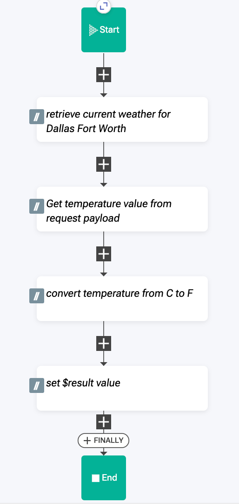

***[C] Add a _HTTPRequest_ action block to your workflow under the first comment***

> This action block will cause a HTTP Request to be issued to ***api.weather.com*** and retrieve the current weather data for your ***stationId*** station.

Find the action block using the action block palette on the left side of the workflow editor.

Select ***Home > Common*** then search for ***HTTP***

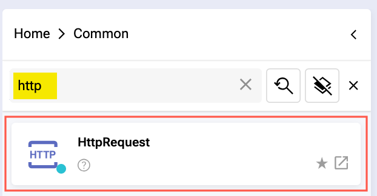

Drag the ***HTTPRequest*** action block into the workflow under the first comment and edit its settings in the ***Object Editor*** using the image for your guide:

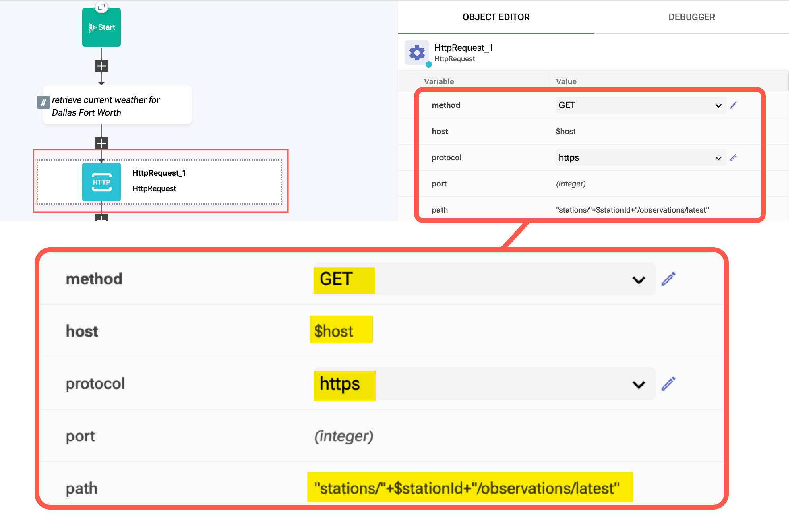

***[D] Add an _Assign_ action block to your workflow under the second comment***

> You will assign the value for your variable ***C*** (celsius) from the ***HTTPRequest_1*** result payload.

Find the action block using the action block palette on the left side of the workflow editor.

Select ***Home > Common*** then search for ***Assign***

Drag the ***Assign*** action block into the workflow under the second comment and edit its settings in the ***Object Editor*** using the image for your guide:

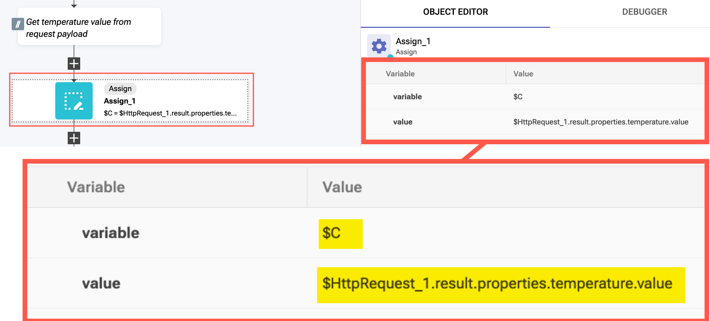

Let's take a look at the payload returned from the HTTPRequest_1 action block:

> The path to the temperature value is contained within the payload's JSON object

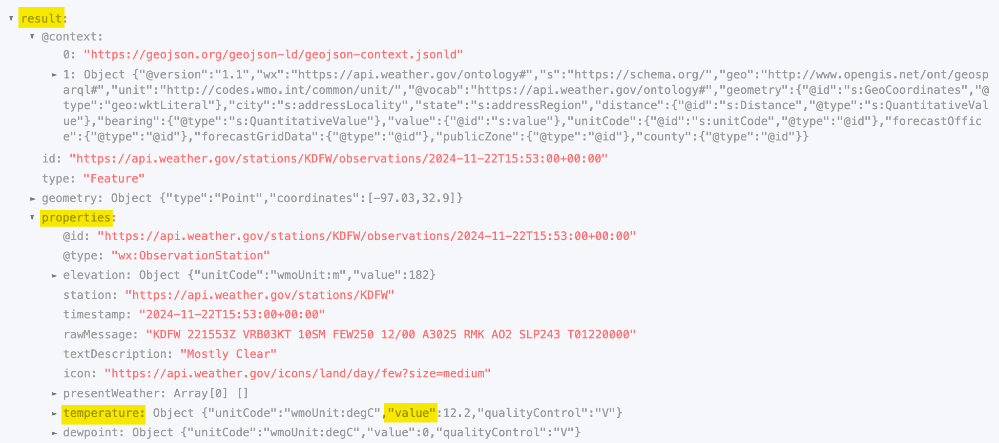

***[E] Add a _Function_ action block to your workflow under the third comment***

> You will convert your ***C*** (celsius) value to ***F*** (fahrenheit) within the function block

Find the action block using the action block palette on the left side of the workflow editor.

Select ***Home > Common*** then search for ***function***

Drag the ***Function*** action block into the workflow under the third comment and edit its settings in the ***Object Editor*** using the image for your guide:

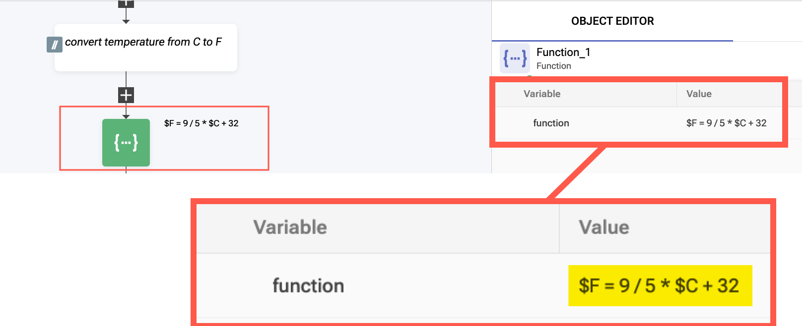

***[F] Add an _Assign_ action block to your workflow under the final comment***

> The $result value will be returned to the _main_ ***Weather Collector*** workflow.  You need to set $result to the $F (fahrenheit) value here

Find the action block using the action block palette on the left side of the workflow editor.

Select ***Home > Common*** then search for ***Assign***

Drag the ***Assign*** action block into the workflow under the final comment and edit its settings in the ***Object Editor*** using the image for your guide:

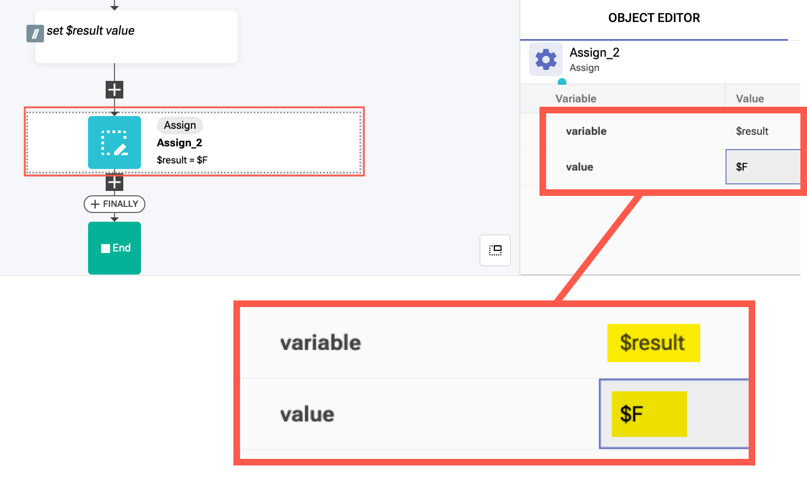

***[G] Save your workflow***

***[H] Run your workflow and verify it returns a numeric result ***

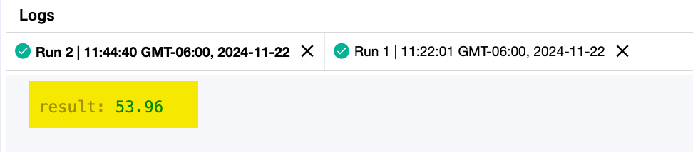

### [4] Download and import "SevOne Ingest Data" workflow from IBM Community website

***[A] Download the "SevOne Ingest Data" workflow from the IBM Community website: ***
```
https://community.ibm.com/community/user/aiops/viewdocument/sevone-data-ingestion-api-v3?CommunityKey=fe9d91df-352c-4846-9060-189fd98d00ca&tab=librarydocuments 

```

Scroll down to find the "Attachments" area.  Download the "absolute SevOne Ingest Data - APIv3 (new v3 version) 2024.zip" file.

Within the RNA "Workflows" area, click on the "Import" button located in the upper right-hand corner of the page.  

***[B] Import the workflow***
```
- Within the RNA "Workflows" area, click on the "Import" button located in the upper right-hand corner of the page.  
- Import the newly downloaded workflow zip file.
```

### [5] Edit the _main_ "Weather Collector" workflow

> Now that you have both ***subflow*** workflows ready, it's time to complete the _main_ workflow.  As you may recall, the object of this workflow is to get the current weather conditions for Dallas Fort Worth -- you accomplished this using a subflow called ***get weather***.  Now its time to take the result of that subflow and format it into a JSON object that can be passed into the subflow that you downloaded and imported from the IBM Community website.  Once the JSON object is ready, you will pass it into the SevOne subflow so that it is ingested into that solution.  You can then login to SevOne to see the fruits of your labor.

When we last edited this workflow, we defined the "Start Block" variables and then added some comments to the workflow.


***[A] Add the first subflow to the _main_ workflow***

Find the subflow action block using the action block palette on the left side of the workflow editor.

Select ***Home > User*** then select ***get weather*** subflow.

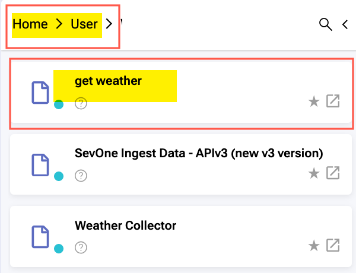

Drag the ***get weather*** action block into the workflow under the first comment and edit its settings in the ***Object Editor*** using the image for your guide:

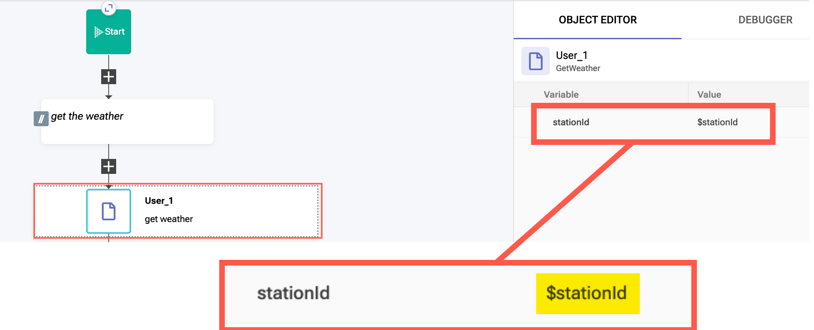

> You add the $stationId value to the subflow settings so that it will be passed into the subflow.

***[B] Add an "Assign" action block below the "User_1" block***

Drag the ***Assign*** action block into the workflow under the ***User_1*** block and edit its settings in the ***Object Editor*** using the image for your guide:

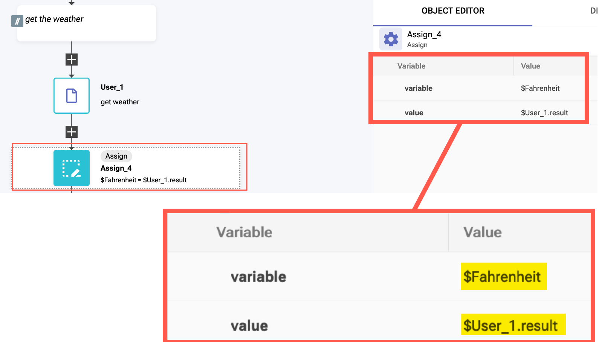
> You are setting variable $Fahrenheit's value to equal the return value from the $User_1 subflow

***[C] Review SevOne API payload requirements***

> Let's review what is required for the JSON object that you need to construct so that SevOne can ingest the data.
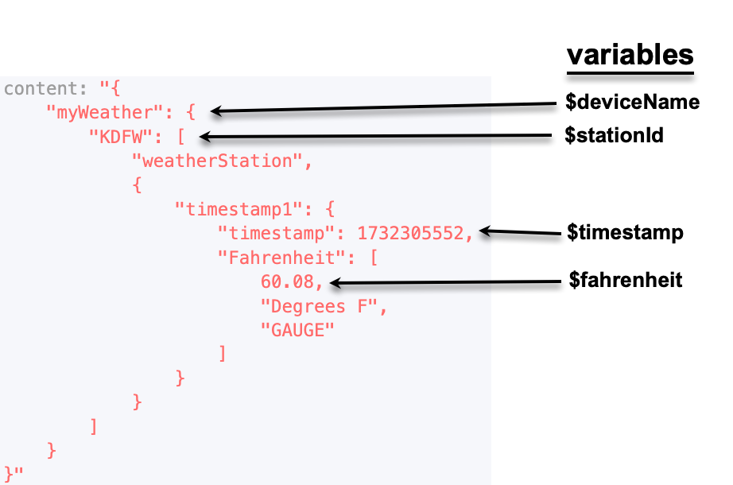
```
You defined the variables needed in the ***Start Block*** of the workflow.  
- deviceName = "myWeather"
- stationId = "KDFW"
- timestamp = <you need to supply this>
- Fahrenheit = <you got this value from the "get weather" subflow>
```

***[D] Get the current timestamp***

Find the "Timestamp Now" action block using the action block palette on the left side of the workflow editor.

Select ***Home > Common*** then perform a "Deep Search" for "Timestamp Now" (looks like a magnifying glass button)

Drag the ***Timestamp Now*** action block into the workflow under the timestamp comment.  It doesn't require any field editing.

Next, add an ***Assign*** block underneath the timestamp block so we can assign the $timestamp variable its value using the result of the $TimestampNow_1 block.  

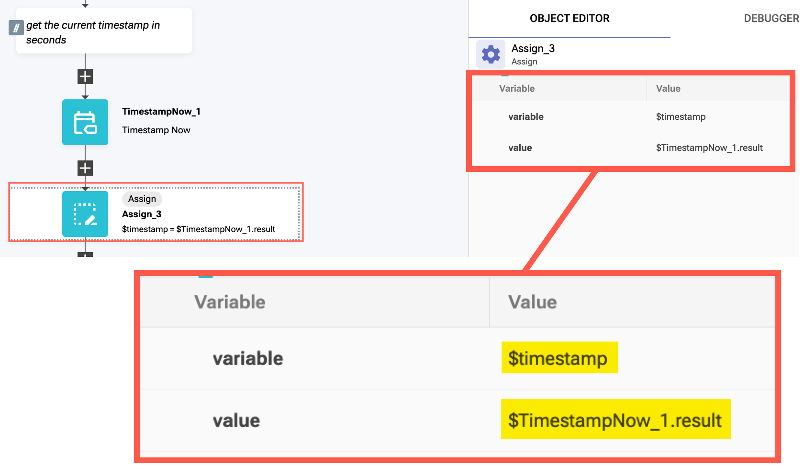

***[E] Construct the SevOne API JSON object***
> You are close to completion!  You now need to construct the SevOne payload using the values you've accumulated.

> The SevOne API payload format requires some nested JSON objects.  So you need to create that structure first.

Add an ***Assign*** block underneath the "populate content" comment so we can create the first nested object.

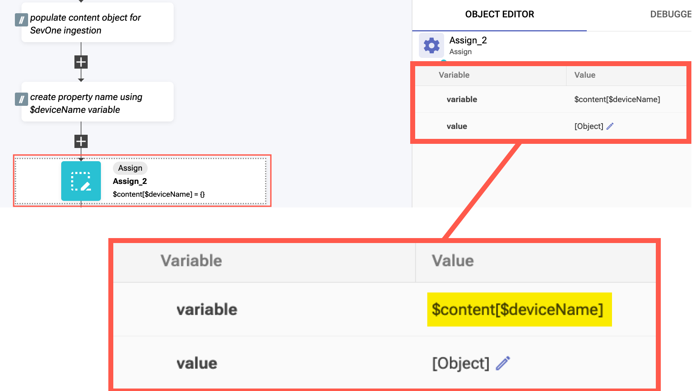

Add another ***Assign*** block underneath the previous one second nested object.

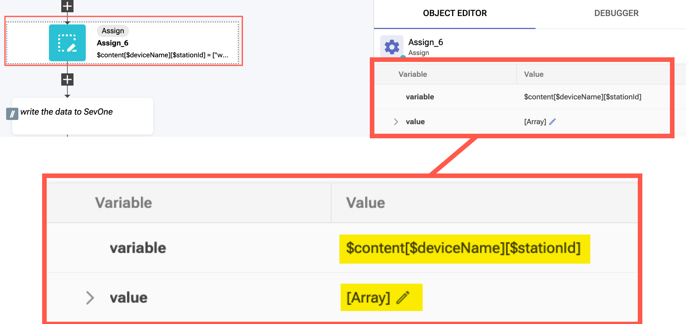

```
- variable: $content[$deviceName][$stationId]
- value: <cut-n-paste from the value code below>
```
value code:
```
["weatherStation", {
    "timestamp1": {
        "timestamp": $timestamp,
        "Fahrenheit": [$Fahrenheit, "Degrees F", "GAUGE"]
    }
}]
```

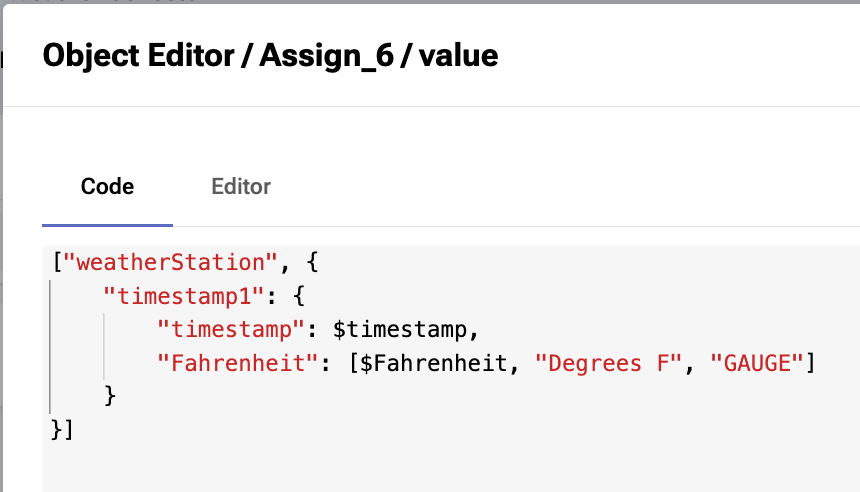


***[F] Add the SevOne subflow to the _main_ workflow***

Find the subflow action block using the action block palette on the left side of the workflow editor.

Select ***Home > User*** then select the ***SevOne Ingest Data - APIv3*** subflow.

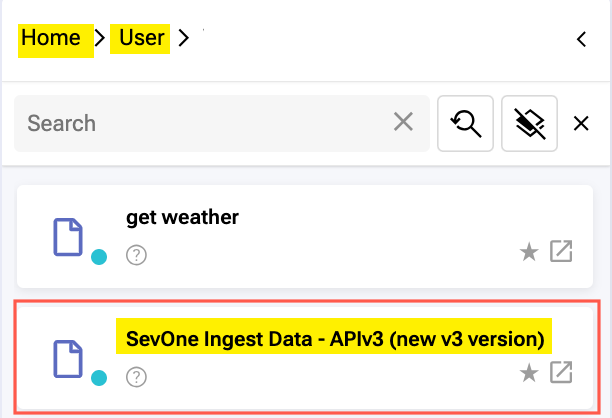

Drag the ***SevOne Ingest Data - APIv3*** action block into the workflow under the ***SevOne*** comment and edit its settings in the ***Object Editor*** using the image for your guide:

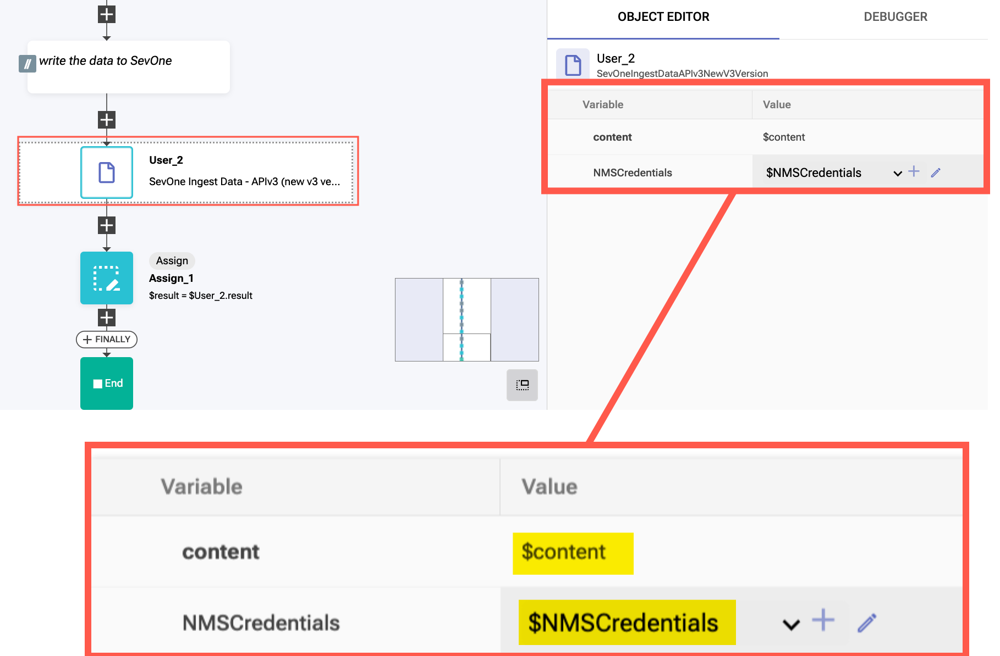

> You are passing the $content payload that you constructed along with the $NMSCredentials to the ***SevOne Ingest Data - APIv3*** action block so that it can ingest the data into SevOne using its API.

### [6] Login to IBM SevOne Data Insight and view your results
> Now you can login into SevOne Data Insight and see your results!

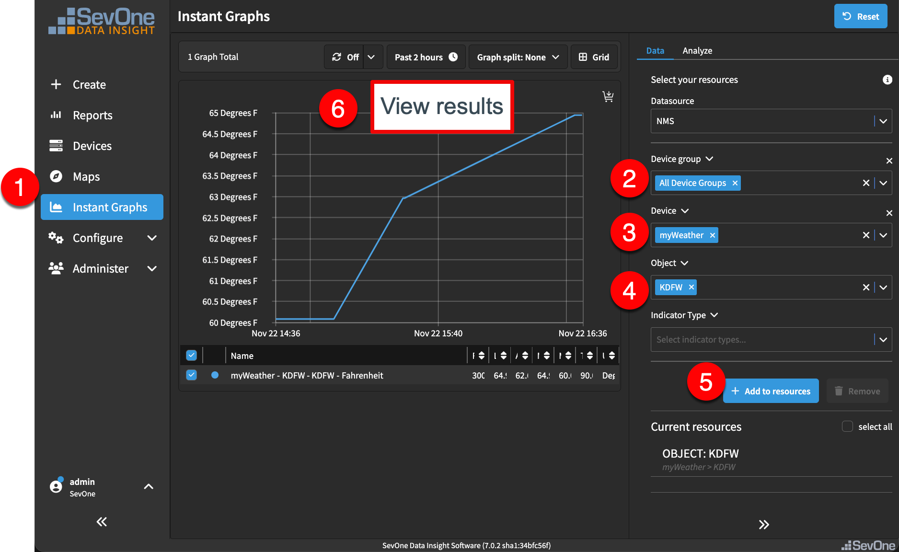

> NOTE: Wait 5 minutes, then run your workflow again and you should see results.

### [7] Schedule your collector workflow within RNA so that it collects automatically

***[A] In RNA, navigate to the ***Jobs*** tab to add your workflow as a scheduled job***

***[B] Click the [+ Create Job] button in the upper right-hand corner ***

***[C] Create job using the images below as your guide: ***

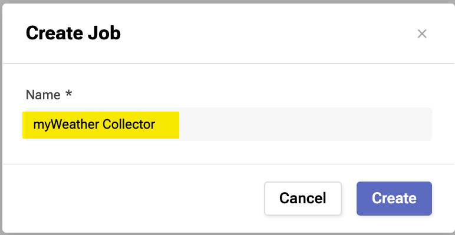
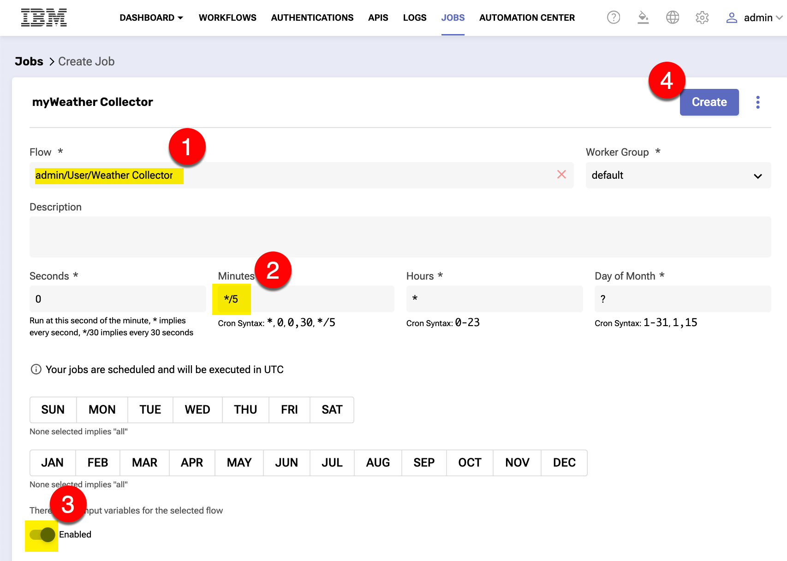
