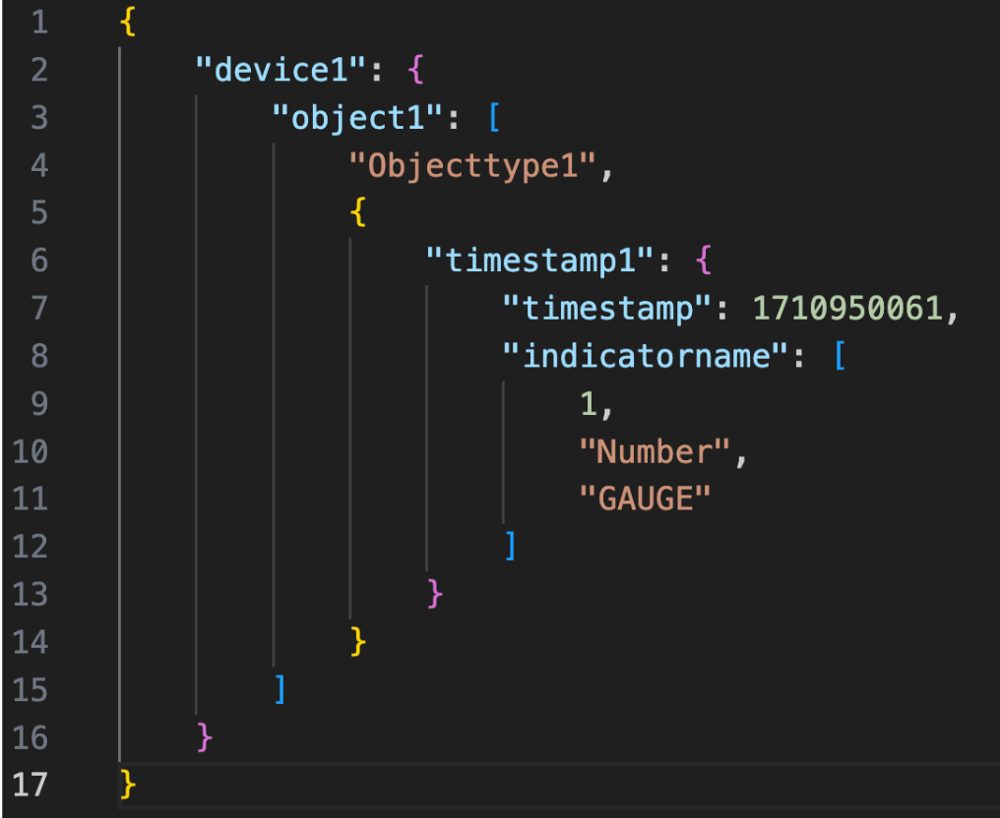
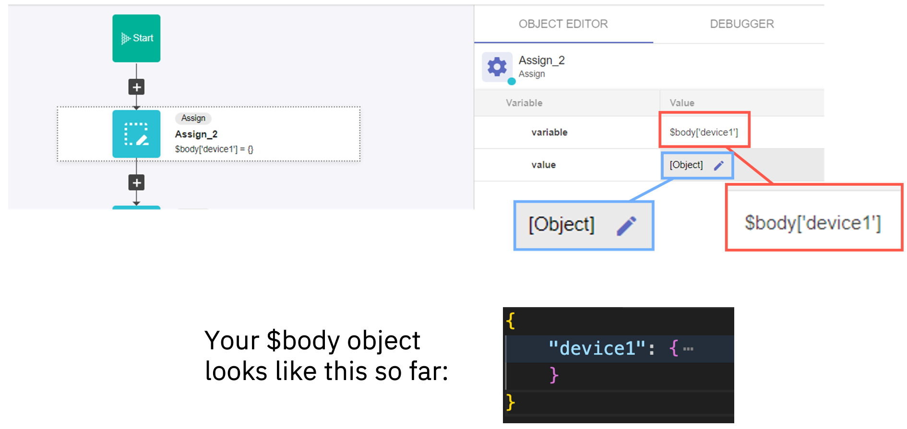
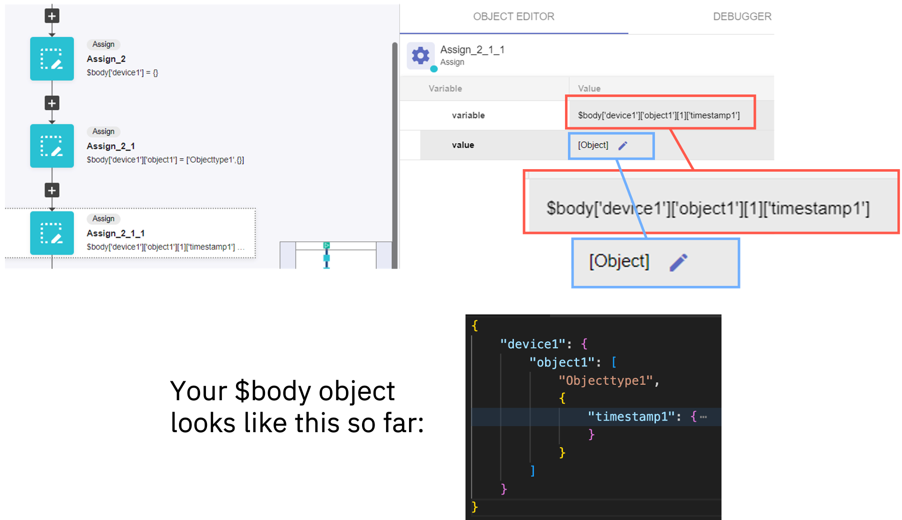
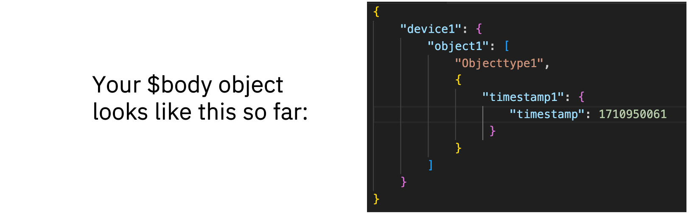
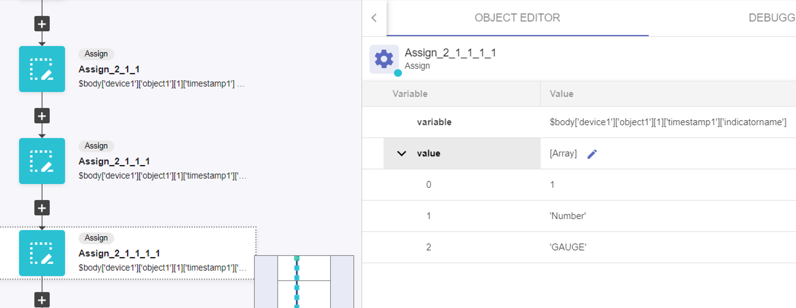
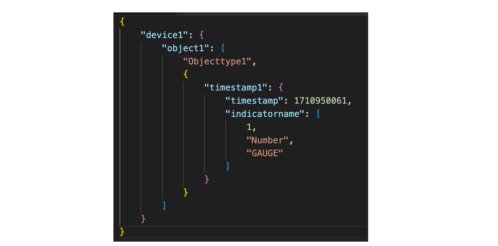
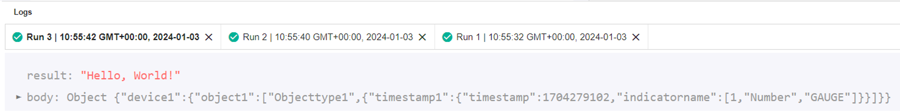
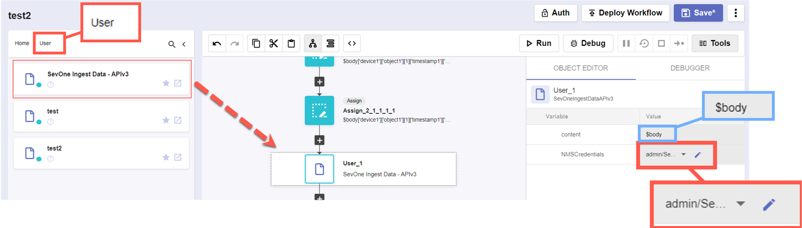
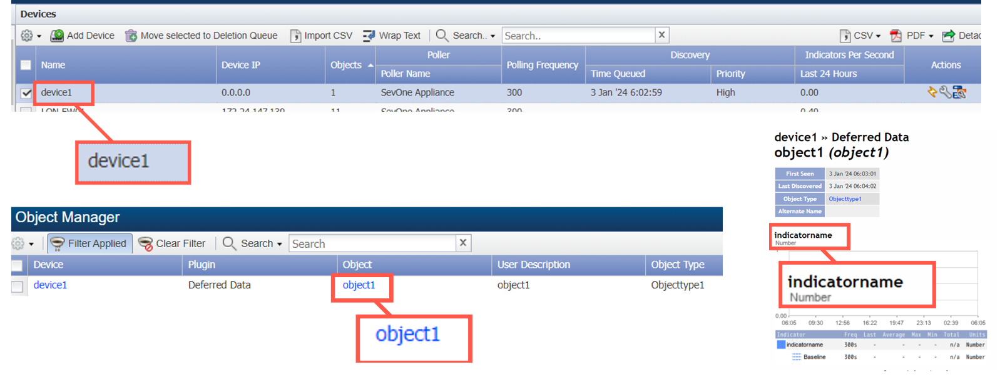

# Variables

## Overview

In this lab you will build this $body structure using a no-code action block workflow:



You will then pass it to an IBM Community workflow that will import the data into SevOne.

## Steps:
### [1] Create an authentication to connect to the SevOne NMS
```
- Protocol: http://
- IP: 10.0.0.10
- User: admin
- Password: SevOne
```

### [2] Create a new workflow
1. Add the following initial variable in the Start block:
```
- Name: body
- Type: object
- Default value: {}
- Out (selected)
- Log (selected)
```

2. Let’s add the first ‘key-value’ pair to the empty variable ‘body’:
```
- Add an action block: Common -> Assign
- Variable: $body['device1']
- Value: {}
```

> NOTE: what we are doing here is creating a key-value pair as follows { 'device1': {} }. The key is 'device1' and the value is an empty object '{}', this way we are paving the way to add more key-value pairs inside that object.



3. Add another Assign action block:
```
- Variable: $body['device1']['object1']
- Value: ['Objecttype1', {}]
```

> NOTE: we have created a new key-value pair where the key is _object1_ and the value is an _array_ ([]) that contains two items: a _string_ ('Objecttype1') in the first position, and an _object_ ({}) in the second position.

4. Add another Assign action block:
```
- Variable: $body['device1']['object1'][1]['timestamp1']
- Value: {}
```



5. Add another Assign action block:
```
- Variable: $body['device1']['object1'][1]['timestamp1']['timestamp']
- Value: 1710950061 
```
> NOTE: go to https://www.epochconverter.com/ and paste the value that 
appears there, mine was 1710950061 



6. Add another Assign action block:
```
- Variable: $body['device1']['object1'][1]['timestamp1']['indicatorname']
- Value: [1, 'Number', 'GAUGE’]
```

> NOTE: In this step, we have not created a new nested key-value pair--we have added a new one to the key 'timestamp1', meaning that the value of the key 'timestamp1' will be an object with two key-value pairs inside:  “timestamp” and “indicatorname”.


7. Click Save and click run, the output should look like this:



### [3] Check if the body that we have built works with the template available in the community to ingest data into SevOne
1. Download the _SevOne Ingest Data - APIv3_ workflow from https://community.ibm.com/community/user/aiops/viewdocument/sevone-data-ingestion-api-v3?CommunityKey=fe9d91df-352c-4846-9060-189fd98d00ca&tab=librarydocuments and import it into RNA.

2. Go back to your original workflow and add the newly downloaded workflow as an action block at the end of the workflow. 
> The imported workflow should be under _User_ in the API selection menu.

Add these settings to the downloaded workflow's action block:

```
- Content: $body
- NMSCredentials: 'admin/SevOne'
```



3. Save and click _Run_.

4. Go to the NMS (https://10.0.0.10).  Login and navigate to _Devices_ > _Device Manager_.
```
There should be a new device called 'device1’ that has one object 'object1’ which has one indicator 'indicatorname'
```
