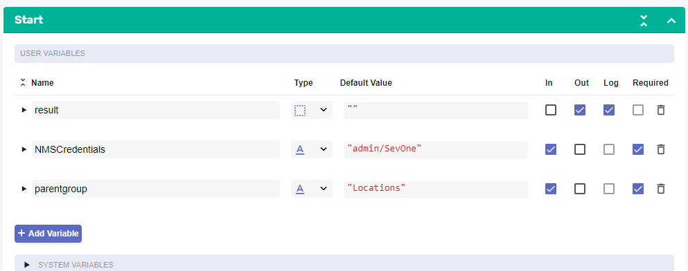
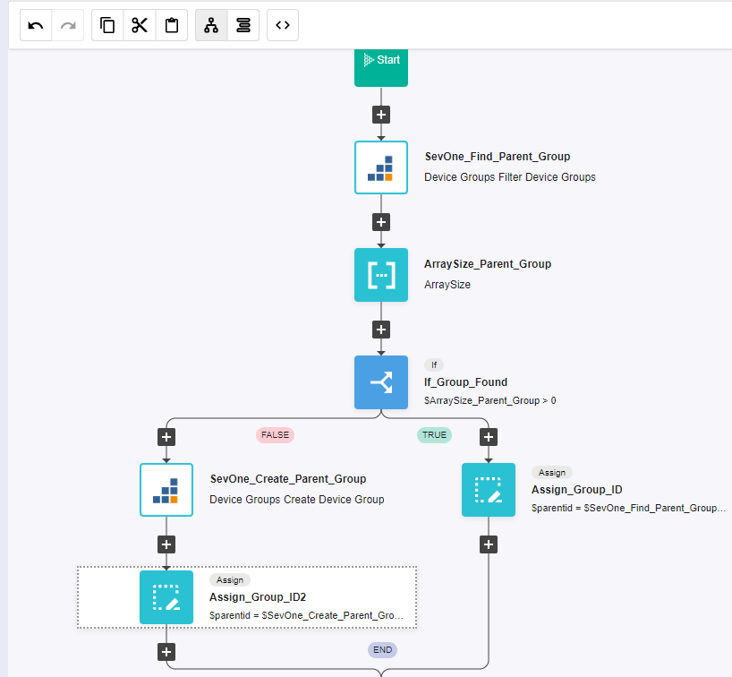
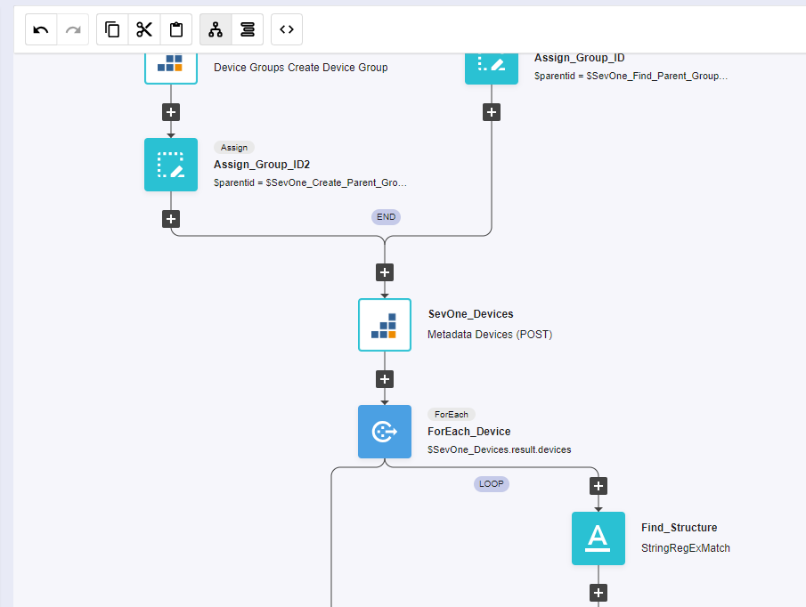
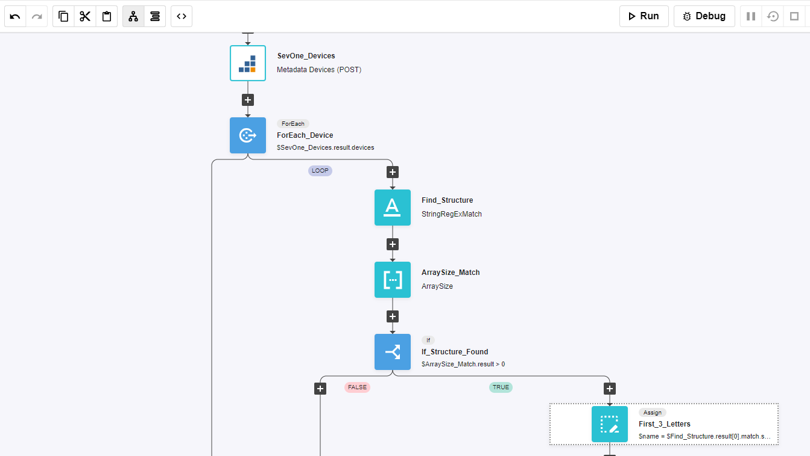
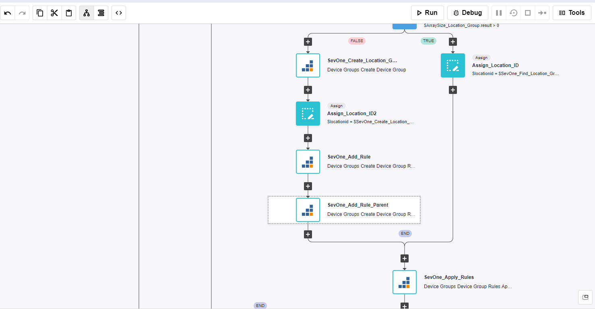
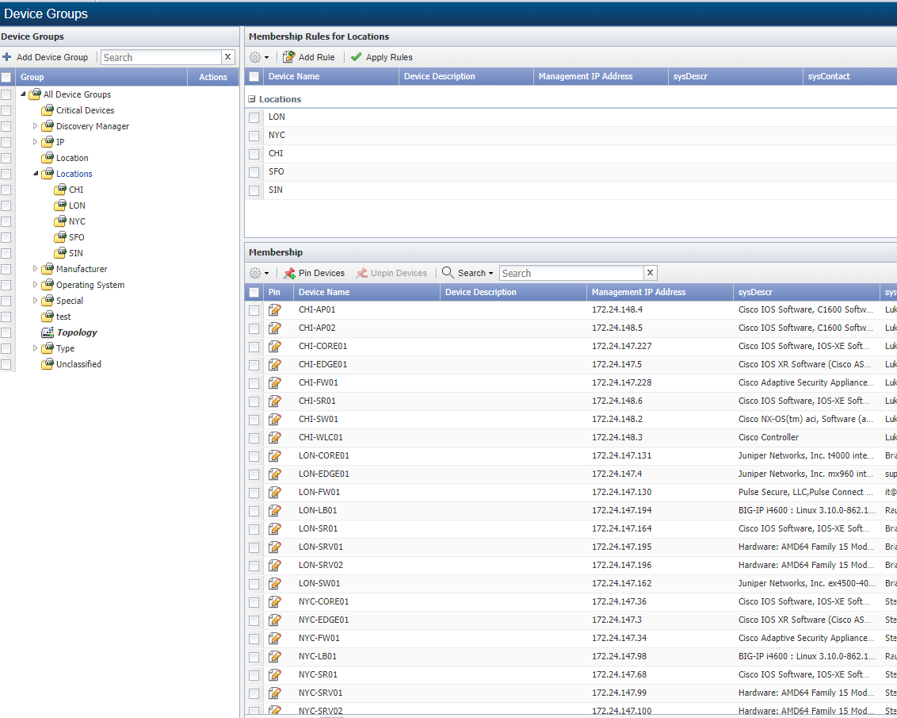

# Custom Device Grouping

## Overview

In this lab we will review how we can create custom groups in SevOne using RNA.

In this lab we will cover the following scenarios:

* Automatically create device groups for new locations that contain the devices of that location and create a rule to add all the devices of that location to that group

## Automatic Device Group Creation

If SevOne authentication has already been created, please skip this block of actions and continue to step 4.

1. Log into SANO automation platform

2. Go to Authentications

3. Click  Create Authentication

	a. Name: SevOne

	b. Service: SevOne

	c. **Protocol: http://** (<-- important)

	d. Host: 10.0.0.10

	e. Username: admin

	f. Password: SevOne

4. Go to **Workflows**

5. Click Create Workflow

	a. Name: Device Group Creation

	b. Layout type: Sequence

6. Add variables to Start

	a. NMSCredentials

		i. Name: NMSCredentials

		ii. Type: Authentication -> SevOne

		iii. Default Value: "admin/SevOne"

		iv. In

		v. Required

	b. parentgroup

		i. Name: parentgroup

		ii. Type: String

		iii. Default Value: "Locations"

		iv. In

		v. Required

7. Change to Flow View

8. On the left hand side panel, search for SevOne, Click on SevOne -> REST v3 -> Device Groups

9. Select the "Device Groups Filter Device Groups" building block and drag and drop it after the Start 

	a. Change name to SevOne_Find_Parent_Group
	
	b. Click on the building block to open the right side panel and complete the following fields

		i. authKey: $NMSCredentials

		ii. body
		
			1. name: $parentgroup

			2. parentIds: [ 2 ]

10. Add a new building block, Common -> Array -> ArraySize

	a. Change name to ArraySize_Parent_Group

	b. Click on the building block to open the right side panel and complete the following fields

		i. array: $SevOne_Find_Parent_Group.result.content

11. Add a new building block, Common -> If

	a. Change name to If_Group_Found
	
	b. Click on the building block to open the right side panel and complete the following fields

		i. condition: $ArraySize_Parent_Group.result > 0

12. On the TRUE branch of the IF, add a new building block, Common -> Assign

	a. Change name to Assign_Group_ID
	
	b. Click on the building block to open the right side panel and complete the following fields

		i. variable: $parentid

		ii. value: $SevOne_Find_Parent_Group.result.content[0].id

13. On the FALSE branch of the IF, add a new building block, SevOne -> REST v3 -> Device Groups -> Device Groups Create Device Group

	a. Change name to SevOne_Create_Parent_Group
	
	b. Click on the building block to open the right side panel and complete the following fields

		i. authKey: $NMSCredentials

		ii. body:
		
			1. name: $parentgroup

			2. parentId: 2

 14. Add a new building block, Common -> Assign

	a. Change name to Assign_Group_ID2
	
	b. Click on the building block to open the right side panel and complete the following fields

		i. variable: $parentid

		ii. value: $SevOne_Create_Parent_Group.result.id

15. Afther the end of the IF, add a new building block, SevOne -> REST v3 -> Metadata -> Metadata Devices (POST)

	a. Change name to SevOne_Devices

	b. Click on the building block to open the right side panel and complete the following fields

		i. authKey: $NMSCredentials

16. Add a new building block, Common -> ForEach

	a. Change name to ForEach_Device
	
	b. Click on the building block to open the right side panel and complete the following fields

		i. list: SevOne_Devices.result.devices

17. Add a new building block, Common -> String -> StringRegExMatch

	a. Change name to Find_Structure
	
	b. Click on the building block to open the right side panel and complete the following fields

		i. str: $ForEach_Device.item.name

		ii. regex: "(^[A-Z]{3})-([A-Z])"

		

18. Add a new building block, Common -> Array -> ArraySize

	a. Change name to ArraySize_Match
	
	b. Click on the building block to open the right side panel and complete the following fields

		i. array: $Find_Structure.result

19. Add a new building block, Common -> If

	a. Change name to If_Structure_Found
	
	b. Click on the building block to open the right side panel and complete the following fields

		i. condition: $ArraySize_Match.result > 0

20. On the TRUE branch of the IF, add a new building block, Common -> Assign

	a. Change name to First_3_Letters
	
	b. Click on the building block to open the right side panel and complete the following fields

		i. variable: $name

		ii. value: $Find_Structure.result[0].match.slice(0, 3)

21. Add a new building block, SevOne -> REST v3 -> Device Groups -> Device Groups Create Device Group

	a. Change name to SevOne_Create_Location_Group
	
	b. Click on the building block to open the right side panel and complete the following fields

		i. authKey: $NMSCredentials

		ii. body:

			1. name: $name

			2. parentId: $parentid

	

22. Add a new building block, SevOne -> REST v3 -> Device Groups -> Device Groups Filter Device Groups

	a. Change name to SevOne_Find_Location_Group
	
	b. Click on the building block to open the right side panel and complete the following fields

		i. authKey: $NMSCredentials

		ii. body
		
			1. name: $name

			2. parentIds: [ $parentid ]
			

23. Add a new building block, Common -> Array -> ArraySize

	a. Change name to ArraySize_Location_Group

	b. Click on the building block to open the right side panel and complete the following fields

		i. array: $SevOne_Find_Location_Group.result.content

23. Add a new building block, Common -> If

	a. Change name to If_Group_Found2
	
	b. Click on the building block to open the right side panel and complete the following fields

		i. condition: $ArraySize_Location_Group.result > 0 

24. On the TRUE branch of the IF, add a new building block, Common -> Assign

	a. Change name to Assign_Location_ID
	
	b. Click on the building block to open the right side panel and complete the following fields

		i. variable: $locationid

		ii. value: $SevOne_Find_Location_Group.result.content[0].id

25. On the FALSE branch of the IF, add a new building block, SevOne -> REST v3 -> Device Groups -> Device Groups Create Device Group

	a. Change name to SevOne_Create_Location_Group
	
	b. Click on the building block to open the right side panel and complete the following fields

		i. authKey: $NMSCredentials

		ii. body:
		
			1. name: $name

			2. parentId: $parentid

26. Add a new building block, Common -> Assign

	a. Change name to Assign_Location_ID2
	
	b. Click on the building block to open the right side panel and complete the following fields

		i. variable: $parentid

		ii. value: $SevOne_Create_Location_Group.result.id

27. Add a new building block, SevOne -> REST v3 -> Device Groups -> Device Groups Create Device Group Rule

	a. Change name to SevOne_Add_Rule

	b. Click on the building block to open the right side panel and complete the following fields

		i. authKey: $NMSCredentials

		ii. body:

			1. groupId: $locationid

			2. nameExpression: $name

28. Add a new building block, SevOne -> REST v3 -> Device Groups -> Device Groups Create Device Group Rule

	a. Change name to SevOne_Add_Rule_Parent

	b. Click on the building block to open the right side panel and complete the following fields

		i. authKey: $NMSCredentials

		ii. body:

			1. groupId: $parentid

			2. nameExpression: $name

	

## Review

29. Log into the NMS

30. Go to Devices -> Grouping -> Device Groups

31. Expand Locations and click on each of the groups to see data populated

	
