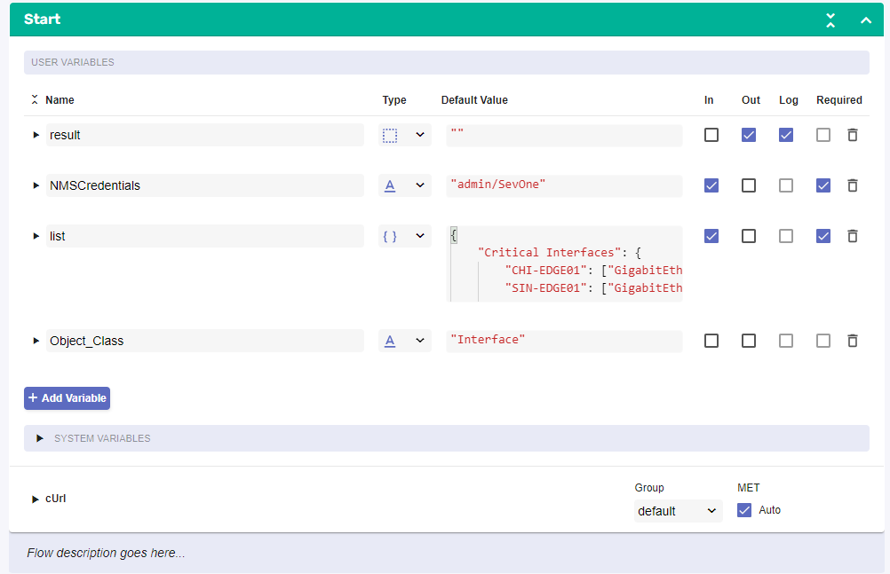
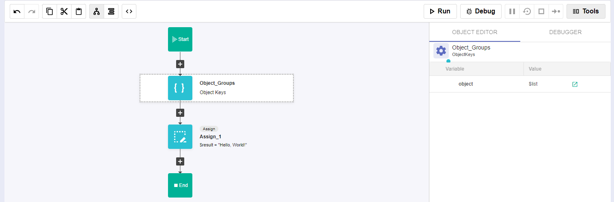
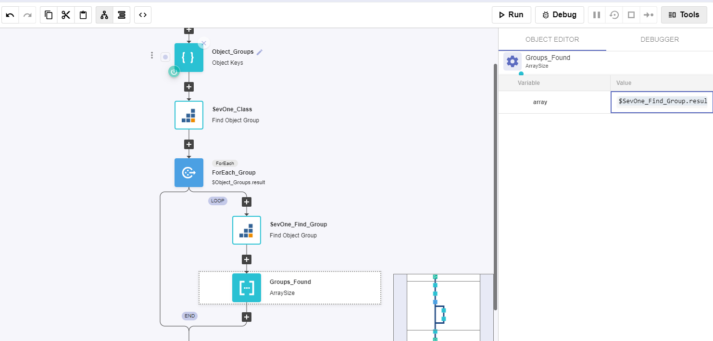
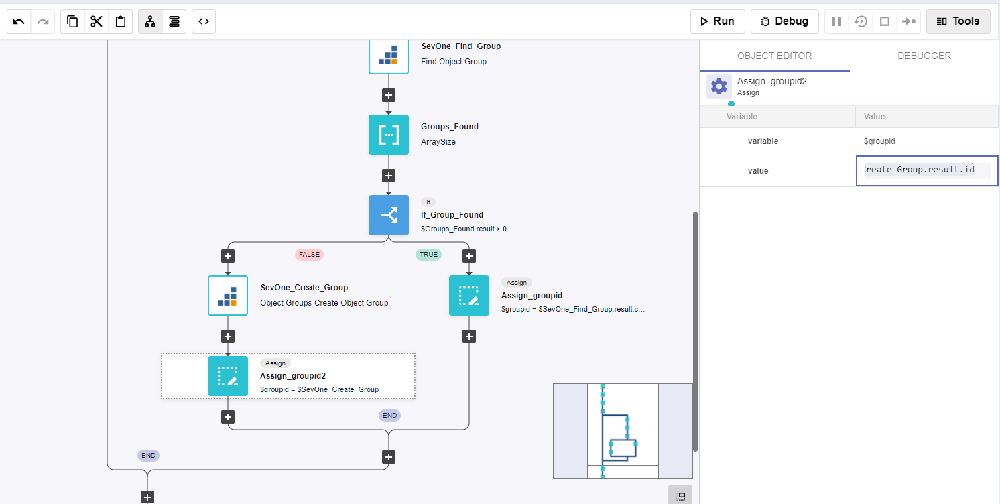
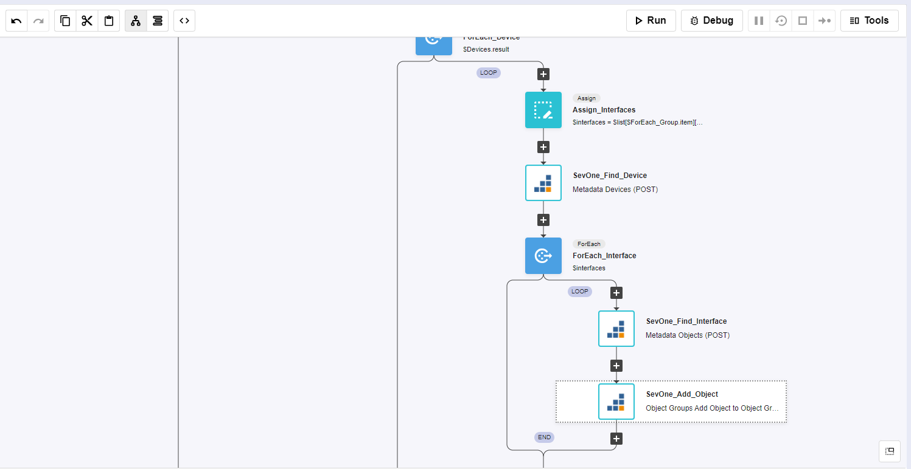
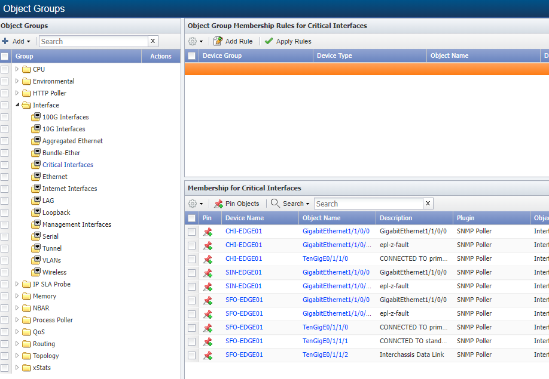

# Custom Object Grouping

## Overview

In this lab we will review how we can create custom groups in SevOne using RNA.

In this lab we will cover the following scenarios:

* Create new object groups and add the specified objects to the groups

Even though these tasks can be completed manually in SevOne, if the number of groups is quite large (100s or even 1000s) it would take a very long time to finish this task, and there is a big change there would be errors or typos. Therefore automating these tasks with RNA helps us to reduce the amount of time required to create and maintain groups as well as make sure there aren't any human errors during the process.

## Object Group Creation

If SevOne authentication has already been created, please skip this block of actions and continue to step 4.

1. Log into SANO automation platform

2. Go to Authentications

3. Click  Create Authentication

	a. Name: SevOne

	b. Service: SevOne

	c. **Protocol: http://** (<-- important)

	d. Host: 10.0.0.10

	e. Username: admin

	f. Password: SevOne

4. Go to **Workflows**

5. Click Create Workflow

	a. Name: Object Group Creation

	b. Layout type: Sequence

6. Add variables to Start

	a. NMSCredentials

		i. Name: NMSCredentials

		ii. Type: Authentication -> SevOne

		iii. Default Value: "admin/SevOne"

		iv. In

		v. Required

	b. list

		i. Name: list

		ii. Type: object

		iii. Default Value: 

		
				{

					"Critical Interfaces": {

						"CHI-EDGE01": ["GigabitEthernet1/1/0/0", "GigabitEthernet1/1/0/10", "TenGigE0/1/1/0"],

						"SIN-EDGE01": ["GigabitEthernet1/1/0/0", "GigabitEthernet1/1/0/10"],

						"SFO-EDGE01": ["GigabitEthernet1/1/0/0","GigabitEthernet1/1/0/10","TenGigE0/1/1/0","TenGigE0/1/1/1","TenGigE0/1/1/2"]
					},

					"Internet Interfaces": {

						"CHI-EDGE01": ["GigabitEthernet1/1/0/0", "GigabitEthernet1/1/0/10"],

						"SIN-EDGE01": ["GigabitEthernet1/1/0/0"],

						"SFO-EDGE01": ["GigabitEthernet1/1/0/0", "GigabitEthernet1/1/0/10"],

						"NYC-EDGE01": ["GigabitEthernet1/1/0/0"],

						"LON-EDGE01": ["ge-4/0/0", "ge-4/0/1"]

					}

				}

		

		iv. In

		v. Required

	b. Object_Class

		i. Name: Object_Class

		ii. Type: String

		iii. Default Value: "Interface"

		iv. In

		v. Required

7. Change to Flow View

8. On the left hand side panel, search for SevOne, Click on Common -> Object

9. Select the "Object Keys" building block and drag and drop it after the Start 

	a. Change name to Object_Groups
	
	b. Click on the building block to open the right side panel and complete the following fields

		i. Object: OneOf -> Object

			1. Click Ok

			2. Click on the pencil icon

			3. Type $list

10. Add a new building bloc, SevOne -> Rest v2 -> Object Group -> Find Object Group

	a. Change name to SevOne_Class

	b. Click on the building block to open the right side panel and complete the following fields

		i. authKey: $NMSCredentials

		ii. filterDto:

			1. name: $Object_Class

			2. parentIds: [ 0 ]

11. Add a new building block, Common -> ForEach

	a. Change name to ForEach_Group

	b. Click on the building block to open the right side panel and complete the following fields

		i. list: $Object_Groups.result

12. Inside the loop, add a new building block, SevOne -> Rest v2 -> Object Group -> Find Object Group

	a. Change name to SevOne_Find_Group

	b. Click on the building block to open the right side panel and complete the following fields

		i. authKey: $NMSCredentials

		ii. filterDto:

			1. name: $ForEach_Group.item

			2. parentIds: [ $SevOne_Class.result.content[0].id ]

13. Add a new building block, Common -> Array -> ArraySize

	a. Change name to Groups_Found

	b. Click on the building block to open the right side panel and complete the following fields

		i. array: $SevOne_Find_Group.result.content

14. Add a new building block, Common -> If

	a. Change name to If_Group_Found

	b. Click on the building block to open the right side panel and complete the following fields

		i. condition: $Groups_Found.result > 0 

15. On the TRUE branch of the IF, add a new building block, Common -> Assign

	a. Change name to Assign_groupid

	b. Click on the building block to open the right side panel and complete the following fields

		i. variable: $groupid

		ii. value: $SevOne_Find_Group.result.content[0].id

16. On the FALSE branch of the IF, add a new building block, SeVOne -> REST v3 -> Object Groups -> Object Groups Create Object Group:

	a. Change name to SevOne_Create_Group

	b. Click on the building block to open the right side panel and complete the following fields

		i. authKey: $NMSCredentials

		ii. body:
				
				1. name: $ForEach_Group.item

				2. parentId: $SevOne_Class.result.content[0].id

17. Add a new building block, add a new building block, Common -> Assign

	a. Change name to Assign_groupid2

	b. Click on the building block to open the right side panel and complete the following fields

		i. variable: $groupid

		ii. value: $SevOne_Create_Group.result.id

18. After the loop, add a new building block, Common -> Object -> Object Keys

	a. Change name to Devices
	
	b. Click on the building block to open the right side panel and complete the following fields

		i. Object: OneOf -> Object

			1. Click Ok

			2. Click on the pencil icon

			3. Type $list[$ForEach_Group.item]

19. Add a new building block, Common -> ForEach

	a. Change name to ForEach_Device

	b. Click on the building block to open the right side panel and complete the following fields

		i. list: $Devices.result

20. Inside the loop, add a new building block, Common -> Assign

	a. Change name to Assign_Interfaces

	b. Click on the building block to open the right side panel and complete the following fields

		i. variable: $interfaces

		ii. value: $list[$ForEach_Group.item][$ForEach_Device.item]

21. Add a new building block, SeVOne -> REST v3 -> Metadata -> Metadata Devices (POST)

	a. Change name to SevOne_Find_Device

	b. Click on the building block to open the right side panel and complete the following fields

		i. authKey: $NMSCredentials

		ii. body:
				
				1. name: 
				
						a. value: $ForEach_Device.item

22. Add a new building block, Common -> ForEach

	a. Change name to ForEach_Interface

	b. Click on the building block to open the right side panel and complete the following fields

		i. list: $interfaces

23. Inside the loop, add a new building block, SeVOne -> REST v3 -> Metadata -> Metadata Objects (POST)

	a. Change name to SevOne_Find_Interface

	b. Click on the building block to open the right side panel and complete the following fields

		i. authKey: $NMSCredentials

		ii. body:

				1. deviceIds: [ $SevOne_Find_Device.result.devices[0].id ]
				
				2. name: 
				
						a. value: $ForEach_Interface.item

24. Inside the loop, add a new building block, SeVOne -> REST v3 -> Object Groups -> Object Group Add Object to Object Group

	a. Change name to SevOne_Add_Object

	b. Click on the building block to open the right side panel and complete the following fields

		i. authKey: $NMSCredentials

		ii. id: $groupid

		iii. body:

				1. deviceId: $SevOne_Find_Device.result.devices[0].id

				2. objectId: $SevOne_Find_Interface.result.objects[0].id

## Review

26. Log into the NMS

27. Go to Devices -> Grouping -> Object Groups

28. Expand Interface, click in Critical Interfaces and Internet Interfaces, to see if there are objects populated

