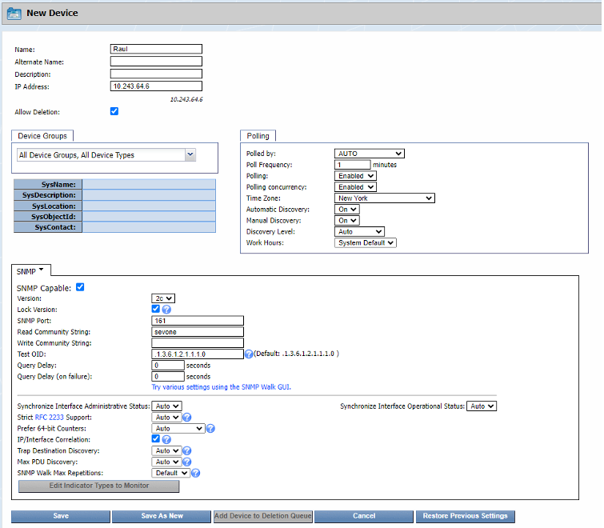

# Add Devices 

In this lab we will learn how SevOne device certification works. Device certification allows us to
discover all the relevant data from the device without the need of extra configuration, giving you all
the metrics you need to have a complete view of the performance of the device.

## Adding an SNMP Device to the vPAS (NMS)

### Add SNMP Device

1. Log into the NMS
2. Go to Devices -> Device Manager
3. Click **Add Device**
    - a. Name: your name
   - b. IP Address: 172.24.147.194
   - c. SNMP Read Community String: sevone
   - d. Poll Frequency: 1 minute
4. Save

## Review

After a few minutes, the name device added should have over 500 objects.
Click on the wrench icon next to your device, click on Object Manager and have a look at the objects discovered based on the device certification available in SevOne

This concludes adding devices tutorial.
