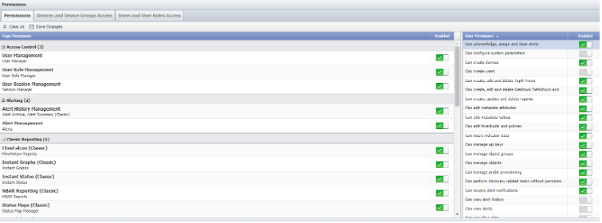
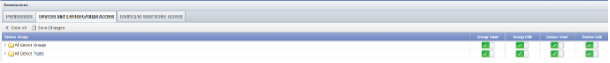
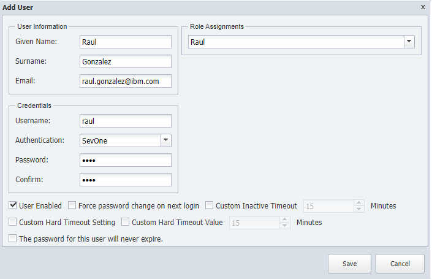

# User Administration 

## Creating User Account

In this lab, we will set up an additional local user account. We will assign them a different Role and scope so you can see the difference between them.

Add User Role

1.	Log into the NMS
2.	Go to Administration -> Access Configuration -> User Role Manager
3.	Expand System Administrators and Administrators roles
4.	Click on Administrators and click on ‘Add Role’
    a.	Name: your name
    b.	Save
5.	Select the new role you have created and enable all the permissions
6.	Click Save Changes as shown below in Image Below

7. Go to Devices and Devices Groups Access and enable Group View / Group Edit / Device View
    / Device Edit for All device Groups and All Device Types
8. Click Save Changes

Image Below

9. Go to Users and User Roles Access
10. Enable Role View / Role Edit / User View / User Edit for Administrators
11. Click Save Changes

![IBM SevOne Automated Network Observability](img/addtargets/userrole.png

Add User
1.	Log into the NMS
2.	Go to Administration -> Access Configuration -> User Manager
3.	Click on **Add User**
    - a. Name: your name
    - b. Surname: your surname
    - c. Email: your email
    - d. Username: your name
    - e. Authentication: SevOne
    - f. Password: any password
    - g. Confirm: any password
    - h. Role Assignments: your name
4.	Save

You will see the User Management Page and see two options: LOCAL USERS or EXTERNAL AUTHENTICATION. In this lab, we will be creating "Local Users". Currently, two user accounts are configured: the admin user you used to log into SevOne.

## Review

Log out and log in again using the new username that you have created to make sure you have access to SevOne with this new credential. The level of access between user Admin and your user will be very similar because we have given all the possible credentials to the new role.

You have now finished the administration lab and can move on to the next lab. 
