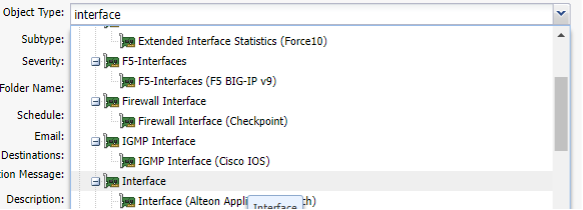
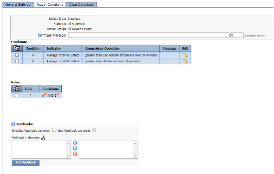
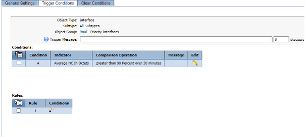
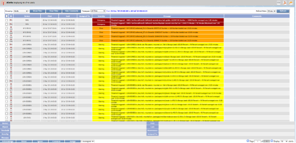

# Alerts
In this lab we will learn how we can create custom metrics based off existing KPIs in order to create aggregations or just new metrics that will help us understand better the performance of the overall network.

## Create Aggregation

1. Log into the NMS
2. Go to Events -> Configuration -> Policy Browser
3. Click Create Policy
    - a. Name: Your Name - Unusual high traffic
    - b. Device Group: All device groups
    - c. Object type: Interface

    - d. Trigger Conditions
        - i. New condition:
            - 1. Indicator: Total HC Octets
            - 2. Type: Baseline Percentage
            - 3. Comparison: Greater than
            - 4. Threshold: 150%
            - 5. Duration 30 minutes
        - ii. New condition:
            - 1. Indicator: Total HC Octets
            - 2. Type: Static
            - 3. Comparison: Greater than
            - 4. Threshold: 70%
            - 5. Duration 30 minutes
4. Save as new

Targeted Static Threshold Alert
- 5. Click ‘Create Policy’
    - a. Name: High Traffic on Critical Interfaces
    - b. Object Group: YOURNAME – Priority Interface
    - c. Object type: Interface
    - d. Trigger Conditions
        - i. New condition:
            - 1. Indicator: HC In Octets
            - 2. Type: Static
            - 3. Comparison: Greater than
            - 4. Threshold: 90
            - 5. Unit: Percentage
            - 6. Duration 30 minutes
6. Save as new

Review
If you go back to Policy Browser and click ‘Refresh’ , go to the end of the second page and you will find the two alerts created

Unfortunately the anomaly detection alert will not trigger any alert at least until we have collected 7 days worth of data, and the second alert won’t trigger any alert either. However to see which other alerts are active, we can go to Events -> Alerts

Congratulations! You have Completed this lab.