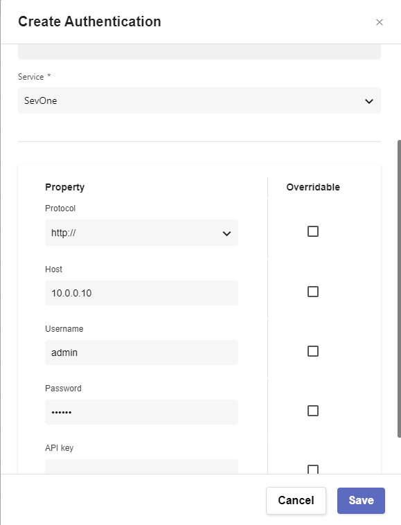

# Automate Automations

## Overview

In this lab we will review how we can run a schedule job that will syncronize users between different tools.

Keep tools in sync is vital, however that requires executing lots of repetitive tasks. With Rapid Network Automation we can automate those tasks and run them either on demand or a specific frequency.

In this lab we are synchronizing the users that can access SevOne adn RNA (imagine the customer doesn't have a centralised RADIUS server and they create accounts manually). What we do in this lab is read the users in SevOne that are part of a role, check if those users exist in RNA, and if they don't, we create those users with the credentials that we have defined. We also create a job to execute this workflow every hour to make sure the users are always synchronized.

This ways we are sure the users are synchronized and we don't need to remember to sync them manually.

## Sync SevOne and RNA Users

If SevOne authentication has already been created, please skip this block of actions and continue to step 4.

1. Log into SANO automation platform

2. Go to Authentications

3. Click  Create Authentication

	a. Name: SevOne

	b. Service: SevOne

	c. **Protocol: http://** (<-- important)

	d. Host: 10.0.0.10

	e. Username: admin

	f. Password: SevOne

4. Go to Authentications

5. Click Create Authentication

	a. Name: IRNA

	b. Service: Pliant

	c. Protocol: http://

	d. Host: 10.0.0.12

	e. Username: admin	

	f. Password: pl1anTAut0m8tion

6. Go to **Workflows**

7. Click Create Workflow

	a. Name: Your Name - Sync SevOne IRNA Users

	b. Layout type: Sequence

8. Add variables to Start

	a. NMSCredentials

		i. Name: NMSCredentials

		ii. Type: Authentication -> SevOne

		iii. Default Value: "admin/SevOne"

	b. IRNACredentials

		i. Name: IRNACredentials

		ii. Type: Authentication -> Pliant

		iii. Default Value: "admin/IRNA"

	c. SevOneRole

		i. Name: SevOneRole

		ii. Type: String

		iii. Default Value: "Administrators"

		iv. In

		v. Required

	d. IRNARole

		i. Name: IRNARole

		ii. Type: String

		iii. Default Value: "ADMIN"

		iv. In

		v. Required

	e. IRNAFlowRole

		i. Name: IRNAFlowRole

		ii. Type: String

		iii. Default Value: "admin"

		iv. In

		v. Required

9. Change to Flow View

10. On the left hand side panel, search for SevOne, Click on SevOne -> REST v2 -> Roles 

11. Select Filter Roles and drop it after the building block START

	a. Change name to SevOne_Find_Role

	b. Click on the building block to open the right side panel and complete the following fields

		i. authKey: $NMSCredentials

		ii. roleFilter -> name: $SevOneRole

12. Add a new building block, SevOne -> REST v3 -> Users -> Users Users (POST)

	a. Change name to SevOne_List_Users

	b. Click on the building block to open the right side panel and complete the following fields

		i. authKey: $NMSCredentials

		ii. body -> roles -> ids: [ $SevOne_Find_Role.result.content[0].id ] 

13. Add a new building block, Common -> ForEach

	a. Change name to ForEach_SevOne_User

	b. Click on the building block to open the right side panel and complete the following fields

		i. list: $SevOne_List_Users.result.users

14. Inside the ForEach, add a new building block, Common -> Assign

	a. Change name to Initiliaze_variable

	b. Click on the building block to open the right side panel and complete the following fields

		i. variable: $user_found

		ii. value: false

15. Add a new building block, Common -> Try

16. Inside the Try, add a new building block, Pliant -> user-controller -> readUser

	a. Change name to IRNA_Find_User

	b. Click on the building block to open the right side panel and complete the following fields

		i. authKey: $IRNACredentials

		ii. userName: $ForEach_SevOne_User.item.username

17. Add a new building block, Common -> Assign

	a. Change name to IRNA_User_Found

	b. Click on the building block to open the right side panel and complete the following fields

		i. variable: $user_found

		ii. value: true

18. After the END of the TRY block, add a new building block, Common -> If

	a. Change name to If_user_not_found

	b. Click on the building block to open the right side panel and complete the following fields

		i. condition: $user_found == false

19. On the TRUE branch of the IF, Add a new building block, Pliant -> user-controller -> createUser

	a. Change name to IRNA_Create_User

	b. Click on the building block to open the right side panel and complete the following fields

		i. authKey: $IRNACredentials

		ii. userDto

			1. active: true

			2. firstName: $ForEach_SevOne_User.item.firstName

			3. flowRoles: [ $IRNAFlowRole ] 

			4. lastName: $ForEach_SevOne_User.item.lastName

			5. forcePasswordChange: true

			6. password: $ForEach_SevOne_User.item.username

			7. provider: LOCAL

			8. roles: [ $IRNARole ]

			9. userName: $ForEach_SevOne_User.item.username

20. Delete any other building blocks after that block (There might be an ASSIGN block that can be removed)

21. Save Workflow

## Create Scheduled Job

22. Go to JOBS

23. Click Create Job

	a. Name: Sync SevOne IRNA users

		i. Flow: Your Name - Sync SevOne IRNA Users

		ii. Seconds: 0

		iii. Minutes: 0

		iv. Hours: *

		v. Day of Month: ?

		vi. Use Default Parameters: ENABLED

		vii. ENABLED

