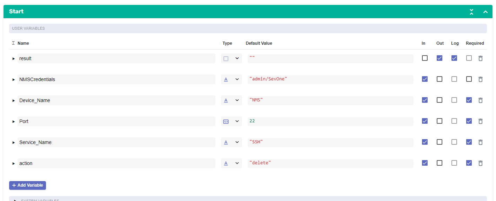
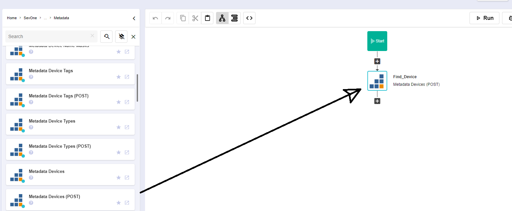
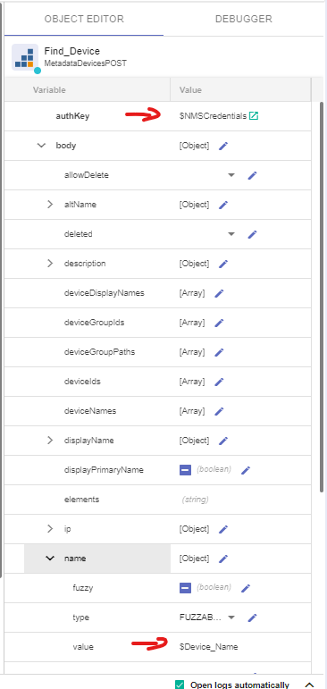
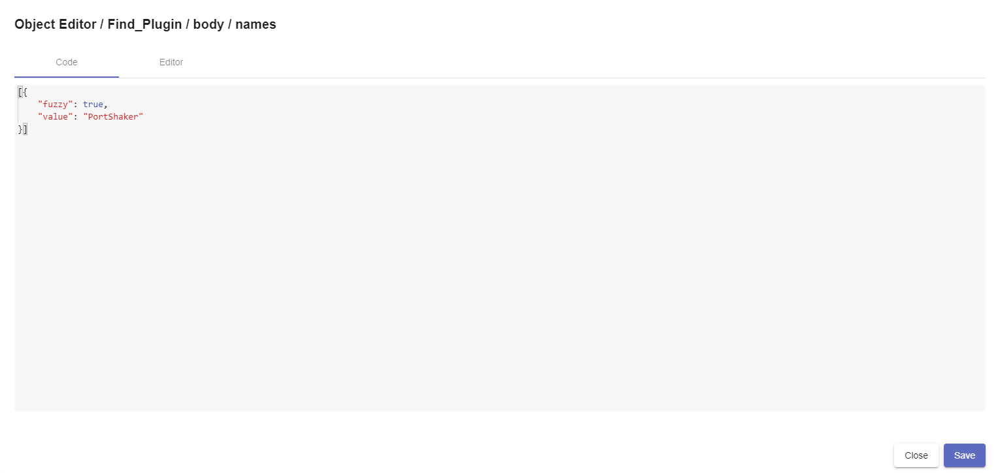
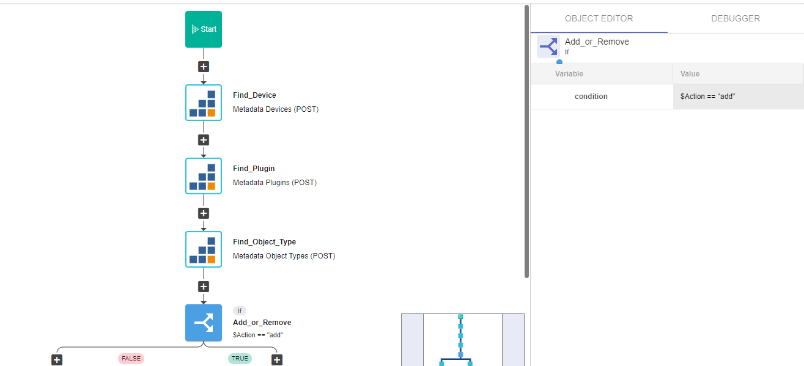
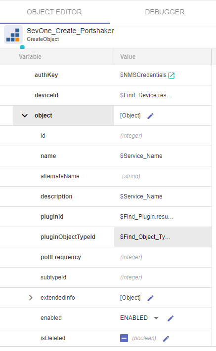
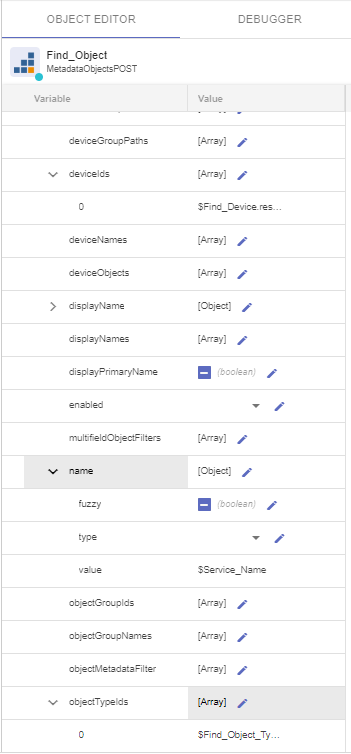
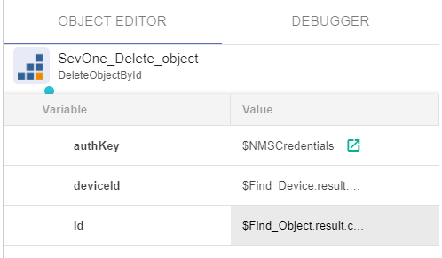
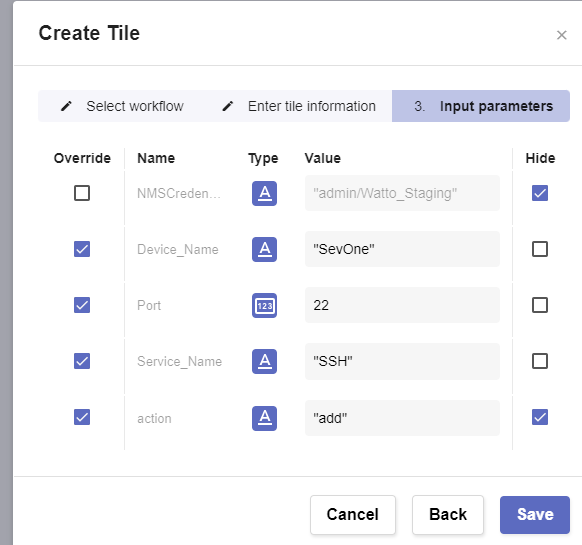

# Democratize Network Automation

## Overview

In this lab we will review how we can provide access to network automation capabilities to any user of our company, democratizing the access to network automation to anyone, not needing any scripting or automation skills.

## Monitor New Metrics in SevOne - Adding PortShaker Monitor

If SevOne authentication has already been created, please skip this block of actions and continue to step 4.

1. Log into SANO automation platform

2. Go to Authentications

3. Click  Create Authentication

	a. Name: SevOne

	b. Service: SevOne

	c. **Protocol: http://** (<-- important)

	d. Host: 10.0.0.10

	e. Username: admin

	f. Password: SevOne

4. Go to **Workflows**

5. Click Create Workflow

	a. Name: Your Name - Create PortShaker

	b. Layout type: Sequence

6. Add variables to Start

	a. NMSCredentials

		i. Name: NMSCredentials

		ii. Type: Authentication -> SevOne

		iii. Default Value: "admin/SevOne"

	a. Device_Name

		i. Name: Device_Name

		ii. Type: String

		iii. Default Value: "NMS"

		iv. In

		v. Required

	a. Port

		i. Name: Port

		ii. Type: Number

		iii. Default Value: 22

		iv. In

		v. Required

	a. Service_Name

		i. Name: Service_Name

		ii. Type: String

		iii. Default Value: "SSH"

		iv. In

		v. Required

	a. Action

		i. Name: Action

		ii. Type: String

		iii. Default Value: "add"

		iv. In

		v. Required

7. Change to Flow View

8. On the left hand side panel, search for SevOne, Click on SevOne -> REST v3 -> Metadata

9. Select Metadata Devices (POST) and drop it after the tile START

10. Change name of the tile to Find_Device

11. Click on the tile to open the right hand side panel and complete it with these options:

	a. authKey: $NMSCredentials

	b. name -> value: $Device_Name

12. Add a new tile, SevOne -> REST v3 -> Metadata -> Metadata Plugins (POST)

13. Change name of the tile to Find_Plugin

14. Click on the tile to open the right hand side panel and complete it with these options:

	a. authKey: $NMSCredentials

	b. names -> click on the pencil icon and paste the following text:

[{

    "fuzzy": true,

    "value": "PortShaker"

}]

15. Add a new tile, SevOne -> REST v3 -> Metadata -> Metadata Object Types (POST)

16. Change name of the tile to Find_Object_Type

17. Click on the tile to open the right hand side panel and complete it with these options:

	a. authKey: $NMSCredentials

	b. pluginId: $Find_Plugin.result.plugins[0].id

18. Add a new tile, Common -> If

	a. Change name of the tile to Add_or_Remove

	b. Click on the tile to open the right hand side panel:

		i. condition: $Action == "add"

19. On the TRUE branch of the if, add a new tile, SevOne -> REST v2 -> Objects -> Create Object

20. Change name of the tile to SevOne_Create_PortShaker

21. Click on the tile to open the right hand side panel and complete it with these options:

	a. authKey: $NMSCredentials

	b. deviceId: $Find_Device.result.devices[0].id

	c. object:

		i. name: $Service_Name

		ii. description: $Service_Name

		iii. pluginId: $Find_Plugin.result.plugins[0].id

		iv. pluginOjbectTypeId: $Find_Object_Type.result.objectTypes[0].id

22. Add a new tile, Common -> Assign

	a. Change the name to Result

	b. variable: $result

	c. value: $SevOne_Create_Portshaker.result

23. Add a new tile, SevOne -> REST v2 -> Discovert -> Run Discover Device

24. Change name of the tile to SevOne_Discover

25. Click on the tile to open the right hand side panel and complete it with these options:

	a. authKey: $NMSCredentials

	b. id: $Find_Device.result.devices[0].id

	c. localOnly: false

26. Now let's focus on the FALSE branch of the if

27. Add a new tile, SevOne -> REST v3 -> Metadata -> Metadata Object (POST)

28. Change name to Find_Object

29. Click on the tile to open the right hand side panel and complete it with these options:

	a. authKey: $NMSCredentials

	b. body -> deviceIds: [ $Find_Device.result.devices[0].id ] 

	c. body -> name -> value: $Service_Name

	d. body -> objectTypeIds: [ $Find_Object_Type.result.objectTypes[0].id ] 

	

30. Add a new tile, SevOne -> REST v2 -> Objects -> Delete Object by Id

31. Change name to SevOne_Delete_Object

32. Click on the tile to open the right hand side panel and complete it with these options:

	a. authKey: $NMSCredentials

	b. deviceId: $Find_Device.result.devices[0].id

	c. id: $Find_Object.result.objects[0].id

33. Add a new tile, Common -> Assign

	a. Change the name to Result2

	b. variable: $result

	c. value: $SevOne_Delete_object.result.body

34. If there is any other tile after these, please delete it

## Automation Center

1. Go to Automation Center

2. Click on Create Panel

	a. Title: TCP Port Monitor

3. Click on Create Tile

	a. Select workflow: Your Name - Create PortShaker

4. Click Next

5. Title: Add TCP Port

6. Click Next

7. Select override on:

	a. Device_Name

	b. Port

	c. Service_Name

	d. Action -> change value to "add"

8. Select Hide on

	a. Action

9. Click on Create Tile

	a. Select workflow: Your Name - Create PortShaker

10. Click Next

11. Title: Delete TCP Port

12. Click Next

13. Select override on:

	a. Device_Name

	b. Service_Name

14. Select Hide on

	a. Port

	b. Action

## Review

1. Go to Automation Center

2. Click on  TCP Port Monitor

3. Click on Add TCP Port

	a. You may change the device name, port and service name if you want to, otherwise leave the default values

4. Click Execute
