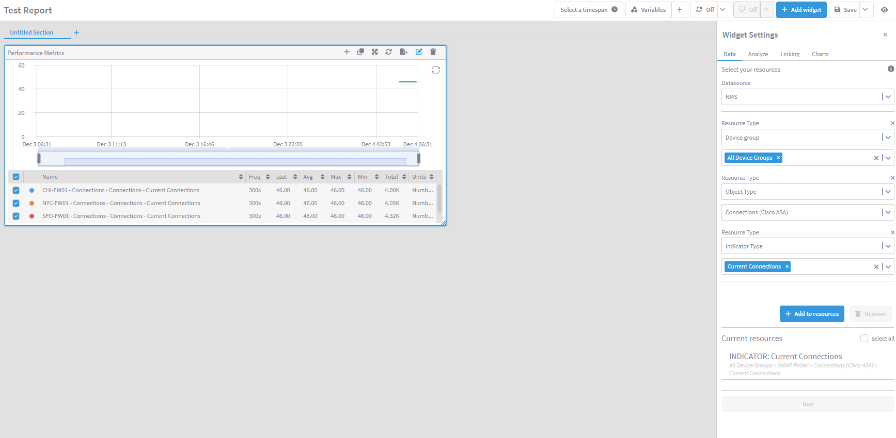
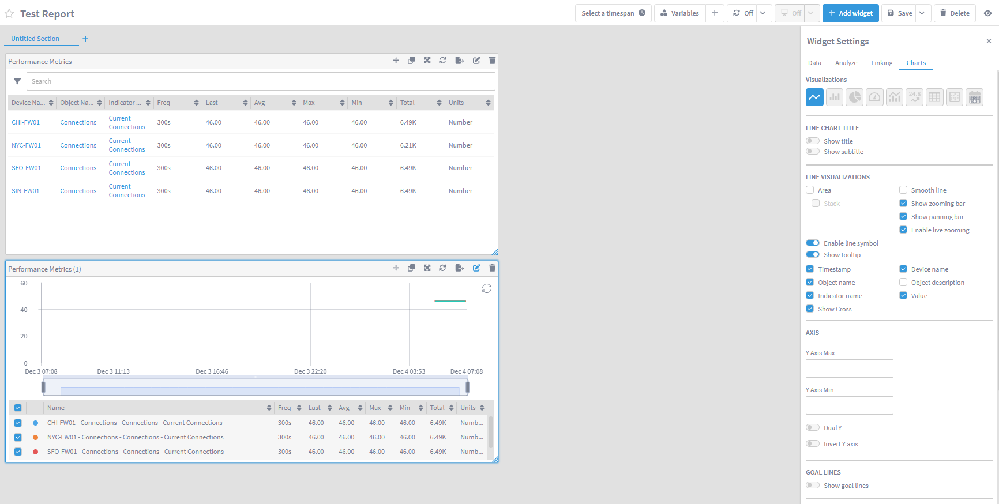

# Report Linking

## Overview

In this lab we will learn how we can define the drill-down options available when you click on an element (device, object, indicator, value) on a Data Insight report, allowing you to define the troubleshooting steps or workflows that will help you to go from a high level report to a more detailed/granular report.

A high level report will show aggregated data from lots of different devices and metrics, and these high level reports will help you stop issues easily. However once you have spotted an issue on the high level report, you will need to drill-down to the specific problem to have a closer look at the problem. With Report Linking we have control on which options we want to allow users to see and use to help them during the troubleshooting process.

In this lab we will review the two report linking options:

* Global: available on every single report and widget

* Local: only available on the coonfiguredd widget

## Prepare the system

1. Log in DI

2. Click 'Create Report'

3. Change new of the report from 'Untitled Report' to 'Test Report'

4. On the right hand side, click on Performance Metrics to add a new widget into the report

    a. On the data column of the widget settings:

        i. Datasource: NMS

        ii. Resource Type: Device group

            1. All device groups

        iii. Resource Type: Object Type

            1. Connections (Cisco ASA)

        iv. Resource Type: Indicator Type

            1. Current Connections

    b. Click on Add to resources

    c. Click Run

5. Go to the Charts column in Widget Settings

    a. Select the table visualization (3rd from the right side)

6. Click Save

So the current status of the report allows you to see the high level status of the VPN connections, however we have to no option to drill down into any more granular/detailed metric.

## Global Report Linking

7. Go to Configure -> Report Linking

    a. Edit 'Global Report Link 0' 

        i. Change the name to 'Device Links'

        ii. Links to report:

            1. Device Summary

        iii. Field:

            1. Device name

NOTE: leaving the Value field empty means that all 'Device names' will be considered for this link

    b. Edit 'Global Report Link 1' 

        i. Change the name to 'Object Links'

        ii. Links to report:

            1. Object Summary

        iii. Field:

            1. Object name

8. Click 'Add Link'

    a. Change the name to 'Indicator Links'
    
    b. Choose 'Indicator'

    c. Links to report:
        
        1. Indicator Summary

        2. Instant Graphs Workspace

        3. Data Analytics Workspace

    d. Field:

        1. Indicator type name

    e. Click Save

## Review

9. Go back to Reports -> Test Report

10. Click on 'Device Name', 'Object Name' and 'Indicator Name' to test all the links configured

11. Go back to Configure -> Report Linking

12. Add a new link

  a. Change the name to 'Cisco ASA'
    
    b. Choose 'Device'

    c. Links to report:
        
        i. Cisco ASA Device Summary

    d. Field:

        i. Device Type

    e. Datasource

        i. NMS

    f. Resource Type

        i. Device type

            1. Cisco ASA (you will find it inside All Device Types -> Generic)

    e. Click Save

13. Go back to Reports -> Test Report

14. Click on any device under 'Device Name' to see two links, first 'Device Summary' more generic, and second Cisco ASA Summary that is more specific to this type of device. This link will only appear if the device is a Cisco ASA as defined on step 12.

## Local Report Linking

15. Go back to Reports -> Test Report

16. Click on the top right pencil icon to edit the report

17. Click on the pencil icon in the top right corner of the widget to edit the widget

    a. Go to the Linking column of the widget settings

    b. On Report Link 1:

        i. Clicking on: 

            1. Device Name

        ii. Links to report:

            1. Network Topology

18. Click Save

## Review

19. Click on any device under the 'Device Name' column, now there are three options. The Network Topology link will only appear on this widget, and will not appear on any other widget that we create, unless we configure it in that widget settings.

## Local Value Link

20. Go back to Reports -> Test Report

21. Click on the top right pencil icon to edit the report

22. Duplicate the widget by clicking on the second 'Duplicate' icon on the top right corner of the widget

23. Edit the new widget

    a. Go to the Charts column and select the first visualization (linegraph)

    ab Go to the Linking column of the widget settings

    b. On Report Link 2:

        i. Clicking on: 

            1. Value

        ii. Links to report:

            1. Data Analytics Workspace

24. Click Save

## Review

25. Go back to Reports -> Test Report

26. On the second widget, click over any data point in the chart, that should give you the open to drill down to the report link configured

