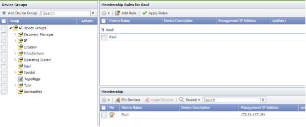
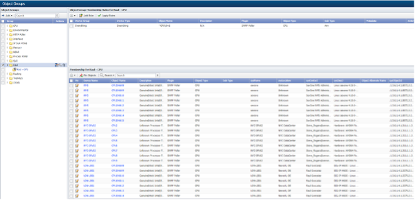
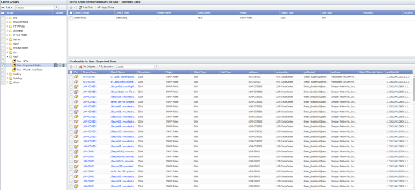
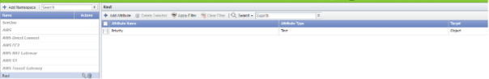
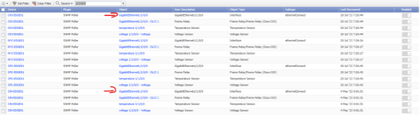
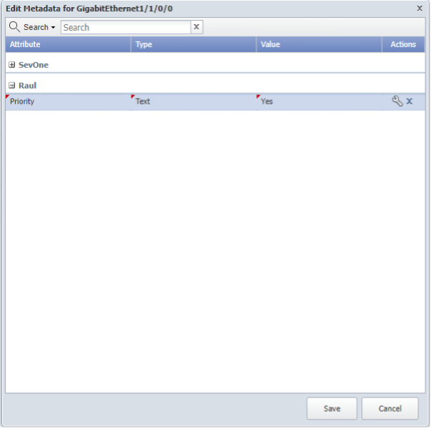
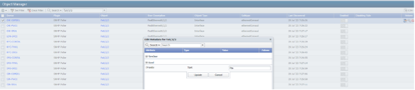
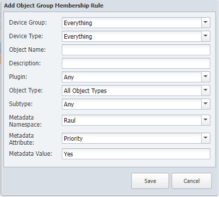

# Grouping and Metadata

In this lab we will learn how we can group devices and object together and how we can tag devices and objects to make it easier to group

**Create Groups**

1. Log into the NMS
2. Go to Devices -> Grouping -> Device Groups
3. Click Add Device Group
- a. Name: YOURNAME

4. Save
5. Click Add Rule
a. Device Name: YOURNAME
6. Save
7. Click Apply Rules

8. Go to Devices -> Grouping -> Object Groups
- a. Click ‘Add’ -> Class
9. Name: YOURNAME
10. Save
11. Click Add -> Group
- a. Name: YOURNAME - CPU
12. Save
13. Click Add Rule
- a. Device Group: YOURNAME
- b. Object Name: ^CPU\d+$
- c. Plugin: SNMP
 -d. Object Type: CPU
14. Sav

1. Click Add -> Group
- a. Name: YOURNAME – Important Disks
2.	Save
3. Click Add Rule
- a. Object Name: .*
- b. Plugin: SNMP
- c. Object Type: Disk
4. Save

**Create Metadata**

1. Log into the NMS
2. Go to Administration -> Metadata Schema
3. Click on Add Namespace
- a. Name: YOURNAME
4. Save
5. Select your namespace and click Add Attribute
- a. Target: object
- b. Type: text
- c. Name: Priority
6. Save

7. Go to Devices -> Object Manager
8. Click Clear Filter
9. Search ‘1/1/0/0’
10. Find these two objects

11. For each of them
- a. Click on the metadata icon
- b. Find your namespace and your attribute
- c. Value: Yes
12. Update and save

13. Search for Fa0/2/2
- a. Select any two interfaces that you want and change the metadata namespace value to Yes, like on the step above

14. Go to Devices -> Grouping -> Object Groups
15. Select your class
16. Click Add -> Group
- a. Name: YOURNAME – Priority Interfaces
17. Save
18. Click Add Rule
- a. Plugin: Any
- b. Object Type: All Object Types
- c. Metadata Namespace: YOURNAME
- d. Metadata Attribute: Priority
- e. Metadata Value: Yes
19. Save

20. Click Apply Rules

**Review**
These groups will be used for a later lab, therefore there is nothing to review on this stage.