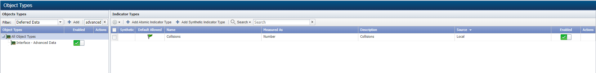
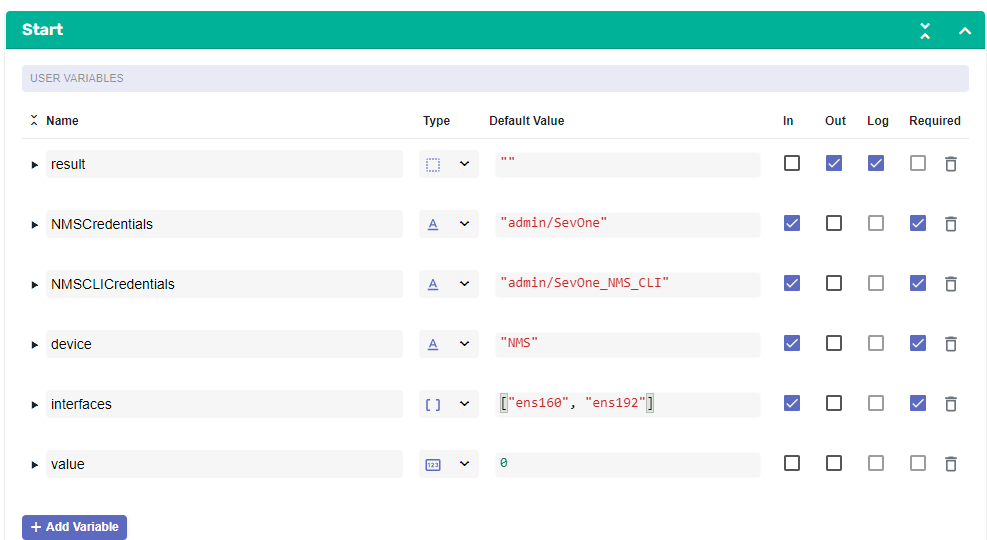
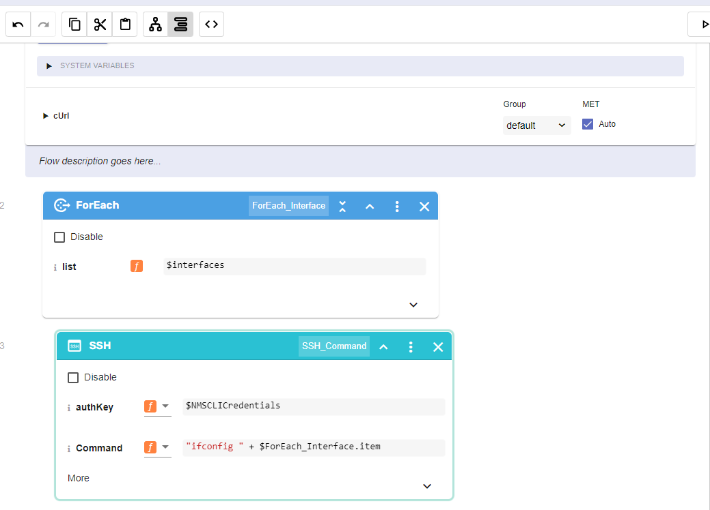
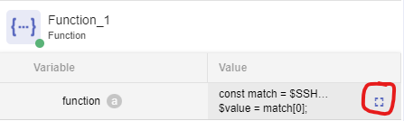
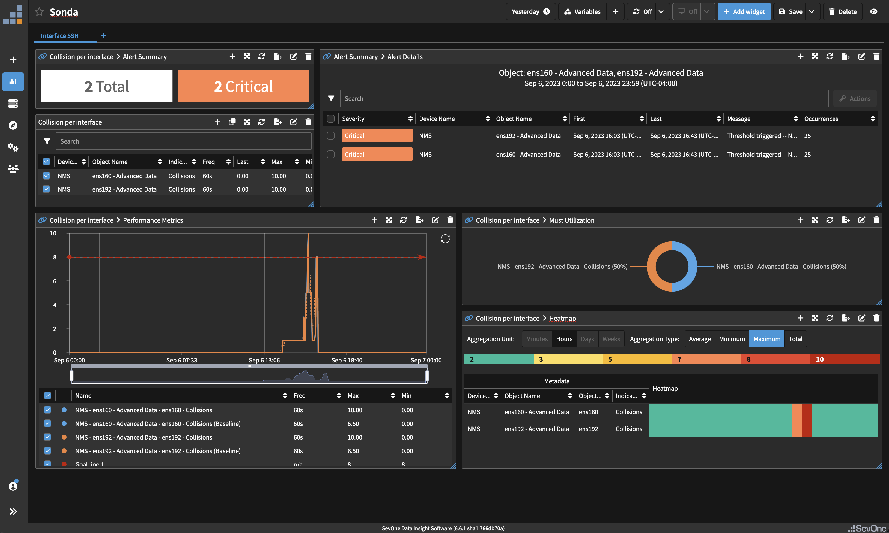

# CLI Monitoring

## Overview

In this lab we will review how we can monitor performance data that comes from CLI commands.

## Prerequisites

1. Log into SevOne

2. Go to Administration -> Monitoring Configuration -> Object Types

3. Change the Filter to Deferred Data

4. Click Add

	a. Name: Interface - Advanced Data

5. Select the new object type created ("Interface - Advanced Data") and click on "Add Atomic Indicator Type"

	a. Indicator Name: Collisions

	b. Description: Collisions

	c. Indicator Type: GAUGE

	d. Measure As: Number

	e. Display As: Number

## Monitor CLI Interface Metrics

If SevOne authentication has already been created, please skip this block of actions and continue to step 10.

6. Log into SANO automation platform

7. Go to Authentications

8. Click  Create Authentication

	a. Name: SevOne

	b. Service: SevOne

	c. **Protocol: http://** (<-- important)

	d. Host: 10.0.0.10

	e. Username: admin

	f. Password: SevOne

9. Click  Create Authentication

	a. Name: SevOne_NMS_CLI

	b. Service: SSH

	c. Host: 10.0.0.10

	d. Port: 22

	e. Username: root

	f. Password: SevOne123

10. Go to **Workflows**

11. Click Create Workflow

	a. Name: Your Name - CLI Interface Metrics

	b. Layout type: Sequence

12. Add variables to Start

	a. NMSCredentials:

		i. Name: NMSCredentials

		ii. Type: Authentication -> SevOne

		iii. Default Value: "admin/SevOne"

		iv. In

		v. Required

	b. NMSCLICredentials:

		i. Name: NMSCLICredentials

		ii. Type: Authentication -> SevOne

		iii. Default Value: "admin/SevOne"

		iv. In

		v. Required

	c. device:

		i. Name: device

		ii. Type: String

		iii. Default Value: "NMS"

		iv. In

		v. Required

	d. interfaces:

		i. interfaces

		ii. Type: Array

		iii. Default value ['ens160', 'ens192']

		iv. In

		v. Required

	e. value:

		i. value

		ii. Type: Number

13. Change to Flow View

14. On the left hand side panel, Click on Common

15. Select ForEach and drop it after the tile START

	a. Change name to ForEach_Interface

	b. Click on the tile to open the right side panel and complete the following fields

		i. list: $interfaces

16. In the loop branch, add a new tile, Common -> SSH 

	a. Change name to SSH_Command

17. Change to Sequence View

	a. Scroll down until you find the SSH_Command tile

	b. Complete the following fields:

		i. authKey: $NMSCLICredentials

		ii. command: 

			1.first change the option from 'const' to 'expression'

			2. Complete the field with: "ifconfig " + $ForEach_Interface.item

			

18. Change to Flow View

19. Add a new tile, Common -> function

	a. Click on the tile to open the right side panel and complete the following fields: click on the square icon on the right side of the variable

const match = $SSH_Command.result.match(/collisions (\d+)/g);

$value = match[0];

	b. Click save

20. Add a new tile, Common -> DateTime -> TimestampNow

	a. No need to edit anything

21. Add a new tile, SevOne -> REST v3 -> Devices -> Devices Data

	a. Change name to SevOne_Ingest_Data

	b. Click on the tile to open the right side panel and complete the following fields

		i. authKey: $NMSCredentials

		ii. body: click on the square icon on the right side of the variable

(Copy everything, including the brackets, but without the quotes)

	

	{

		"objects": [{

			"type": "Interface - Advanced Data",

			"automaticCreation": true,

			"description": $ForEach_Interface.item,

			"name": $ForEach_Interface.item + " - Advanced Data",

			"pluginName": "DEFERRED",

			"timestamps": [{

				"indicators": [{

					"name": "Collisions",

					"units": "Number",

					"value": $value,

					"format": "GAUGE"

				}],

				"timestamp": $TimestampNow_1.result

			}]

		}],

		"type": $device,

		"name": $device,

		"automaticCreation": true

	}

"

	c. Click save

22. If there is an Assign tile at the end of the workflow, use that tile for the next config, if there is not, add a tile from Common -> Assign

	a. variable: $result

	b. value: $SevOne_Ingest_Data.result

## Create Job

23. Go to JOBS

24. Click Create Job

	a. Name: Monitor CLI Interface Data   

		i. Flow: Your Name - CLI Interface Metrics

		ii. Seconds: 0

		iii. Minutes: */5

		iv. Hours: *

		v. Day of Month: ?

		vi. Use Default Parameters: ENABLED

		vii. ENABLED

Example of Data Insight report

