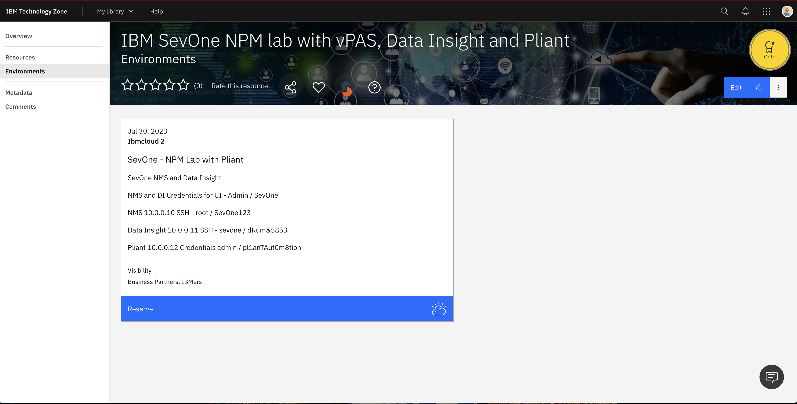
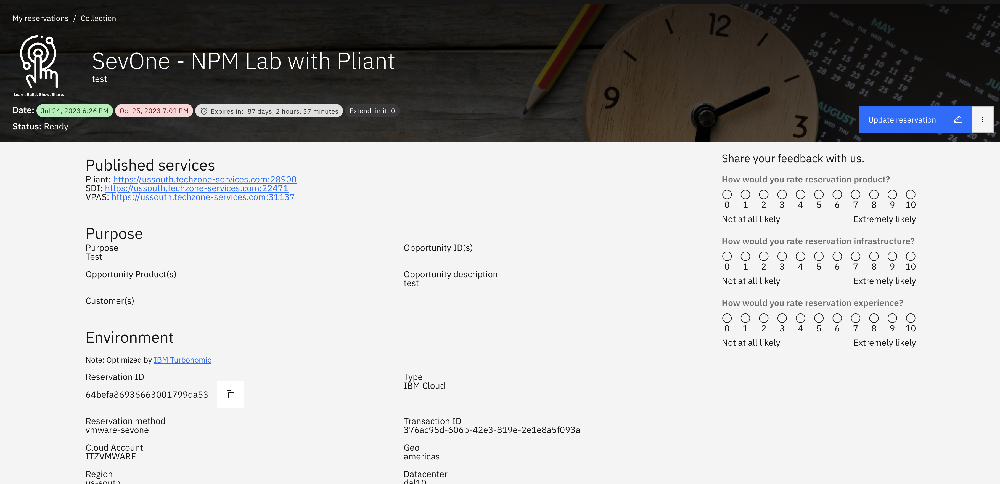
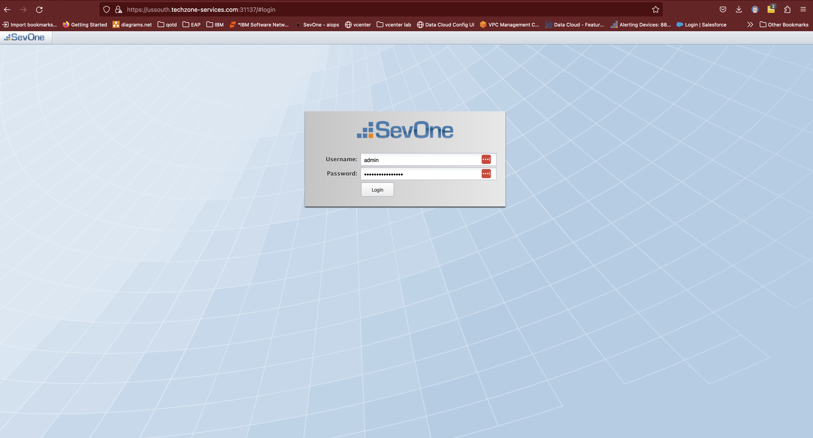
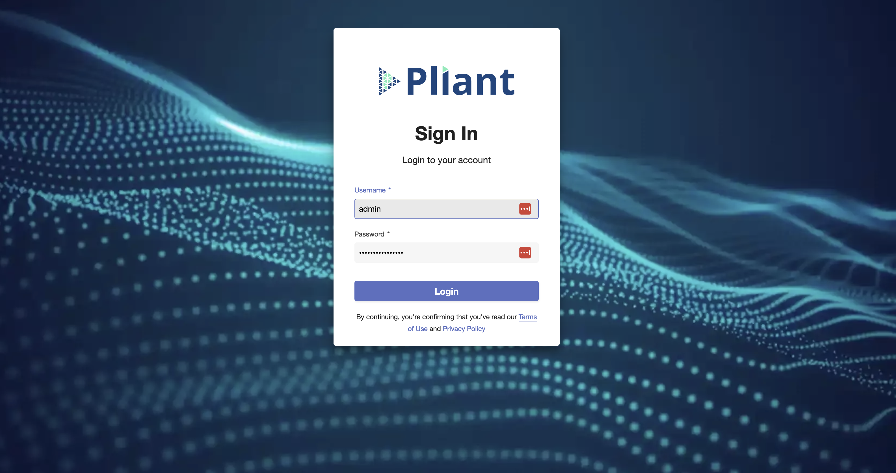

# TechZone lab environment 
Lab Environment 
To go through your lab sessions, you must first access your environment. Most of the labs will use NMS, Data Insight and Pliant UI's. Below are the instances you will use during this proof of technology session.

- **vPAS/NMS VM** - This is your network management system (NMS) You will run most of the labs in this UI. It can be accessed using the unique link provided by the provisioned techzone lab documented **Published Labs** . The link should automatically log you in the system.
- **Data Insight** -  This is your DI Front end Reporting system (DI) You will run most of the Reporting labs in this UI. It can be accessed using the unique link provided by the provisioned techzone lab documented **Published Labs** . The link should automatically log you in the system.
- **IBM Pliant** - This is your Pliant UI low code no code workflow system. You will run workflow labs in this UI. It can be accessed using the unique link provided by the provisioned techzone lab documented **Published Labs** . The link should automatically log you in the system. 

## Reserving your TechZone Lab environment

To reserve your lab by going to the following URL https://techzone.ibm.com/collection/ibm-sev-one-npm-lab-with-v-pas-data-insight-and-pliant/environments.

## Access your IBM SevOne TechZone Lab environment

The IBM SevOne instance is pre-populated with 40 devices and using your default browser and by clicking on the link provided in your reservation you will see the corosponding UI. Once your reservation is completed you will get an email and can connect to your reservation. The URL's provided in your reservation will connect you to your various provisioned systems UI's

## Access NMS UI
Use the link provided by your TechZone reservation. Once you click on it, it should open the below page in your browser. Login with default credentials admin / SevOne

### NMS Credentials
Username **Admin**

Password **SevOne**

## Access Data Insight UI
Use the link provided by your TechZone reservation. Once you click on it, it should open the below page in your browser. Login with default credentials admin / SevOne

### Data Insight Credentials
Username **Admin**

Password **SevOne**

## Access Pliant UI
Use the link provided by your TechZone reservation. Once you click on it, it should open the below page in your browser. Login with default credentials admin / pl1anTAut0m8tion

### Pliant Credentials
Username **Admin**

Password **pl1anTAut0m8tion**

