# Maps

In this lab we will learn how we can create live maps in Data Insight in order to show real time status of the network, and how we can embed these maps into DI reports.

Reports are great to display performance data, however in some situations it'd be great to display the current status of the network alongside some topological information, either in terms of connections between devices or in terms of geographical locations.

Data Insight Maps allows you to create this picture of the network where you can display different elements of the network (devices, interfaces, metrics...) and display it stand alone or as part of a DI report.

In this lab we will create two different maps:

* Logical map showing connections between devices, and integrated into a DI report

* Geographical map with custom connections

## Logical Map

1. Log in DI

2. On the left hand side pannel, click on Maps

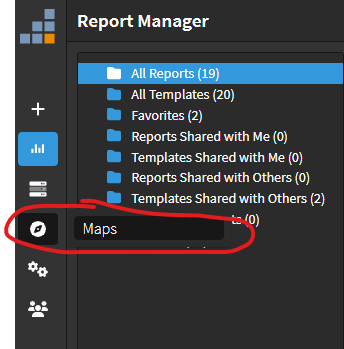

3. Click Create Map

4. On the right hand side pannel, select the following resource:

    a. Datasource

        i. NMS

    b. Resource Type

        i. Device

        ii. NYC-LB01

    c. Click Add

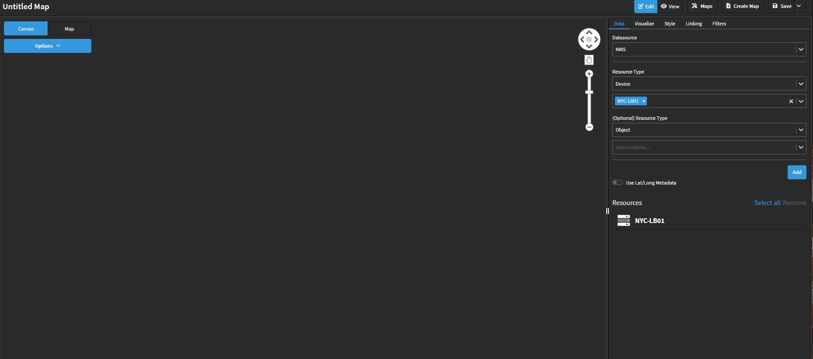

5. Drag and drop the NYC-LB01 device from the Resource list into the map

6. Right click on the NYC-LB01 device that is in the map

    a. On the 'Hops' section, replace the current '1' by '2'

    b. Click Generate Topology

7. On the top left corner there is 'Options'. Click in Options and change the LAYOUT to the one you prefer the most

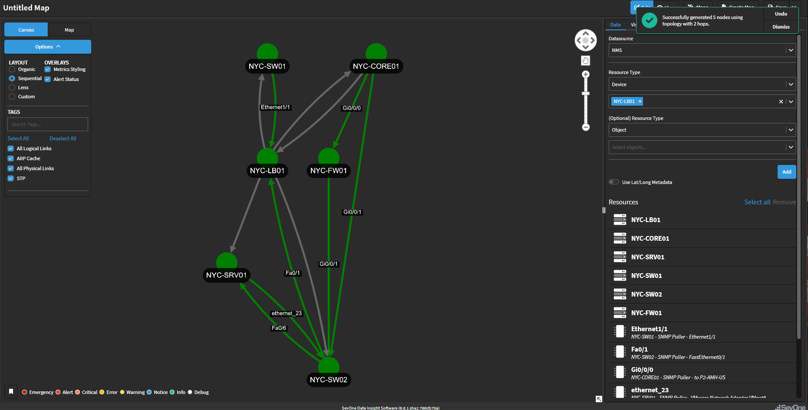

8. Change the name of the report from 'Untitled Map' to 'NYC Network'

9. Click Save (top right corner)

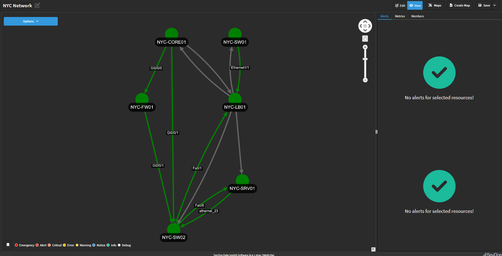

## Metric View

This is a great map, however by default we are displaying the alerts attached to the devices and interfaces displayed, and in this case we don't expect too many alerts at the device level, therefore we would like to display a different type of metric on this map.

10. Click Edit

11. Go to the 'Visualize' section

12. In Node Options, choose the following options

    a. Inner Node Labels

        i. Metric Value

    b. Size nodes by

        i. Metric Value

    c. Color nodes by

        i. Metric Value

        ii. Click on Add Color and change the following values and colours

            1. From 0

            2. To 2 -> Green

            3. To 10000 -> Red

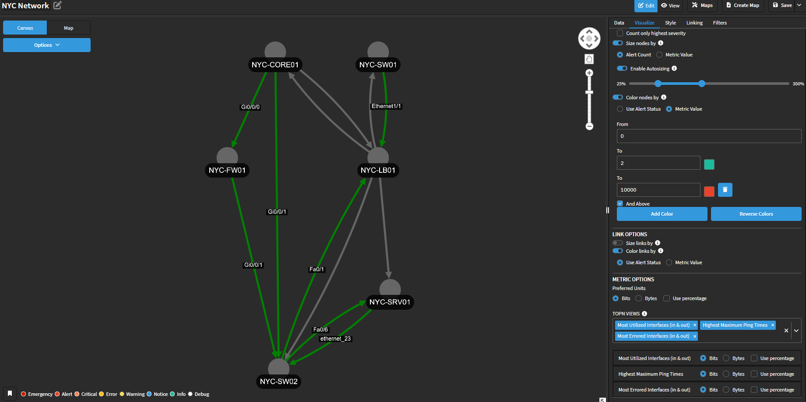

13. Click over all the devices keeping the 'Control' key pushed and click on Metrics

    a. On Resource Type -> object, select all the 'IP of Device' objects (there should be 6 objects)

    b. On Resource Type -> Indicator Type, select 'Maximum ping time'

    c. Click Add

14. Click Save (top right corner)

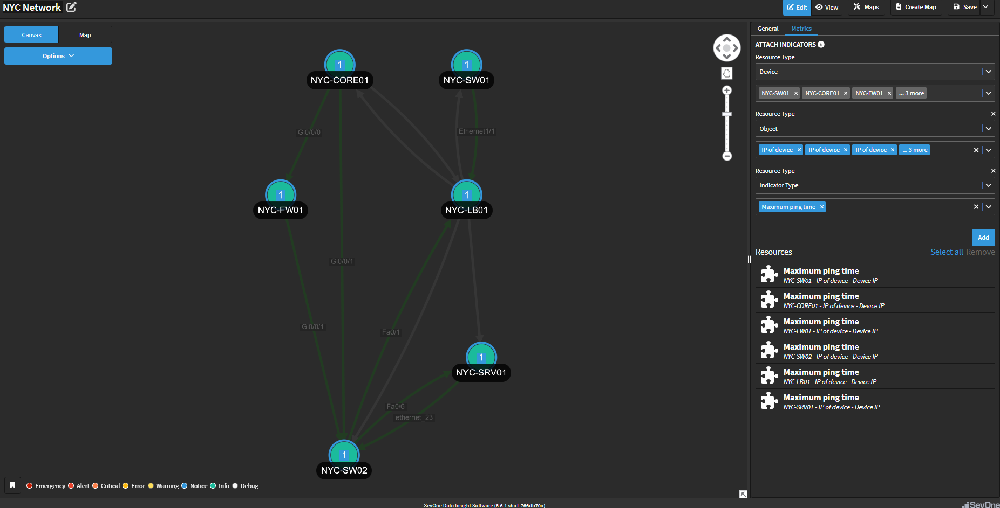

## Add Map to Report

15. Click on the + icon on the top left corner to create a new report

16. Change the name of the report from 'Untitled Report' to 'NYC'

17. On the right hand side, select the 'Maps' widget

    a. From the Select Map list, select the map created before (NYC Network)

    b. Expand the widget as shown on the screenshot below

    c. Zoom in to enhance how the devices are displayed

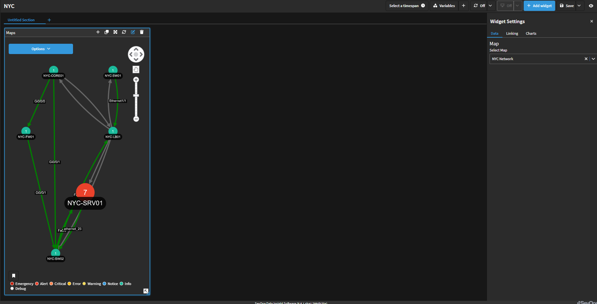

18. Click on the + icon in the Maps widget and select TopN

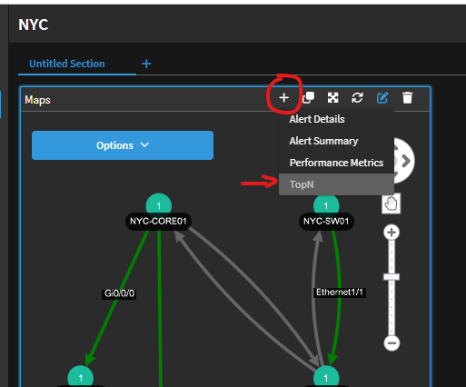

19. Move the TopN widget next to the map

20. Click on the + icon in the TopN widget and select Performance Metrics

21. Move the Performance Metrics widget next to the TopN and expand it to use all the width available in the report

22. Click Save

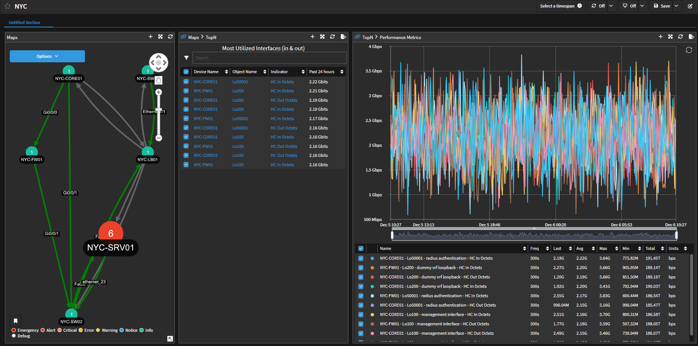

## Review

23. Click on any device on the map, this selection should be propagated to the TopN widget and to the Performance Metrics widget

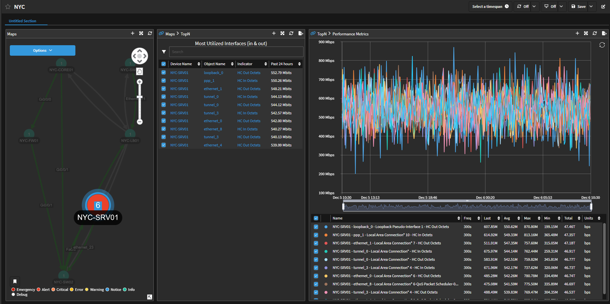

24. The same can be done if we select an interface that contains the name on the map

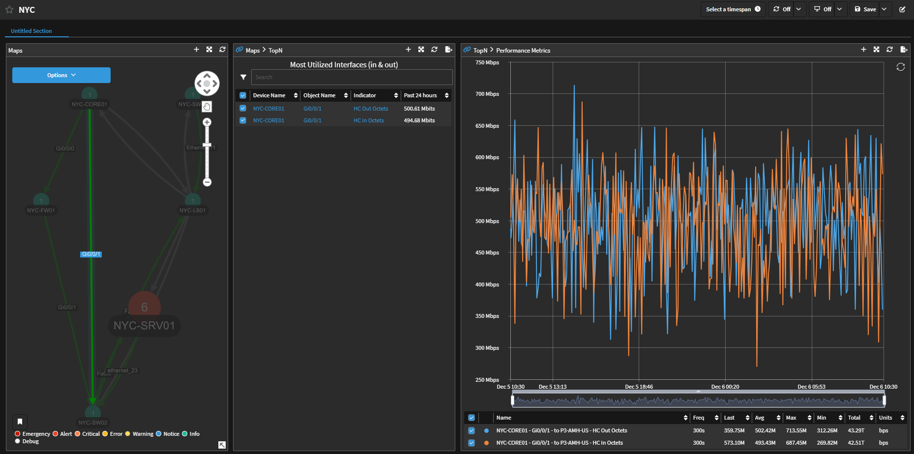

