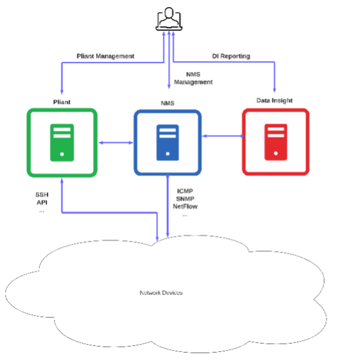

# Overview 
## Introduction
IBM SevOne Automated Network Observability is a network performance monitoring and
automation software that provides real-time visibility and insight into complex networks and automates networks using a no-code approach.

The main benefits of this platform are:
- **Monitor all the network** – from legacy networks to new technologies such as SDWAN, from onprem devices to Cloud technologies...all in a single tool.

- **Advanced Analytics and AI** – analyse data in real time to provide better insights, use anomaly detection to improve MTTR.

- **Advanced Visualization** – enhance visibility by providing flexible and dynamic reports across all environments.

- **Automated Observability** – provide automatic resolution to detected network problems, enhance visibility of new technologies, reduce repetitive tasks through no-code automation.

Purpose
The purpose of this PoT is to review and learn some of the main functionality available in the tool, such as device certification, anomaly detection or flexible reporting without the need of extensive training. At the end of this PoT, the user should be able to understand, explain and demonstrate the main features available in SevOne.
This PoT does not intend to be a full training session on SevOne capabilities, therefore there is some important functionality such as NetFlow, Deferred Data, Device Types and others that are not covered during this PoT.

## Architecture
Below is a high-level view of your TechZone Lab Architecture.

•	**NMS:** main SevOne server, collects data, stores data in the database, generates alerts,… It’s where the main management tasks are done, such as adding devices, configuring alerts, configuring groups.

•	**Data Insight:** it’s the reporting engine where all the dashboards, maps,… are built. This is the main server that regular users of SevOne would use.

•	**Pliant:** automation server where the automation workflows are configured that allows us to build workflows to enhance data collection, self-heal the network, and automate repetitive tasks using a no-code approach

