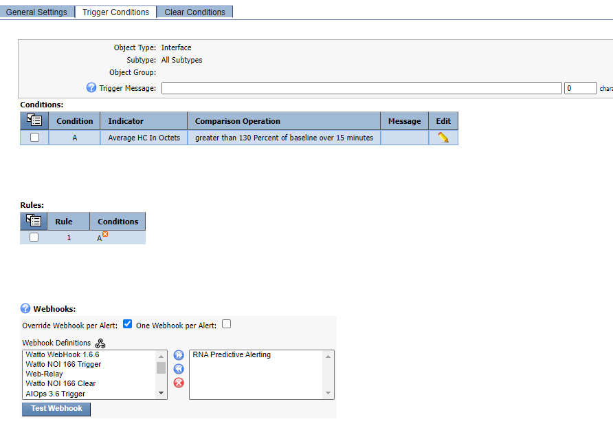

# Predictive Alerting

## Overview

In this lab we will review how we can create proactive alerts based on anomaly detection and predictive behaviour.

One of the ways to become predictive is to monitor what will happen in the future if a metric keeps behaving in a specific way. Lots of tools can do capacity forecast, however this is something that they do once a day and considering long periods of historical data, but what happens when the metric starts behaving abnormally only for the last 30 minutes? 

SevOne can generate notifications when an anomaly is detected on a metric, however that doesn't mean for sure that there is a potential future issue. But what we can do is, once we have detected an anomaly, trigger an action to check how the future utilization of that metric will be (say in the next 24 hours) to **predict** if that's a potential future issue or not.

This is what we are doing in this lab:
* First, we are generating an alert when we detect an anomaly on one of the metrics
* Second, we check how the future behaviour of this metric
* Third, if the future behaviour of the metric goes over 100% utilization, then we trigger a new alert (Emergency alert) notifying that this is a real issue

Therefore, what we are doing here is predictively detecting potential future issues based on short term historical data abnormalities.

## Predict Short Term Future Behaviour

If SevOne authentication has already been created, please skip this block of actions and continue to step 4.

1. Log into SANO automation platform

2. Go to Authentications

3. Click  Create Authentication

	a. Name: SevOne

	b. Service: SevOne

	c. **Protocol: http://** (<-- important)

	d. Host: 10.0.0.10

	e. Username: admin

	f. Password: SevOne

4. Go to **Workflows**

5. Click Create Workflow

	a. Name: Your Name - Predictive Alerting

	b. Layout type: Sequence

6. Add variables to Start

	a. NMSCredentials

		i. Name: NMSCredentials

		ii. Type: Authentication -> SevOne

		iii. Default Value: "admin/SevOne"

		iv. In

		v. Required

	b. deviceid

		i. Name: deviceid

		ii. Type: Number

		iii. Default Value: 1

		iv. In

		v. Required

	c. objectid

		i. Name: objectid

		ii. Type: Number

		iii. Default Value: 1

		iv. In

		v. Required

	d. indicatorname

		i. Name: indicatorname

		ii. Type: String

		iii. Default Value: availability

		iv. In

		v. Required

	e. seconds

		i. Name: seconds

		ii. Type: Number

		iii. Default Value: 21600

		iv. In

	f. fvalue

		i. Name: fvalue

		ii. Type: Number

		iii. Default Value: 0

	g. backtime

		i. Name: backtime

		ii. Type: String

		iii. Default Value: "Past 60 minutes"

		iv. In

	h. severity

		i. Name: severity

		ii. Type: Number

		iii. Default Value: 0

		iv. In

7. Change to Flow View

8. On the left hand side panel, search for SevOne, Click on SevOne -> REST v3 -> Data

9. Select "Data Performance Metrics" and drop it after the tile START

	a. Change name to SevOne_Forecast

	b. Click on the tile to open the right side panel and complete the following fields

		i. authKey: $NMSCredentials

		ii. body:

			1. indicatorFilters -> Append Child

				a. IndicatorTypeNames -> Append Child

					i. value: $indicatorname

				b. objectIds: [ $objectid ]

			2. preferPercent: TRUE

			3. timeRange -> timeString: $backtime

			4. trendingOptions:

				a. projectedTime: $seconds

				b. timeRange:

					i. label: $backtime

					ii. timeString: $backtime

				c. trendType: PROJECTED

			

If you click on the 'square' icon next to body, you should see something like the above.

10. Add a new tile, Common -> Assign

	a. Change name to Future_Value

	b. Click on the tile to open the right side panel and complete the following fields

		i. variable: $fvalue

		ii. value: $SevOne_Forecast.result.indicatorResults[0].polledData.trendValueA + ($seconds * $SevOne_Forecast.result.indicatorResults[0].polledData.trendValueB)

11. Add a new tile, Common -> DateTime -> TimestampNowms

	a. No need to edit anything

12. Add a new tile, Common -> If

	a. Change name to If_future_value_more_than_100

	b. Click on the tile to open the right side panel and complete the following fields

		i. condition: $fvalue >= 100

13. On the TRUE branch of the IF, add a new tile, SevOne -> REST API v2 -> Alerts -> createAlert

	a. Change name to SevOne_Create_Alert

	a. Click on the tile to open the right side panel and complete the following fields

		i. authKey: $NMSCredentials

		ii. alert:

			1. deviceId: $deviceid

			2. endTime: $TimestampNowms_1.result

			3. indicatorName: "$indicatorname"

			4. message: "There is an anomaly on this device on indicator " + $indicatorname + " that might reach 100% in the next 24 hours"

			5. objectId: $objectid

			6. origin: system

			7. severity: $severity

			8. startTime: $TimestampNowms_1.result

14. If there is an Assign tile at the end of the workflow, use that tile for the next config, if there is not, add a tile from Common -> Assign

	a. variable: $result

	b. value: $fvalue

## Create API Call

15. Go to APIS

16. Click on ‘Create API’

	a. Name: predictive

	b. Authentications

		i. Authentication: API Keys

			1. Click ‘Add API Key’

			2. Name: hfpkey

		ii. Copy the api key for later use

	c. Click ‘Create’

17. In workflow deployments, click ‘Create’

	1. Workflow -> Choose the workflow you created clicking on the folder icon on the top right side of that field

	2. Stage - > Click on + icon -> leave everything as it is, click ‘Save’

	3. Endpoint -> Click on + icon 

		a. Change Path to /Predictive

		b. Method: POST

		c. Click ‘Save’

18. Click Deploy

## Review

19. Click on Swagger UI

	a. Click on Authorize

	b. Paste the copied toekn (step 15.b.ii)

	c. Click Authorize

	d. Click Close

20. Click Try it out

	a. Edit the body:

		i. NMSCredentials: "admin/SevOne"

		ii. deviceid: 1

		iii. objectid: 1

		iv. indicatorname: "availability"

		v. seconds: 21600

		vi. backtime: "Past 60 minutes"

		vii. severity: 0 

	b. Click Execute

21. Copy the Request URL

22. Go to SevOne NMS

23. Go to Events -> Configuration -> Webhook Definition Manager

24. Click on Add Webhook Definition

	a. Webhook Definition Name: IRNA Predictive

	b. Destination URL: paste the Request URL copied on step 21

	c. Request Method: POST

	d. Body:
	
(Copy everything, including the brakets, but without the quotes)

"

{

	"NMSCredentials": "admin/SevOne",

	"deviceid": $deviceId,

	"objectid": $objectId,

	"indicatorname": "ifHCInOctets",

	"seconds": 21600,

	"backtime": "Past 60 minutes",

	"severity": 0 

}

"

25. Click Save

26. Go to Events -> Configuration -> Policy Browser

27. Click Create Policy

	a. Name: Unusual high traffic

	b. Device group: All device groups

	c. Object Type: Interface

	d. Severity: Notice

28. Click on Trigger Conditions

	a. Click on the menu item under Conditions -> Create New

		i. Indicator: HC In Octets

		ii. Type: Baseline Percentage

		iii. Comparison: greater than

		iv. Threshold: 130 percent of baseline

		v. Duration: 15 minutes

		vi. Aggregation: Average

	b. Override Webhook per Alert: Enabled

	c. One Webhook per Alert: disabled

	d. Select the IRNA Predictive webhook and move it to the right side

29. Click 'Save as New'

