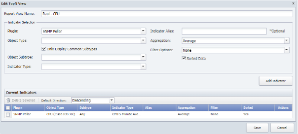
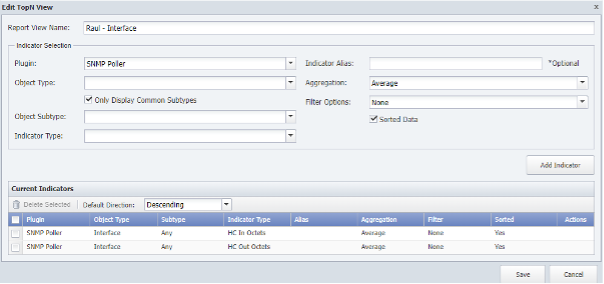
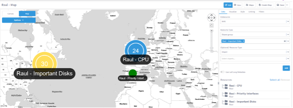
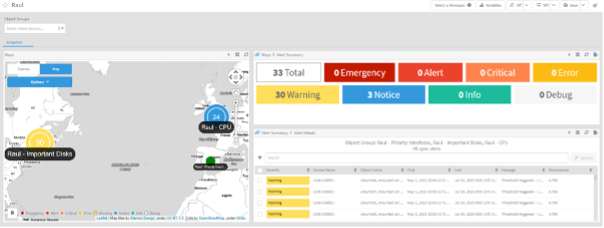
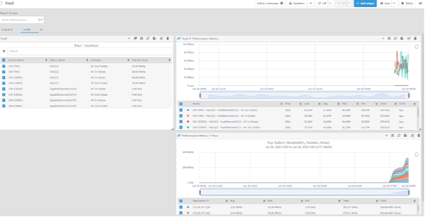
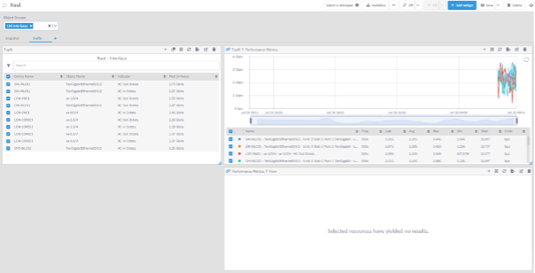

# Reporting

In this lab we will learn how we can create reports in Data Insight in order to show the data we are collecting from the network in a flexible and dynamic way. However, even though the reports we will create are in Data Insight, a lot of the configuration of these reports will come from configurations in the NMS.

## TopN Views

1. Log in the NMS
2. Go to Reports -> TopN Reports
3. Click ‘Add View’
    - a. Name: YOURNAME – CPU
    - b. Plugin: SNMP
     -c. Object Type: CPU (Cisco IOS XR) 
    - d. Disable Only Display Common Subtypes
    - e. Object subtype: any
    - f. Indicator Type: CPU 5 Minute Average
    - g. Click Add Indicator

4. Save

5. Click Add View
    - a. Name: YOURNAME – Interface
    - b. Plugin: SNMP
    - c. Object Type: Interface
    - d. Disable ‘Only Display Common Subtypes’
    - e. Object subtype: any
    - f. Indicator Type: HC In Octets
    - g. Click ‘Add Indicator’
    - h. Indicator Type: HC Out Octets
    - i. Click ‘Add Indicator’
6. Save

DI Report
1. Log into DI
2. Go to Explore Maps
3. Click ‘Create Map’
    - a. Change name to Your Name - Map
    - b. Change from Canvas to Map
    - c. Add Object Group YOURNAME - CPU Group and move it to the city you reside on the map
    - d. Add Object Group YOURNAME – Priority Interface Group and move it to another county on the map
    - e. Add Object Group YOURNAME – Important Disks Group and move it to   another county on the map
4. Save

5. Click ‘ + Create’ on the top left corner
    - a. Report Name: Your Nameb. Section Name: Snapshot
6. Add Variable -> Object Group
    - a. Select All and click ‘Add’
7. Add Widget -> Maps
    - a. Choose the map you have created
8. Chain the Map widget to Alert Summary (Click on the + icon on the Widget)
9. Chain the Alert Summary Widget to Alert Details widget (Click on the + icon on the Widget)

10. Add a new section named Traffic
11. Add Widget -> TopN
    - a. Resource Type: object group -> YOURNAME – Priority Interface
    - b. TopN view: Your Name - interface
    - c. Click ‘Run’
12. Chain the TopN widget to a Performance Metrics widget
13. Chain the Performance Metrics Widget to a Flow Widget

**Review**

If we have configured all the steps until now correctly, all the widgets should have data (see screenshots). We can also test the variables by changing the scope of the report to a different subset of objects. For example, on the Traffic section change the Object groups filter to 10G Interfaces. New interfaces will appear, but netflow data won’t show anything, because from that list of interfaces, none of them is sending netflow data to Sev

Congratulations! 

