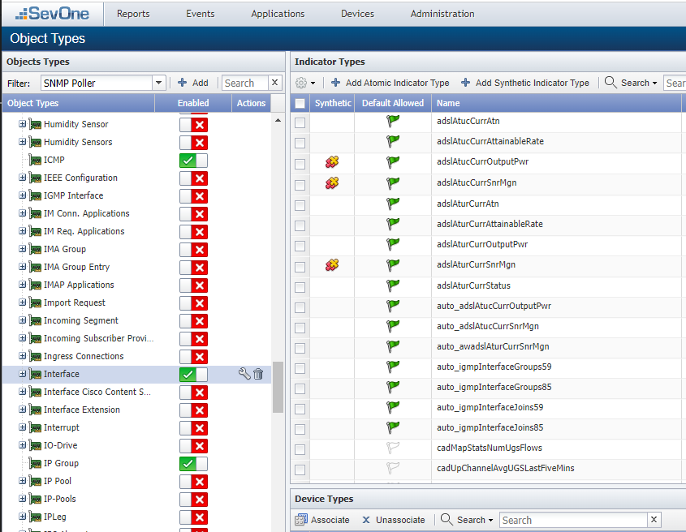
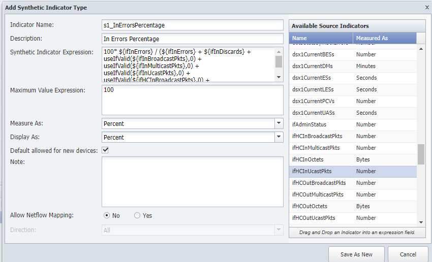
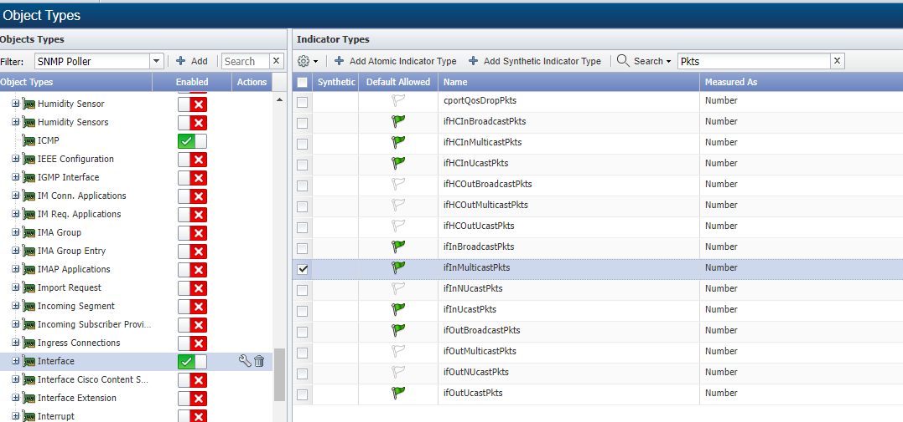
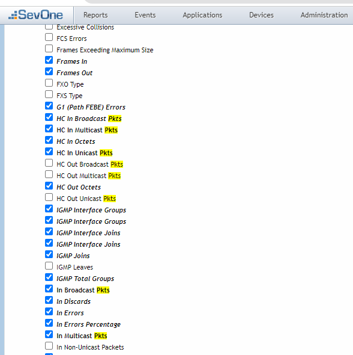
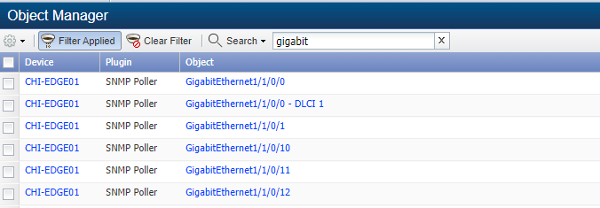
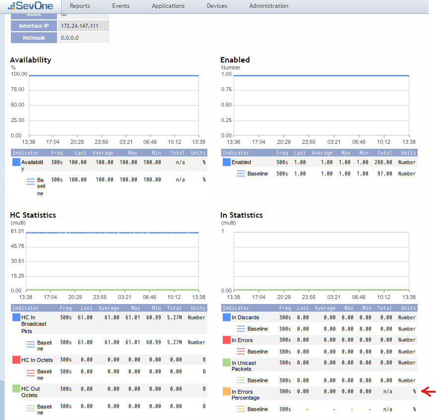

# Synthetic indicators

In this lab we will learn how we can create synthetic indicators in order to combine metrics from a single object into a new KPI.

The example that we will cover in this lab shows how the Interface object type collects number of packet errors on the interface, however it does not show the percentage of packet errors compared with the total number of packets received on that interface, even though we are collecting that data. Therefore we will create a new synthetic indicator that calculates the percentage of errors received, compared with the total number of packets received.

## Create Synthetic Indicator

1. Log into the NMS

2. Go to Administration -> Monitoring Configuration -> Object Types

3. Click on Interface

4. Click on Add Synthetic Indicator Type

    a. Indicator Name: s1_InErrorsPercentage

    b. Description: In Errors Percentage

    c. Synthetic Indicator Expression:  100* ${ifInErrors}/ (${ifInErrors} + ${ifInDiscards} + useIfValid(${ifInBroadcastPkts},0) + useIfValid(${ifInMulticastPkts},0) + useIfValid(${ifInUcastPkts},0) + useIfValid(${ifHCInBroadcastPkts},0) + useIfValid(${ifHCInMulticastPkts},0) + useIfValid(${ifHCInUcastPkts},0) )

    d. Maximum Value Expression: 100

    e. Measure As: Percent

    f. Display As: Percent

    g. Click Save As New

5. Search for Pkts on the search box and enable 'Default Allowed' on:

    a. ifHCInMulticastPkts

    b. ifHCInUcastPkts

    c. IfInBroadcastPkts

    d. IfInMulticastPkts

6. Go to Devices -> Device Manager, find CHI-EDGE01 and click on the wrench icon to edit the device

7. Click on 'Edit Indicator Types to Monitor' at the bottom of the page

8. Enable the following indicators:

    a. Hc In Multicast Pkts

    b. HC In Unicast Pkts

    c. In Broadcast Pkts

    d. In Multicast Pkts

9. Click Save Changes

10. Go back to Devices -> Device Manager, select CHI-EDGE01, click on the 'gear' icon -> Discovery Discover

Wait 5 - 10 minutes before reviewing

## Review

11. Go to Devices -> Device Manager, find CHI-EDGE01 and click on the wrench icon to edit the device

12. Click on Object Manager

13. Search for Gigabit and click on GigabitEthernet1/1/0/0

14. Scroll down a little bit to find the section 'In Statistics' where you will find the indicator In Errors Percentage with data

