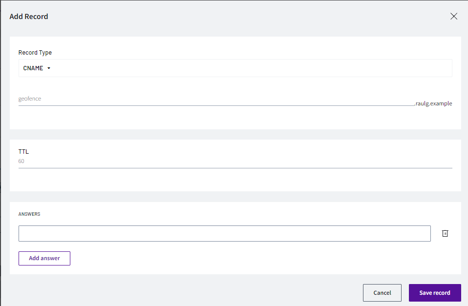
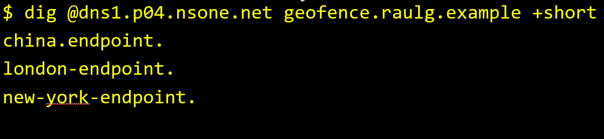
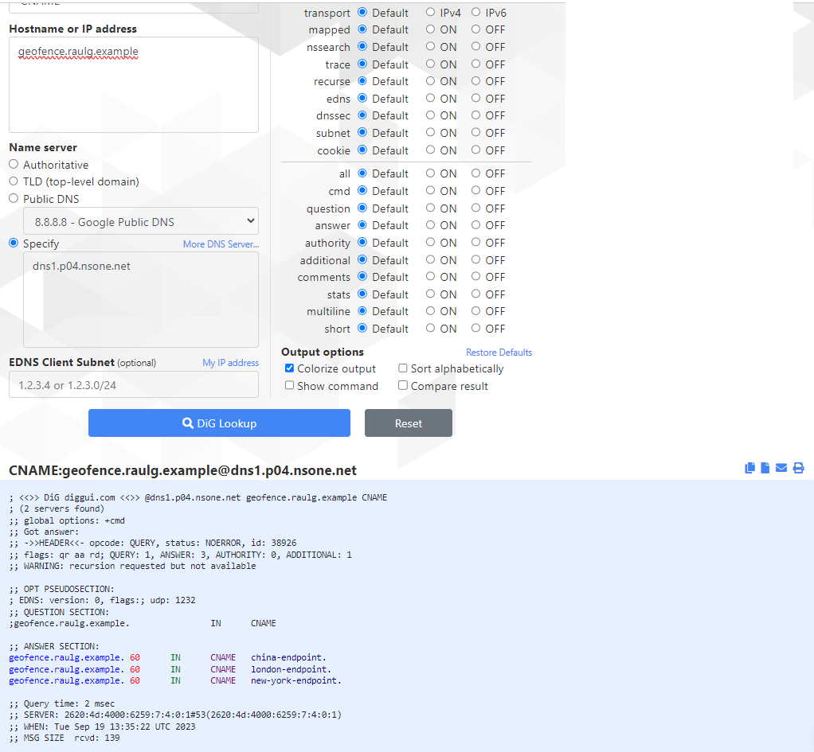
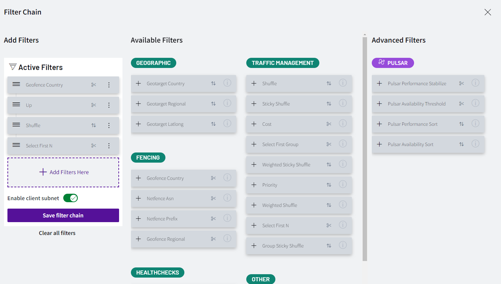
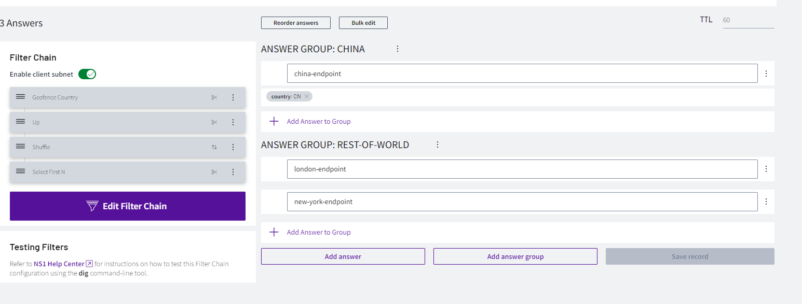
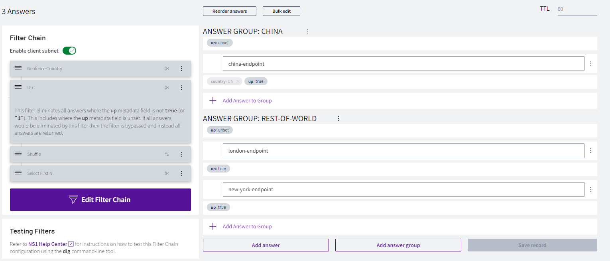
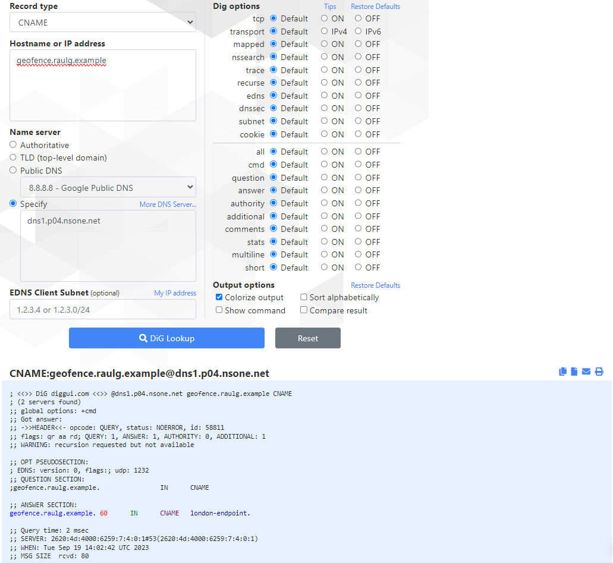
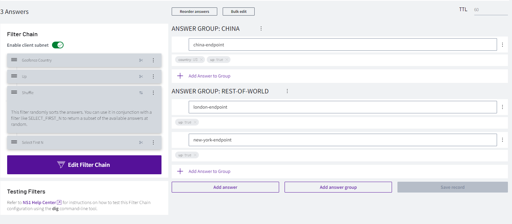
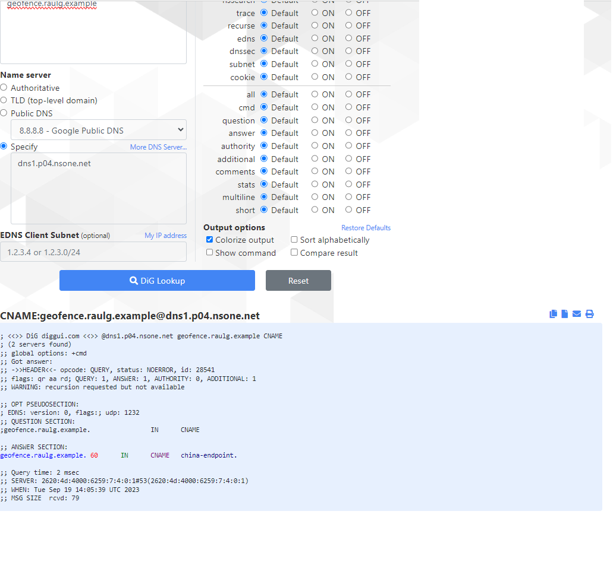

# Geographic Steering

## Overview

In this lab we will test NS1 ability to peformance geographic steering.

In order to provide better performance and resiliency, it is recommended to provide the closest answer possible based on the location of the user doing the DNS query. If someone is in the US, it would be better to reply to their query with an endpoint in the US, rather than in Asia (for example), and vice versa.

NS1 can provide different answers base on the geolocation of the querier. In this lab we will configure a DNS record that provides different answers for in China and outside China, improving the performance of the end users avoiding the great firewall of China (one of the most important bottlenecks in terms of performance).

## Geographic Steering

**NOTE: If there is any configuration from another lab, please delete all those configurations as some of them may impact this lab. This includes DNS records, filter chains, monitors, etc...**

1. Log into https://my.nsone.net/ with your username and password

2. Navigate to the DNS tab

3. Click the + icon on the top right side

	a. Domain name: yourname.example (raulg.example)

	b. leave all the other settings as is

	c. Click 'Save Zone'

4. Click the '1 Record' box next to the zone just created

5. Click 'Add record'

	a. Record Type: CNAME

	b. name: geofence

	c. TTL: 60 

6. Click 'Save Record'

7. Click on '0 answers'

	a. Click 'Add answer group'
		
		i. Name: China
		
		ii. Save Answer group

	b. Click '+ Add answer to Group'
		
		i. china-endpoint

	c. Click 'Add answer group'
		
		i. Name: Rest-of-world
		
		ii. Save Answer group

	d. Click '+ Add answer to Group'
		
		i. london-endpoint

	e. Click '+ Add answer to Group'

		i. new-york-endpoint

	f. Click 'Save record'
	

NOTE: for mac users, please use the commands provided. For windows users, either download DIG NSLOOKUP or use the online service https://www.diggui.com/

8. Test the results with command:

	a. dig @dns1.p04.nsone.net geofence.YOURNAME.example

		i. dig @dns1.p04.nsone.net geofence.raulg.example

**For MAC users**

**For Windows users**

9. Click 'Create Filter Chain'

	a. Click the '+' icon next to the 'Geofence Country' filter

	a. Click the '+' icon next to the 'Up' filter

	b. Click the '+' icon next to the 'Shuffle' filter

	c. Click the '+' icon next to the 'Select First N' filter

	d. Click 'Save Filter Chain'

9. Let's add metadata values to the answers, click in the middle of the 'Geofence Country' filter to highlight the up metadata on the answers

	a. Click the 'Country' metadata under the 'china-endpoint' answer

	b. Select Asia -> Eastern Asia -> China
	
	c. Click 'OK'

10. Click 'Save record'

11. Click in the middle of 'Up' filter and change all metadata values of 'china-endpoint', 'london-endpoint' and 'new-york-endpoint' to up

	a. Click on 'up: unset'

	b. Click 'Choose up'

	c. Select 'UP'

	d. Click 'OK'

	e. Repeat the same operation for the three answers.

12. Click 'Save record'

13. If test again the results of the query, if we are outside China we should receive only one result, either 'london-endpoint' or 'new-york-endpoint' with a 50% chance. If we are in China, we would always receive the same result (china-endpoint)

14. Test the results with command:

	a. dig @dns1.p04.nsone.net geofence.YOURNAME.example

		i. dig @dns1.p04.nsone.net geofence.raulg.example

15. If we are not testing from China, we can change the country on 'china-endpoint' to the country were you are (or to US if you are testing from https://www.diggui.com/) and test again.

**Changed country to US**

**Result test from US**
