# DNS Failover

## Overview

In this lab we should NS1 capabilities of adding resiliency to a DNS record.

NS1 can answer different options depending on the status of the endpoints. For example, if we know that a DNS answer is down, we can automatically change the answers to the queries to another endpoint that we know is up.

There are different ways we can detect an answer is up or down, it can be done manually, or it can be done automatically. One of the options to automatically change the status of an answer is using **monitors**. These monitors allows us to regularly check the status of an endpoint, and change the status of our answers based on the status of the monitor.

In this lab we are creating a new DNS record with two answers, by default we will always return always the first answer, unless the endpoint assigned to that answer is down. In that case we will return the second answer. This way we are adding high availability to the DNS record.

## DNS Failover

**NOTE: If there is any configuration from another lab, please delete all those configurations as some of them may impact this lab. This includes DNS records, filter chains, monitors, etc...**

1. Log into https://my.nsone.net/ with your username and password

2. Navigate to the DNS tab

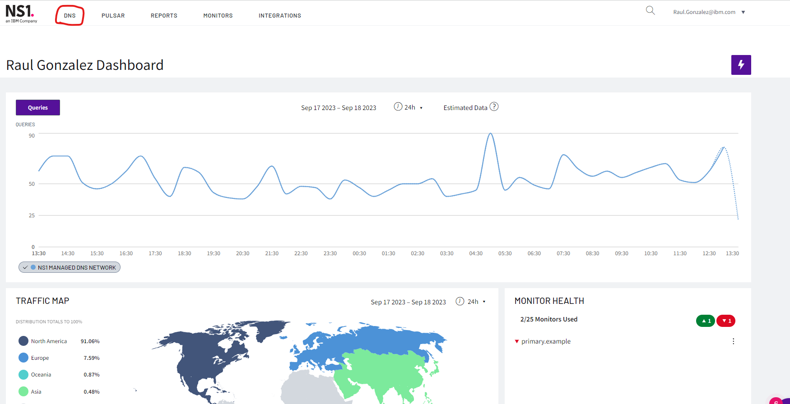

3. Click the + icon on the top right side

	a. Domain name: yourname.example (raulg.example)

	b. leave all the other settings as is

	c. Click 'Save Zone'

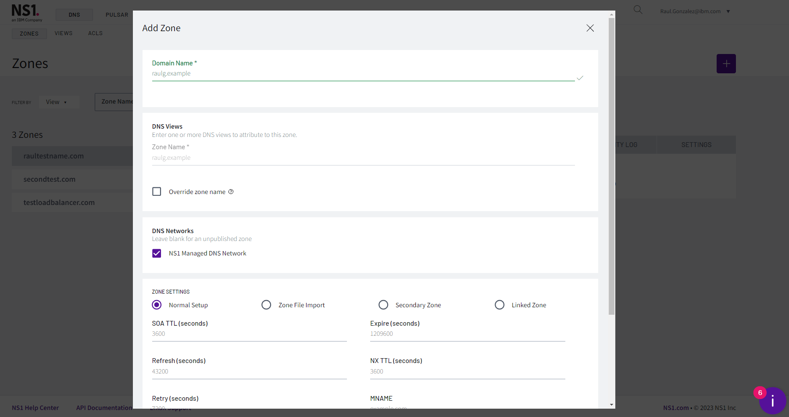

4. Click the '1 Record' box next to the zone just created

5. Click 'Add record'

	a. Record Type: CNAME

	b. name: failover

	c. TTL: 60 

	d. answers:

		i. primary.example

	e. Click 'Add answer':

		i. backup.example

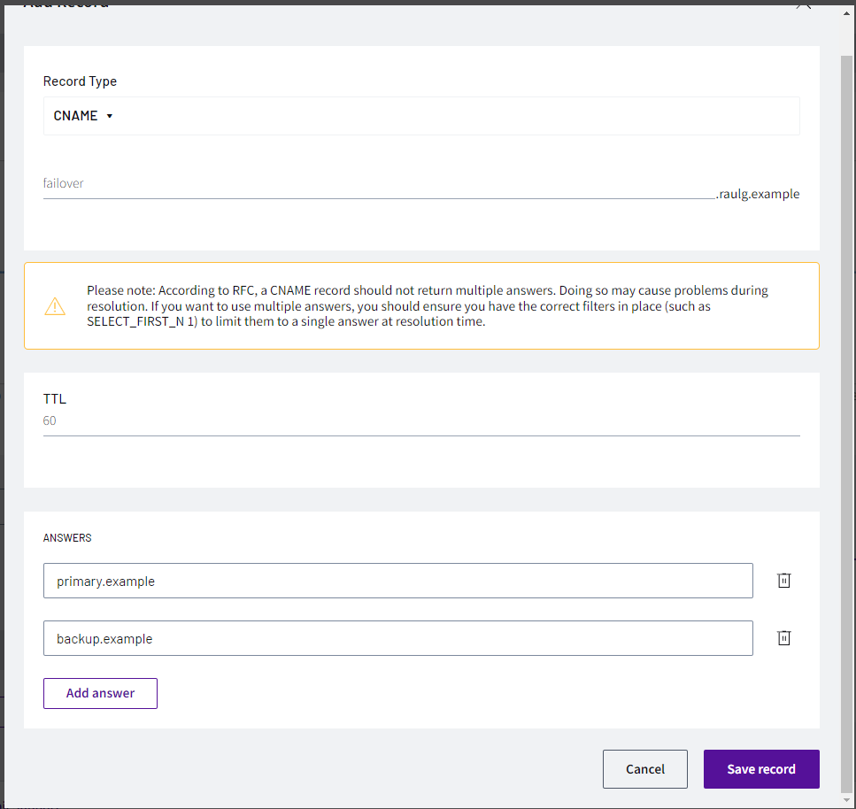

NOTE: for mac users, please use the commands provided. For windows users, either download DIG NSLOOKUP or use the online service https://www.diggui.com/

6. Test the results with command:

	a. dig @dns1.p04.nsone.net failover.YOURNAME.example

		i. dig @dns1.p04.nsone.net failover.raulg.example

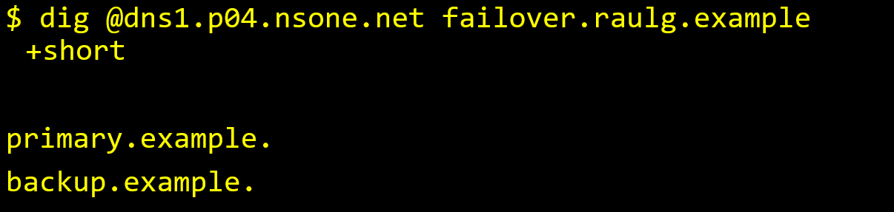
**For MAC users**

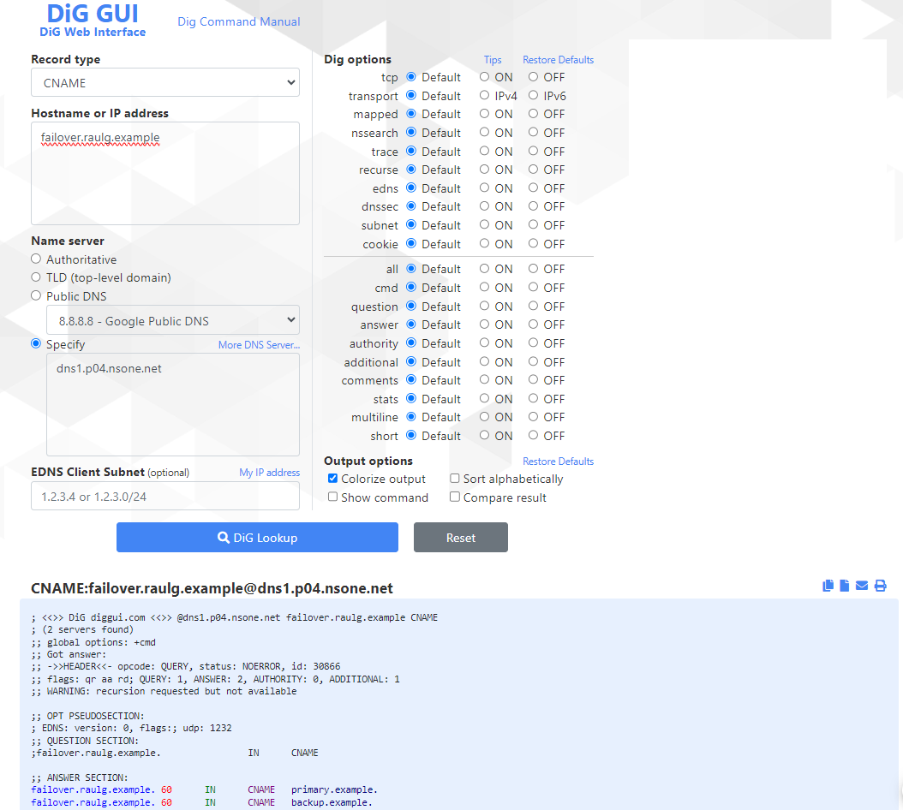
**For Windows users**

7. In order to only return 'backup.example' when the primary is down, let's create a filter chain

8. Click 'Create Filter Chain'

	a. Click the '+' icon next to the 'Up' filter

	b. Click the '+' icon next to the 'Priority' filter

	c. Click the '+' icon next to the 'Select First N' filter

	d. Click 'Save Filter Chain'

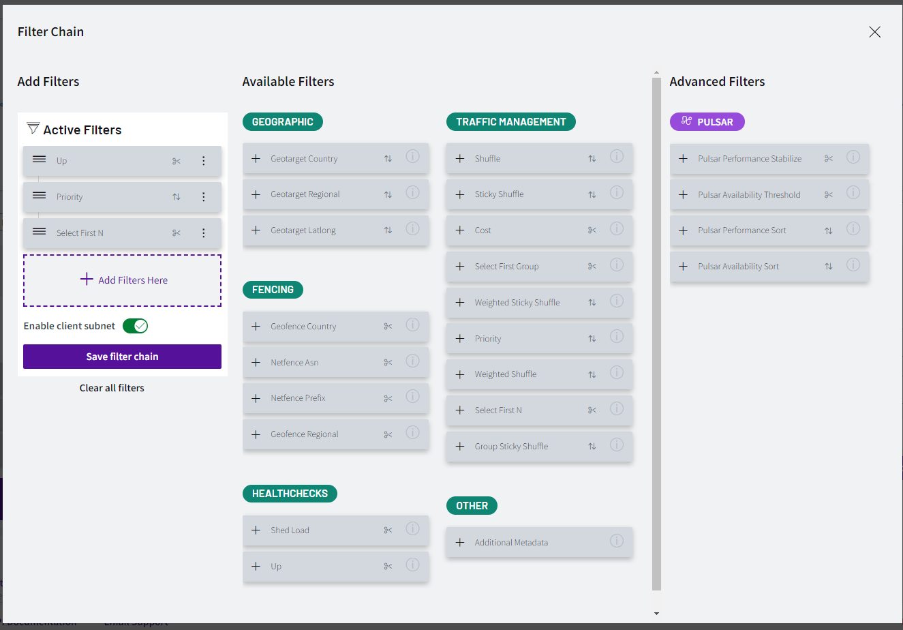

9. Let's add metadata values to the answers, click in the middle of the 'Up' filter to highlight the up metadata on the answers

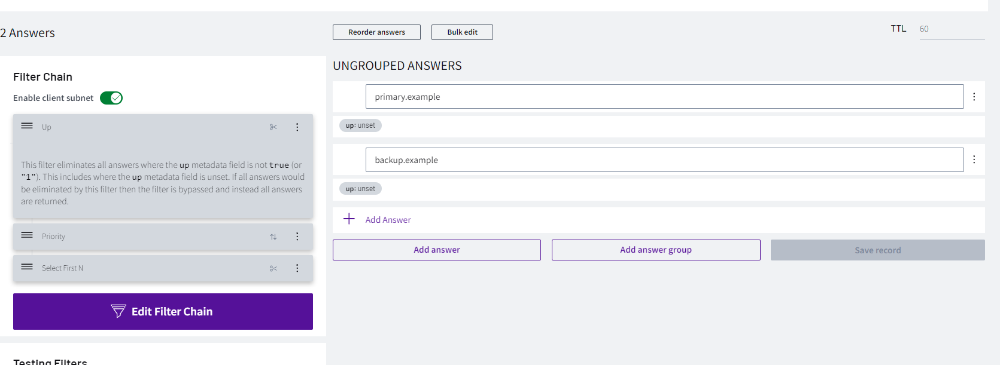

	a. Click on 'up: unset' on the first answer

	b. Click on 'Choose up' 

	c. Select up

	d. Click 'OK'

11. Do the same on the second answer

	a. Click 'up: unset'

	b. Click 'Choose up'

	c. Select up

	d. Click 'OK'

12. Click 'Save record'

13. Now, let's work on Priority. Click in the middle of the 'Priority' filter

	a. For the primary answer, select 1

		i. Click 'priority: unset'

		ii. Add priority -> 1

		iii. Click 'OK'	

	b. For the backup answer, select 2

		i. Click 'priority: unset'

		ii. Add priority -> 2

		iii. Click 'OK'	

	c. Save record

14. Let's do another test to check if the changes have been applied properly, as now only one answer should come back from the query

	a. dig @dns1.p04.nsone.net failover.YOURNAME.example

		i. dig @dns1.p04.nsone.net failover.raulg.example

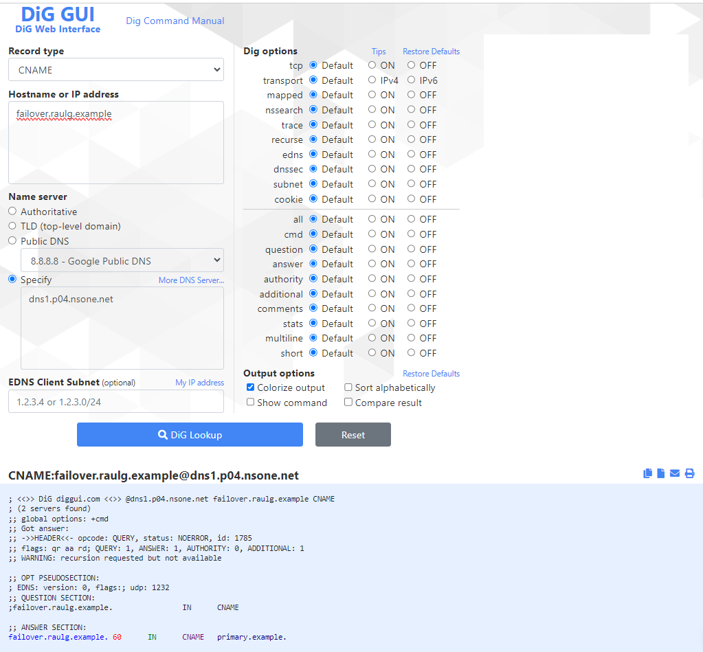

15. Let's create a monitor to check the status of the primary answer

	a. Click on 'Monitors' tab on the top of the page

	b. Click the + icon on the right side

		i. Click PING and change to HTTP

		ii. Name: primary.example

		iii. Regions: London

		iv. Frequency: 60 seconds

		v. URL: https://www.ns1.com 

	c. Save Probe

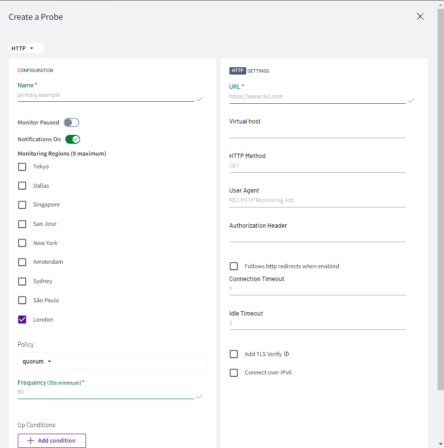

16. Navigate back to DNS tab

	a. Click on '2 records' on the zone you created

	b. Click on '2 answers' on the failover CNAME record

	c. Click on the 'up: true' metadata value from the 'primary.example' answer	

		i. Click on the 'FEED' column icon

		ii. Select the 'primary.example' option

		iii. Click OK

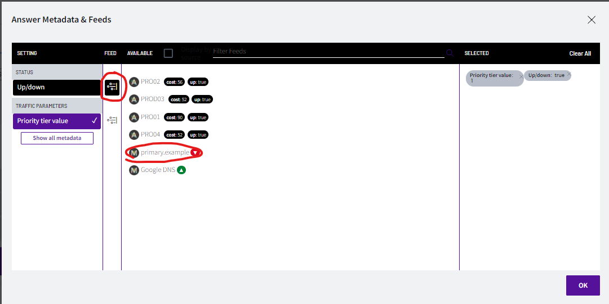

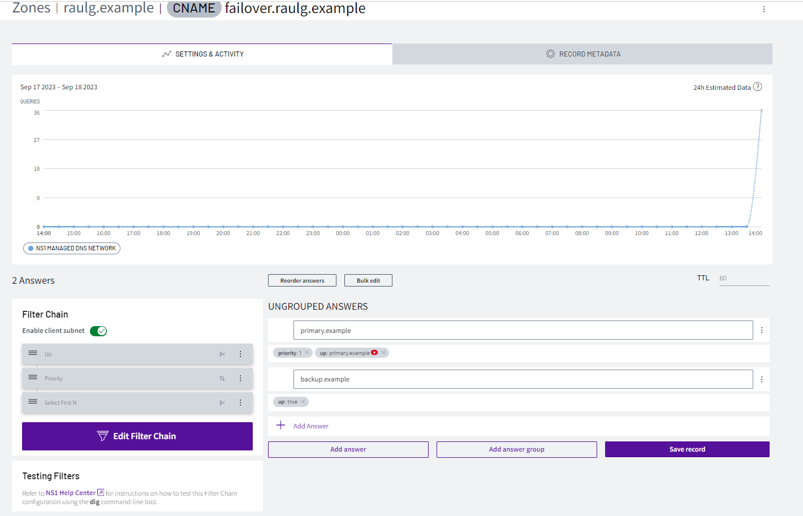

17. As the test should be up, if we query again in DIG, the answer should be the same as before

18. Let's change the monitor to force it to be down

	a. Go to Monitors tab

	b. Edit the 'primary.example' monitor

	c. Click on ' + Add condition'

		i. HTTP Response body

		ii. Contains

		iii. OK

	d. Click 'Add'

	e. Click 'Save changes'

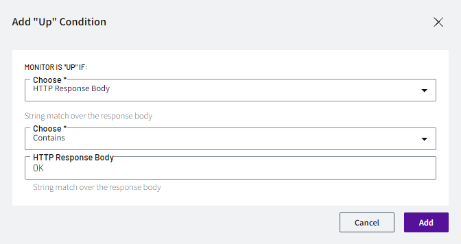

19. Let's test the query again in DIG, and the answer we receive should be different than before

	a. dig @dns1.p04.nsone.net failover.YOURNAME.example

		i. dig @dns1.p04.nsone.net failover.raulg.example

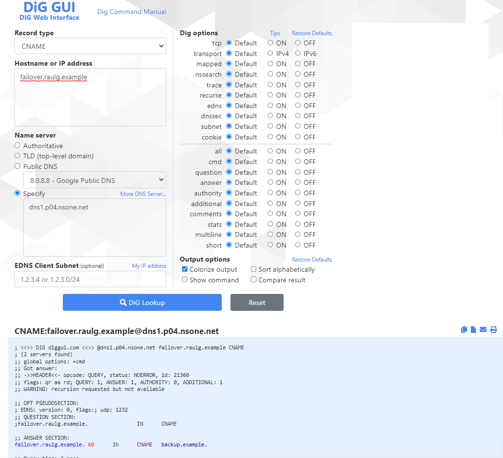

