# Instana - NS1 Integration

## Overview

This lab shows how we can integrate Instana with NS1, allowing the customer to get observability over individual internal applications health and alarms/alerts. This gives even more granularity and control over steering away from outages, allowing for 100% app availability, especially when customers are replicating apps across multiple cloud or hybrid environments, fitting nicely into the Hybrid Cloud Mesh story.

## Story

NS1 has been configured to respond with the most available answer for a new application replicated across and running in multiple cloud or hybrid environments. With Instana monitoring the real-time performance of applications and microservices being delivered to external users, alarms can be set on Websites and Apps monitored, with specific configurable thresholds alerting when an issue arises. Using Webhooks and API integrations, these alarms can trigger a failover event in NS1, steering away from any outage before it is noticed by any synthetic monitoring solution, but more importantly, by any end user accessing or currently using an application monitored by Instana.

As an extension of this integration, this can also scale up to multiple applications, when using an orchestration tool like RNA, giving customers full visibility and control over their application health and providing resilient, always-on services.

## NS1 Configuration

1. Log into https://my.nsone.net/ with your username and password

2. Navigate to the DNS tab

3. Click the + icon on the top right side

	a. Domain name: yourname.example (raulg.example)

	b. leave all the other settings as is

	c. Click 'Save Zone'

4. Click the '1 Record' box next to the zone just created

5. Click 'Add record'

	a. Record Type: CNAME

	b. name: replicated-app

	c. TTL: 30 

	d. answers:

		i. primary-app-endpoint

	e. Click 'Add answer':

		i. backup-app-endpoint

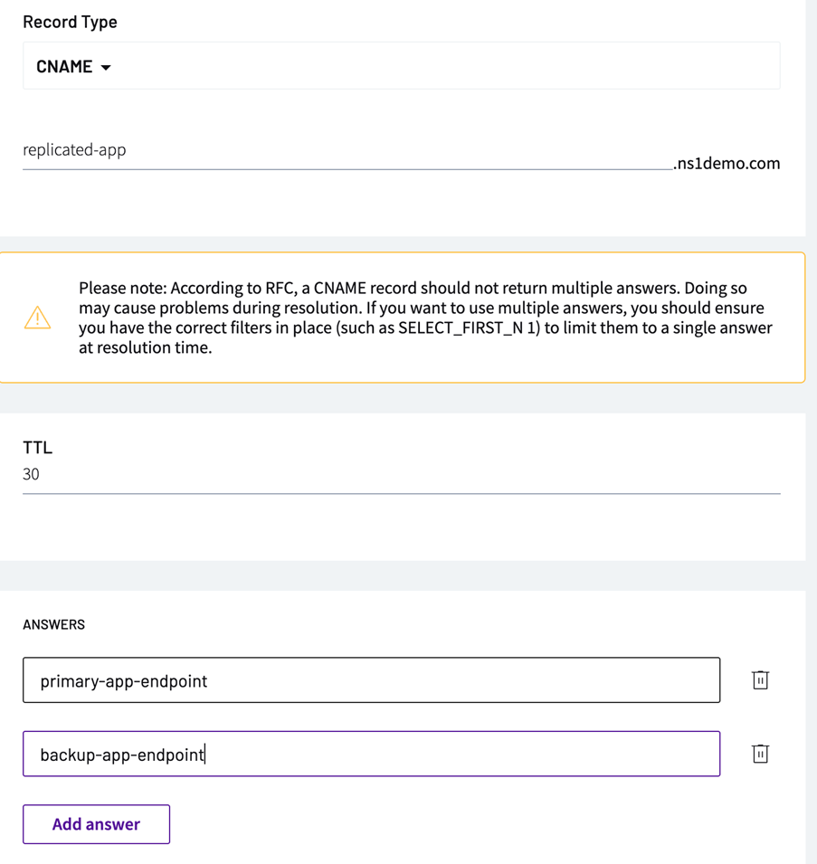

6. Click 'Create Filter Chain'

7. Move the to the left side the following options:

	a. Up

	b. Priority

	c. Select First N

8. Click on the 'Priority' filter

	a. Choose '1' for your primary app

	b. Choose '2' for your backup app

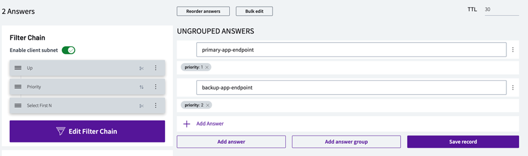

9. Go to 'User' in the top-right hand corner, then Settings-> Users & Teams

10. Go to 'API Keys' and click 'add key'

11. Copy the key generated as we will need it for Instana

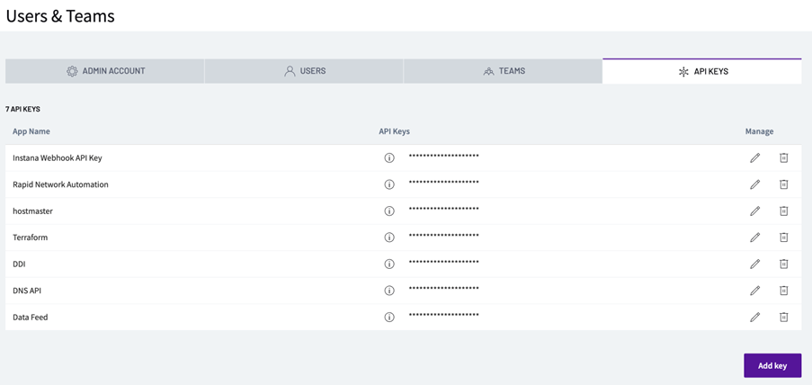

## Instana Configuration

12. Login to the demo Instana environment at the following URL: https://ibmdevsandbox-instanaibm.instana.io/ 

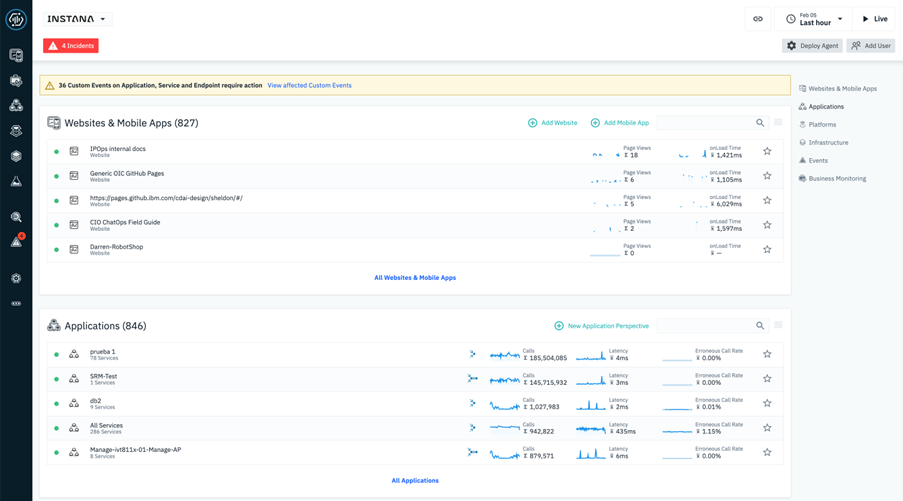

13. Navigate to “Settings>Alerts Channel”. Create a new “Generic Webhook” Alert Channel. 

14. Create a name for your alert channel and you will need to fill in the Webhook URL. This can be grabbed from NS1, once the Webhook is setup.

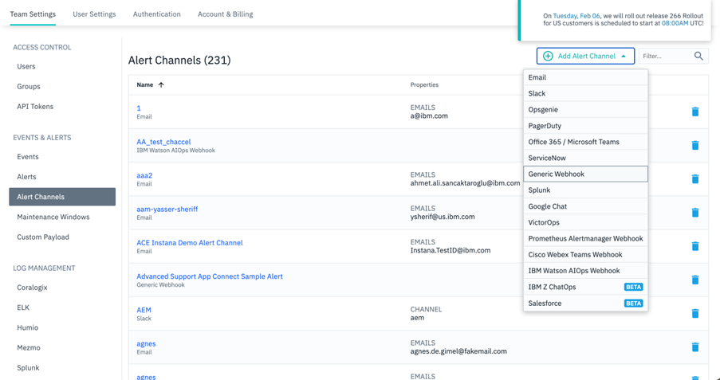

## NS1 Data Feed Configuration

15. Without closing the Instana GUI, go to NS1 platform and go to 'Integrations'

16. Click on the '+' button to add a new webhook

	a. Source type 'NS1 API'

	b. Continue

	c. Name: Instana-app-1

	d. Label: Instana-app-1

	e. Save feed

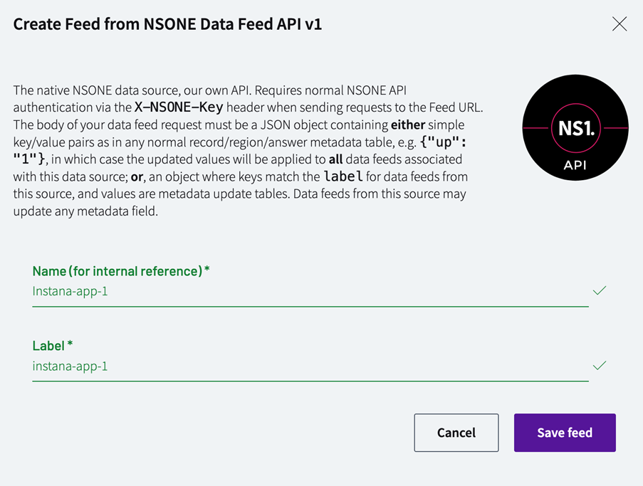

17. Copy the Feeds URL as it will be used in Instana
	
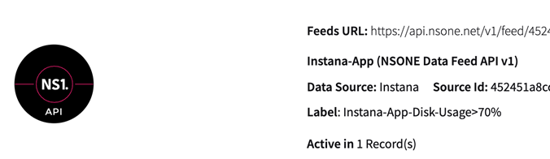

## Instana Configuration

18. Go back to the Instana GUI

19. On the 'Create Generic Webhook Alert Channel' paste the Feeds URL from NS1.

20. Add a Custom HTTP Header Field below this URL window. 

NOTE: This is where you’ll be adding your recently created Instana API Key in NS1. This will be used to authenticate the webhook alarm, that will cause a failover to occur. 

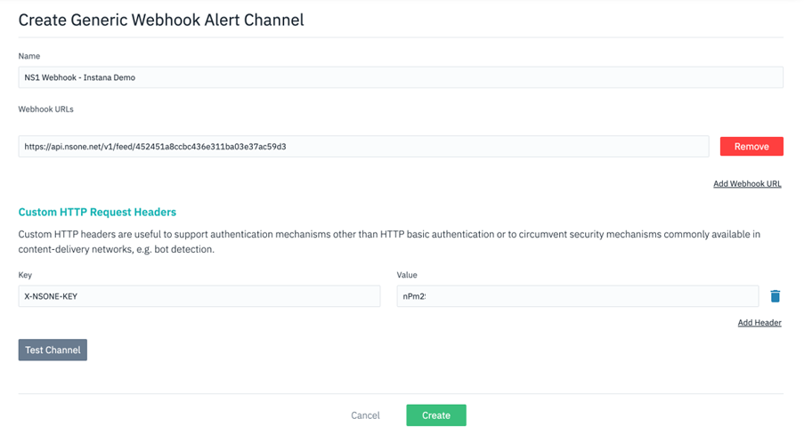

21. Navigate to “Settings>Alerts” and “Create New Alert”

	a. Name: Disk Usage > 70% NS1 Alert

	b. Alert on Events

	c. Click to add event

		1. JBM TEST Disk Usage > 70%

NOTE: As this alert goes off quite frequently in the sandbox environment and is easy to simulate, it is a good one to use but you can build out your own events or use another existing event, as you wish. 

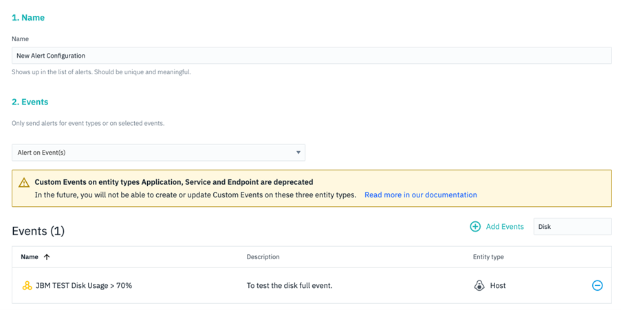

	d. Choose the scope on “all available entities” and on “Alerting”, choose the recently created “NS1” Webhook Alert Channel.

	e. On Custom Payloads add the following:

			1. Key: Up

			2. Value: 0

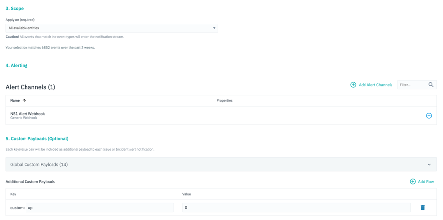

## NS1 Steering Policy

22. Go back to NS1 GUI

23. Navigate to the zone and record configured and click on the 'Up' filter

	a. Click on the backup answer and change the value to 'true'

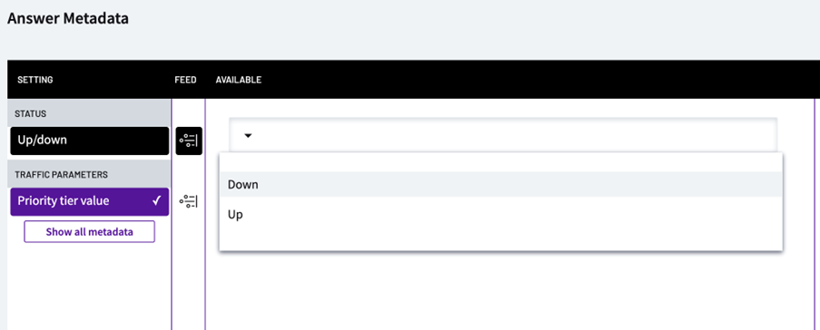

	b. Click on the primary answer

		1. Click on the Feed icon

		2. Choose the Instana-app-1 webhook

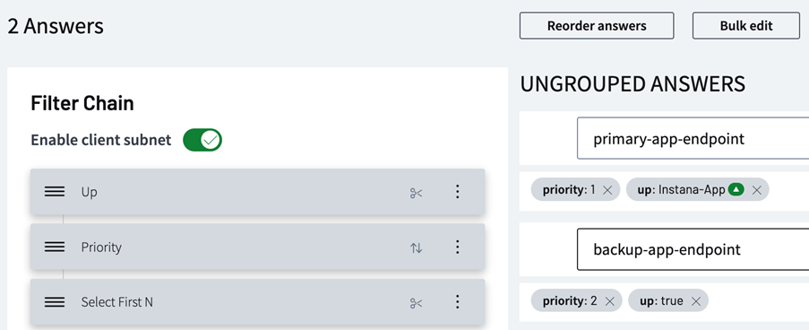

## Review

24. To demonstrate the failover in real-time, you can navigate to the alarm in Instana and force it to alert. This should send a Webhook to NS1, to change the “up” value from true to false, and failover to the backup endpoint of the replicated app. You can also implement some load-balancing policies instead of “Priority”, if you want to show how this can scale to multiple apps across multiple cloud or on-premise environments. RNA can also be used to scale up this approach, with eyeballs across hundreds or thousands of apps, while integrating into NS1 to steer away from those application-layer outages.