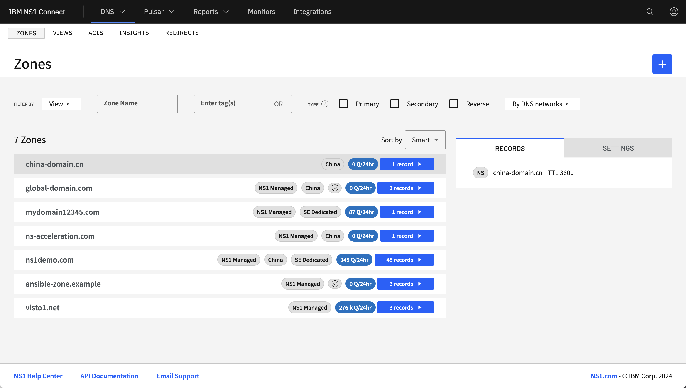
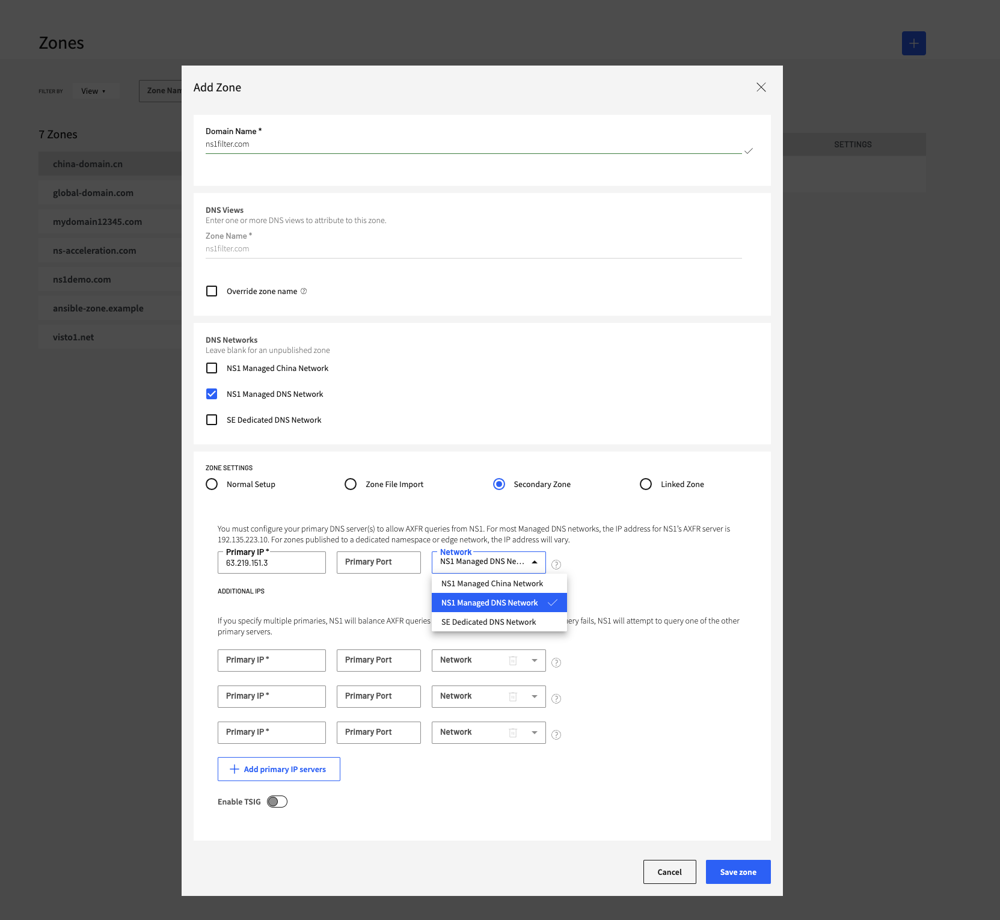
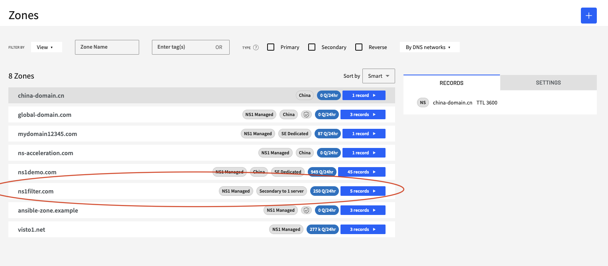
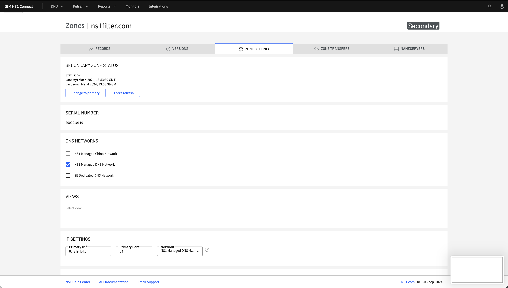
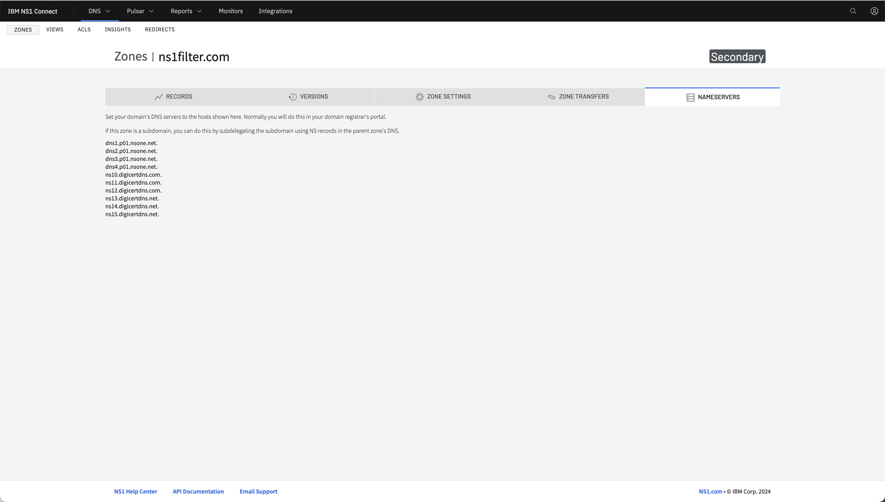
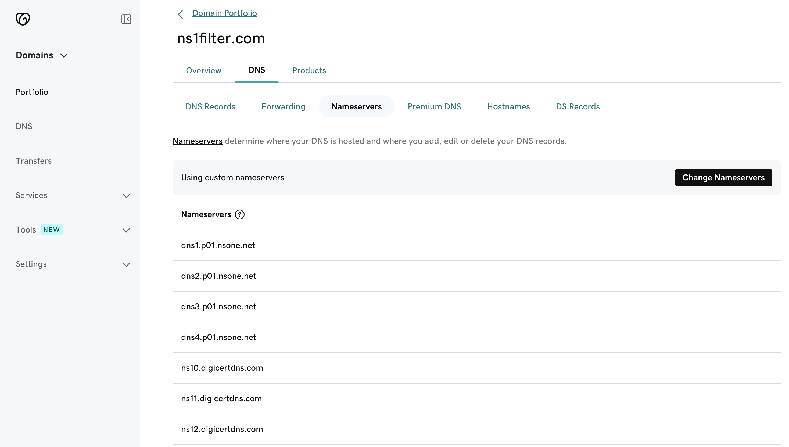
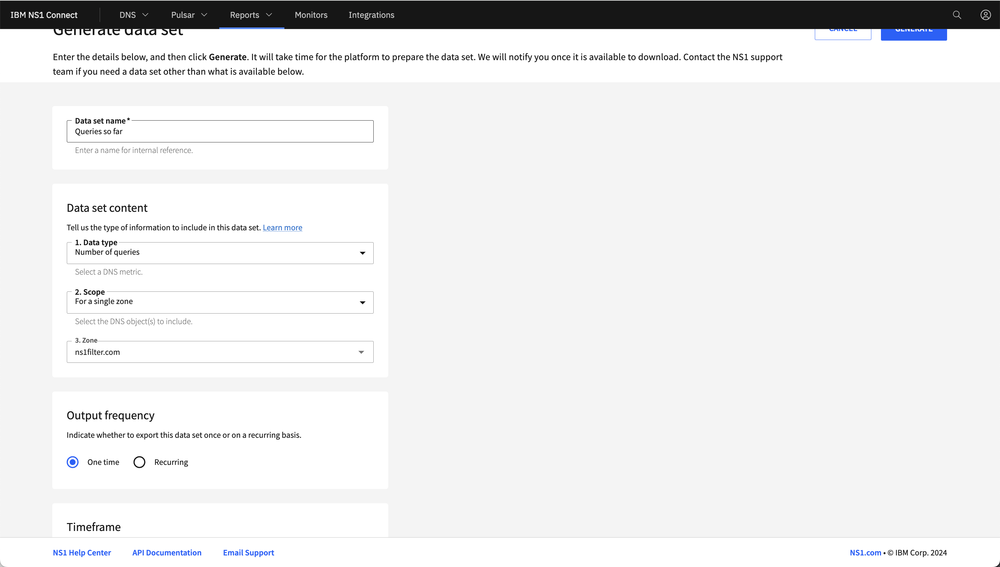

# NS1 as Secondary - Redundancy/Resiliency

## Overview

This POT walkthrough will give you steps needed to setup a Primary-Secondary configuration, with  NS1 as Secondary to another DNS solution, allowing for redundancy and resiliency on the DNS layer. You can even "hide" the primary during this POT, by removing the existing NS Records at the domain registrar, allowing for a "Hidden Primary" setup, giving the customer the ability to continue configuring DNS on their Primary/Self-hosted solution, without exposing it to the public internet.

## Story

During this POT, we want the customer to experience a real-world migration process, so always try to push for the customer to come prepared with a domain that is getting traffic. They will need access to the domain registrar also, during this process. This does not have to mean a full production domain but possibly an older marketing campaign domain, that still gets some traffic. This makes it easier to demonstrate the value of performance and redundancy gains against a real live domain, instead of a test/dummy domain. Also, this domain will already be delegated to another solution, which matches it to the same process the customer will have to go through for their live production domains. We will show how quick and simple it is to test this setup. This will also make NS1 more "sticky", as the customer will have to go through the steps to remove NS1 and may wish to move forward with this setup for ease-of-use. You will also want to make sure the customer sets up the correct firewall rules on their Primary solution, to allow NS1 to XFR the zone file successfully. The following NS1 IP will need to be allowed:
192.135.223.10

## NS1 Configuration

1. Log into https://my.nsone.net/ with your username and password

2. Navigate to the DNS>Zones tab

3. Click the + icon on the top right side

	a. Domain name: anydomain.com (customer's live domain here)

	b. Make sure to check off "Managed DNS Network" and choose "Secondary Zone" under "Zone Settings"

	c. At this stage, you must configure your primary DNS server(s) to allow AXFR queries from NS1. This can be done by finding out the public IP of the Primary XFR server. This will vary depending on the customer's setup but there are links below for most of the cloud provider XFR IP's and self-hosted guides on how to set this up, below
	LINKS TBC

	d. Make sure "Managed DNS" is picked from the dropdown, as shown below.

	e. TSIG can be enabled and configured, if set on the Primary already and customer wants to test this feature.

	f. Save Zone

4. The zone should now be showing as a "Secondary" Zone in the Zone list

5. Click into the newly added Zone

	a. Depending on how quickly XFR takes to update and pull in the DNS config from the Primary, you may start to see some records start to populate. If not, don't worry. You may have to wait a minute or two for it to refresh. While it's refreshing, you can show off the "ALIAS-as-Secondary" feature, allowing customers to add an additional CNAME-@-the-Apex record. This is a great feature for customers currently doing this on the Primary but does not allow for transfer over XFR, due to RFC compliancy.

	b. To check on the current status of the Zone Transfer, you can navigate to "Zone Settings" tab.

	c. Under "Secondary Zone Status", you will see the current status of the zone transfer. It may show "ok" if the zone has successfully updated or you may see an error. Usually these errors will relate to the firewall rules on either side not setup correctly or incorrect TSIG configuration.

	d. You can also show how easy it is for the customer to force a refresh of the zone and also implement a "break-glass" scenario, by turning the zone to a primary. This will allow the customer to manage the zone as a "primary", allowing for changes on NS1, while maintenance is performed on the Primary.

6. Click to the "Nameservers" tab to get a view of the NS1 nameservers to apply at the domain's registrar

7. Once the records have all pulled down and you get the "ok" zone refresh status, you can walk the customer through changing their domain registrar's DNS Nameservers.

8. The customer's domain registrar portal will look different depending on their provider. It should look similar to something like below but only including the existing Primary solution NS's

	a. Edit the Nameservers

	b. Add in the additional NS1 nameservers, noted in the "Nameservers" tab. It should look something similar to the below screenshot, via GoDaddy.

9. Once added, NS1 will start to responding to any new DNS lookups where NS1 is performing better for the end client/resolver making the DNS lookup. If the customer wants to test a "Hidden Primary" setup, they can remove their existing solution's NS's from the domain registrar. This will mean the "Primary" configuration is where the changes are made but NS1 are listening as a publicly-facing "Secondary".

10. To check if the delegation change has changed globally, you can run local "dig" commands, like below, or use a tool like diggui.com to check.

11. Customers can start to run reports, using NS1's Data Set [generator](https://https://www.ibm.com/docs/en/ns1-connect?topic=data-sets-page), to run reports on queries and a number of other metrics for the newly delegated zones.

12. Customers may also want to test how quickly a change propogates from the Primary configuration to the Secondary (NS1). You can go through this exercise with the customer by walking them changing a record at the Primary and watching how quickly it takes to change in the NS1 portal and then propogated out to the public internet, again using tools like "diggui" or local dig commands.