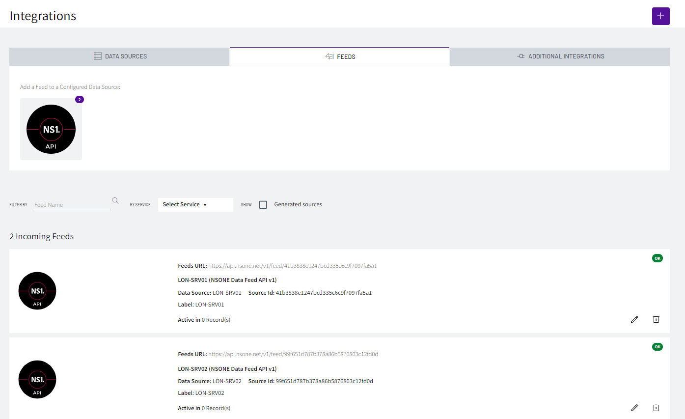

# Advanced Load Balancing - SANO integration

In this lab we will see how we can load balance traffic among different servers based on how busy those servers are using SANO and NS1.

On the first step of this lab, we will configure SevOne to create a new custom metric call 'load' that includes the number of connections plus how busy the CPU is. Also, we will configure an alert to send the value of this new custom metric to Rapid Network Automation (RNA).

The second step will be to configure RNA to process the values received, format them in a way that NS1 understands, and send them to NS1.

Finally we will configure NS1 to change the cost of the different answers based on the value received from SevOne + RNA, therefore when we query for an answer to NS1, it will reply with the server with less connections and CPU load.

NOTE: For a real world scenario, we would recommend using 'Shed Load' rather than 'Cost' to provide a smoother solution by providing more than one response until one of the answers becomes overloaded. However, in this lab we have chosen 'Cost' to see changes on the answers quicker.

## Create Aggregation

1. Log into the NMS

2. Go to Administration -> Monitoring Configuration -> Object Types

3. Change Filter to Calculation Poller

4. Click Add

	a. Name: Load

5. Choose Load:

	a. Click Add Atomic Indicator Type

		i. Indicator Name: Load

		ii. Description: Load

		iii. Indicator Type: GAUGE
	
		iv. Measure as: Number

		v. Display as: Number

6. Go to Administration -> Monitoring Configuration -> Calculation Editor

7. Click ‘Add Object’

	a. Parent Device: LON-SRV01

	b. Object Type: Calculation Poller -> Load

	c. Object Name: Load

	d. Object Description: Load

	e. Click 'Save'

8. Select the 'Load' object in 'LON-SRV01'

9. Add Variable:

	a. Name: cpu

	b. Plugin: SNMP Poller

	c. Device: LON-SRV01

	d. Object: CPU2

	e. Indicator: CPU Load

	f. Click 'Save'

10. Add Variable:

	a. Name: conn

	b. Plugin: SNMP Poller

	c. Device: LON-SRV01

	d. Object: TCP

	e. Indicator: Established TCP Connections

	f. Click 'Save'

11. On the section below named 'Expression Browser for Load', click on the spanner symbol of the indicator 'Load'
	
	a. Indicator Expression: $cpu + $conn

	b. Click 'Save'

12. Let's repeat the steps for LON-SRV02

13. Click ‘Add Object’

	a. Parent Device: LON-SRV02

	b. Object Type: Calculation Poller -> Load

	c. Object Name: Load

	d. Object Description: Load

	e. Click 'Save'

14. Select the 'Load' object in 'LON-SRV02'

15. Add Variable:

	a. Name: cpu

	b. Plugin: SNMP Poller

	c. Device: LON-SRV02

	d. Object: CPU2

	e. Indicator: CPU Load

	f. Click 'Save'

16. Add Variable:

	a. Name: conn

	b. Plugin: SNMP Poller

	c. Device: LON-SRV02

	d. Object: TCP

	e. Indicator: Established TCP Connections

	f. Click 'Save'

17. On the section below named 'Expression Browser for Load', click on the spanner symbol of the indicator 'Load'
	
	a. Indicator Expression: $cpu + $conn

	b. Click 'Save'

18. Go to Devices -> Device Manager

	a. Search for LON-SRV
	
	b. Select both devices and click on the 'gear' icon on the top left corner -> Discovery -> Discover

## Rapid Network Automation Configuration

19. Log into https://my.nsone.net/ with your username and password

20. Go to the top right corner where you see your username
	
	a. Click on your username -> Settings -> Account Settings

	b. Click on 'API KEYS'

	c. Click 'Add key'
	
		i. App Name: RNA

		ii. Click Save API Key
	
	d. Click on the i icon next to the *********** to uncover the API key

		i. Copy that API key for future use

21. Log into Rapid Network Automation platform

22. Go to Authentications

23. Click 'Create Authentication'

	a. Name: NS1
	
	b. Service: NS1

	c. Protocol: https://

	d. Host: api.nsone.net

	e. X-NSONE-key: paste your key from NS1
	

24. Go to **Workflows**

25. Click 'Create Workflow'

	a. Name: SevOne to NS1 Cost

	b. Layout type: Sequence

26. Add variables to Start

	a. NS1Credentials

		i. Name: NS1Credentials

		ii. Type: Authentication -> NS1

		iii. Default Value: "admin/NS1"

	b. Devicename

		i. Name: Devicename

		ii. Type: String

		iii. Default Value: ""

		iv. In

		v. Required

	c. Value

		i. Name: Value

		ii. Type: String

		iii. Default Value: ""

		iv. In

		v. Required

	d. body

		i. Name: body

		ii. Type: Object

		iii. Default Value: {}

		iv. Out

		v. Log

27. Change to Flow View

28. On the left hand side panel, search for NS1, Click on NS1 -> Data Sources & Feeds -> Data Sources -> View active data sources
	
	a. Change name to NS1_sources

	b. Click on the building block to open the right side panel and complete the following fields
		
		i. authKey: $NS1Credentials

29. Add a new building block, Common -> ForEach

	a. Change name to ForEach_source

	b. Click on the building block to open the right side panel and complete the following fields
		
		i. list: $NS1_sources.result

30. On the right side of the foreach, add a new building block, Common -> If

	a. Change name to If_same_device

	b. Click on the building block to open the right side panel and complete the following fields
		
		i. condition: $ForEach_source.item.name == $Devicename

31. On the TRUE side of the If, add a new building block, Common -> Assign
	
	a. Change name to Assign_url

	b. Click on the building block to open the right side panel and complete the following fields
		
		i. variable: $url
		
		ii. value: "https://api.nsone.net/v1/feed/" + $ForEach_source.item.id

32. Add a new building block, Common -> String -> StringRemove
	
	a. Change name to CleanValue

	b. Click on the building block to open the right side panel and complete the following fields
		
		i. str1: $Value
		
		ii. str2: "Threshold triggered -- "

33. Add a new building block, Common -> Assign
	
	a. Change name to Assign_body

	b. Click on the building block to open the right side panel and complete the following fields
		
		i. variable: $body[$Devicename]
		
		ii. value: 

{

	"up": "1",

	"cost": $CleanValue.result

}

34. Add a new building block, Common -> HttpRequest
	
	a. Change name to Send_data

	b. Click on the building block to open the right side panel and complete the following fields
		
		i. method: POST

		ii. host: $url

		iii. protocol: https

		iv. headers: 

{

    "X-NSONE-key": "PASTE_HERE_THE_KEY_FROM_NS1"

}

		v. body: $body

35. Move the last building block of the workflow 'Assign_1' next to 'Send_data'. You can do 'drag and drop'

	a. Change value to '$Send_data.result'

36. Click 'Save'

37. Go to APIs
38. Click on Create API

	a. Name: cost

	b. Authentications
	
		i. Authentication: API Keys

		ii. Click ‘Add API Key’

			1. Name: cost
            
			2. Copy the api key for later use
               
	c. Click ‘Create’
    

39. In workflow deployments, click ‘Create’

	a. Workflow -> Choose the workflow you created clicking on the folder icon on the top right side of that field

	b. Stage - > Click on + icon -> leave everything as it is, click 'Create'
        
	c. Endpoint -> Click on + icon 
        
		i. Change Path to /Cost

		ii. Method: POST

		iii. Click ‘Create’
            

40. Click **Deploy**  

41. Click on **Swagger UI**

	a. Click on Authorize 
	
		i. Paste the API Key copied before

		ii. Click 'Authorize'

		iii. Click 'Close'

	b. Click 'Try it out'

	c. Click 'Execute'

		i. We don't care about the result, we want to get the request URL

		ii. Copy the Request URL for future use

## Send data to RNA using alerts

42. Go back to the SevOne GUI (vPAS)

43. Go to Events -> Configuration -> Webhook Definition Manager

44. Click on Add Webhook Definition
	
	a. Webhook Definition Name: RNA Cost

	b. Destination URL: paste the Request URL from the four steps above

		i. Replace 'na4.techzone-services.com:xxxxx' from the URL for '10.0.0.12'
 
	c. Allow insecure webhook connection: TRUE
	
	c. Request Method: POST

	d. Body:

{

"Devicename": "$deviceName",

"Value": "$alertMessage"

}

## SevOne Alert Configuration

45. Go to Events -> Configuration -> Policy Browser

46. Click 'Create Policy'
	
	a. Name: Server Load - NS1

	b. Device Group: All device groups

	c. Object type: Calculation Poller -> Load

	d. Severity: Debug

47. Click 'Trigger Conditions'

	a. Under Conditions, click on the menu icon and click 'Create New'
		
		i. Indicator: Load
	
		ii. Type: Static

		iii. Comparison: Greater than equal to

		iv. Threshold: 0 Number **(not centinumber)**

		v. Duration: 1
	
		vi. Aggregation: Average

		vii. Custom message: $dataValue

	b. Under Webhooks:

		i. Enable 'Override Webhook per Alert'

		ii. Disable 'One webhook per Alert'

		iii. Move 'RNA Cost' to the right side

	c. Click 'Save as New'

## NS1 Configuration

**NOTE: If there is any configuration from another lab, please delete all the NS1 configurations as some of them may impact this lab. This includes DNS records, filter chains, monitors, etc...**

48. Log into https://my.nsone.net/ with your username and password

49. Navigate to the DNS tab

50. Click the + icon on the top right side

	a. Domain name: yourname.loadbalancer (raulg.loadbalancer)

	b. leave all the other settings as is

	c. Click 'Save Zone'

51. Click the '1 Record' box next to the zone just created

52. Click 'Add record'

	a. Record Type: A

	b. name: app1

	c. TTL: 60 

	d. Answers:

		i. 172.24.147.195

		ii. 172.24.147.196

53. Click 'Save Record'

54. Click on '2 answers' on app1.yourname.loadbalancer

55. Click 'Create Filter Chain'

	a. Click the '+' icon next to the 'Cost' filter

	b. Click the '+' icon next to the 'Up' filter

	d. Click 'Save Filter Chain'

56. Let's create the integrations to read the cost from SevOne data. Click on 'Integrations' (top bar)

	a. Click on the + icon on the top right to create a Data Source

		i. NS1 API integration

		ii. Name: LON-SRV01

		iii. Click on 'Create a new feed with this data source?'

			1. Name: LON-SRV01

			2. Label: LON-SRV01

		iv. Click 'Save changes'

	b. Go back to Data Sources and click the + icon to do the same with the other server
		
		i. NS1 API integration

		ii. Name: LON-SRV02

		iii. Click on 'Create a new feed with this data source?'

			1. Name: LON-SRV02

			2. Label: LON-SRV02

		iv. Click 'Save changes'

56. Go back to DNS -> yourname.loadbalancer -> app1.yourname.loadbalancer, click in the middle of the 'Cost' filter to highlight the up metadata on the answers

	a. Click on 'cost: unset' of the first answer (172.24.147.195)

		i. click on the feed icon and select LON-SRV01

		ii. Click 'OK'

	b. Click on 'cost: unset' of the first answer (172.24.147.196)

		i. click on the feed icon and select LON-SRV02

		ii. Click 'OK' 

	c. Enable the option 'Select answers instead of sorting' inside the 'Cost' box on the left hand side

57.  Click in the middle of the 'Up' filter to highlight the up metadata on the answer

	a. Click on 'cost: unset' of the first answer (172.24.147.195)

		i. click on the feed icon and select LON-SRV01

		ii. Click 'OK'

	b. Click on 'cost: unset' of the first answer (172.24.147.196)

		i. click on the feed icon and select LON-SRV02

		ii. Click 'OK' 

58. Click 'Save record'

NOTE: It will take a minute for the UP monitors to show up. Don't get alarmed if they show red for one minute or two

59. Now it's time to test which result we get back based on the load of the server. Test the results with command:

	a. dig @dns1.p04.nsone.net app1.YOURNAME.loadbalancer

		i. dig @dns1.p04.nsone.net app1.raulg.loadbalancer

60. Let's force the other result to appear by editing the formular

61. Go back to SevOne (vPAS) and go to Administration -> Monitoring Configuration -> Calculation Editor

	a. In my case the server with less load is LON-SRV01, therefore I will click on 'Load' on that device and edit the formula
	
		i. Indicator Expression: ${cpu}+${conn} + 1000000

		ii. Click 'Save'

62. As we poll every 5 minutes by default, we can speed up the process by editing the devices in SevOne and change the polling frequency to 1 minute, and check the results again in 3-4 minutes

63. Otherwise we can wait around 10 minutes and test again the results:

	a. dig @dns1.p04.nsone.net app1.YOURNAME.loadbalancer

		i. dig @dns1.p04.nsone.net app1.raulg.loadbalancer

