# HTTPS Redirect

## Overview

This POT walkthrough will give you steps needed to setup an HTTPS Re-direct, allowing for the ability to re-direct to HTTPS domains, provide and handle SSL certificates and SSL termination, providing a fully secure redirect. 

NS1 provides the auto-renewing certificate management and shows a “secure connection” in the address bar when visiting the relevant URL. 

This feature is unique in that no other DNS provider can offer this feature as standard in their platform and means customers can consolidate this necessary evil to their DNS provider instead of offloading this work to a proxy/server, that may require maintenance, labour and cost.

NOTE: As this is a "Premium" feature, please email NS1 Project Office <NS1.Project.Office@ibm.com> with your Account ID to enable this feature.

## Story

During this POT, we want to show the customer the ease of use for setting up certificates and configuring the redirect, so that they can see the value of consolidating this sometimes time-consuming and costly task to their Managed DNS solution. 

They will need access to a test domain/record for redirection, during this process. This does not have to mean a full production domain but possibly an older marketing campaign domain, that still gets some traffic. 

This makes it easier to demonstrate the value of visibility into metrics and show how easy it to setup and import existing configs for future redirects (of which there may be quite a few, especially in the case of large enterprises with many brands/subsidiaries). This test/low-traffic domain will need to be delegated to NS1 before the setup.

## Create Redirect

1. [Log into NS1 with your username and password](https://my.nsone.net/)

2. Along the top bar, click into "Redirects"

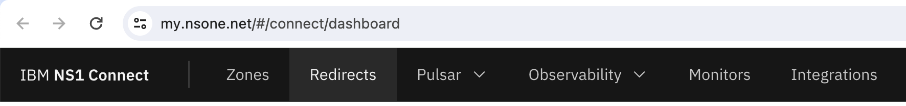

3. Within the "Source and Target" URL page, talk through the different options for importing existing redirect configs that can be used to save time when given a large batch/spreadsheet from another team of domains to configure (XML or CSV file containing the URL redirect configuration details). This shows how quickly customers can import their existing setups into NS1.

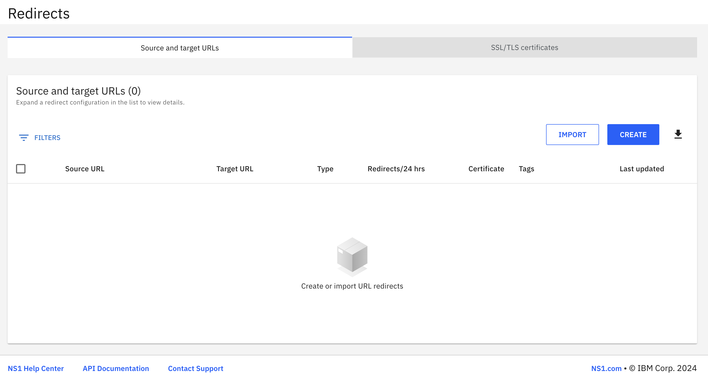

4. Click on the "Create" button to create a new Redirect.

5. Within the "Create URL redirect" panel, we have a wizard to go through to show how easy it is to setup one or multiple redirects at one time.

	a. Define source URLs - Specfify the source URL. This will be the test/dummy record mentioned previously, that should live on the NS1 platform already. My example URL is as follows: "redirect.ns1demo.com/*". Once added, you can also show how you can add multiple URLs, to setup multiple redirects that all go to the same target URL. [Wildcard records/subomains are also supported](https://www.ibm.com/docs/en/ns1-connect?topic=redirects-configuring-url-redirect#configuring_url_redirects__title__2). This is a key feature for speeding up redirects for brand protection domains/acquired companies that need to point to a new target URL. Make sure you also check off/tick the "Enable HTTPS" and "Enforce HTTPS" to secure the redirect through SSL/TLS encryption.
	NOTE: HTTP Redirects can also be setup here, without the need for certificates. 

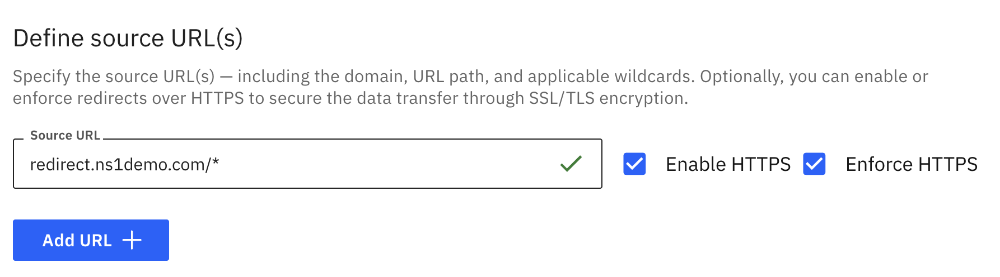

	b. Define target URL. This can be something simple like "ibm.com" - Specify the target destination for which the source URLs should redirect to. This URL does not need to exist on the NS1 platorm. Once added, you have the option to select the Redirect type:

			i. 301 Permanent indicates to search engines that they should remove the old page from their database and replace it with the target page. This approach is recommended for SEO. Pick this one as your option for the POT/Demo.
			
			ii. 302 Temporary is less common and indicates that search engines should retain the old domain or page indexed as the redirect is only temporary. While both pages may appear in search results, the search engine will prioritize the new page.

			iii. Masking(URL cloaking or domain masking) indicates that the browser should display the requested URL even though the content shown is generated from the target URL.

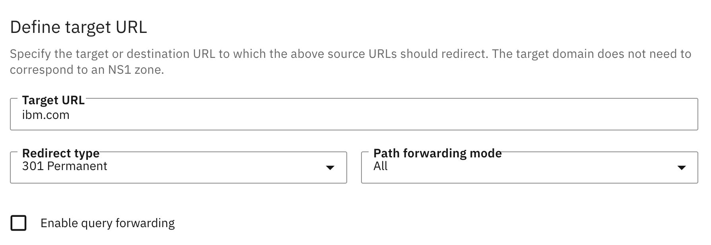

	c. Define Path forwarding mode - Specify the target destination for which the source URLs should redirect to. This URL does not need to exist on the NS1 platorm. Once added, you have the option to select the Redirect type:

			i. The "all" path forwarding mode indicates that the entire URL path included in incoming requests to the source URL is appended to the target URL. Pick this one.
			
			ii. The "capture" path forwarding mode indicates that only the segment of the requested URL path matching the wildcard segment defined in the source URL should be appended to the target URL.

			iii. The "none" path forwarding mode indicates that no part of the requested URL path should be appended to the target URL.		
	
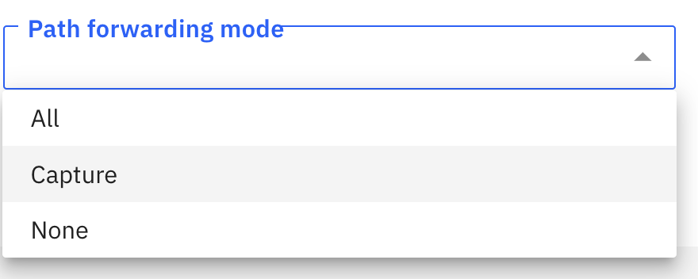

	d. Enable query forwarding - Enable query forwarding to apply the incoming query string following the URL path (the segment after the question mark) to the new target URL. We can leave this unchecked.

	e. Add tags - Tags can be applied to Redirects just like other object types on the NS1 platform. This helps for tracking, filtering and reporting on any related plain-text tagged objects to the relevant apps/teams/projects etc. For this POT, you can add something simple like "team: marketing" and hit enter.

6. Once created, the new redirect will show within the list of active redirects and there is also a certificate being auto-created in the background. While the cert is being created, we can navigate to the "SSL/TLS Certs" tab to show more info about the cert itself.

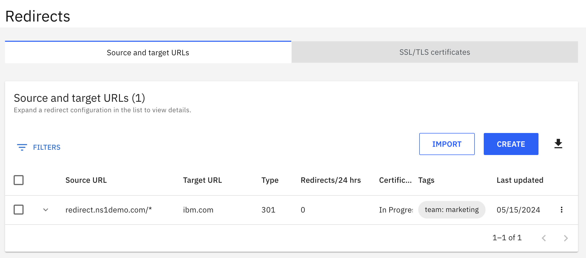

7. Click into the "SSL/TLS Certs" tab to show the cert being created. The NS1 platform leverages the Let’s Encrypt service to generate SSL/TLS certificates, using the DNS01 challenge as validation. When a new certificate is generated (automatically or manually), the platform creates a TXT record for the corresponding domain with information about the SSL/TLS certificate. We want to show how a lot of the manual process that any user setting up their own SSL-enabled Redirects is now automated, including both the day-to-day maintenance but also setting up of multiple redirects.
NOTE: There will be support for bring-your-own certs in the future.

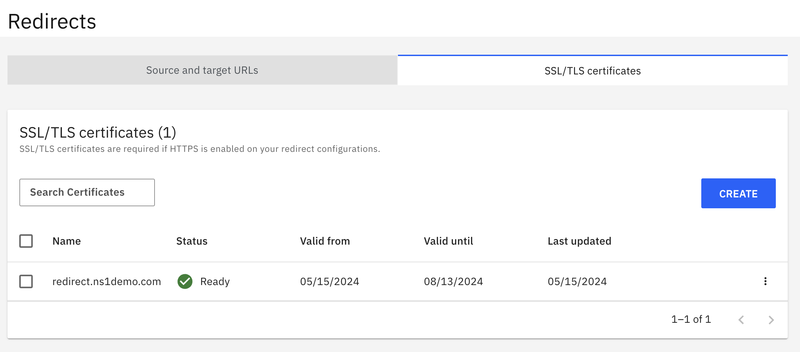

8. Click into "Create" and show how you can create a single domain or wildcard certificate in here. Creating wildcard certs also saves the customer time as it can cover mutliple subdomains.

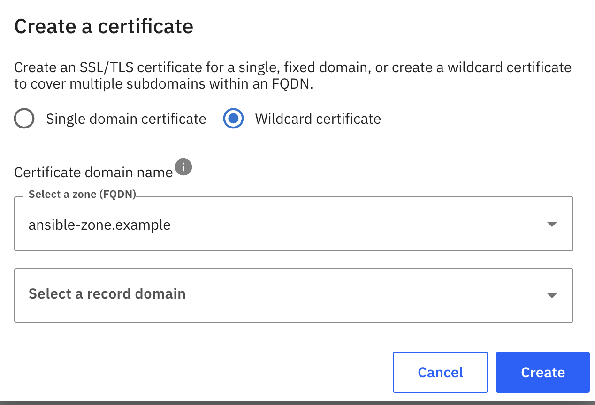

9. The cert auto-created should now show as "Ready". Navigate to the "Zone" where the redirect sits and navigate to the Record itself. It should show alongside other DNS records within the Zone, giving the customer the ability to differentiate it from other DNS-specific records but also showing how it is now consolidated and easily identifiable alongside their whole DNS estate.

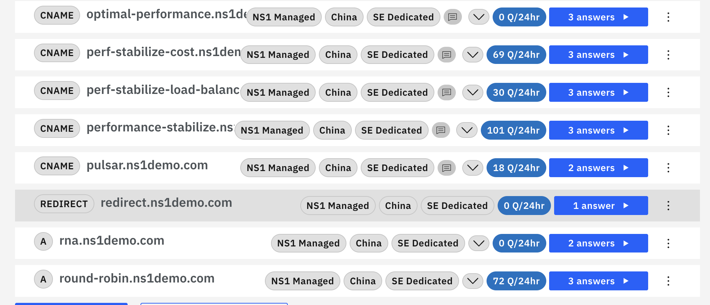

9. Now let's finally test it in our Browser. Type in the URL and hit enter. You should see a redirect being performed to the target URL without any issues around certificates, which would normally show up in your browser's cert. This shows the value of a completely secure connection to prevent unauthorized third parties from intercepting data while it is in transit and to validate the website's authenticity.

We can also show our Developer Tools (Browser>View>Developer>Developer Tools>Network>All) to verify the 301 redirect (or other type of redirect) has taken place successfully.

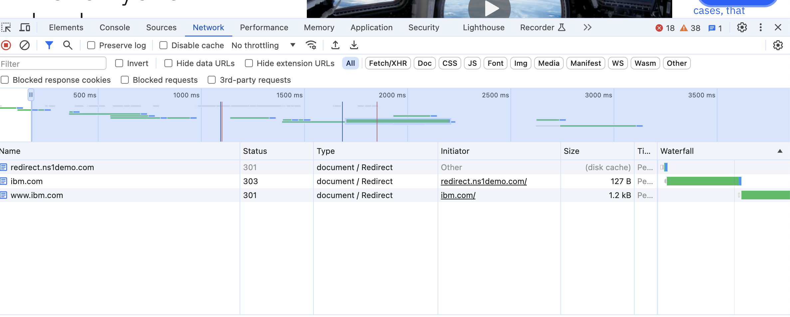

10. Finally, let's look at the metrics. We can go back to the "Redirects" page to see the amount of redirects in the past 24 hours.

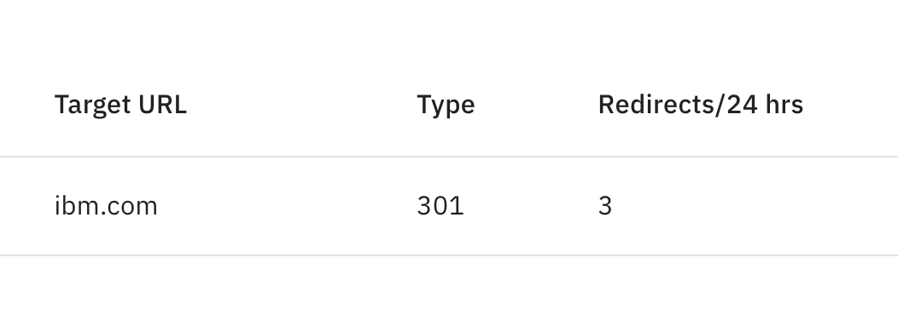

11. We can also utilise NS1's data-set reporting functionality to run a report on the Redirects for more detailed info. Navigate to Observability > Data Sets > Generate Data Set. Now we have data types we can pull from to generate a report on redirects, where we can show to the customer they can export this data to share with their relevant teams (ex. Marketing may want to know how many redirects to their new campaign are happening)

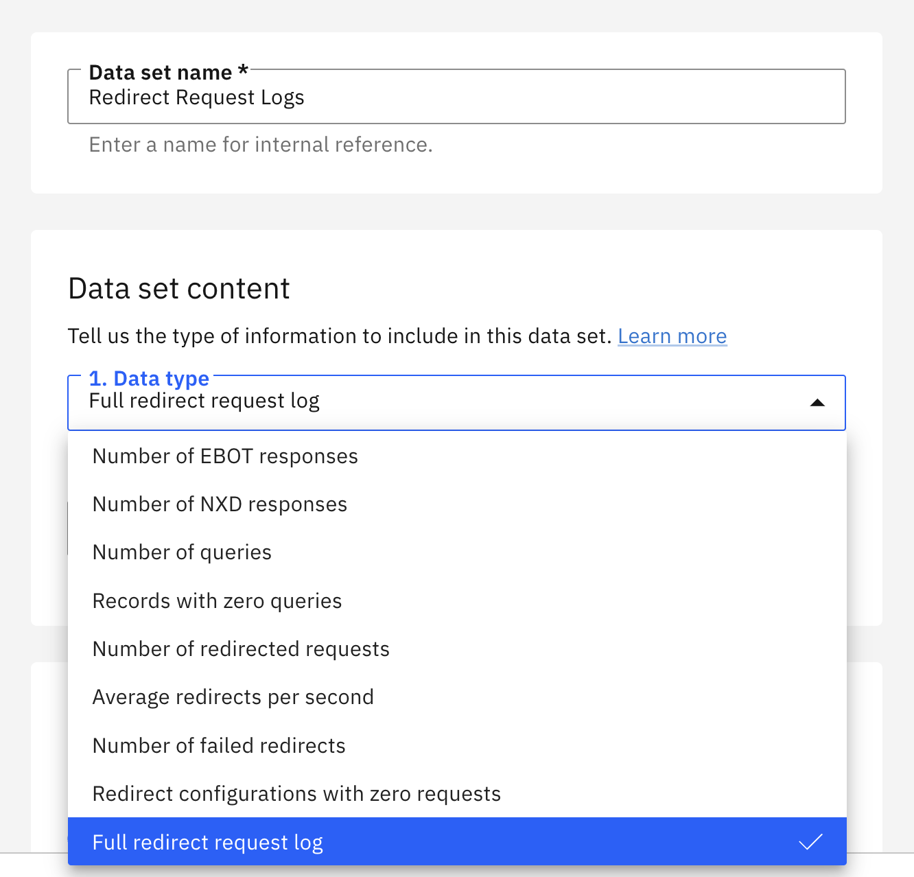