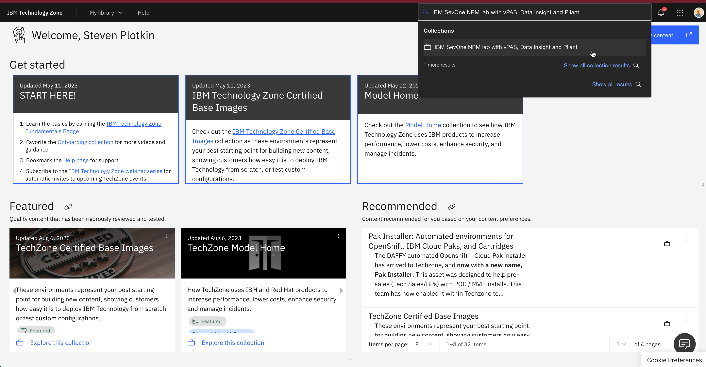
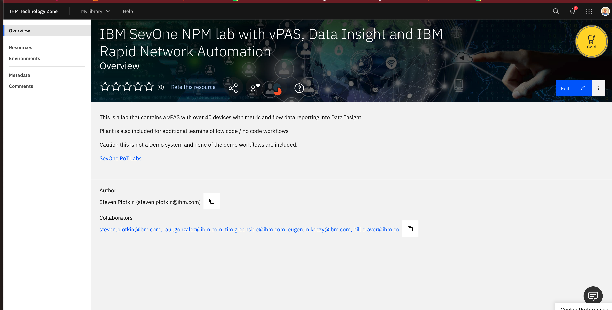
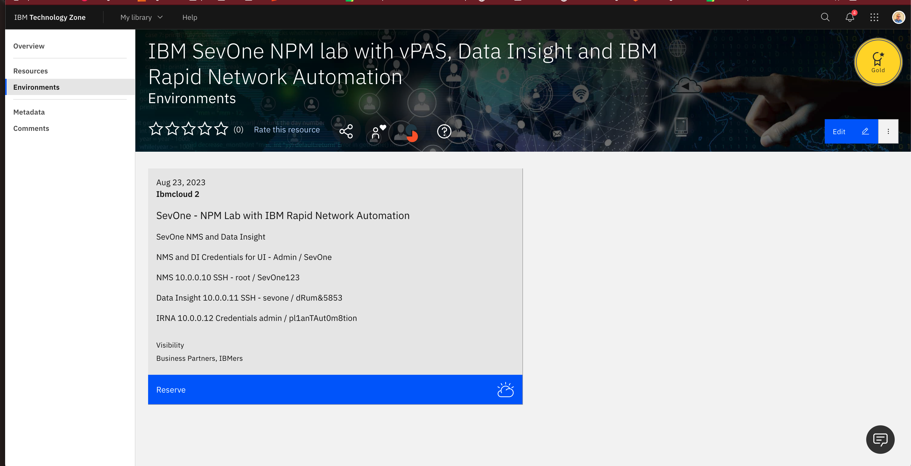
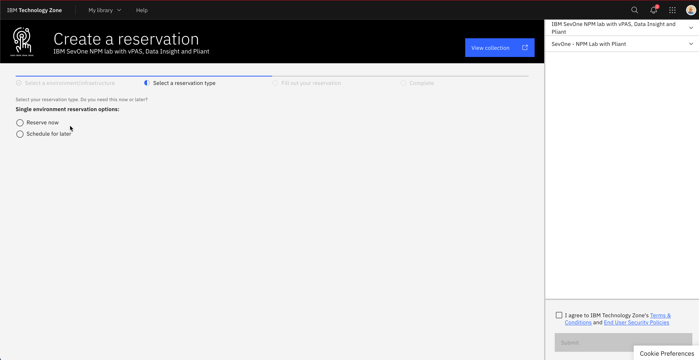
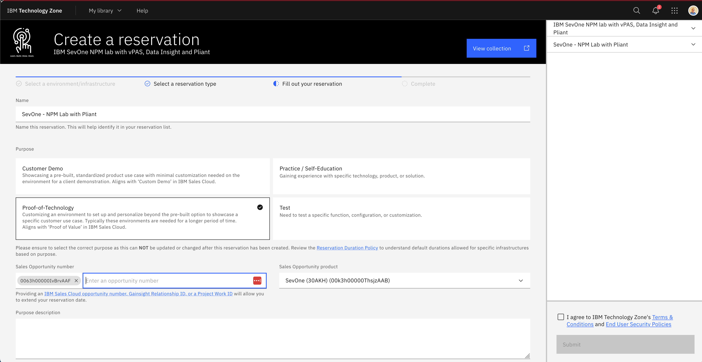
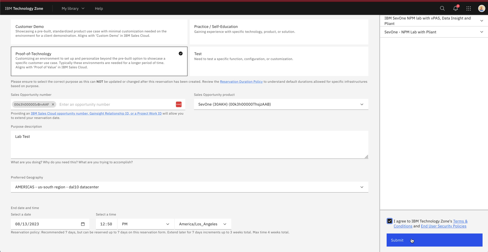

# Reserve Lab

In this section we will go Step by Step Reserving the TechZone Lab to be used with SANO PoT labs

To reserve your lab by going to the following:
[**IBM SevOne IRNA Lab Link**](https://techzone.ibm.com/collection/ibm-sev-one-npm-lab-with-v-pas-data-insight-and-ibm-rapid-network-automation/environments)

You will see the image below and see the overview

Select Enviorments and select RESERVE 

**Create Reservation**

Select one of the four options. Test will give you 1 day of reservation and you can extend for 3 additional days. this is used for quick testing. The other three options can be used but select Proof of Technology and add an oppertunity ID which will reserv lab for a week with 3 extensions.

**Review**

You will recieve an email when the lab is provisioning and when complete. Credentials are in the overview. 